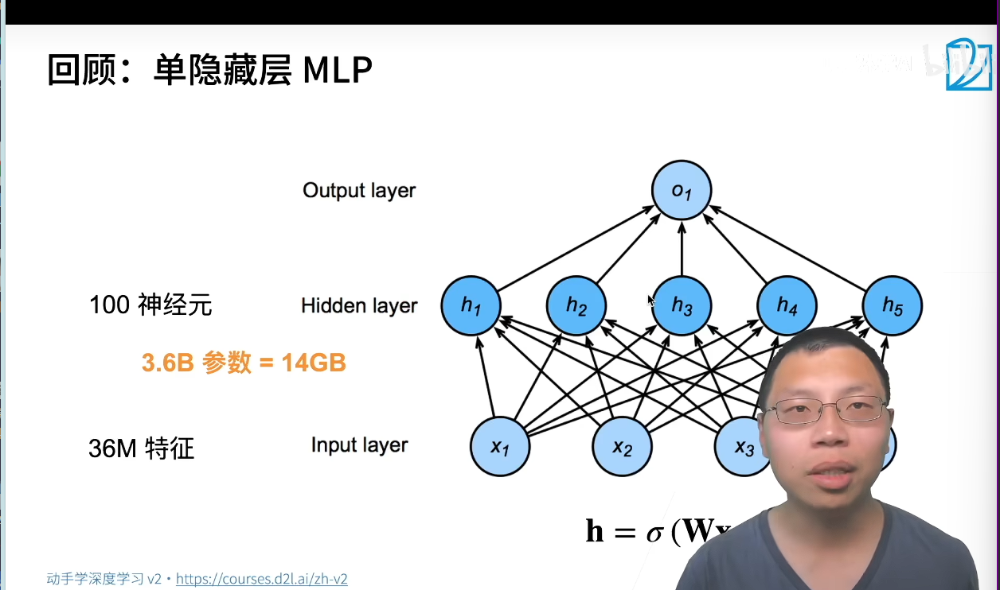
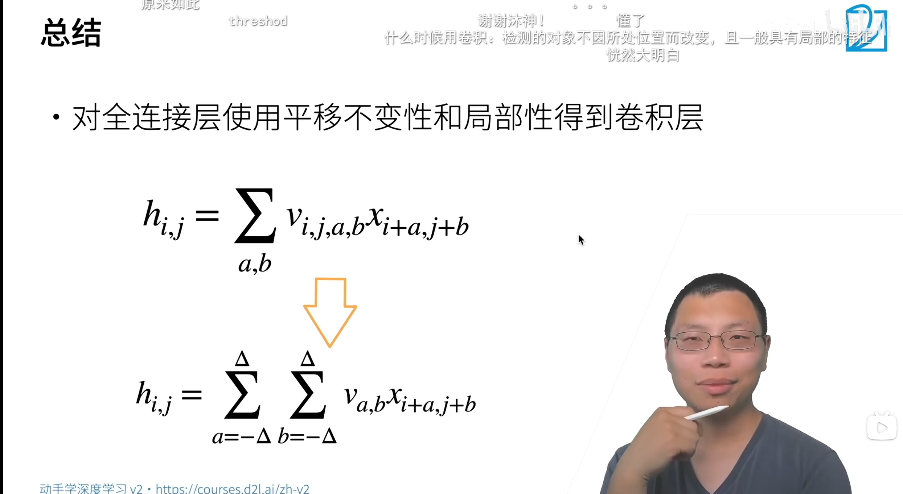
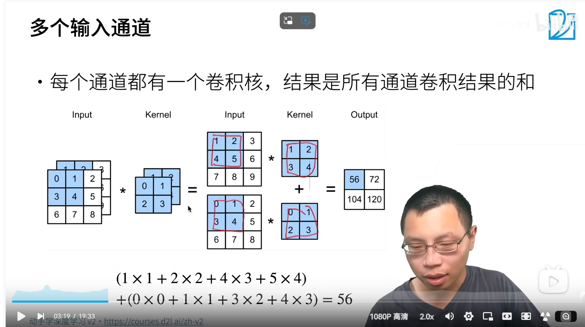
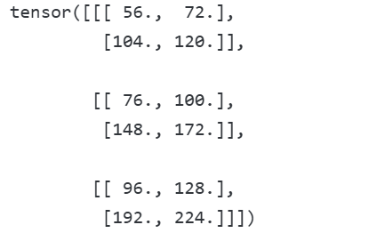
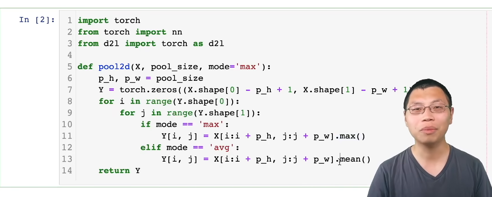

卷积的概念:
分类猫和狗,因为像素的数值很大,一共有12M*3的单隐藏层的训练使用100大小的MLP
神经网络的架构如下:


两个策略:
- 平移不变性
- 局部性
  这两个原则平移不变性所以卷积核移动
  局部性则是卷积核的局部性

  卷积叫交叉相关:
  因为其实际上上是滑动点击和我们的卷积的数学概念类似
  即
  
局部性卷积卷积核的大小不会太大

对全连接层使用平移不变性和局性性就是卷积

二维交叉相关的操作


代码:
```python

import torch
from torch import nn

"""## 互相关运算"""
def corr2d(X, K):  # save
    """计算二维互相关运算"""
    h, w = K.shape
    # 确保输出维度正确，处理边界情况 构建卷积活动操作
    Y = torch.zeros((X.shape[0] - h + 1, X.shape[1] - w + 1)) # 创建一个与输出维度相同的零矩阵,作为卷积之后的东西
    for i in range(Y.shape[0]): # 遍历输出矩阵的每一个位置
        for j in range(Y.shape[1]):
            Y[i, j] = (X[i:i + h, j:j + w] * K).sum()#这就是卷积核而已,用了矩阵表示 # 计算当前位置的卷积结果：输入特征图与卷积核对应元素相乘后求和   进行卷积运算
    return Y

#如果是3*3的图像使用2*2的卷积核那么出现的就会是3-2+1=2的平方,即上述X.shape[0]-h+1


# 验证二维互相关运算的输出
X = torch.tensor([[0.0, 1.0, 2.0], [3.0, 4.0, 5.0], [6.0, 7.0, 8.0]])
K = torch.tensor([[0.0, 1.0], [2.0, 3.0]])
print("互相关运算结果：")
print(corr2d(X, K))

"""## 卷积层"""
class Conv2D(nn.Module):
    def __init__(self, kernel_size):
        super().__init__()
        self.weight = nn.Parameter(torch.rand(kernel_size))  # 随机初始化卷积核
        self.bias = nn.Parameter(torch.zeros(1))  # 初始化偏置

    def forward(self, x):#前向运算  
        return corr2d(x, self.weight) + self.bias

"""## 图像中目标的边缘检测"""#检测目标中的图像边缘
# 构造6x8的黑白图像（中间四列为黑色，其余为白色）
X = torch.ones((6, 8))
X[:, 2:6] = 0
print("\n原始图像X：")
print(X)

# 构造1x2的卷积核（检测垂直边缘）
K = torch.tensor([[1.0, -1.0]])#这个核就可以检测边缘

# 执行互相关运算检测边缘
Y = corr2d(X, K)
print("\n边缘检测结果Y：")
print(Y)

# 验证转置输入后无法检测垂直边缘
print("\n转置X后的边缘检测结果：")
print(corr2d(X.t(), K))

"""## 学习卷积核"""
# 构造一个二维卷积层，它具有1个输出通道和形状为（1，2）的卷积核
conv2d = nn.Conv2d(1, 1, kernel_size=(1, 2), bias=False)#不要偏置bias实际上是因为其不用在后面加偏置,x_1*K_1+...+x_n*K_n+b中的b就是bias

# 调整为四维输入格式（批量大小、通道、高度、宽度），批量大小和通道数都为1
X = X.reshape((1, 1, 6, 8))
Y = Y.reshape((1, 1, 6, 7))
lr = 3e-2  # 学习率

# 迭代学习卷积核
print("\n开始学习卷积核：")
for i in range(10):
    Y_hat = conv2d(X)
    l = (Y_hat - Y) ** 2  # 平方误差损失
    conv2d.zero_grad()     # 清零梯度
    l.sum().backward()     # 反向传播计算梯度
    # 更新卷积核权重
    conv2d.weight.data[:] -= lr * conv2d.weight.grad
    if (i + 1) % 2 == 0:
        print(f'epoch {i+1}, loss {l.sum():.3f}')

# 查看学习到的卷积核权重
print("\n学习到的卷积核权重：")
print(conv2d.weight.data.reshape((1, 2)))

```
输出:
```
tensor([[ 1,  4],
        [ 6,  7]])
```


## 卷积核的填充和步幅(padding and stride)

如果 使用卷积的大小,想做更深的神经网络,卷积核的大小会很大,所以需要做填充和步幅

填充:在输入的边缘添加额外的像素,使得卷积核可以完全覆盖输入,甚至可以比原来的还大
步幅:卷积核移动的步幅,步幅越大,卷积核移动的越快,输出的图像就会越小,如果图像太大怎么处理,添加步幅
填充处理小图像,步幅处理大图像


```
import torch
from torch import nn


# 为了方便起见，我们定义了一个计算卷积层的函数。
# 此函数初始化卷积层权重，并对输入和输出提高和缩减相应的维数
def comp_conv2d(conv2d, X):
    # 这里的（1，1）表示批量大小和通道数都是1
    X = X.reshape((1, 1) + X.shape)
    Y = conv2d(X)
    # 省略前两个维度：批量大小和通道
    return Y.reshape(Y.shape[2:])

# 请注意，这里每边都填充了1行或1列，因此总共添加了2行或2列
conv2d = nn.Conv2d(1, 1, kernel_size=3, padding=1)
X = torch.rand(size=(8, 8))
comp_conv2d(conv2d, X).shape
```

## 多通道的输入输出

输入x


```python   
def corr2d_multi_in(X, K):
    # 先遍历“X”和“K”的第0个维度（通道维度），再把它们加在一起
    return sum(d2l.corr2d(x, k) for x, k in zip(X, K))
    """计算多个输入的二维互相关运算"""zip是对xk进行配对如0-0,1-1,2-2,3-3,4-4,5-5,6-6,7-7这就是实现卷积核

X = torch.tensor([[[0.0, 1.0, 2.0], [3.0, 4.0, 5.0], [6.0, 7.0, 8.0]],
               [[1.0, 2.0, 3.0], [4.0, 5.0, 6.0], [7.0, 8.0, 9.0]]])
K = torch.tensor([[[0.0, 1.0], [2.0, 3.0]], [[1.0, 2.0], [3.0, 4.0]]])

corr2d_multi_in(X, K)
#卷积核操作
```
```python
def corr2d_multi_in_out(X, K):
    # 迭代“K”的第0个维度，每次都对输入“X”执行互相关运算。
    # 最后将所有结果都叠加在一起
    return torch.stack([corr2d_multi_in(X, k) for k in K], 0)
K = torch.stack((K, K + 1, K + 2), 0)
K.shape
corr2d_multi_in_out(X, K)

```
结果展示如下

三个核是相当于把k从三个维度拆开进行上面的卷积运算形成的多输出


# 池化层

池化层是卷积层的一种，它通过下采样来减少输入的维数，从而提高计算效率。
二维最大池化层,用滑动窗口输出最大值

填充步幅和多通道与卷积一样
每一个通道都池化单独的
平均池化层和最大池化层是常用的

总结:
返回窗口的最大值或者平均值
缓解卷积的位置敏感性
同样有窗口大小,步幅和多通道

.max就是池化
核里面的最大的就是池化后的结果,取最大值而不是相加
pool2d=nn.MaxPool2d(kernel_size=2,stride=2)参数分别为核的大小和stride即步幅

pytorch中的步幅和窗口大小相同


