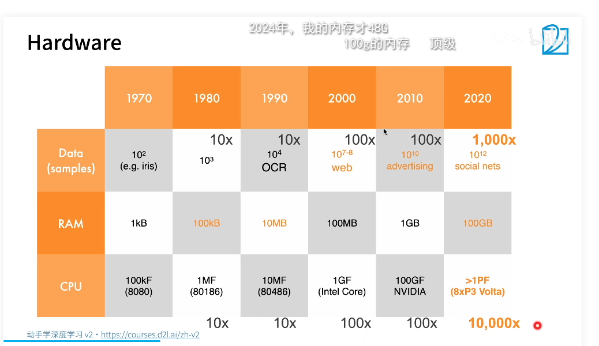
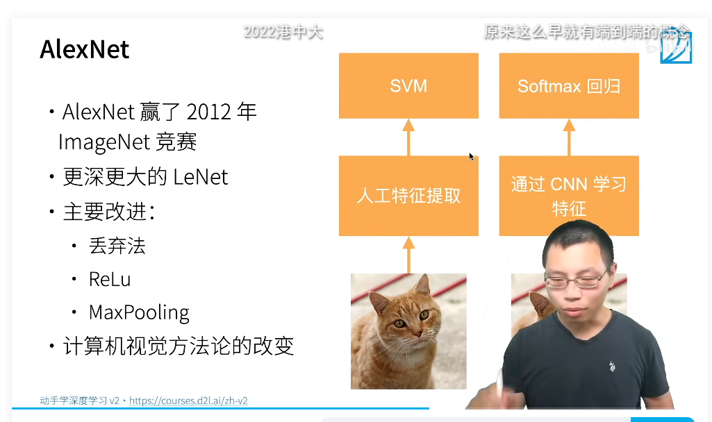
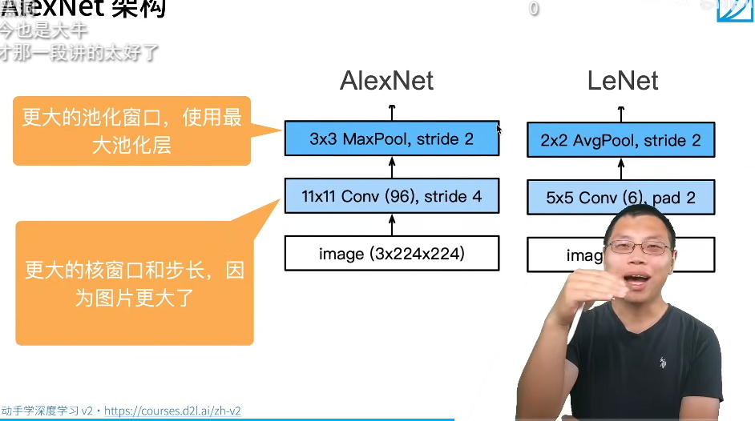
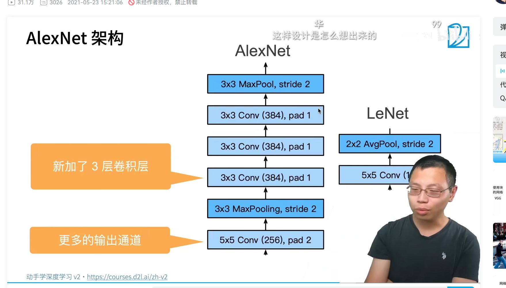
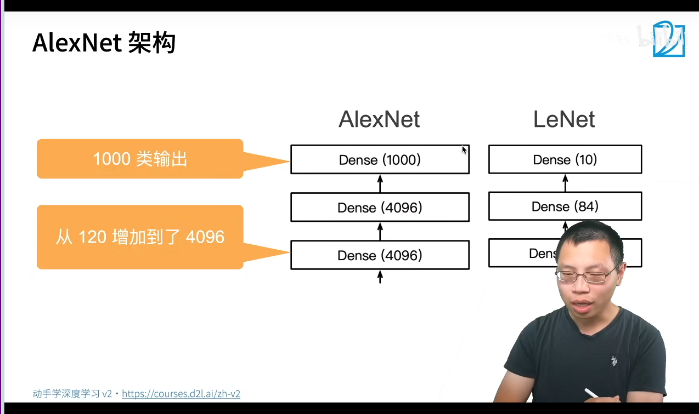
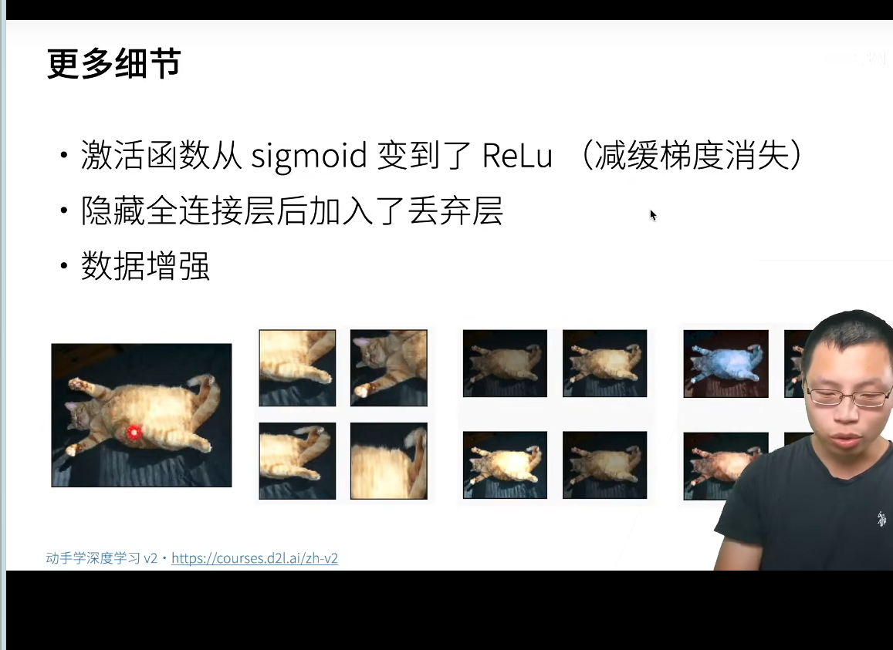
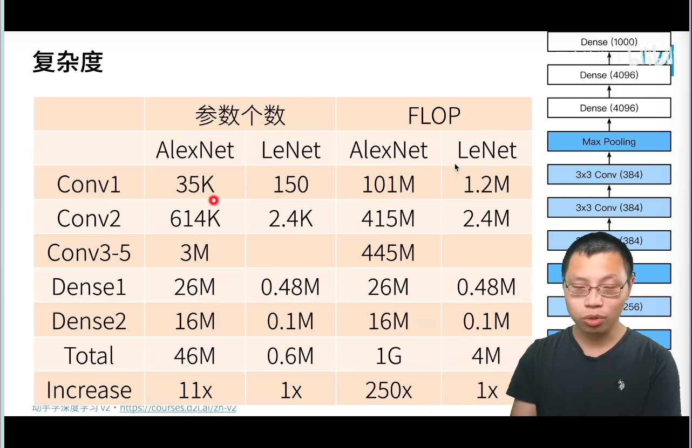
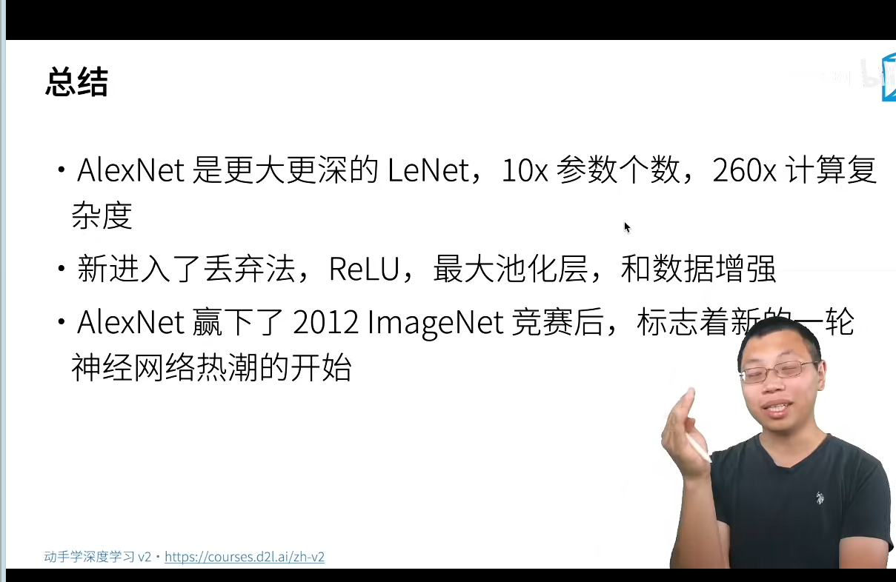
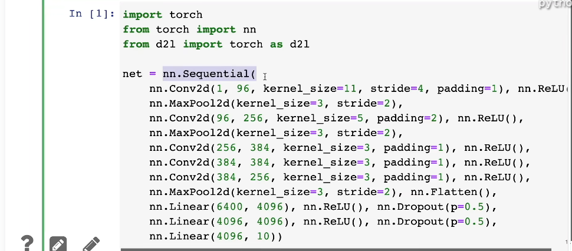

机器学习的核方法 2000年很热门 能用泛函计算 凸优化的求解
svm不需要调参
计算机视觉是从几何学过来,要把计算机视觉描述为一个几何问题,现在有很多子领域,如地球学
特征工程是关键
特制的描述子SIFT,SURF
视觉得的词袋

硬件的发展

计算的能力增长快

90年代的用神经网络做CNN
2000你那用核方法
2010年后有使用神经网络,构造更深的神经网络

数据集ImageNet(2010)物体分类的数据集
2012年ImageNet Large Scale Visual Recognition Challenge(ILSVRC)
做自然物体的彩色识别
样本数120万
训练数据集1000类
测试数据集1000类
alexnet拿到了冠军,
主要改进加入了丢弃法,Relu,maxpooling

AlexNet结构是更大更深的LeNet增大了卷积核MAx池化,增加了三个全连接层,使用了丢弃法,ReLU,1000输出层







更多细节:数据变化,截取一块云云,防止过拟合



总结



代码架构如下:


```
from mxnet import np, npx
from mxnet.gluon import nn
from d2l import mxnet as d2l

npx.set_np()

net = nn.Sequential()

net.add(
    # 这里使用一个11*11的更大窗口来捕捉对象。
    # 同时，步幅为4，以减少输出的高度和宽度。
    # 另外，输出通道的数目远大于LeNet
    nn.Conv2D(96, kernel_size=11, strides=4, activation='relu'),
    nn.MaxPool2D(pool_size=3, strides=2),
    # 减小卷积窗口，使用填充为2来使得输入与输出的高和宽一致，且增大输出通道数
    nn.Conv2D(256, kernel_size=5, padding=2, activation='relu'),
    nn.MaxPool2D(pool_size=3, strides=2),
    # 使用三个连续的卷积层和一个较小的卷积窗口。
    # 除了最后的卷积层，输出通道的数量进一步增加。
    # 前两个卷积层后不使用汇聚层来减小输入的高和宽
    nn.Conv2D(384, kernel_size=3, padding=1, activation='relu'),
    nn.Conv2D(384, kernel_size=3, padding=1, activation='relu'),
    nn.Conv2D(256, kernel_size=3, padding=1, activation='relu'),
    nn.MaxPool2D(pool_size=3, strides=2),
    # 这里，全连接层的输出数量是LeNet中的好几倍。使用dropout层来减轻过拟合
    nn.Dense(4096, activation='relu'), nn.Dropout(0.5),
    nn.Dense(4096, activation='relu'), nn.Dropout(0.5),
    # 最后是输出层。由于这里使用Fashion-MNIST，所以用类别数为10，而非论文中的1000
    nn.Dense(10))
```


