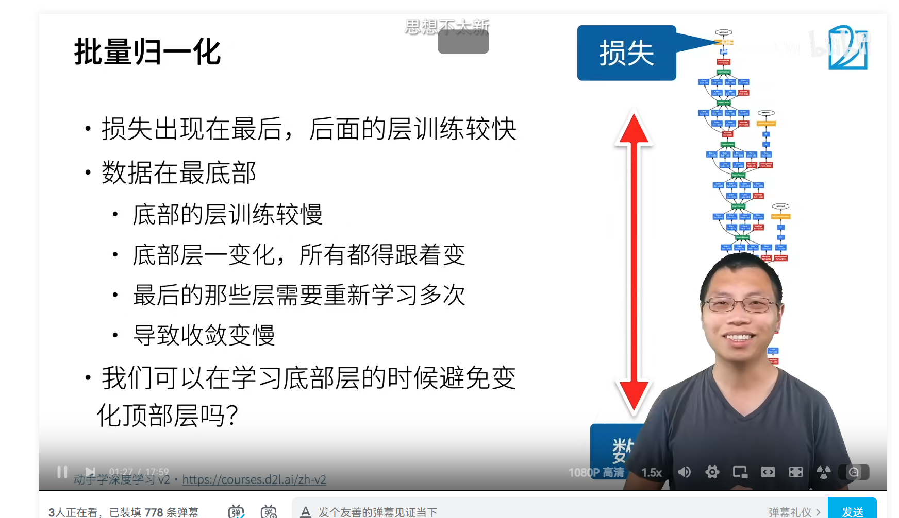
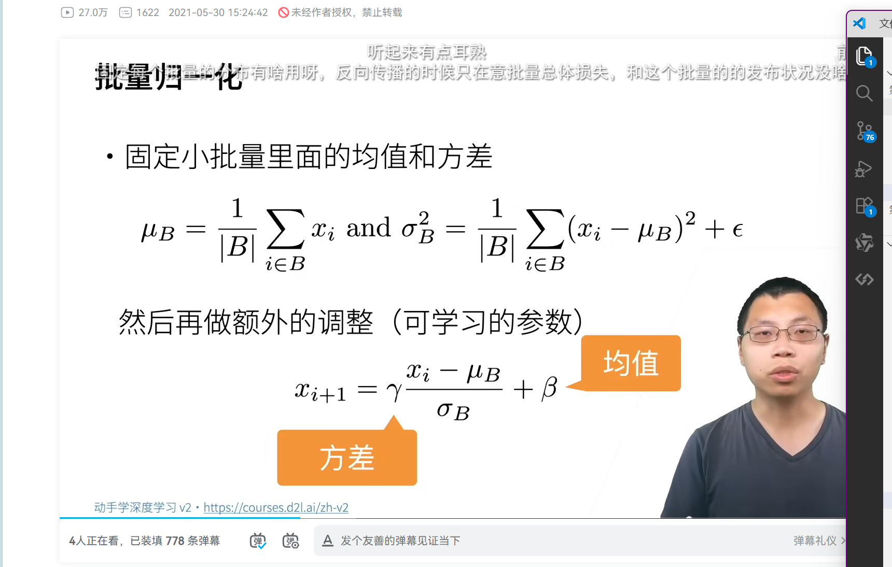
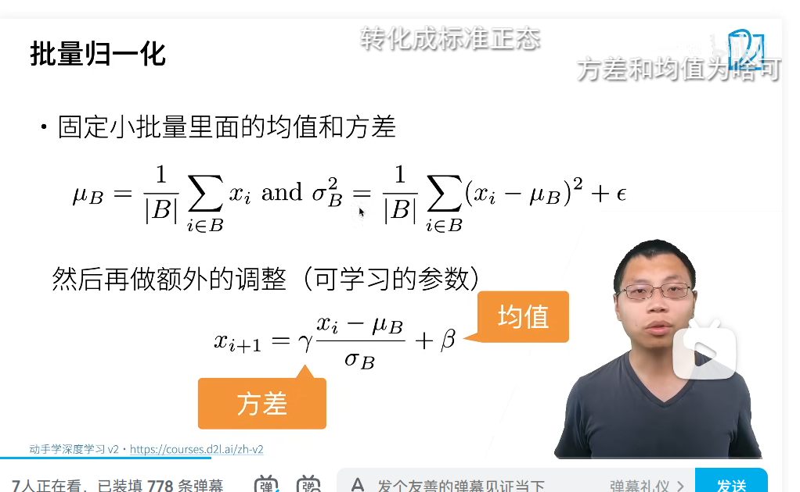
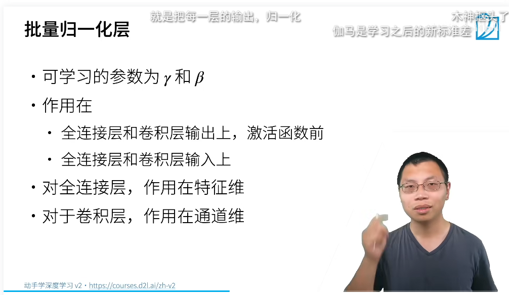
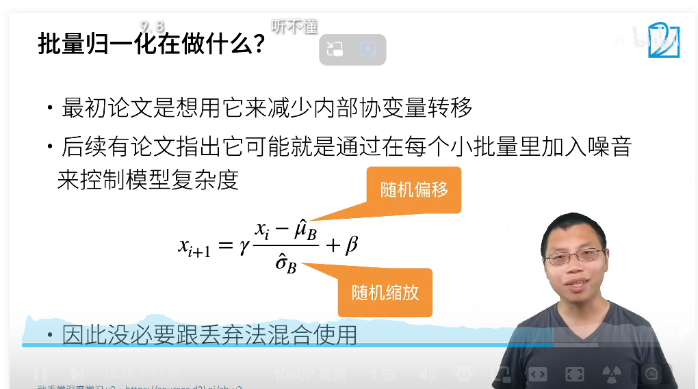

批量归一化:
训练数据特征:
避免顶部的重复训练,使用batch

假设分布固定了,批量归一化层
在小批量的均值和方差固定住

然后再做额外的调整

先固定小批次的方差,一点一点的挪

放在激活函数之前
批量归一化层
激活函数之前

批量归繁华应用于单个可选层:原理如下
- 在每次训练迭代中,首先规范化和输入,即通过减去其均值并除以其标准差,其中两者君基于当前小批量处理.
- 接下来应用比例系数和偏移量.对这个基于批量统计的标准化为批量规范化
- 批量的选择很重要
- 批量为1的批量在训练中无法学到任何东西,故而只有足够大的批量才能学到新东西else已经被归一化了
  
批量归一化层
- 关键区别为在完整的小批量上运行,因此不能像引入其他层一样忽视批量大小.下讨论两个情况
   - 全连接层:将批量归一化置于全连接层的放射变换和激活函数之间.设全连接层的输出为x,权重参数和偏置参数分别为w和b.激活函数为 \phi 批量规范化的运算符为BN.那么,使用批量规范化的全连接层的输出的计算详情如下:
         $h=\phi(BN(xw)+b)$  即全连接层的激活函数之前
   - 卷积层:   假设我们的小批量包含m个样本,且对于每个通道,卷积的输出具有高度p和宽度q.对于卷积层,在输出通道的m* p*q同事执行每个批量规范化.
   - 预测过程中的批量规范化:与训练模式下通常不同,首先将训练好的模型用于预测,不需要样本均值的噪声和小批次上估计每个批次的方差了.其次,用模型对样本进行预测.常用的方法

没必要进行丢弃法的混合使用
在批量中加入了噪音进行控制模型复杂度
在小批中加入噪音
可以加速收敛,但是一般不改变模型精度

代码:
inference 的时候:
def batch_norm(X, gamma, beta, moving_mean, moving_var, eps, momentum):
    # 通过is_grad_enabled来判断当前模式是训练模式还是预测模式
    if not torch.is_grad_enabled():
        # 如果是在预测模式下，直接使用传入的移动平均所得的均值和方差
        X_hat = (X - moving_mean) / torch.sqrt(moving_var + eps)

    else

        assert len(X.shape) in (2, 4)
        if len(X.shape) == 2:
            # 使用全连接层的情况，计算特征维上的均值和方差
            mean = X.mean(dim=0)#通道数0轴,高度1轴,宽度2轴
            var = ((X - mean) ** 2).mean(dim=0)
        else:
            # 使用二维卷积层的情况，计算通道维上（axis=1）的均值和方差。
            # 这里我们需要保持X的形状以便后面可以做广播运算
            mean = X.mean(dim=(0, 2, 3), keepdim=True)#批量数0轴,通道数1轴,高度2轴,宽度3轴
            var = ((X - mean) ** 2).mean(dim=(0, 2, 3), keepdim=True)
        # 训练模式下，用当前的均值和方差做标准化
        X_hat = (X - mean) / torch.sqrt(var + eps)
        # 更新移动平均的均值和方差 moving 动量法
        moving_mean = momentum * moving_mean + (1.0 - momentum) * mean
        moving_var = momentum * moving_var + (1.0 - momentum) * var
    Y = gamma * X_hat + beta  # 缩放和移位
    return Y, moving_mean.data, moving_var.data

