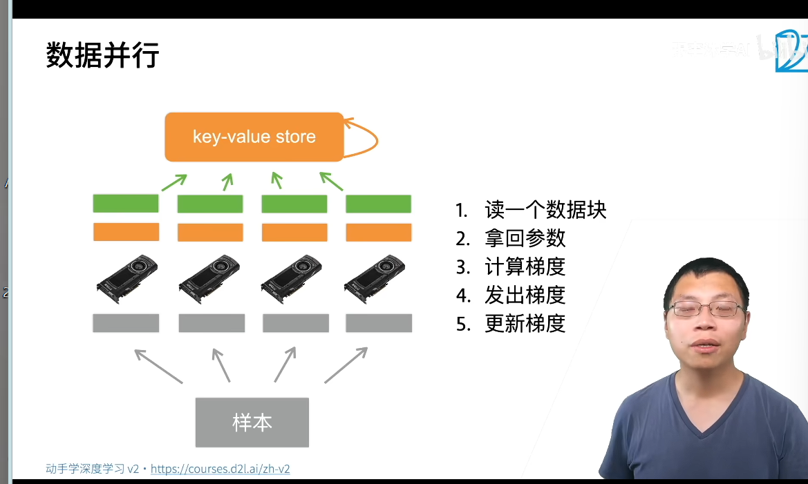

多GPU的并行,
一个机器可以安装多个GPU一个小批量计算切分到多个GPu来达到加速目的
数据并行:小批量分成n块,每个Gpu拿到完整的参数计算的梯度
模型的并行:把模型分成n块,每个GPU拿到模型计算的前向和方向

数据并行:
1. 读取数据
2. 拿回参数
3. 计算梯度
4. 发出梯度
5. 更新梯度

总结
当一个模型能够单卡计算,用数据并行拓展到多卡
模型并行用于超大模型

QA:
显存的大小GPU,依照小GPU的方法,看样本数
小批量分到多个GPU计算后,模型的结果如何合到一起:梯度加起来,模型更新
拆分后中间数据量不会增加,会降低性能,批量变小了矩阵运算变小了
模型并行可以做到低一点的并行
无人车功耗问题,

### 多GPU的数据实现

