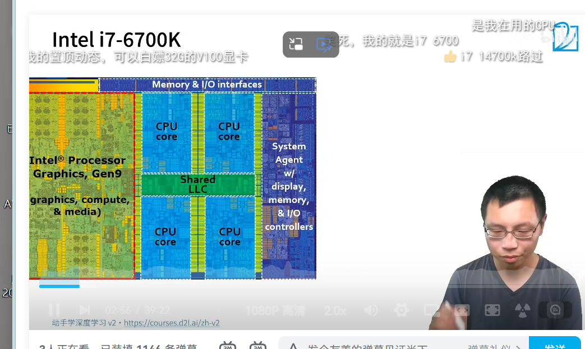
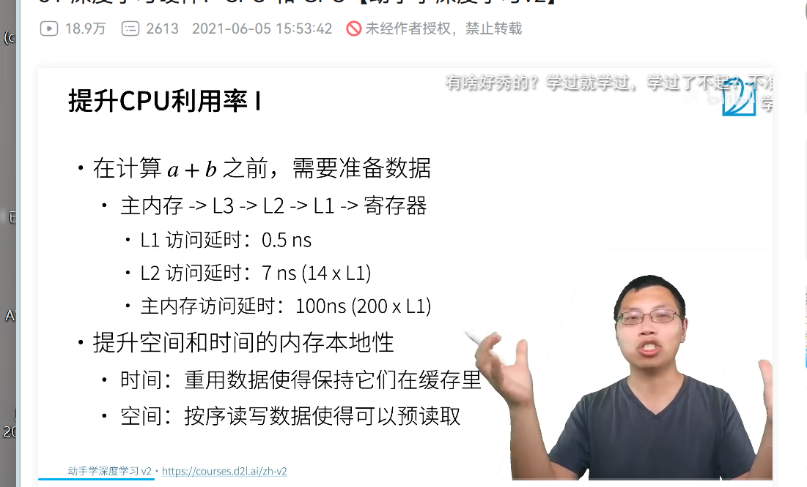
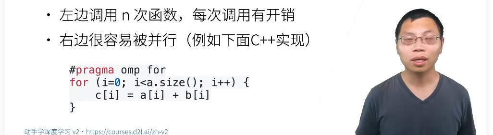
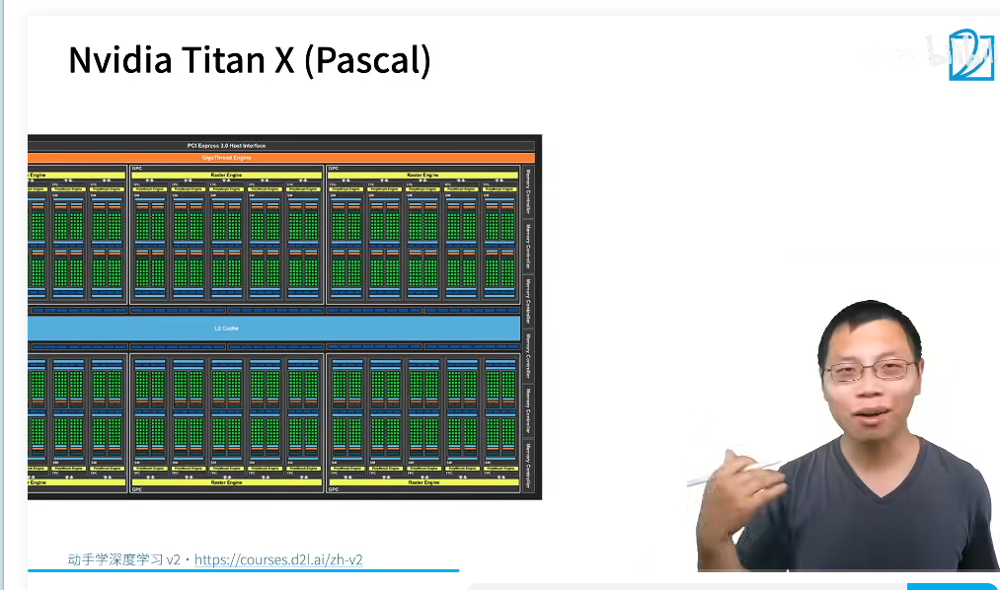
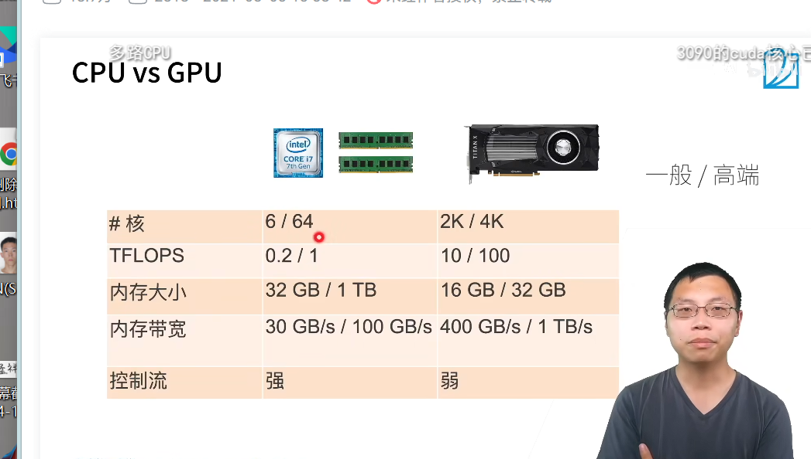
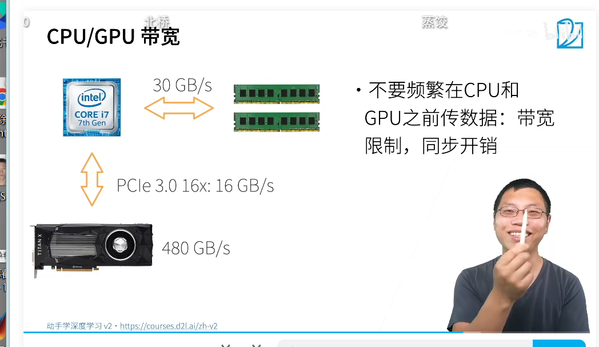
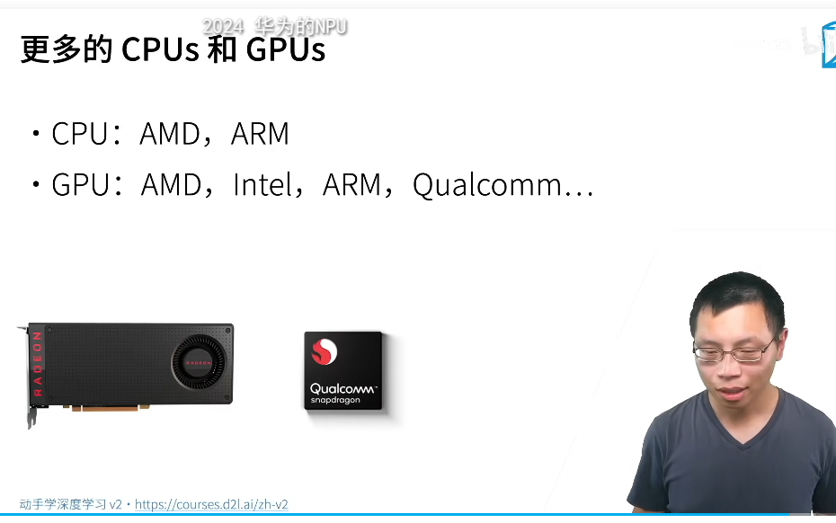
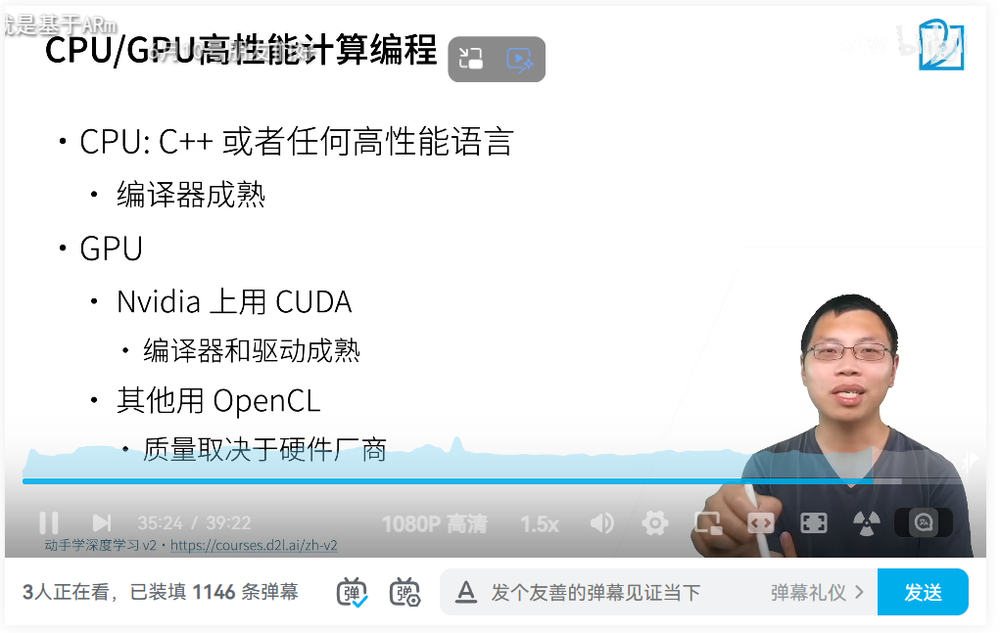

cpu和Gpu

cpu0.15t
gpu 12t  16G

四核 sharedll 即为第三级闪存
计算 a+b
主内存->l3->l2->l1->寄存器

内存访问慢
提升空间的时间的内存本地性

样例分析:
按照行存,访问一行64字节,按照行存和列存
提升cpu的利用率
英特尔
2超线程共享一个寄存器
计算密集型的用处不大

左边慢右边快

提升内存的稳定性

GPU

cuda核心：CUDA核
gpc 组

内存带宽GPU大一些
内存比较贵

cpu有控制流
计算效果不强

gpu不需要三级显存
冯诺依曼架构

并行
上千的线程并行
小神经网络速度加速不快
内存本地行
少用控制语句
支持有限,同步开销大

尽量不要在cpu和gpu中搬数据

更多的gpu和cpu
amd cpu
arm  游戏
intel 集成显卡
大厂做自己的芯片

高性能计算编程
编译器成熟 c c++
GPU cuda
opencl 标准
做硬件和做IDE

总结:

QA
1. 增加数据,提高泛化性,数据的质量很重要,调参的意义不如数据 的意义,调参的质量不是特别重要,else打比赛
1. alexnet计算量比resnet大,alexnet全连接层大,模型大小和计算复杂度不太一样
1. resnet和gbdt很像但是和数模型不一样
1. 这两个w不一样,在torch里面梯度丢失
1. 过拟合的数据
1. 加了层数也是超参数吗,架构就是超参数,参数尽量别乱搞
1. yolov4
1. llc是缓存last layer cache
1. gpu和cpu的区别,深度学习把gpu火了
1. 按行存,列存,列优先,行优先,列优先的效率,转换形式,如何存的
1. lenet用硬件做的,摩尔定律,更新换代,硬件发展周期是固定的
1. 硬件完全按照moone's law,软件对计算量上升很快
1. multiprocess分到哪个核上是系统决定的
1. for-loops尽量不要用或用c++写
1. 可视化的cpu和gpu切换,不要频繁转换,如何debug,在两个device上会报错,代码问题上没问题
1. go的分布式系统很好,和这个不一样,如网页的分布式,这里的hpc是计算密集型
1. rust的语言安全性比较好,
1. fortran编译器好,现在c++也很好
1. 复现论文,一篇论文复现需要理解每一句话,经典论文可以复现,写出所有的关键细节,看懂每一句话,看代码
1. tf框架和pytorch框架转化没有太大争议
1. paper能脱离实现成立的
1. 矿机asic
1. 硬件架构网站 
1. 分布式和高性能,分布考虑容错
1. qa是同事写的
1. 深度学习做测量,测量物体的宽度,换个矩阵摄像头
2. go语言的分布式好,高性能c比较好,社区不关注
3. 用多进程,py有全局锁
4. 国内的ai芯片的技术细节不开源
5. 统计➕神经网络的算法提升的鲁棒性和可解释性.如何入手
6. 矿机asic不适合深度学习
7. 芯片不难,tpu简单,做编译器,和别人用,生态,开发门槛
8. resnet做图像,不用文本
9. 分布式系统国内多,因为卖货,图神经网络的完善
10. pytorch和mxnet用户很多
11. xavier和bn一起用
12. 带货
13. 打比赛学不到什么
14. huggingface有很多人在用,商业化有问题
15. 自动驾驶有商业价值

