R-CNN
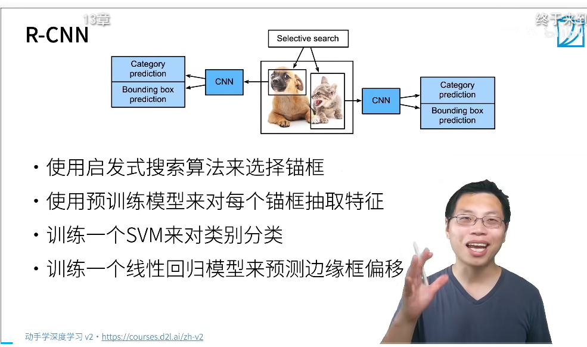
用启发式的算法来选择锚框
使用预训练模型对锚框抽取特征
训练svm的类别分类
用线性回归来预测边缘框的偏移

兴趣区域的RoI池化
的池化
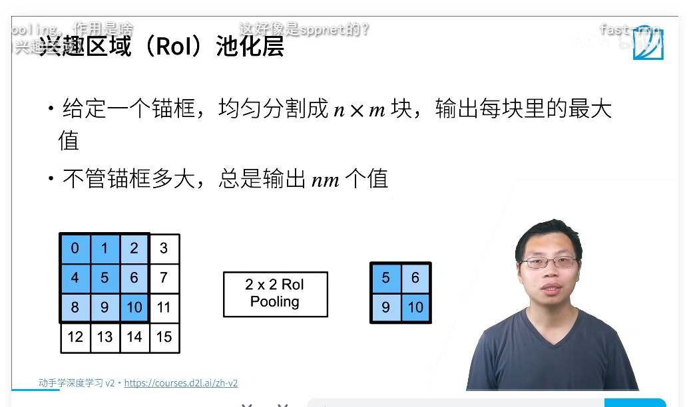
给定锚框均匀切割为n*m块
输出每一块的最大值
不管锚框多大,都可以输出nm个值

fast-RCNN
对图片用CNN抽特征
用pol池化层对锚框生成最固定长度
按照比例从特征的列表中抽取
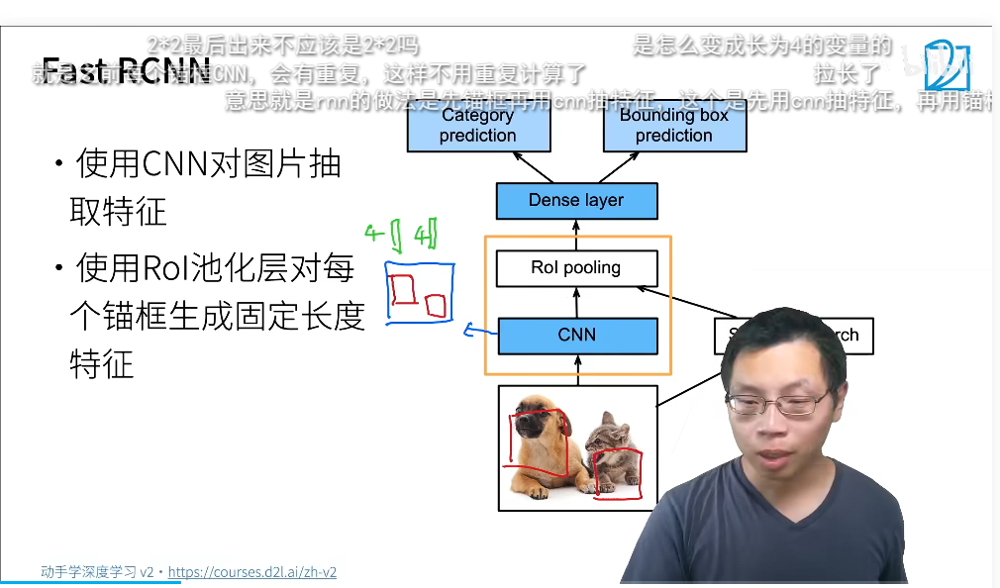
验证完进入全连接层
其中的cnn比之前的快
面对池化层的抽取比之前的少

Faster R-CNN
用神经网络替代选择性搜索
RPN 
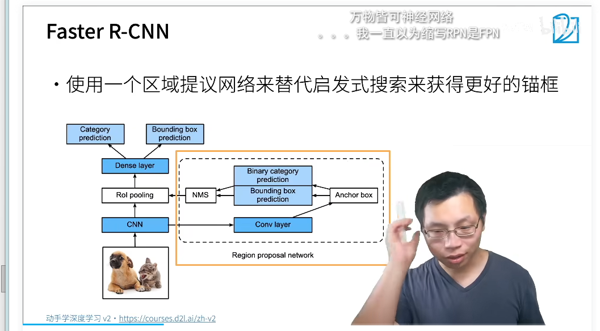
cnn进入

Mask R-CNN
假设有像素的预测,加上其像素的标号,目标检测是像素级别的,pooling可能导致像素级别的偏移,
这里直接不切了
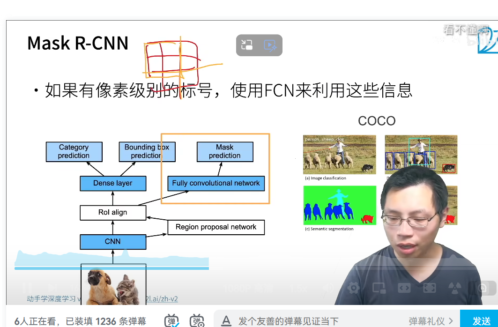
fasterRCNN 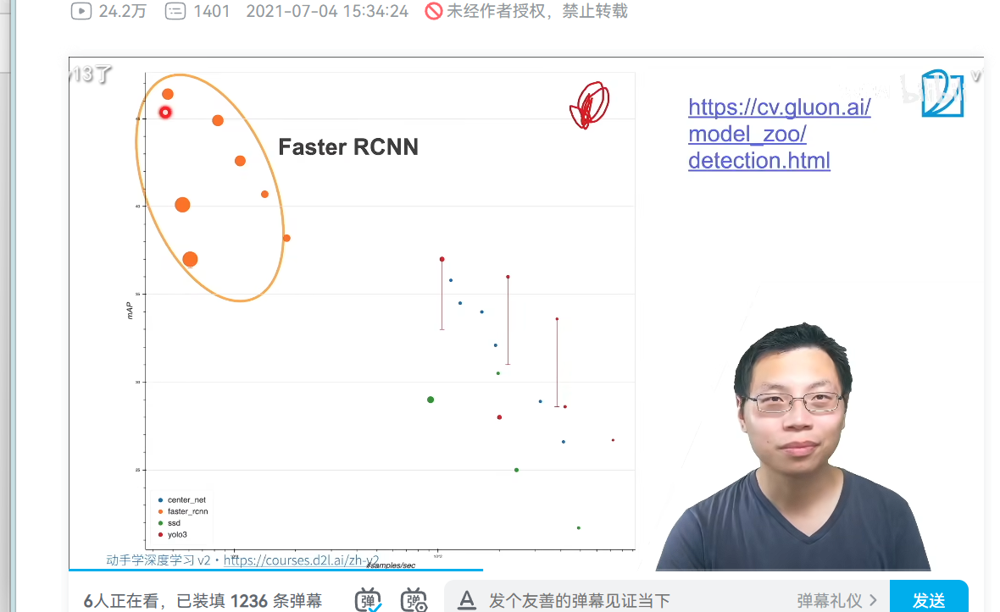计算效果比对图,对精度关心的时候用faster RCNN,对速度关心用Mask R-CNN

Rcnn是最早也是最有名的cnn目标检测算法的检测算法
fasterRCNN和fastrcnn持续提高性能
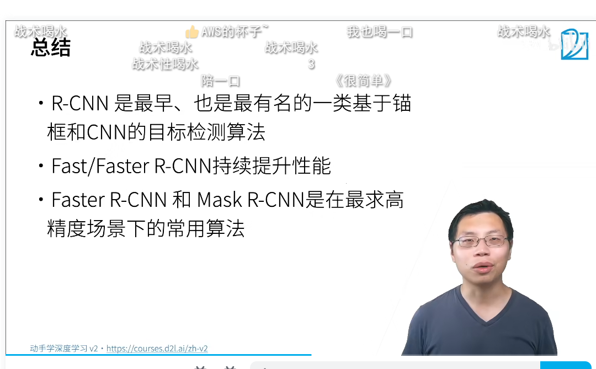

单发多框检测ssd算法

single-shot-detection
固态硬盘
生成锚框以每个像素为中心生成模框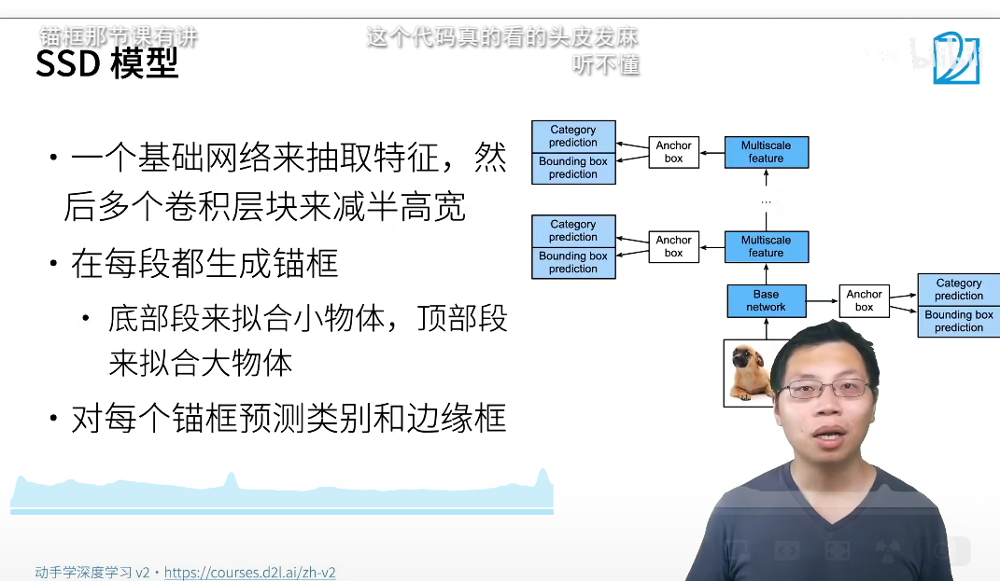
直接对模框做预测了
图片过来,抽特征,生成模框,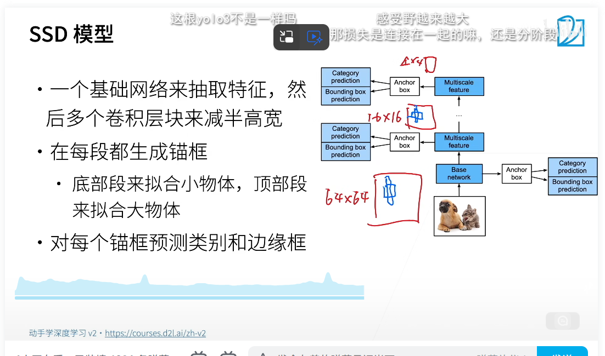一张图片可以生成一百万个物体

ssd的算法相对来说比较快,做的比较早
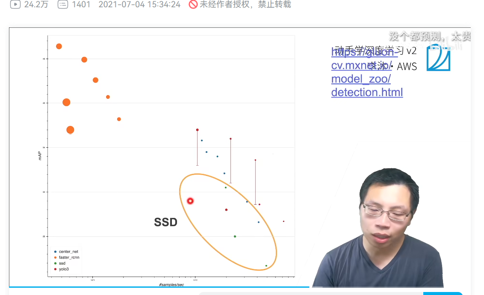
总结
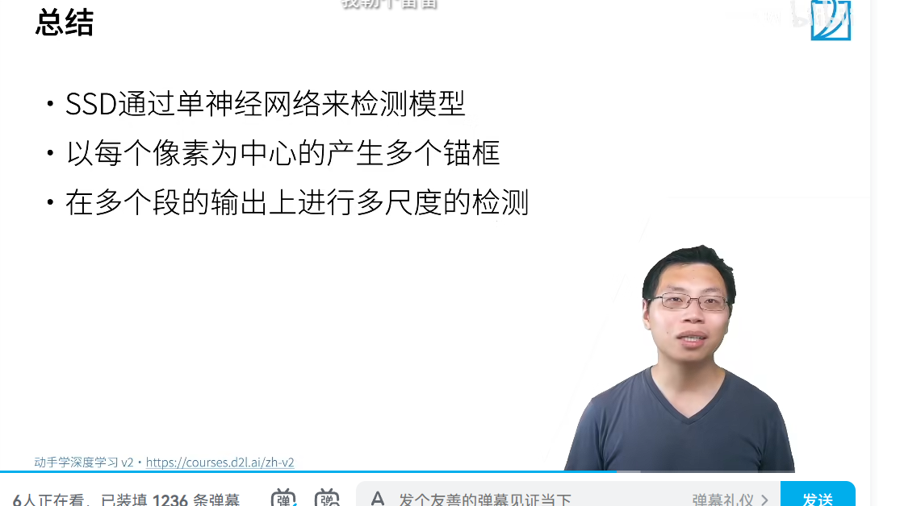
多尺度的检测算法

YOLO
(你只看一次)
只有一个单神经网络
生成模框
ssd的模框重叠率很高
yolo的模框尽量不要重叠
每一块都是一个模框
去每一个模框预测第一个边缘框
对每个模框预测b个边缘框
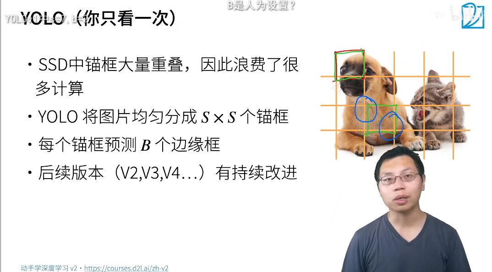
后续版本v2,v3,v4
v3后那算法检测人,
真实的边缘框不会随机出现,每一个物体在数据集中出现是有一点的规律,可以用一个算法给这种找出来,相当于有先验知识后的检测
yolo v3
性能梯度图
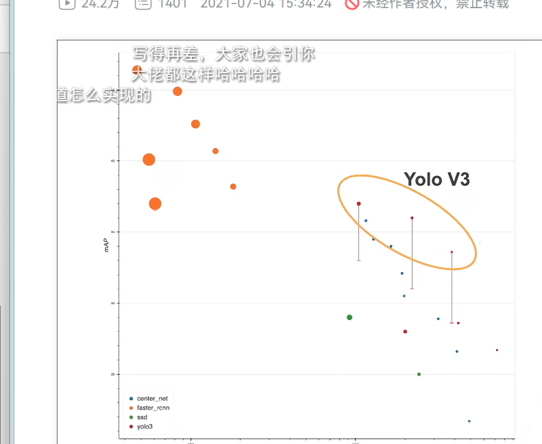
比ssd性能高,也快
且比fasterRCNN快
被常使用与工业界

对每个像素的预测

