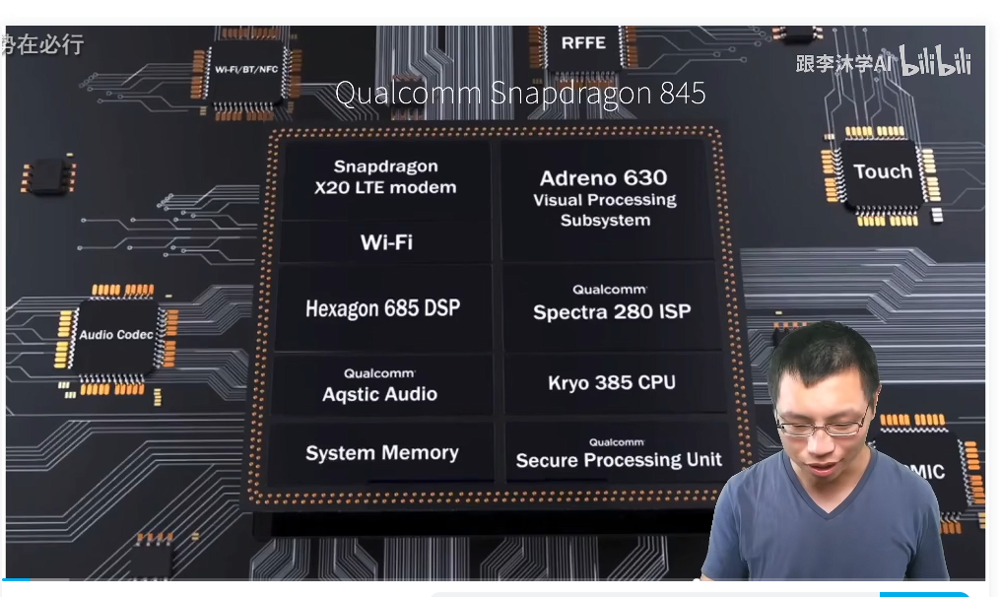
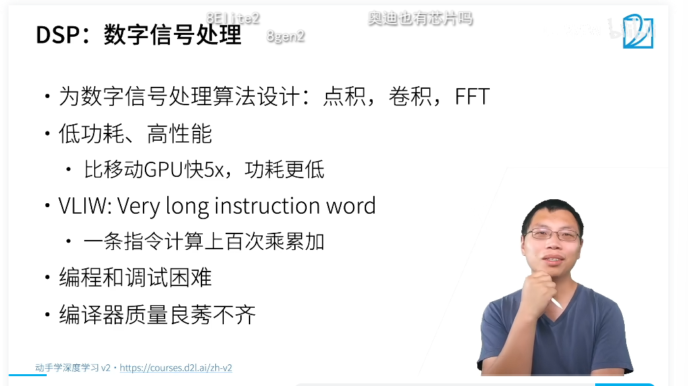
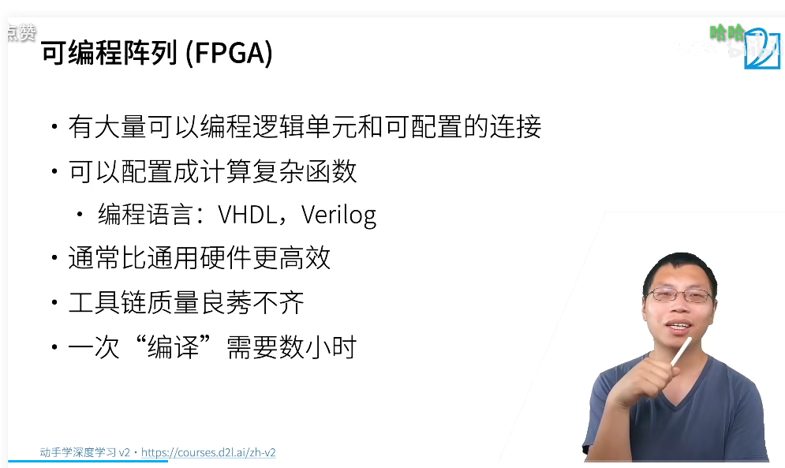
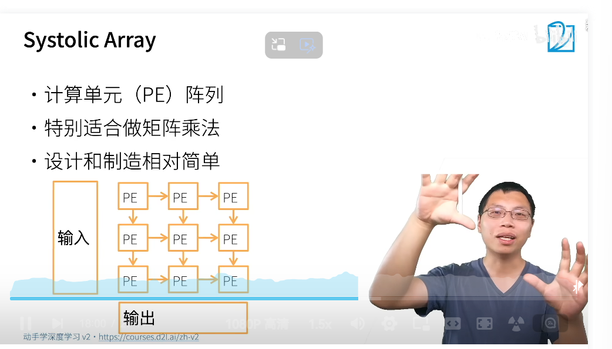
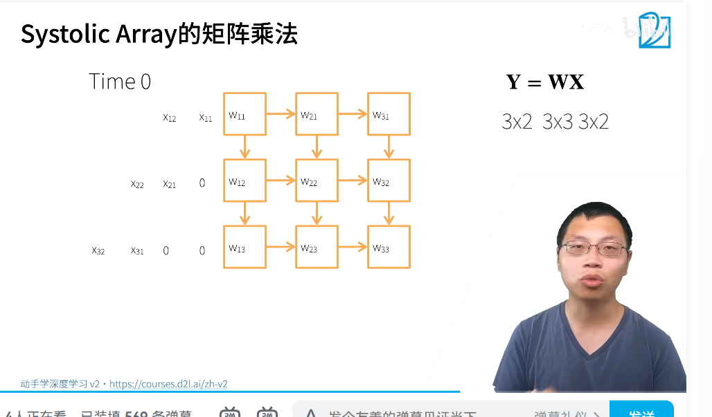
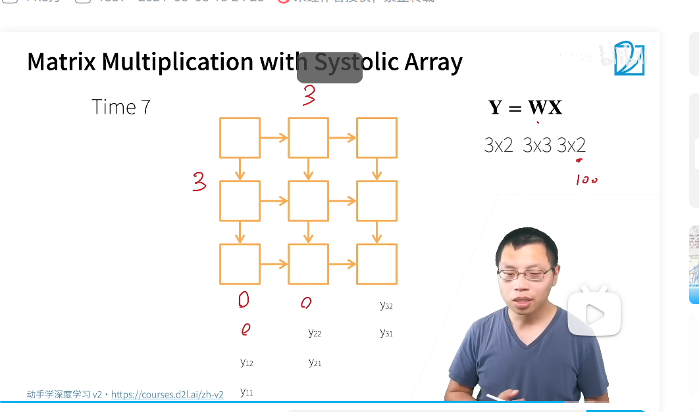
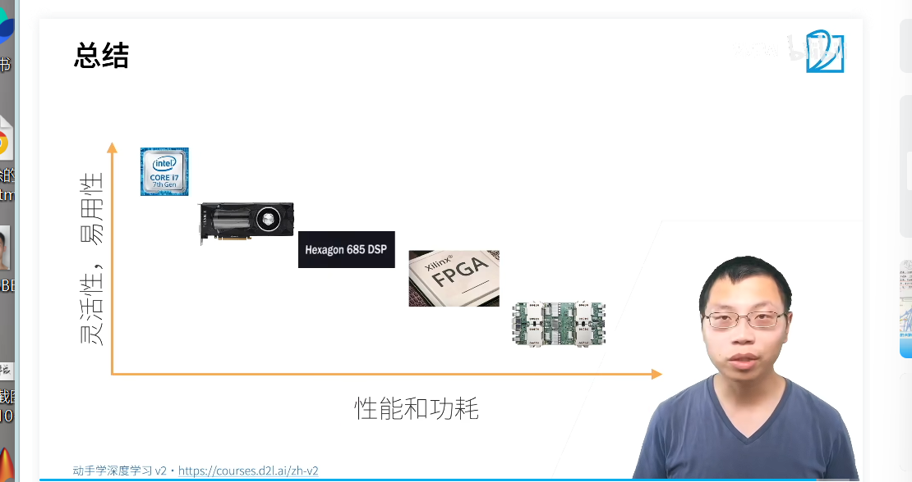
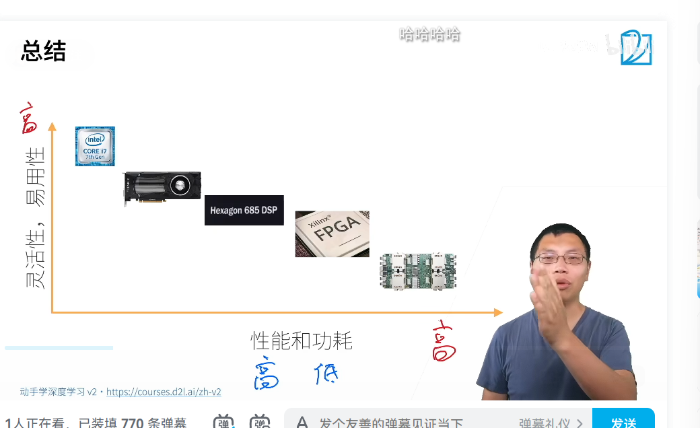
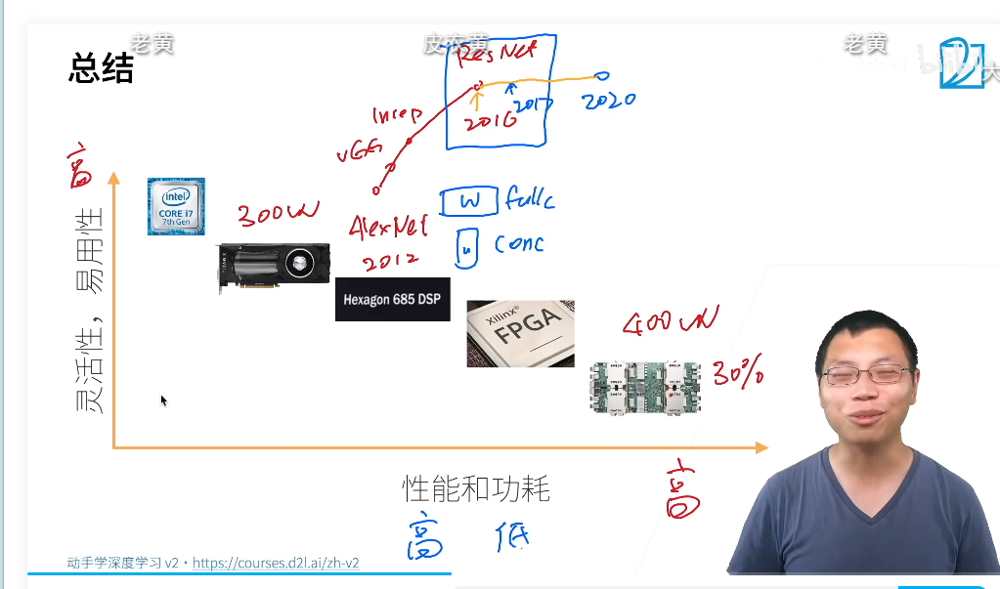

更多的芯片:

手机芯片:

DSp

信号处理芯片:
低功耗,卷积,傅里叶变换的
高性能
编译器差
very long insyruction word 计算指令的上百次累加
编程调试困难

fpga
可编程阵列
可以编程的逻辑单元和可配置的连接
配置成计算复杂的函数
语言:VHDL,Verilog
通常比通用硬件更高效
工具链良莠不齐
一次编译要好几个小时

ASIC
深度学习的热门领域:
Google TPU标志性的芯片
媲美Nvidia GPU媲美
大量Google大量部署
核心systolic array 专门做大矩阵乘法
好造但是便宜,也不是很厉害
用cpu的模拟

systolic array

计算单元阵列
特别适合矩阵乘法
设计和制作相对简单

乘法演示

切开匹配
批量输入减少延迟
特别的nn操作子

基本上一个单元做一种操作
基本上只有大厂愿意去发展
硬件的研发周期风险很大

QA
1. 性能要看芯片面积,比较性能,越专用的芯片性能越好
2. fpga的编译慢烧进板子很慢
3. fpga用asic的设计 :可以改,烧一个更新换代
4. 微软网页搜索用了fpga
5. sla的tpu的性能,尽量用tensorflow,卖芯片要有生态
6. softmax分类和sigmoid函数激活
7. 云上的关心功耗,散热的功耗
8. 对于一个云厂的功耗不是问题,30%,硬件才是机房的大头
9. NPu都是asic的
10. 未来的变化和asic的芯片的观察,

11. 硬件成为主流,定义网络怎么设计
12. reshape deep learning
13. bert架构的transformer,适合跑tpu,能做特别大是内存很大,tpu有128g
14. moudle parallel 
15. 硬件决定算法做asic的人见了个漏字,
16. 硬件是怎么变的,work load离开不了硬件
17. risc v做硬件,是个指令集,指令集的架构
18. arm可以定制化
19. risc v不用收学费,很便宜的成本,低端的芯片,成本低,价格战
20. apple的芯片有gpu和cpu,asic芯片,只能做inference
21. tpu在边缘端的asic tpu 
22. 国产芯片的框架问题,商业化的问题,当框架是真的开源的情况下是不用担心的,如果不开源的话,那么会有影响
23. 

