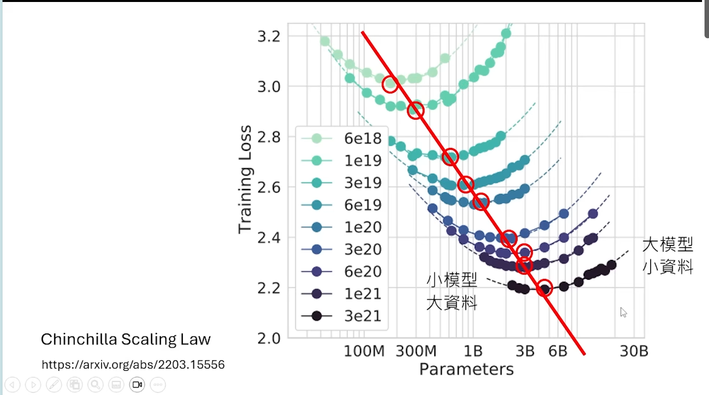
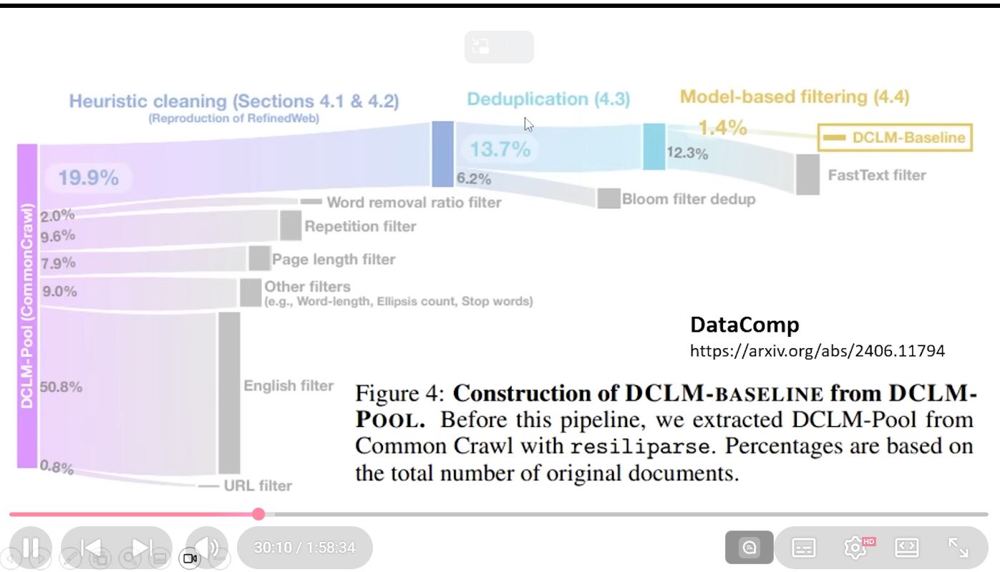
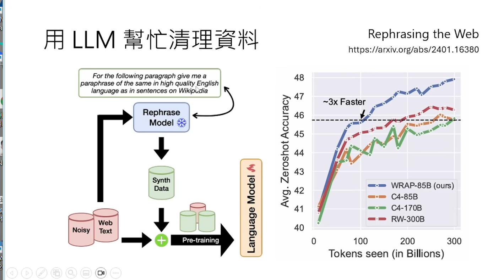
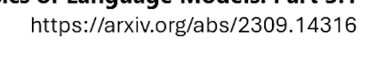
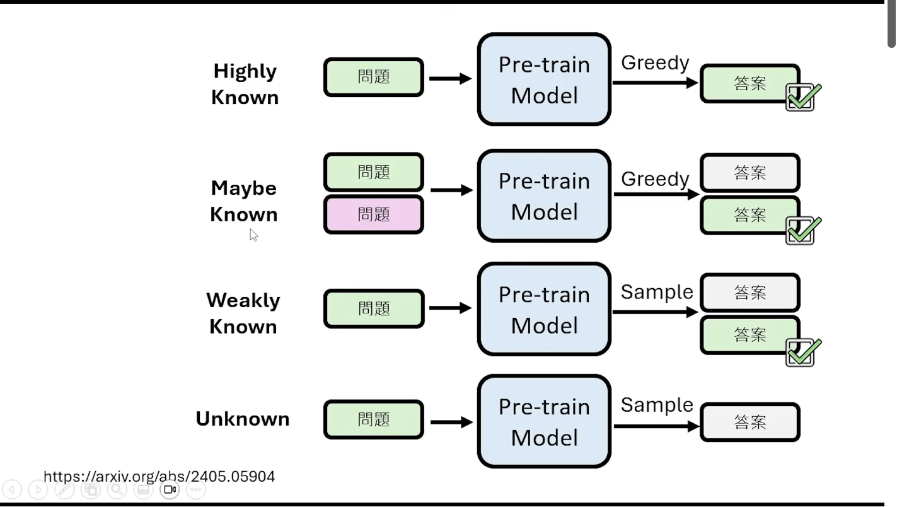
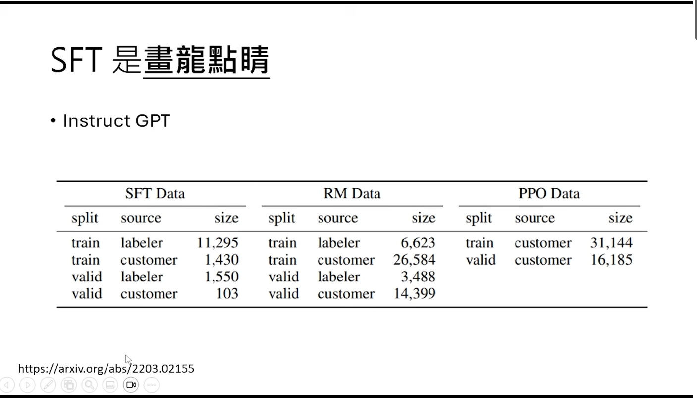
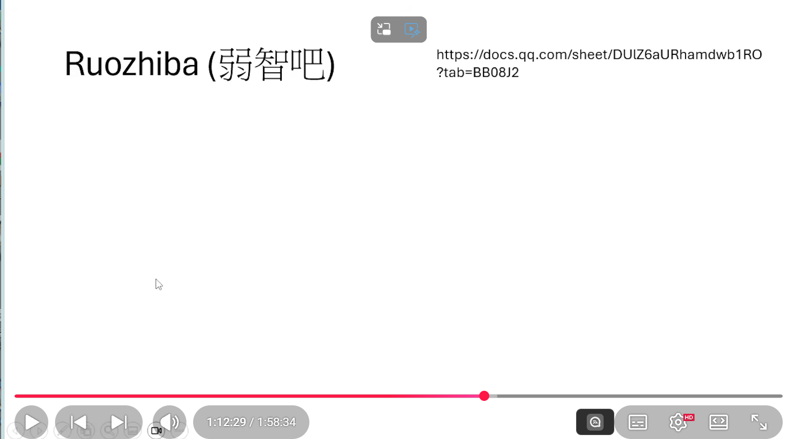
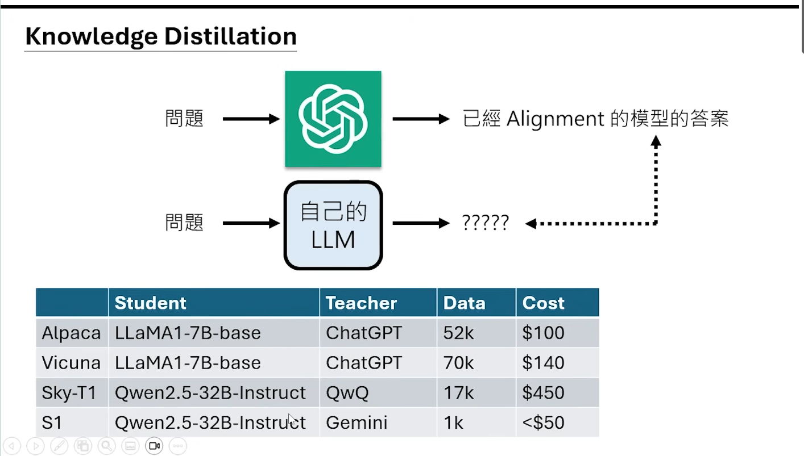
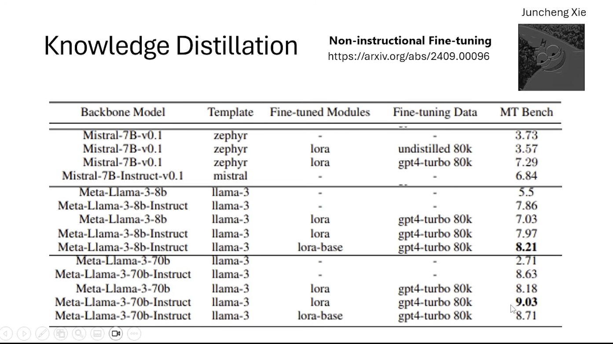
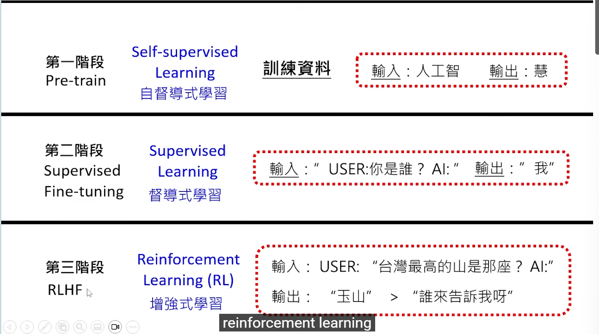

[text](c:/Users/31304/Downloads/LLMtraining.pdf)大型语言模型的学习历程
- pre-training: 预训练
- SFT: Supervised Fine-Tuning
- RLHF: Reinforcement Learning from Human Feedback

第二阶段人们提供标准答案
第三阶段只是提供回馈

文字接龙是分类问题
15Ttoken
fineweb: 15Ttoken的数据集
网络上的资料差不多增长多头了
不是死背但是压缩

资料越多越好吗?不是,算力有限
大模型与大资料要平衡

chichilla scaling law 的图片,证明了要平衡大模型和大资料

有些资料很难学
microwavegang的模型试验,里面有一些乱码(资料的品质)

Datacomp的资料清理工作

用大型语言模型进行清理

蓝色线是结果,换句话说

有大模型model不去回答问题
反而问人类,因为网络上很多问人的问题(资料污染)

Pre-train的model需要精雕细琢,
SFT:人类的资料进行文字接龙
instruction fine-tuning: 指令微调 问题学习问题
pre-training如何帮助sft

[Physics of Language Models: Part 3.1](https://arxiv.org/abs/2309.14316)
其实不容易让ai学一个新的东西
highly known
maybe known
weakly known
unknown
图片如下

其中最有用的是maybe known
maybe known: 是一个其知道的知识,但是不知道如何用
SFT很难使得模型学习新的东西
一般pre-train过程中就确定了
ALignment: 模型学习如何将输入映射到输出
alignment并没有本质的变化

ROT13最长用来使用,因为其是26/2
Gpt4只能做1,3,13因为是训练用的东西
通才
FLan模型
google想要打造通才模型
SFT是教输出风格
将原理的论文

quailty is all you need
Ruozhiba的资料对机器学习很重要,可以激发模型能力

有人从ALpaca挑选最长的1k资料结果训练效果出奇的好Long is more
找郝老师当模型,训练的成本低(不含生资料和请资料的成本)

连解决问题的问题用ai来来完成.
ai答问题
ai训练小ai
finetunning: 训练小ai微调也可以使得模型效果好

RLHF: 模型学习如何从人类反馈中获取信息
判断好坏是容易的
minimize the negative log likelihood
根据正确答案学习和根据reward学习的不一样的
因为很难去理解人类的反馈
无法做梯度
RL做到的是一个完整的回答评判,更接近人类的偏好
第一阶段只是过问过程
第三阶段只关注结果

RLHF: 模型学习如何从人类反馈中获取信息
RL更像是因材施教回馈更接近痛点
怎么在没有gradient的情况下训练RL模型
下棋和RL关系
policy gradient: 策略梯度 在RL的应用
精神:
- 跟错误答案拉远
- 跟正确答案拉近

RLAIF: 模型学习如何从ai反馈中获取信息
微调一个Reward model
生成答案困难,评分容易

总结

训练三个阶段

    

