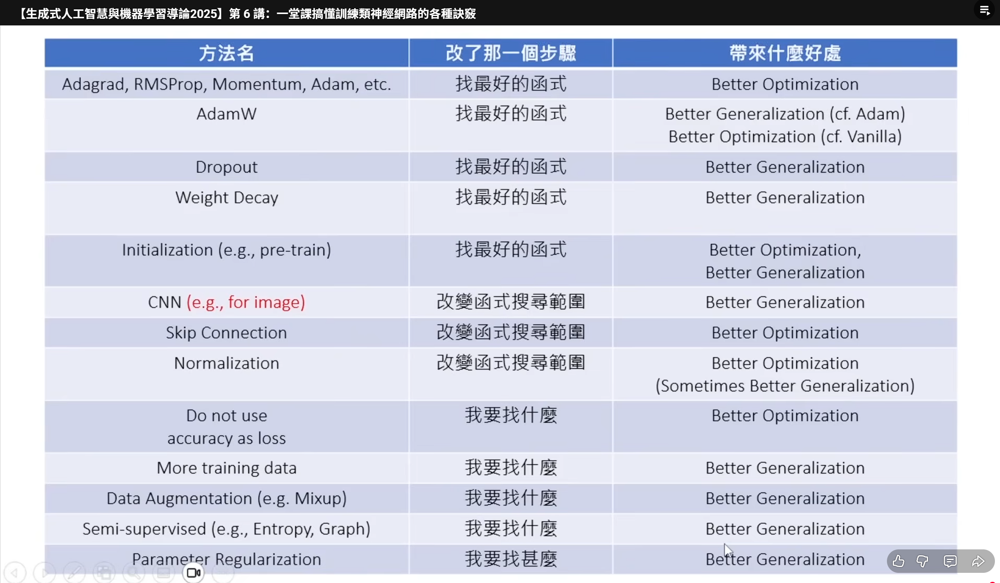

寻找解决问题的函数.
要找的函数,根据投影片->讲课的时间   老师什么时候要下课
三个问题3+1
- 我要找什么函数
- 有哪些什么选择
- 选个好的

第四讲,评估方法(回忆)

Evalution要先被讲

要做到的事情,从youtobe中可以找到时长
越小越好 loss
越大越好 objective 

ppt,feature: 输入
$ y=w_1*x_1+b $

$L(w_1,b)= 1/n \sum_{i=1}^n (y_i - (w_1*x_i+b))^2 $

$ w_1,b=\arg\min_{w_1,b} L(w_1,b) $
热力图
如果为线性问题则有closed form solution
但是本文讲的是通用的办法,即使用Gradient Descent来解决
第五讲后面便是通过Gradient Descent来解决但是需要介绍overfitting,然后解决办法就是使用batch normalization 来解决
但是要选择多大需要自己考虑

#第六讲
训练的方法
adam optimizer的思路如下:
使用动量法和RMSprop的结合,具体思路如下:

dropout: 防止过拟合,在训练的时候,随机将一些神经元的输出设置为0,这样可以防止过拟合,但是在测试的时候,需要将所有的神经元都打开,然后再进行测试.
但是不是必要的,其使用的时候会降低训练的正确率,可能提高测试的训练率,所以要在训练效果降不下去的时候使用
initialization: 随机初始化,使得参数的初始值不会太大,防止梯度爆炸,防止梯度消失
即使optimizer的参数很好,initialization也有可能发挥作用
因为有局部最优解
pre-training: 预训练,在训练之前,先训练一个模型,然后将其参数作为初始化参数,这样可以加速训练,并且提高训练的效果
Pretext Task->Downstream Task
Pretext Task: 预训练任务,需要有Downstream Task的特征,但是不需要Downstream Task的标签.
对optimizeration and generation都有帮助

函数的集合,比较大则容易overfitting,小则容易underfitting
convolutional neural network: 卷积神经网络,处理图像

skip connection(Residual connection): 跳过连接,使得网络可以处理长序列数据
将低layer的输出加到高layer的输出中,使得长的layer可以被更好的训练

分类问题的评分
先走softmax的结果,然后再计算cross entropy loss
公式如下:
loss = -1/N * sum(y*log(p))