## pid上的有限生成模的分解定理
### 第一类分解
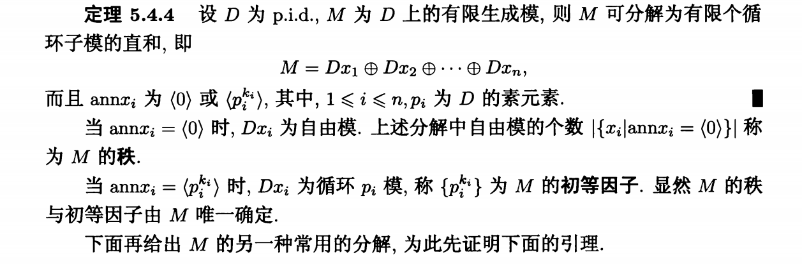
其中的x_i为第i个有限生成模的生成元素,annx_i为第i个有限生成模的生成元素对应的逆元素,可以理解为p模的直和

### 第二类分解
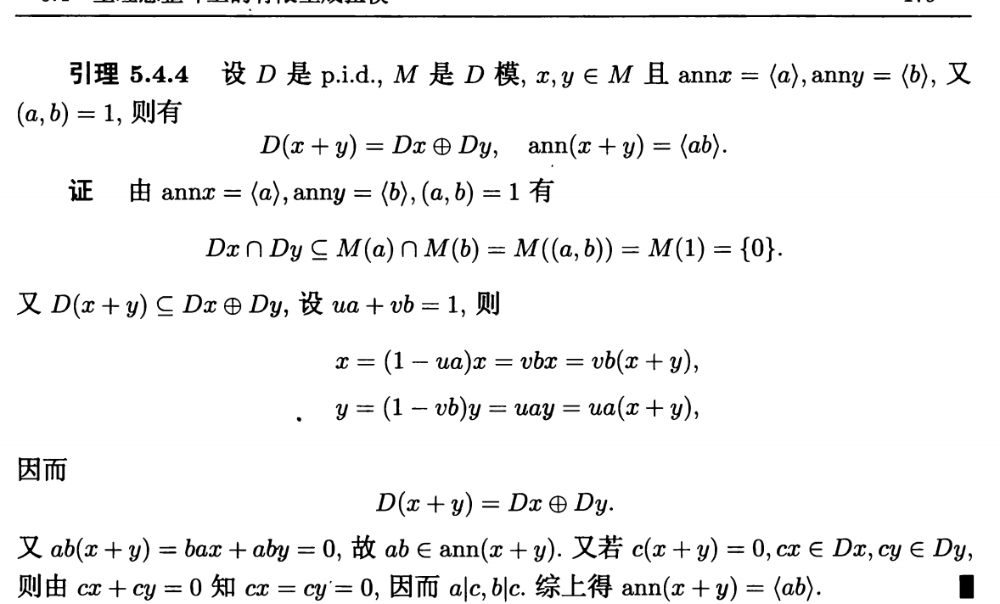
这一个说明了两个ann生成元互素的模元素x,y的直和的D(x+y)=D(x)+D(y),ann(x+y)=<ab>
也间接说明了p模的直和运算法则

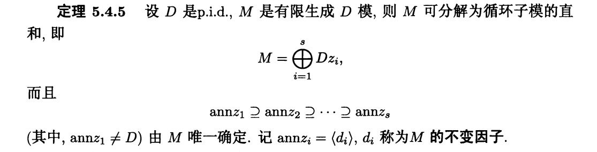
证明如下:
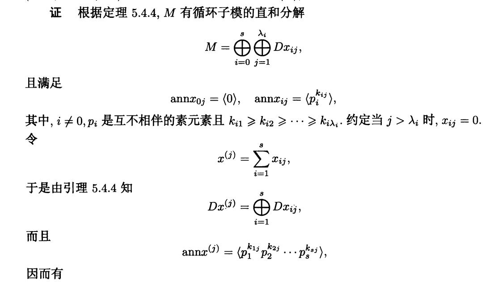
第一部分证明直接重复使用上面的p模直和的关系,重复应用然后把其中在一块的互素元素拆开即可
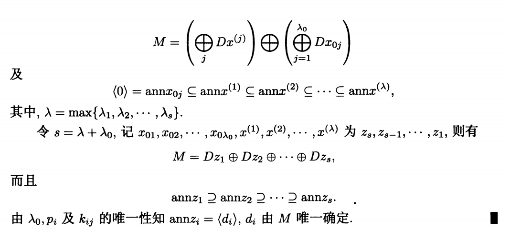

两个分解定理都阐释完毕:
正文内容如下:
# 定理5.5.1 
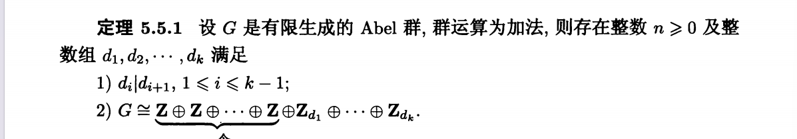
abel群为一个zmoudle
z是一个主理想整环,故而直接用第二类分解得到这个定理
完整证明如下:
[thmeorem 5.5.1的证明](image-7.png)

在这个定理之后引入了Betti数和扭系数的概念
- thmeorem 5.5.1中的n为z module的秩,就是Betti数
- d_i为z module的d_i,即G作为z module的不变因子在袋鼠拓扑学中称为扭系数
 ### Abel群的分解 
于是Abel群的分解如下:
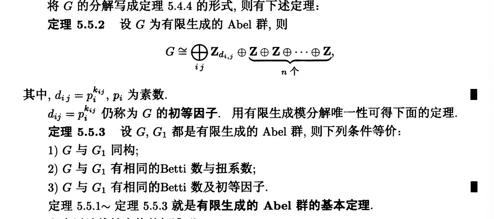
即G可以分解为zmoudle的自由元和zmoudle的纽元
等价的z,moudle满足如下的条件:
- G与G_1同构
- G与G_1有相同的扭系数和Betti数
- G与G_1有相同的初等因子和Betti数
注意:本文中的扭系数和不变燕子是相互定义,一个是对应着f(x)=0中的代数元,另一个是代表着f这个泛函

### field上的线性变换可以视为一个moudle
- 假设部分
     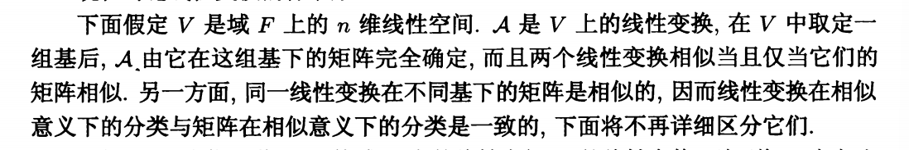
-  引出部分v的一个分解,A可以看作为一个F[\lambda]moudle
    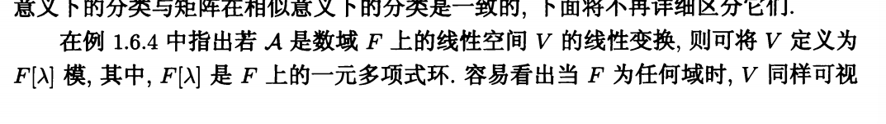
    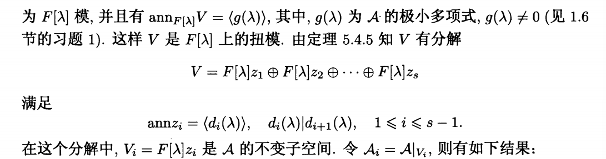

### themorem 5.5.4
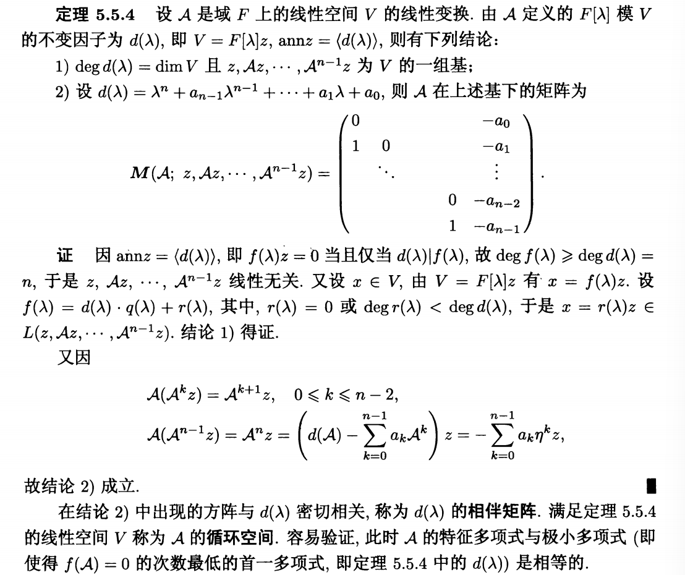
themorem 5.5.4讲述了F有理标准形的循环表示
其实就是A^n-d(A)作为最后一项即可
them5.5.5 域上的线性空间v的线性变换的不变因子分解:
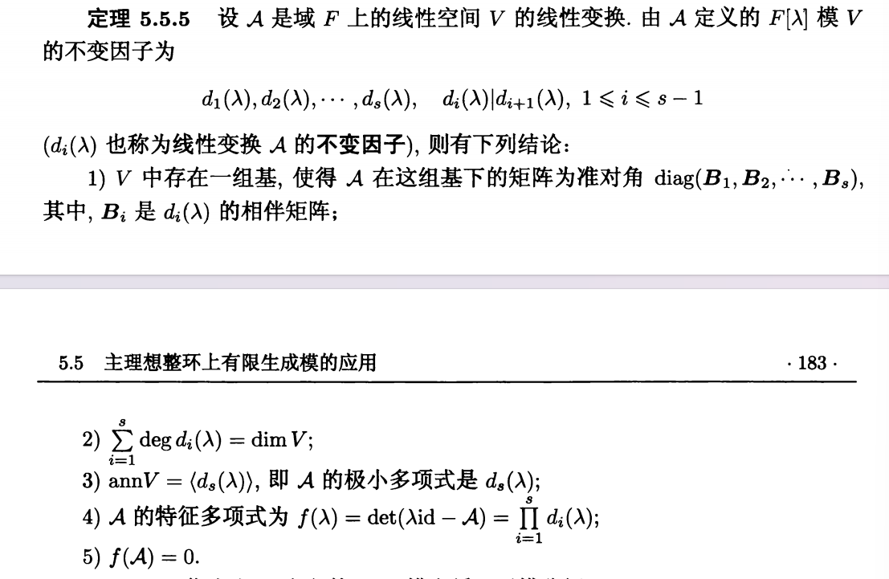

有如下结论:
1. v存在一组基,使得A在这组基下的矩阵为准对角diag(B_1,B_2,...,B_s),其中B_i是di(lambda)的相伴矩阵[有理分解]
2. \sum_{i=1}^s deg(d_i)=dim(v)
3. annv=<d_s>即A的极小多项式就是d_s
4. A的特征多项式为f(lambda)=det(\lambda*id - A)=\prod_{i=1}^s d_i(\lambda)
5. f(A)= 0.即为极小多项式

证明如下:
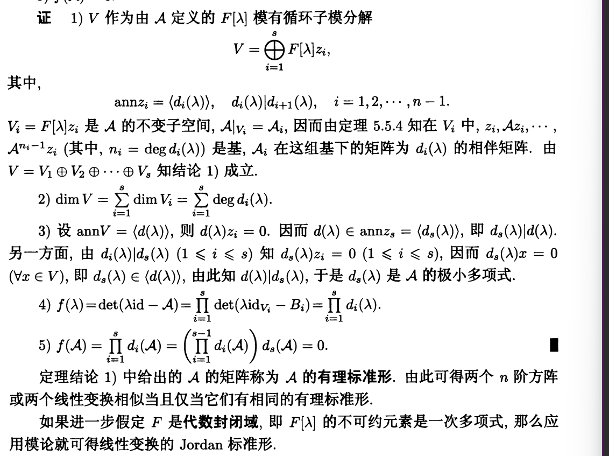

上面描述的为有利标准型的分解
接下来描述jordan标准型的分解
### jordan standard form
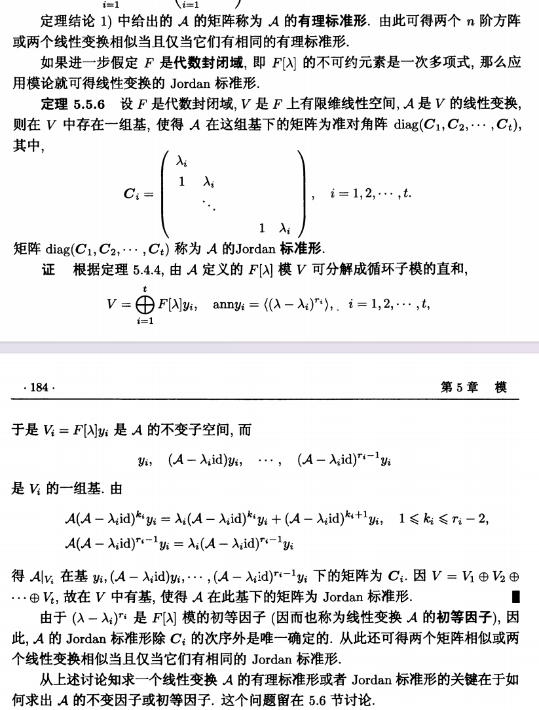
这就是Jordan标准型的分解.
如何计算留与5.6继续

