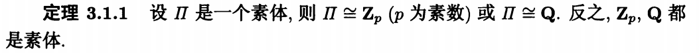

域的单扩张:
>定义3.1.1 不包含任何非平凡子体的为素体
由于一个体中任意多个子体之交依旧为子体,因而每个体都必须包含唯一一个素体,这个素体称为这个体的素子体
每一个体都可以被认为是素体的扩张

>theorem 3.1.1 
>设 $\Pi$ 是一个素体，则 $\Pi \cong \mathbb{Z}_p$ ($p$ 为素数) 或 $\Pi \cong \mathbb{Q}$. 反之，$\mathbb{Z}_p$, $\mathbb{Q}$ 都是素体.

证明:设e为$Pi$的幺元，于是$Ze= {ne| n \in \mathbb{Z}}$

