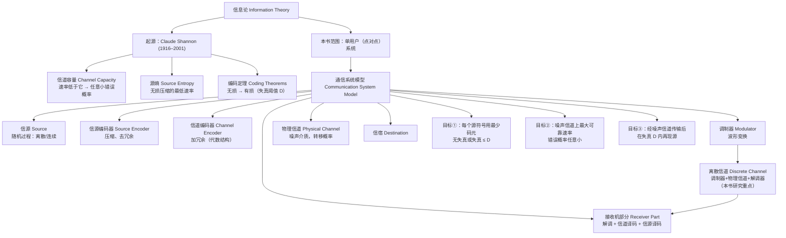
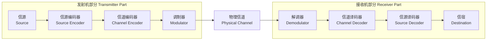

# 第 1 章 绪论 (Introduction)

## 📝 本章摘要

- 信息论自诞生起，就为通信理论提供了一个数学框架，其核心任务是建立各种通信系统性能的**根本极限 (Fundamental Limits)**。
- 香农 (Shannon) 的两个里程碑式结论：① 噪声信道存在一个由信道统计特性决定的固定量——**信道容量 (Channel Capacity)**，只要传输速率低于它，就能以任意小的错误概率可靠传输；② 随机信源可被无失真地压缩到其固有信息量——**源熵 (Source Entropy)**。
- 若源熵小于信道容量，则信源可以在信道上可靠传输（错误概率渐近趋于零）；香农进一步把这些"编码定理"从无损情形推广到有损情形（在容许失真阈值 $D$ 内压缩与再现）。
- 本书聚焦**单用户（点对点）**系统的基本通信理论。
- 本章给出通用的通信系统分块模型（信源 → 信源编码器 → 信道编码器 → 调制器 → 物理信道 → 解调器 → 信道译码器 → 信源译码器 → 信宿），并阐明全书要解决的三个基本问题。

## 🧠 知识结构思维导图

---

## 1.1 概述 (Overview)

自诞生以来，信息论的主要作用一直是为工程界与科学界提供一种**通信理论的数学框架**，其途径是建立各种通信系统性能上的**根本极限 (Fundamental Limits)**。

信息论的诞生始于 Claude Elwood Shannon（1916–2001）开创性工作 [340, 346] 的发表。Shannon 断言：只要传输速率低于某个由信道统计特性决定的固定量，就**有可能**以一个固定的正速率，通过噪声信道以任意小的错误概率发送携带信息的信号；他将这个量命名为 **信道容量 (Channel Capacity)**。

他进一步宣称：代表数据、语音或图像信号的随机（随机性）信源，可以以其固有信息量为最低速率实现**无失真压缩**，他将该固有信息量命名为 **源熵 (Source Entropy)**[^1]，并依据信源的统计特性加以定义。

他接着证明了：如果一个信源的熵小于某个通信信道的容量，则该信源可以在该信道上被**可靠传输**（错误概率渐近趋于零）。他还进一步将这些"编码定理"从**无损（无失真）**情形推广到**有损**情形——此时信源可在**容许的失真阈值 $D$** 内被压缩并被再现（可能还需经过信道传输）[345]。

[^1]: Shannon 借用了统计力学中的"熵"这一术语，因为他的这一量具有与 Boltzmann 熵相同的表达式 [55]。 —— [译者注：香农熵 $H(X)=-\sum_x P_X(x)\log_2 P_X(x)$ 与玻尔兹曼熵 $S=k_B\ln W$ 在形式上同构（负对数加总），这也是中文"熵"名沿用热力学译名的原因。]

受 Shannon 开创性思想的启发与指引[^2]，信息论研究者逐渐把兴趣拓展到通信理论之外，在多个相关领域中探讨基础性问题，其中包括：

- **统计物理**（热力学、量子信息论）；
- **计算与信息科学**（分布式处理、压缩、算法复杂性、可分辨性）；
- **概率论**（大偏差、极限定理、马尔可夫决策过程）；
- **统计学**（假设检验、多用户检测、Fisher 信息、估计）；
- **随机控制**（通信约束下的控制、随机优化）；
- **经济学**（博弈论、团队决策论、赌博论、投资论）；
- **数学生物学**（生物信息论、生物信息学）；
- **信息隐藏、数据安全与隐私**；
- **数据网络**（网络流行病、自相似性、流量调节理论）；
- **机器学习**（深度神经网络、数据分析）。

[^2]: 关于 Shannon 大部分著作的获取方式参见 [359]，其中包括：他的硕士论文 [337, 338]（该论文在电路开关与布尔代数之间建立了突破性联系，是数字革命的催化剂）、他关于群体遗传学代数框架的博士论文 [339]，以及他那篇信息论密码学奠基之作 [342]。另参见 [362]（近期关于 Shannon 的非技术性传记）与 [146]（关于信息史与信息时代更广泛的论述）。

> [!note] 本书定位
> 在本教材中，我们集中研究**单用户（点对点, single-user / point-to-point）**系统的基本通信理论——这正是信息论最初被设想所针对的对象。

---

## 1.2 通信系统模型 (Communication System Model)

一个一般通信系统的简单框图如图 1.1 所示。下面简要描述图中每个模块的作用。

### 1.2.1 各模块的作用

> [!note] 信源 (Source)
> 信源通常代表数据或多媒体信号，被建模为一个**随机过程**（随机过程的介绍见附录 B）。它在取值上和时间上都可以是**离散的**（有限或可数字母表）或**连续的**（不可数字母表）。

> [!note] 信源编码器 (Source Encoder)
> 其作用是以紧凑的方式表示信源，即**去除信源中不必要或冗余的内容**（也就是对其进行压缩）。

> [!note] 信道编码器 (Channel Encoder)
> 其作用是使信源编码器的输出在经由噪声通信信道传输后能被**可靠再现**。这通常通过给信源编码器的输出**添加冗余**（通常使用某种代数结构）来实现。

> [!note] 调制器 (Modulator)
> 它将信道编码器的输出变换为适合在物理信道上传输的**波形**。这通常通过令一个正弦信号的参数随信道编码器输出所提供的数据成比例变化来实现。

> [!note] 物理信道 (Physical Channel)
> 它是传输波形所穿越的**有噪声（不可靠）介质**。通常用一列**条件（转移）概率分布**来建模：给定发送某个特定输入时，接收到某个输出的概率。

> [!note] 接收机部分 (Receiver Part)
> 它由**解调器、信道译码器、信源译码器**组成，执行上述操作的逆过程。**信宿 (Destination)** 表示信宿端，即信源译码器所提供的信源估计被再现之处。

### 1.2.2 框图（图 1.1）

> [!tip] 图 1.1 结构解读
> 上图按原书图 1.1 的逻辑结构用 Mermaid 复现。要点：
> 1. **发射机部分**包含信源 → 信源编码器 → 信道编码器 → 调制器；
> 2. **离散信道**是"调制器 + 物理信道 + 解调器"的级联，**这也是本书的研究重点**——调制器、物理信道、解调器三者合起来被建模为一个离散时间信道；
> 3. **接收机部分**包含解调器 → 信道译码器 → 信源译码器 → 信宿。

### 1.2.3 本书的三个基本目标

在本教材中，我们把调制器、物理信道与解调器的级联建模为具有一列给定条件概率分布的**离散时间信道**[^3]。给定一个信源和一个离散信道，我们的目标将包括确定我们能以多好的程度构造（信源/信道）编码方案，以便：

1. **无损压缩极限**：用**最少数目的信源编码符号**表示每一个信源符号，做到无失真，或达到规定的失真水平 $D$（其中 $D>0$，且信道为无噪信道）；
2. **信道传输极限**：在噪声信道上、在信道编码器输入端与信道译码器输出端之间，以**任意小的译码错误概率**传输信息所能达到的**最大信息速率**；
3. **联合保真传输**：保证信源能经由噪声信道传输，并在信宿端以失真 $D$ 内（$D>0$）被再现。

[^3]: 除第 5 章对连续时间（波形）高斯信道的简短讨论外，全书都将考虑离散时间通信系统。

> [!note] 附录指引
> - **附录 A** 提供上确界 (supremum) 与极限的必要背景；其中 **Observation A.5**（相应地 **Observation A.11**）给出了集合的上确界（相应地，下确界）与信息论中典型信道编码定理（相应地，信源编码定理）证明之间的联系。
> - **附录 B** 提供书中使用的概率论与随机过程理论基本概念综述，并简要讨论**凸性 (Convexity)**、**Jensen 不等式**以及**拉格朗日乘子约束优化技术**。

---

## 本章要点速查

| 概念 | 英文 | 一句话解释 |
|---|---|---|
| 信道容量 | Channel Capacity | 由信道统计特性决定的固定量；低于它的速率可任意小错误概率传输 |
| 源熵 | Source Entropy | 信源的固有信息量；无损压缩的最低速率 |
| 编码定理 | Coding Theorems | 无损/有损情形下压缩与可靠传输的基本极限 |
| 信源编码器 | Source Encoder | 去冗余、压缩信源 |
| 信道编码器 | Channel Encoder | 加冗余（代数结构），保证可靠传输 |
| 离散信道 | Discrete Channel | 调制器 + 物理信道 + 解调器的级联，本书研究重点 |
| 单用户系统 | Single-User (Point-to-Point) System | 本书的研究范围 |

---

## 后续知识连接

- [[Chapter_02_Information_Measures_for_Discrete_Systems]] — 源熵的定义与性质（自信息、熵、互信息等）
- [[Chapter_03_Lossless_Data_Compression]] — 无损压缩与编码定理
- [[Chapter_04_Data_Transmission_and_Channel_Capacity]] — 信道容量与信道编码定理
- [[Chapter_05_Differential_Entropy_and_Gaussian_Channels]] — 连续信源与高斯信道
- [[Chapter_06_Lossy_Data_Compression_and_Transmission]] — 有损压缩、率失真理论（失真阈值 $D$）
- [[Kullback–Leibler 散度]]
- [[互信息]]

---

## 一句话总结

> 信息论源于香农对两个根本极限的刻画——**无损压缩的极限是源熵**、**噪声信道上可靠传输的极限是信道容量**；本书围绕单用户系统，用通信系统模型把这两个问题统一起来加以研究。
