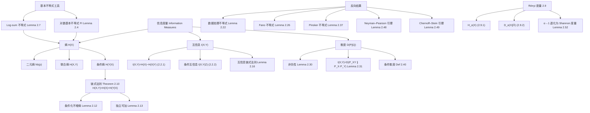
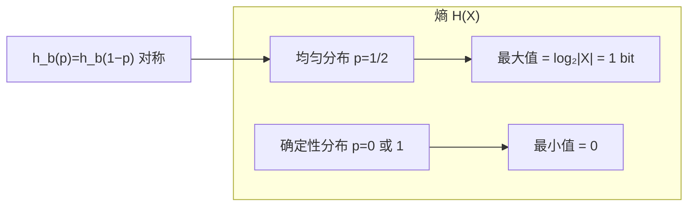
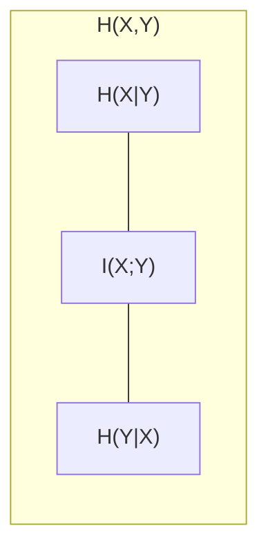
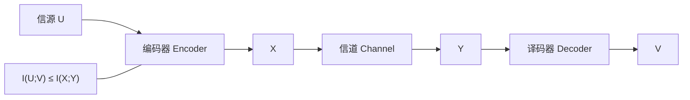

# 第 2 章 离散系统的信息度量 (Information Measures for Discrete Systems)

> [!abstract] 本章主线
> 本章从概率论观点定义 Shannon 针对离散时间、离散字母表系统的信息度量并研究其性质。阐明"概率意义下定义的信息度量"与"编码的根本极限"之间的**操作意义 (operational significance)** 正是本书的主要目标，这将在后续章节看到。

## 📝 本章摘要

- 本章系统定义并研究了 Shannon 的三大信息度量：**熵 (Entropy)**、**互信息 (Mutual Information)** 与 **散度/相对熵 (Divergence / Relative Entropy)**，以及它们对多随机变量、条件化情形的推广。
- 熵刻画随机性/不确定度，具有非负性、上界（不超过 $\log_2|\mathcal X|$）、链式法则、条件化不增熵、独立可加等核心性质；互信息刻画统计依赖，散度刻画两个分布之间的"差异性"。
- 关键不等式工具：**对数基本不等式 (FI)**、**Log-sum 不等式**（均由 Jensen 不等式导出），它们是几乎所有信息度量性质证明的基石。
- 重要的**反向结果**包括：数据处理不等式（处理不增互信息）、Fano 不等式（用 $H(X|Y)$ 界定译码错误概率）、Pinsker 不等式（散度控制变分距离）以及 Neyman–Pearson 引理与 Chernoff–Stein 引理（散度作为假设检验 II 类错误指数）。
- 最后引入 **Rényi 信息度量**（阶 $\alpha$ 熵与散度），Shannon 度量是其 $\alpha\to1$ 的极限情形。

## 🧠 知识结构思维导图

---

## 2.1 熵、联合熵与条件熵 (Entropy, Joint Entropy, and Conditional Entropy)

> [!note] 引注
> Shannon 引入熵、条件熵与互信息 [340]；散度由 Kullback 与 Leibler 提出 [236, 237]。离散字母表通常指有限或可数无穷字母表；本书主要关注有限字母表系统（所给信息度量在存在时允许可数字母表）。

### 2.1.1 自信息 (Self-information)

设 $E$ 是给定事件空间中的事件，其概率为 $p_E:=\Pr(E)$，其中 $0\le p_E\le 1$。令 $I(E)$ —— 事件 $E$ 的**自信息 (self-information)** [114, 135] —— 表示得知 $E$ 已发生时所获得的信息量（等价地，在得知 $E$ 发生之前关于 $E$ 的不确定程度）。

一个自然的问题是"$I(E)$ 应该具有哪些性质？"尽管答案因人而异，但以下是 $I(E)$ 被合理期望满足的性质：

1. **单调性**：$I(E)$ 应是 $p_E$ 的递减函数。即 $I(E)=I(p_E)$，其中 $I(\cdot)$ 是定义在 $[0,1]$ 上的实值函数；事件越罕见，得知其发生后获得的信息越多。
2. **连续性**：$I(p_E)$ 关于 $p_E$ 连续。直观上，$p_E$ 的微小变化应对应于 $E$ 所携带信息量的微小变化。
3. **独立事件可加性**：若 $E_1,E_2$ 独立，则 $I(E_1\cap E_2)=I(E_1)+I(E_2)$，等价地 $I(p_{E_1}\cdot p_{E_2})=I(p_{E_1})+I(p_{E_2})$。即独立事件同时发生时，所获信息量应等于各自信息量之和。

下面证明，唯一同时满足上述三条性质的函数是对数函数。

> [!theorem] 定理 2.1 (Theorem 2.1)
> 定义在 $p\in[0,1]$ 上且满足下列条件的唯一函数是 $I(p)=-c\cdot\log_b(p)$，其中 $c$ 为正常数，对数底数 $b$ 为任意大于 1 的数：
>
> 1. $I(p)$ 关于 $p$ 单调递减；
> 2. $I(p)$ 是 $p\in[0,1]$ 的连续函数；
> 3. $I(p_1\cdot p_2)=I(p_1)+I(p_2)$。

> [!proof]- Proof 证明
> **第 1 步：对 $n=1,2,3,\dots$，有 $I\!\left(\frac1n\right)=-c\log_b\!\left(\frac1n\right)$，其中 $c>0$ 为常数。**
>
> 先看 $n=1$：条件 3 直接给出 $I(1)=I(1)+I(1)$，故 $I(1)=0=-c\log_b(1)$。
>
> 固定 $n>1$。条件 1 与 3 分别给出
>
> $$
> n<m \implies I\!\left(\frac1n\right)<I\!\left(\frac1m\right) \tag{2.1.1}
> $$
>
> 与
>
> $$
> I\!\left(\frac1{mn}\right)=I\!\left(\frac1m\right)+I\!\left(\frac1n\right), \qquad n,m=1,2,3,\dots \tag{2.1.2}
> $$
>
> 由 (2.1.2) 可对 $k$ 归纳证明：对所有非负整数 $k$，
>
> $$
> I\!\left(\frac1{n^k}\right)=k\cdot I\!\left(\frac1n\right). \tag{2.1.3}
> $$
>
> 对任意正整数 $r$，存在非负整数 $k$ 使得 $n^k\le 2^r<n^{k+1}$。由 (2.1.1) 得
>
> $$
> I\!\left(\frac1{n^k}\right)\le I\!\left(\frac1{2^r}\right)<I\!\left(\frac1{n^{k+1}}\right),
> $$
>
> 结合 (2.1.3) 得
>
> $$
> k\cdot I\!\left(\frac1n\right)\le r\cdot I\!\left(\frac12\right)<(k+1)\cdot I\!\left(\frac1n\right).
> $$
>
> 因 $I(1/n)>I(1)=0$，故 $\dfrac{k}{r}\le\dfrac{I(1/2)}{I(1/n)}<\dfrac{k+1}{r}$。另一方面，由对数单调性：
>
> $$
> \log_b n^k\le\log_b 2^r\le\log_b n^{k+1} \iff \frac{k}{r}\le\frac{\log_b(2)}{\log_b(n)}\le\frac{k+1}{r}.
> $$
>
> 因此 $\left|\dfrac{\log_b(2)}{\log_b(n)}-\dfrac{I(1/2)}{I(1/n)}\right|<\dfrac1r$。由于 $n$ 固定而 $r$ 可任意大，令 $r\to\infty$ 得
>
> $$
> I\!\left(\frac1n\right)=c\cdot\log_b(n),
> $$
>
> 其中 $c=I(1/2)/\log_b(2)>0$。第 1 步得证。
>
> **第 2 步：对正有理数 $p$，$I(p)=-c\log_b(p)$。**
>
> 正有理数 $p$ 可写为两整数之比 $p=r/s$。由条件 3：
>
> $$
> I\!\left(\frac1s\right)=I\!\left(\frac r{sr}\right)=I\!\left(\frac rs\right)+I\!\left(\frac1r\right),
> $$
>
> 结合第 1 步得
>
> $$
> I(p)=I\!\left(\frac rs\right)=I\!\left(\frac1s\right)-I\!\left(\frac1r\right)=c\log_b s-c\log_b r=-c\log_b p.
> $$
>
> **第 3 步：对任意 $p\in[0,1]$，由连续性及有理数在实数中的稠密性，**
>
> $$
> I(p)=\lim_{\substack{a\to p\\ a\text{ 有理数}}}I(a)=\lim_{\substack{b\to p\\ b\text{ 有理数}}}I(b)=-c\log_b(p).\tag*{∎}
> $$

**单位选择与规范化：** 常数 $c$ 按惯例规范化为 $c=1$；对数底数 $b$ 决定信息度量单位。当 $b=2$ 时，信息量以 **bit（二进位）** 表示；当 $b=e$（即使用自然对数 $\ln$）时，信息量以 **nat（自然单位）** 表示。例如公平硬币抛出正面的自信息为 $I(E)=-\log_2(1/2)=1$ bit，或 $-\ln(1/2)=0.693$ nats。

一般地，在底数 $b>1$ 下，信息用 **b 进制单位 (b-ary units)** 表示。本书除非另有说明一律使用以 2 为底的对数。由 bit 换算到 b 进制单位，只需除以 $\log_2(b)$。

### 2.1.2 熵 (Entropy)

设 $X$ 是取值于有限字母表 $\mathcal X$ 的离散随机变量，其概率分布（概率质量函数 pmf）为 $P_X(x):=\Pr[X=x]$（$x\in\mathcal X$）。$X$ 一般代表一个**无记忆信源 (memoryless source)**，即具有独立同分布 (i.i.d.) 随机变量的离散时间随机过程 $\{X_n\}_{n=1}^{\infty}$（参见附录 B）。

> [!definition] 定义 2.2 (熵, Definition 2.2)
> 具有 pmf $P_X(\cdot)$ 的离散随机变量 $X$ 的熵记为 $H(X)$ 或 $H(P_X)$，定义为
>
> $$
> H(X):=-\sum_{x\in\mathcal X}P_X(x)\log_2P_X(x)\quad\text{(bits)}.
> $$
>
> 于是 $H(X)$ 表示"得知 $|\mathcal X|$ 个结果中的某一个已经发生时"所获得的平均信息量（统计均值），其中 $|\mathcal X|$ 表示字母表 $\mathcal X$ 的大小。

直接由定义可得

$$
H(X)=\mathbb E[-\log_2P_X(X)]=\mathbb E[I(X)],
$$

其中 $I(x):=-\log_2P_X(x)$ 是基本事件 $\{X=x\}$ 的自信息。

**约定：** 计算熵时采用 $0\cdot\log_2 0=0$。这可借助连续性论证：$x\log_2 x\to0$（$x\to0$）。

**熵只依赖于概率分布：** $H(X)$ 仅由 $X$ 的分布决定，与代表结果的符号无关。例如公平硬币的结果可记为 $2$（代替 $1$）与 $100$（代替 $0$），只要两结果概率仍为 $1/2$，熵始终为 $\log_2(2)=1$ bit。

> [!example] 例 2.3 (Example 2.3)
> 设二元随机变量 $X$ 的字母表为 $\mathcal X=\{0,1\}$，pmf 为 $P_X(1)=p$，$P_X(0)=1-p$（$0\le p\le1$ 固定）。则
>
> $$
> H(X)=-p\log_2 p-(1-p)\log_2(1-p).
> $$
>
> 该熵称为**二元熵函数 (binary entropy function)**，记作 $h_b(p)$，如图 2.1 所示。如图所示，$h_b(p)$ 在均匀分布（$p=1/2$）时取最大值。

**D 进制熵与 nat：** 设 $H_D(X):=-\sum_x P_X(x)\log_D P_X(x)$（$D>1$），即 D 进制单位下的熵。全书将 $H_2(X)$ 简记为 $H(X)$（bit 是编码系统的常用单位），且

$$
H_D(X)=\frac{H(X)}{\log_2 D}.
$$

于是

$$
H_e(X)=\frac{H(X)}{\log_2(e)}=(\ln 2)\cdot H(X)
$$

给出以 nat 为单位的熵（$e$ 为自然对数的底）。

> [!tip] 图 2.1 结构解读
> 原书图 2.1 为二元熵函数 $h_b(p)$ 的曲线：横轴 $p\in[0,1]$，纵轴 $h_b(p)$，曲线在 $p=0$ 与 $p=1$ 处取 0，在 $p=0.5$ 处取 1。以上 Mermaid 只概括其三个关键性质，曲线形态请参考原书。

### 2.1.3 熵的基本性质 (Properties of Entropy)

证明熵（及其他信息度量）的基本性质时，常使用如下对数基本不等式（证明留作习题）。

> [!lemma] 引理 2.4 (对数基本不等式 FI, Lemma 2.4)
> 对任意 $x>0$ 与 $D>1$，
>
> $$
> \log_D(x)\le\log_D(e)\cdot(x-1),
> $$
>
> 等号成立当且仅当 $x=1$。

令 $y=1/x$ 并利用 FI 直接得到：对任意 $y>0$，

$$
\log_D(y)\ge\log_D(e)\cdot\left(1-\frac1y\right),
$$

同样等号当且仅当 $y=1$ 时成立。对以 2 为底的对数，上述不等式变为

$$
\log_2(e)\left(1-\frac1x\right)\le\log_2(x)\le\log_2(e)\cdot(x-1),
$$

等号当且仅当 $x=1$。

> [!lemma] 引理 2.5 (熵的非负性, Lemma 2.5)
> $H(X)\ge0$。等号成立当且仅当 $X$ 是确定性的（此时 $X$ 的不确定性显然为零）。

> [!proof]- Proof
> $0\le P_X(x)\le1$ 蕴含 $\log_2[1/P_X(x)]\ge0$（$\forall x\in\mathcal X$）。故
>
> $$
> H(X)=\sum_{x\in\mathcal X}P_X(x)\log_2\frac{1}{P_X(x)}\ge0,
> $$
>
> 等号成立当且仅当对某个 $x\in\mathcal X$ 有 $P_X(x)=1$。∎

> [!lemma] 引理 2.6 (熵的上界, Lemma 2.6)
> 若随机变量 $X$ 取值于有限集 $\mathcal X$，则
>
> $$
> H(X)\le\log_2|\mathcal X|,
> $$
>
> 其中 $|\mathcal X|$ 表示集合 $\mathcal X$ 的大小。等号成立当且仅当 $X$ 在 $\mathcal X$ 上等概率（均匀）分布，即 $P_X(x)=1/|\mathcal X|$（$\forall x\in\mathcal X$）。

> [!proof]- Proof
> $$
> \begin{aligned}
> \log_2|\mathcal X|-H(X)
> &=\log_2|\mathcal X|\cdot\sum_x P_X(x)+\sum_x P_X(x)\log_2P_X(x)\\
> &=\sum_x P_X(x)\log_2[|\mathcal X|\cdot P_X(x)]\\
> &\ge\sum_x P_X(x)\log_2(e)\left[1-\frac{1}{|\mathcal X|\cdot P_X(x)}\right] \quad(\text{由 FI 引理})\\
> &=\log_2(e)\sum_x\left[P_X(x)-\frac1{|\mathcal X|}\right]\\
> &=\log_2(e)\cdot(1-1)=0,
> \end{aligned}
> $$
>
> 其中不等式来自 FI 引理，等号成立当且仅当（$\forall x\in\mathcal X$）$|\mathcal X|\cdot P_X(x)=1$，即 $P_X(\cdot)$ 是 $\mathcal X$ 上的均匀分布。∎

直观上，$H(X)$ 刻画 $X$ 的随机程度：$X$ 是确定性的（毫无随机性）当且仅当 $H(X)=0$；$X$ 均匀分布（等概率）时 $H(X)$ 最大，等于 $\log_2|\mathcal X|$。

> [!note] 脚注
> $\log|\mathcal X|$ 也被称为 **Hartley 函数或熵**；Hartley 是第一个建议"不涉及内容地"度量信息的人 [180]。

> [!lemma] 引理 2.7 (Log-sum 不等式, Lemma 2.7)
> 对非负数 $a_1,a_2,\dots,a_n$ 与 $b_1,b_2,\dots,b_n$，
>
> $$
> \sum_{i=1}^n a_i\log_D\frac{a_i}{b_i}\ge\left(\sum_{i=1}^n a_i\right)\log_D\frac{\sum_{i=1}^n a_i}{\sum_{i=1}^n b_i}, \tag{2.1.4}
> $$
>
> 等号成立当且仅当对所有 $i=1,\dots,n$，
>
> $$
> \frac{a_i}{b_i}=\frac{\sum_{j=1}^n a_j}{\sum_{j=1}^n b_j},
> $$
>
> 即该比值为不依赖于 $i$ 的常数。（约定 $0\log_D 0=0$，$0\log_D(0/0)=0$，且当 $a>0$ 时 $a\log_D(a/0)=+\infty$；这些也可由"连续性"论证。）

> [!proof]- Proof
> 令 $a:=\sum_{i=1}^n a_i$，$b:=\sum_{i=1}^n b_i$。则
>
> $$
> \begin{aligned}
> \sum_{i=1}^n a_i\log_D\frac{a_i}{b_i}-a\log_D\frac{a}{b}
> &=\sum_{i=1}^n a_i\left[\log_D\frac{a_i}{b_i}-\log_D\frac{a}{b}\right]\\
> &=\sum_{i=1}^n a_i\log_D\frac{a_i b}{b_i a}
> \end{aligned}
> $$
>
> （注：$\sum_i\frac{a_i}{a}=1$，故第二个括号可写为 $\log_D\frac{a_i b}{b_i a}$。）
>
> 由 FI 引理（对每个 $i$ 取 $x=\frac{a_i b}{b_i a}$，注意 $\log_D(y)\ge\log_D(e)(1-1/y)$ 这一形式）：
>
> $$
> \sum_{i=1}^n a_i\log_D\frac{a_i b}{b_i a}
> \ge a\log_D(e)\sum_{i=1}^n\left[\frac{a_i}{a}-\frac{b_i}{b}\right]
> =a\log_D(e)(1-1)=0,
> $$
>
> 等号成立当且仅当对所有 $i$，$\dfrac{a_i b}{b_i a}=1$，即 $\dfrac{a_i}{b_i}=\dfrac{a}{b}$。∎
>
> **另证（Jensen 不等式）：** 不妨设对所有 $i$ 有 $a_i>0,b_i>0$。Jensen 不等式（见附录 B 定理 B.18）断言：对任意严格凸函数 $f(\cdot)$、权重 $\lambda_i\ge0$ 且 $\sum_i\lambda_i=1$，有
>
> $$
> \sum_i\lambda_i f(t_i)\ge f\left(\sum_i\lambda_i t_i\right),
> $$
>
> 等号当且仅当所有 $t_i$ 为常数。取 $\lambda_i=\dfrac{b_i}{\sum_j b_j}$，$t_i=\dfrac{a_i}{b_i}$，$f(t)=t\log_D(t)$（$f''(t)=1/(t\ln D)>0$ 严格凸），即得所需结果。∎

### 2.1.4 联合熵与条件熵 (Joint Entropy and Conditional Entropy)

给定一对随机变量 $(X,Y)$，其定义在 $\mathcal X\times\mathcal Y$ 上的联合 pmf 为 $P_{X,Y}(\cdot,\cdot)$，二维基本事件 $\{X=x,Y=y\}$ 的自信息定义为

$$
I(x,y):=-\log_2P_{X,Y}(x,y).
$$

> [!definition] 定义 2.8 (联合熵, Definition 2.8)
> 随机变量 $(X,Y)$ 的联合熵 $H(X,Y)$ 定义为
>
> $$
> H(X,Y):=-\sum_{(x,y)\in\mathcal X\times\mathcal Y}P_{X,Y}(x,y)\log_2P_{X,Y}(x,y)=\mathbb E[-\log_2P_{X,Y}(X,Y)].
> $$

> [!definition] 定义 2.9 (条件熵, Definition 2.9)
> 给定联合分布的随机变量 $X$ 与 $Y$，给定 $X$ 时 $Y$ 的条件熵 $H(Y|X)$ 定义为
>
> $$
> H(Y|X):=\sum_{x\in\mathcal X}P_X(x)\left[-\sum_{y\in\mathcal Y}P_{Y|X}(y|x)\log_2P_{Y|X}(y|x)\right], \tag{2.1.5}
> $$
>
> 其中 $P_{Y|X}(\cdot|\cdot)$ 是给定 $X$ 时 $Y$ 的条件 pmf。

式 (2.1.5) 可写成三种不同但等价的形式：

$$
H(Y|X)=-\sum_{(x,y)\in\mathcal X\times\mathcal Y}P_{X,Y}(x,y)\log_2P_{Y|X}(y|x)
=\mathbb E[-\log_2P_{Y|X}(Y|X)]
=\sum_{x\in\mathcal X}P_X(x)\cdot H(Y|X=x),
$$

其中 $H(Y|X=x):=-\sum_{y}P_{Y|X}(y|x)\log_2P_{Y|X}(y|x)$。

联合熵与条件熵的关系体现为：一对随机变量的熵等于其中一个的熵加上另一个的条件熵。

> [!theorem] 定理 2.10 (熵的链式法则, Theorem 2.10)
>
> $$
> H(X,Y)=H(X)+H(Y|X). \tag{2.1.6}
> $$

> [!proof]- Proof
> 由 $P_{X,Y}(x,y)=P_X(x)P_{Y|X}(y|x)$ 直接得
>
> $$
> \begin{aligned}
> H(X,Y)&=\mathbb E[-\log_2P_{X,Y}(X,Y)]\\
> &=\mathbb E[-\log_2P_X(X)]+\mathbb E[-\log_2P_{Y|X}(Y|X)]\\
> &=H(X)+H(Y|X).\tag*{∎}
> \end{aligned}
> $$

由定义，联合熵满足交换律：$H(X,Y)=H(Y,X)$。故

$$
H(X,Y)=H(X)+H(Y|X)=H(Y)+H(X|Y)=H(Y,X),
$$

这蕴含

$$
H(X)-H(X|Y)=H(Y)-H(Y|X). \tag{2.1.7}
$$

上式所给出的量恰好等于下一节将引入的互信息。

**条件熵的通信解释：** 条件熵可从信道角度理解——信道输入为 $X$，输出为 $Y$。$H(X|Y)$ 称为 **equivocation（含糊度）**，对应接收方视角下信道输入的不确定性。例如设 $(X,Y)$ 的可能结果为 $\{(0,0),(0,1),(1,0),(1,1)\}$，且无零概率项；当接收方收到 $1$ 时仍不能确定发送方 $X$ 观察到的到底是 $1$ 还是 $0$，故接收方视角的不确定性取决于 $P_{X|Y}(0|1)$ 与 $P_{X|Y}(1|1)$。类似地，$H(Y|X)$ 称为 **prevarication（搪塞度）**，是发送方视角下信道输出的不确定性：发送方确切知道自己发了什么，却不清楚接收方最终会收到什么。

特别关注 $H(X|Y)=0$ 的情形：若观察到 $Y$ 后 $X$ 变成确定性的，则给定 $Y$ 后 $X$ 的不确定性完全为零。

> [!corollary] 推论 2.11 (条件熵的链式法则, Corollary 2.11)
>
> $$
> H(X,Y|Z)=H(X|Z)+H(Y|X,Z).
> $$

其证明与定理 2.10 类似。

### 2.1.5 联合熵与条件熵的性质 (Properties of Joint Entropy and Conditional Entropy)

> [!lemma] 引理 2.12 (条件化不增熵, Lemma 2.12)
> 侧信息 $Y$ 降低关于 $X$ 的不确定性：
>
> $$
> H(X|Y)\le H(X),
> $$
>
> 等号成立当且仅当 $X$ 与 $Y$ 独立。换言之，"条件化"降低熵。

> [!proof]- Proof
> $$
> \begin{aligned}
> H(X)-H(X|Y)
> &=\sum_{(x,y)}P_{X,Y}(x,y)\log_2\frac{P_{X|Y}(x|y)}{P_X(x)}\\
> &=\sum_{(x,y)}P_{X,Y}(x,y)\log_2\frac{P_{X|Y}(x|y)P_Y(y)}{P_X(x)P_Y(y)}\\
> &=\sum_{(x,y)}P_{X,Y}(x,y)\log_2\frac{P_{X,Y}(x,y)}{P_X(x)P_Y(y)}\\
> &\ge\left(\sum_{(x,y)}P_{X,Y}(x,y)\right)\log_2\frac{\sum_{(x,y)}P_{X,Y}(x,y)}{\sum_{(x,y)}P_X(x)P_Y(y)} \quad(\text{Log-sum 不等式})\\
> &=1\cdot\log_2\frac{1}{1}=0,
> \end{aligned}
> $$
>
> 等号成立当且仅当 $\dfrac{P_{X,Y}(x,y)}{P_X(x)P_Y(y)}$ 对 $(x,y)\in\mathcal X\times\mathcal Y$ 为常数。由于概率总和为 1，该常数等于 1，即 $X$ 与 $Y$ 独立。∎

> [!lemma] 引理 2.13 (独立随机变量的熵可加, Lemma 2.13)
> $H(X,Y)=H(X)+H(Y)$，当 $X$ 与 $Y$ 独立时成立。

> [!proof]- Proof
> 由前一引理，$X$ 与 $Y$ 独立蕴含 $H(Y|X)=H(Y)$，故
>
> $$
> H(X,Y)=H(X)+H(Y|X)=H(X)+H(Y).\tag*{∎}
> $$
>
> 由于条件化不增熵，更有一般的不等式：
>
> $$
> H(X,Y)=H(X)+H(Y|X)\le H(X)+H(Y). \tag{2.1.8}
> $$
>
> 上面的引理表明，(2.1.8) 中取等号仅当 $X$ 与 $Y$ 独立。

> [!lemma] 引理 2.14 (条件熵的下可加性, Lemma 2.14)
>
> $$
> H(X_1,X_2|Y_1,Y_2)\le H(X_1|Y_1)+H(X_2|Y_2).
> $$
>
> 等号成立当且仅当对所有 $x_1,x_2,y_1,y_2$，
>
> $$
> P_{X_1,X_2|Y_1,Y_2}(x_1,x_2|y_1,y_2)=P_{X_1|Y_1}(x_1|y_1)P_{X_2|Y_2}(x_2|y_2).
> $$

> [!proof]- Proof
> 利用条件熵的链式法则及条件化降熵：
>
> $$
> H(X_1,X_2|Y_1,Y_2)=H(X_1|Y_1,Y_2)+H(X_2|X_1,Y_1,Y_2) \tag{2.1.9}
> $$
>
> $$
> \le H(X_1|Y_1,Y_2)+H(X_2|Y_1,Y_2) \tag{2.1.10}
> $$
>
> $$
> \le H(X_1|Y_1)+H(X_2|Y_2).
> $$
>
> (2.1.9) 取等当且仅当给定 $(Y_1,Y_2)$ 时 $X_1$ 与 $X_2$ 条件独立：$P_{X_1,X_2|Y_1,Y_2}(x_1,x_2|y_1,y_2)=P_{X_1|Y_1,Y_2}(x_1|y_1,y_2)P_{X_2|Y_1,Y_2}(x_2|y_1,y_2)$；(2.1.10) 取等当且仅当给定 $Y_1$ 时 $X_1$ 与 $Y_2$ 条件独立（即 $P_{X_1|Y_1,Y_2}(x_1|y_1,y_2)=P_{X_1|Y_1}(x_1|y_1)$），且给定 $Y_2$ 时 $X_2$ 与 $Y_1$ 条件独立（即 $P_{X_2|Y_1,Y_2}(x_2|y_1,y_2)=P_{X_2|Y_2}(x_2|y_2)$）。合并即得引理的等号条件。∎

---

## 2.2 互信息 (Mutual Information)

对两个随机变量 $X$ 与 $Y$，$X$ 与 $Y$ 之间的**互信息 (mutual information)** 是由于知道 $X$（或反过来知道 $Y$）而导致的 $Y$ 不确定性的**减少量**。互信息的另一个对偶定义是：$Y$ 关于 $X$（或 $X$ 关于 $Y$）所携带（或包含）的平均信息量。

把 $X$ 看作信道输入、$Y$ 看作信道输出，则不确定性的减少量按定义为 $X$ 的总不确定性 $H(X)$ 减去观察到 $Y$ 后 $X$ 的不确定性 $H(X|Y)$：

$$
\text{互信息}=I(X;Y):=H(X)-H(X|Y). \tag{2.2.1}
$$

由 (2.1.7) 可容易验证互信息是对称的：$I(X;Y)=I(Y;X)$。

### 2.2.1 互信息的性质 (Properties of Mutual Information)

> [!lemma] 引理 2.15 (Lemma 2.15)
> 1. $\displaystyle I(X;Y)=\sum_{x\in\mathcal X}\sum_{y\in\mathcal Y}P_{X,Y}(x,y)\log_2\frac{P_{X,Y}(x,y)}{P_X(x)P_Y(y)}$。
> 2. $I(X;Y)=I(Y;X)=H(Y)-H(Y|X)$。
> 3. $I(X;Y)=H(X)+H(Y)-H(X,Y)$。
> 4. $I(X;Y)\le H(X)$，等号当且仅当 $X$ 是 $Y$ 的函数（即存在函数 $f(\cdot)$ 使 $X=f(Y)$）。
> 5. $I(X;Y)\ge0$，等号当且仅当 $X$ 与 $Y$ 独立。
> 6. $I(X;Y)\le\min\{\log_2|\mathcal X|,\log_2|\mathcal Y|\}$。

> [!proof]- Proof
> 性质 1、2、3、4 由定义立即得到。性质 5 是引理 2.12 的直接推论。性质 6 需证 $I(X;Y)\le\log_2|\mathcal X|$ 且 $I(X;Y)\le\log_2|\mathcal Y|$。证明第一个不等式：写 $I(X;Y)=H(X)-H(X|Y)$，利用 $H(X|Y)\ge0$ 并应用引理 2.6。类似可证 $I(X;Y)\le\log_2|\mathcal Y|$。∎

**Venn 图关系（图 2.2）：**

> [!tip] 图 2.2 结构解读
> 原书图 2.2 为 Venn 图，展示 $H(X)$、$H(Y)$、$H(X,Y)$、$H(X|Y)$、$H(Y|X)$ 与 $I(X;Y)$ 之间的关系。用两个相交的圆 $H(X)$ 与 $H(Y)$ 表示：并集为 $H(X,Y)$；$H(X)$ 中不在 $H(Y)$ 内者为 $H(X|Y)$；$H(Y)$ 中不在 $H(X)$ 内者为 $H(Y|X)$；两圆相交部分为 $I(X;Y)$。Mermaid 以上仅示意"三块划分"，完整 Venn 图请参照原书。

### 2.2.2 条件互信息 (Conditional Mutual Information)

**条件互信息**记为 $I(X;Y|Z)$，定义为在已知 $Z$ 的条件下 $X$ 与 $Y$ 之间的公共不确定性：

$$
I(X;Y|Z):=H(X|Z)-H(X|Y,Z). \tag{2.2.2}
$$

> [!lemma] 引理 2.16 (互信息的链式法则, Lemma 2.16)
> 按 (2.2.1) 定义 $X$ 与 $(Y,Z)$ 之间的联合互信息 $I(X;Y,Z):=H(X)-H(X|Y,Z)$，则
>
> $$
> I(X;Y,Z)=I(X;Y)+I(X;Z|Y)=I(X;Z)+I(X;Y|Z).
> $$

> [!proof]- Proof
> 不失一般性，只证明第一个等式：
>
> $$
> \begin{aligned}
> I(X;Y,Z)&=H(X)-H(X|Y,Z)\\
> &=H(X)-H(X|Y)+H(X|Y)-H(X|Y,Z)\\
> &=I(X;Y)+I(X;Z|Y).\tag*{∎}
> \end{aligned}
> $$

上述引理可读作：$(Y,Z)$ 关于 $X$ 的信息量，等于 $Y$ 关于 $X$ 的信息量，加上 $Y$ 已知后 $Z$ 关于 $X$ 的信息量。

---

## 2.3 多变元熵与互信息的性质 (Properties for Multiple Random Variables)

采用常见的上标记号表示 $n$ 元组：$X^n:=(X_1,\dots,X_n)$，$x^n:=(x_1,\dots,x_n)$，且 $P_{X^n}(x^n):=P_{X_1,\dots,X_n}(x_1,\dots,x_n)$。

> [!theorem] 定理 2.17 (熵的链式法则, Theorem 2.17)
> 设 $X_1,X_2,\dots,X_n$ 按 $P_{X^n}(x^n)$ 分布，则
>
> $$
> H(X_1,X_2,\dots,X_n)=\sum_{i=1}^n H(X_i|X_{i-1},\dots,X_1),
> $$
>
> 其中 $H(X_i|X_{i-1},\dots,X_1):=H(X_1)$（当 $i=1$）。也可写为
>
> $$
> H(X^n)=\sum_{i=1}^n H(X_i|X^{i-1}),
> $$
>
> 其中 $X^i:=(X_1,\dots,X_i)$。

> [!proof]- Proof
> 由 (2.1.6)，
>
> $$
> H(X_1,\dots,X_n)=H(X_1,\dots,X_{n-1})+H(X_n|X_{n-1},\dots,X_1). \tag{2.3.1}
> $$
>
> 再次对 (2.3.1) 右端第一项应用 (2.1.6)：
>
> $$
> H(X_1,\dots,X_{n-1})=H(X_1,\dots,X_{n-2})+H(X_{n-1}|X_{n-2},\dots,X_1).
> $$
>
> 重复应用 (2.1.6) 即得所需结果。∎

> [!theorem] 定理 2.18 (条件熵的链式法则, Theorem 2.18)
>
> $$
> H(X_1,X_2,\dots,X_n|Y)=\sum_{i=1}^n H(X_i|X_{i-1},\dots,X_1,Y).
> $$

> [!proof]- Proof
> 证明与定理 2.17 类似。∎

若 $X^n=(X_1,\dots,X_n)$ 与 $Y^m=(Y_1,\dots,Y_m)$ 是联合分布的随机向量（长度不必相等），则其联合互信息为

$$
I(X_1,\dots,X_n;Y_1,\dots,Y_m):=H(X_1,\dots,X_n)-H(X_1,\dots,X_n|Y_1,\dots,Y_m).
$$

> [!theorem] 定理 2.19 (互信息的链式法则, Theorem 2.19)
>
> $$
> I(X_1,X_2,\dots,X_n;Y)=\sum_{i=1}^n I(X_i;Y|X_{i-1},\dots,X_1),
> $$
>
> 其中 $I(X_i;Y|X_{i-1},\dots,X_1):=I(X_1;Y)$（当 $i=1$）。

> [!proof]- Proof
> 先把互信息用熵与条件熵表示，再分别应用熵与条件熵的链式法则。∎

> [!theorem] 定理 2.20 (熵的独立性上界, Theorem 2.20)
>
> $$
> H(X_1,X_2,\dots,X_n)\le\sum_{i=1}^n H(X_i).
> $$
>
> 等号成立当且仅当所有 $X_i$ 两两独立[^8]。

[^8]: 该条件等价于要求对每个 $i$，$X_i$ 独立于 $(X_{i-1},\dots,X_1)$。等价性可由联合概率的链式法则 $P_{X^n}(x^n)=\prod_{i=1}^n P_{X_i|X_1^{i-1}}(x_i|x_1^{i-1})$ 直接证明，留作习题。

> [!proof]- Proof
> 应用熵的链式法则：
>
> $$
> H(X_1,\dots,X_n)=\sum_{i=1}^n H(X_i|X_{i-1},\dots,X_1)\le\sum_{i=1}^n H(X_i).
> $$
>
> 等号成立当且仅当每个条件熵等于对应的熵，即对每个 $i$，$X_i$ 独立于 $(X_{i-1},\dots,X_1)$。∎

> [!theorem] 定理 2.21 (互信息的上界, Theorem 2.21)
> 若 $\{(X_i,Y_i)\}_{i=1}^n$ 满足条件独立性假设 $P_{Y^n|X^n}=\prod_{i=1}^n P_{Y_i|X_i}$，则
>
> $$
> I(X_1,\dots,X_n;Y_1,\dots,Y_n)\le\sum_{i=1}^n I(X_i;Y_i),
> $$
>
> 等号成立当且仅当 $\{X_i\}_{i=1}^n$ 相互独立。

> [!proof]- Proof
> 由熵的独立性上界，$H(Y_1,\dots,Y_n)\le\sum_{i=1}^n H(Y_i)$。由条件独立性假设，
>
> $$
> \begin{aligned}
> H(Y_1,\dots,Y_n|X_1,\dots,X_n)
> &=\mathbb E\left[-\log_2P_{Y^n|X^n}(Y^n|X^n)\right]\\
> &=\mathbb E\left[-\log_2\prod_{i=1}^n P_{Y_i|X_i}(Y_i|X_i)\right]\\
> &=\sum_{i=1}^n H(Y_i|X_i).
> \end{aligned}
> $$
>
> 因此
>
> $$
> I(X^n;Y^n)=H(Y^n)-H(Y^n|X^n)\le\sum_{i=1}^n H(Y_i)-\sum_{i=1}^n H(Y_i|X_i)=\sum_{i=1}^n I(X_i;Y_i),
> $$
>
> 等号成立当且仅当 $\{Y_i\}_{i=1}^n$ 独立，这当且仅当 $\{X_i\}_{i=1}^n$ 独立。∎

---

## 2.4 数据处理不等式 (Data Processing Inequality)

回忆 Markov 链关系 $X\to Y\to Z$ 表示给定 $Y$ 时 $X$ 与 $Z$ 条件独立（参见附录 B），于是有以下结果。

> [!lemma] 引理 2.22 (数据处理不等式, Lemma 2.22)
> 若 $X\to Y\to Z$，则
>
> $$
> I(X;Y)\ge I(X;Z).
> $$

> [!proof]- Proof
> 由 $X\to Y\to Z$，直接有 $I(X;Z|Y)=0$。由互信息链式法则，
>
> $$
> I(X;Z)+I(X;Y|Z)=I(X;Y,Z) \tag{2.4.1}
> $$
>
> $$
> =I(X;Y)+I(X;Z|Y) \tag{2.4.2}
> $$
>
> $$
> =I(X;Y).
> $$
>
> 因 $I(X;Y|Z)\ge0$，得 $I(X;Y)\ge I(X;Z)$，等号当且仅当 $I(X;Y|Z)=0$。∎

**数据处理不等式的含义：** 互信息在"处理"之后不会增加。这一结果有些反直觉——给定两个随机变量 $X$ 和 $Y$，我们或许认为对 $Y$ 施加一个精心设计的处理方案（一般可表示为映射 $g(Y)$）可能增加互信息。然而对任意 $g(\cdot)$，$X\to Y\to g(Y)$ 构成 Markov 链，因此数据处理不会增加互信息。数据处理引理的通信背景见图 2.3。

> [!tip] 图 2.3 结构解读
> 原书图 2.3 展示了数据处理引理的通信语境：$U\to X\to Y\to V$ 构成 Markov 链，图上标注"By processing, we can only reduce (mutual) information, but the processed information may be in a more useful form!"（通过处理，我们只能减少（互）信息，但处理后的信息可能以更有用的形式呈现！）。上图 Mermaid 复现了该链路 $U \xrightarrow{\text{编码}} X \xrightarrow{\text{信道}} Y \xrightarrow{\text{译码}} V$。

> [!corollary] 推论 2.23 (Corollary 2.23)
> 对联合分布的随机变量 $X$、$Y$ 及任意函数 $g(\cdot)$，有 $X\to Y\to g(Y)$ 且
>
> $$
> I(X;Y)\ge I(X;g(Y)).
> $$

> [!corollary] 推论 2.24 (Corollary 2.24)
> 若 $X\to Y\to Z$，则
>
> $$
> I(X;Y|Z)\le I(X;Y).
> $$

> [!proof]- Proof
> 由 (2.4.1) 与 (2.4.2) 直接推出。∎

需要指出：当 $X,Y,Z$ 不构成 Markov 链时，可能出现 $I(X;Y|Z)>I(X;Y)$。例如设 $X,Y$ 独立等概率二元 0-1 随机变量，$Z=X+Y$（模 2 意义下）。则

$$
\begin{aligned}
I(X;Y|Z)&=H(X|Z)-H(X|Y,Z)=H(X|Z)\\
&=\sum_{z}P_Z(z)H(X|z)=0+\frac12+0=0.5\ \text{bits},
\end{aligned}
$$

显然大于 $I(X;Y)=0$。

最后，可将数据处理不等式推广到构成 Markov 链的一列随机变量（定义见附录 B (B.3.5)）。

> [!corollary] 推论 2.25 (Corollary 2.25)
> 若 $X_1\to X_2\to\cdots\to X_n$，则对满足 $1\le i\le j\le k\le l\le n$ 的任意 $i,j,k,l$，
>
> $$
> I(X_i;X_l)\le I(X_j;X_k).
> $$

---

## 2.5 Fano 不等式 (Fano's Inequality)

Fano 不等式 [113, 114] 是信息论中广泛用于证明编码定理**反向结论 (converse)** 的有用工具（后续章节将看到）。

> [!lemma] 引理 2.26 (Fano 不等式, Lemma 2.26)
> 设 $X$ 与 $Y$ 是两个一般相关的随机变量，字母表分别为 $\mathcal X$ 与 $\mathcal Y$，其中 $\mathcal X$ 有限而 $\mathcal Y$ 可数无穷。设 $\hat X:=g(Y)$ 是观察 $Y$ 后对 $X$ 的估计，$g:\mathcal Y\to\mathcal X$ 为给定估计函数。定义错误概率
>
> $$
> P_e:=\Pr[\hat X\ne X].
> $$
>
> 则下列不等式成立：
>
> $$
> H(X|Y)\le h_b(P_e)+P_e\cdot\log_2(|\mathcal X|-1), \tag{2.5.1}
> $$
>
> 其中 $h_b(x):=-x\log_2 x-(1-x)\log_2(1-x)$（$0\le x\le1$）是二元熵函数（见例 2.3）。

> [!note] Observation 2.27 (观察)
> - 当 $P_e=0$ 时，由 (2.5.1) 得 $H(X|Y)=0$，符合直觉：若 $P_e=0$，则 $\hat X=g(Y)=X$（以概率 1），故 $H(X|Y)=H(g(Y)|Y)=0$。
> - Fano 不等式给出了 $P_e$ 关于 $H(X|Y)$ 的**上、下界**。设 $f(P_e):=h_b(P_e)+P_e\log_2(|\mathcal X|-1)$ 为 (2.5.1) 右端。当 $\log_2(|\mathcal X|-1)<H(X|Y)\le\log_2|\mathcal X|$ 时，$P_e$ 可被双向界定：
>
> $$
> 0<\inf\{a:f(a)\le H(X|Y)\}\le P_e\le\sup\{a:f(a)\le H(X|Y)\}<1.
> $$
>
> 而当 $0<H(X|Y)\le\log_2(|\mathcal X|-1)$ 时，只有下界成立：
>
> $$
> P_e\ge\inf\{a:f(a)\le H(X|Y)\}>0.
> $$
>
> 因此对 $H(X|Y)$ 的一切非零值，都得到 $P_e$ 的下界；该界蕴含：若 $H(X|Y)$ 有界远离零，则 $P_e$ 也有界远离零。
> - 由 (2.5.1) 注意到 $h_b(P_e)\le1$，可得到更弱但更简单的版本：
>
> $$
> H(X|Y)\le1+P_e\log_2(|\mathcal X|-1), \tag{2.5.2}
> $$
>
> 进而（当 $|\mathcal X|>2$ 时）
>
> $$
> P_e\ge\frac{H(X|Y)-1}{\log_2(|\mathcal X|-1)}.
> $$
>
> 它弱于上面关于 $P_e$ 的下界。

> [!tip] 图 2.4 结构解读
> 原书图 2.4 画出在 Fano 不等式下允许的 $(P_e,H(X|Y))$ 区域：横轴 $P_e\in[0,1]$，纵轴 $H(X|Y)\in[0,\log_2|\mathcal X|]$；虚线边界为 $f(P_e)$，当 $P_e=0$ 时 $f=0$，当 $P_e=(|\mathcal X|-1)/|\mathcal X|$ 时 $f=\log_2(|\mathcal X|-1)$。

> [!proof]- Proof (引理 2.26)
> 定义新随机变量
>
> $$
> E:=\begin{cases}1, & \text{若 } g(Y)\ne X,\\ 0, & \text{若 } g(Y)=X.\end{cases}
> $$
>
> 利用条件熵链式法则：
>
> $$
> H(E,X|Y)=H(X|Y)+H(E|X,Y)=H(E|Y)+H(X|E,Y).
> $$
>
> 注意到 $E$ 是 $X,Y$ 的函数，故 $H(E|X,Y)=0$。由条件化不增熵，$H(E|Y)\le H(E)=h_b(P_e)$。剩余项 $H(X|E,Y)$ 可如下界定：
>
> $$
> \begin{aligned}
> H(X|E,Y)&=\Pr[E=0]H(X|Y,E=0)+\Pr[E=1]H(X|Y,E=1)\\
> &\le(1-P_e)\cdot0+P_e\cdot\log_2(|\mathcal X|-1),
> \end{aligned}
> $$
>
> 因为 $E=0$ 时 $X=g(Y)$；给定 $E=1$ 时，可用剩余结果个数（即 $|\mathcal X|-1$）的对数上界条件熵。合并这些结果即完成证明。∎

> [!note] Sharp（最优可达）与 Tight（处处紧）
> Fano 不等式在某种意义上不可改进：下界 $H(X|Y)$ 可在某些特殊情形达到。**某个界若能针对某些情形达到，称该界是 sharp（尖的）**；**若对所有情形都能达到，称其是 tight（紧的）**。由上述证明可观察到，Fano 不等式取等需满足 $H(E|Y)=H(E)$ 与 $H(X|Y,E=1)=\log_2(|\mathcal X|-1)$：前者等价于 $E$ 与 $Y$ 独立；后者当且仅当 $P_{X|Y}(\cdot|y)$ 在集合 $\mathcal X\setminus\{g(y)\}$ 上均匀分布。据此可构造 Fano 不等式取等的例子。

> [!example] 例 2.28 (Example 2.28)
> 设 $X$ 与 $Y$ 是两个独立随机变量，均在字母表 $\{0,1,2\}$ 上均匀分布。估计函数取 $g(y)=y$。则
>
> $$
> P_e=\Pr[g(Y)\ne X]=\Pr[Y\ne X]=1-\sum_{x=0}^2 P_X(x)P_Y(x)=\frac23.
> $$
>
> 此时 Fano 不等式取等：
>
> $$
> h_b\!\left(\frac23\right)+\frac23\cdot\log_2(3-1)=H(X|Y)=H(X)=\log_2 3.
> $$

> [!proof]- Alternative Proof (Fano 不等式的另证)
> 注意到 $X\to Y\to\hat X$ 构成 Markov 链，由数据处理不等式直接得 $I(X;Y)\ge I(X;\hat X)$，即 $H(X|Y)\le H(X|\hat X)$。故只需证 $H(X|\hat X)$ 不超过 (2.5.1) 右端。
>
> 注意到
>
> $$
> P_e=\sum_{x}\sum_{\hat x\ne x}P_{X,\hat X}(x,\hat x),\qquad 1-P_e=\sum_{x}P_{X,\hat X}(x,x),
> $$
>
> 可得
>
> $$
> \begin{aligned}
> &H(X|\hat X)-h_b(P_e)-P_e\log_2(|\mathcal X|-1)\\
> =&\sum_{x}\sum_{\hat x\ne x}P_{X,\hat X}(x,\hat x)\log_2\frac{P_e}{P_{X|\hat X}(x|\hat x)(|\mathcal X|-1)}
> +\sum_x P_{X,\hat X}(x,x)\log_2\frac{1-P_e}{P_{X|\hat X}(x|x)}\\
> \ge&\log_2(e)\sum_{x}\sum_{\hat x\ne x}P_{X,\hat X}(x,\hat x)\left[\frac{P_e}{P_{X|\hat X}(x|\hat x)(|\mathcal X|-1)}-1\right]\\
> &+\log_2(e)\sum_x P_{X,\hat X}(x,x)\left[\frac{1-P_e}{P_{X|\hat X}(x|x)}-1\right]\\
> =&\log_2(e)\left[\frac{P_e}{|\mathcal X|-1}\sum_{\hat x}P_{\hat X}(\hat x)-\frac{P_e}{|\mathcal X|-1}\sum_{x}\sum_{\hat x\ne x}P_{X,\hat X}(x,\hat x)\right]\\
> &+\log_2(e)\left[(1-P_e)\sum_x P_{\hat X}(x)-\sum_x P_{X,\hat X}(x,x)\right]\\
> =&\log_2(e)\left[\frac{P_e}{|\mathcal X|-1}(|\mathcal X|-1)-P_e\right]+\log_2(e)[(1-P_e)-(1-P_e)]\\
> =&\ 0,
> \end{aligned}
> $$
>
> 其中不等式对 (2.5.3) 中每个对数项应用 FI 引理。∎

---

## 2.6 散度与变分距离 (Divergence and Variational Distance)

除概率意义下定义的熵与互信息外，信息论中另一常用度量是**散度**。本节定义该度量并研究其统计性质。

> [!definition] 定义 2.29 (散度, Definition 2.29)
> 给定定义在公共字母表 $\mathcal X$ 上的两个离散随机变量 $X$ 与 $\hat X$，**散度 (divergence)**，或称 **Kullback–Leibler 散度/距离**（其他名称：相对熵、鉴别度），记为 $D(X\parallel\hat X)$ 或 $D(P_X\parallel P_{\hat X})$，定义为
>
> $$
> D(X\parallel\hat X)=D(P_X\parallel P_{\hat X}):=\mathbb E_X\left[\log_2\frac{P_X(X)}{P_{\hat X}(X)}\right]=\sum_{x\in\mathcal X}P_X(x)\log_2\frac{P_X(x)}{P_{\hat X}(x)}.
> $$

换言之，散度 $D(P_X\parallel P_{\hat X})$ 是分布 $P_X$ 相对于 $P_{\hat X}$ 的对数似然比 $\log_2[P_X/P_{\hat X}]$（关于 $P_X$ 取期望）的期望。$D(X\parallel\hat X)$ 可视为分布 $P_X$ 与 $P_{\hat X}$ 之间"距离"或"相异度"的度量。散度也称为**相对熵 (relative entropy)**，因为它可看作"错误假设信源分布为 $P_{\hat X}$（而真实分布为 $P_X$）所造成低效程度"的度量。

例如，若已知信源的真实分布 $P_X$，则可构造平均码长达到熵 $H(X)$ 的无损压缩码（下章研究）。若错误地以为"真实分布"是 $P_{\hat X}$，并采用对应 $P_{\hat X}$ 的"最优"码，则所得平均码长为

$$
\sum_{x\in\mathcal X}[-P_X(x)\cdot\log_2P_{\hat X}(x)].
$$

于是所得平均码长与 $H(X)$ 之间的相对差正是相对熵 $D(X\parallel\hat X)$。因此散度是"因错误分类系统统计特性而付出的系统代价（如存储开销）"的度量。

**计算散度时的约定：** $0\cdot\log_2 0=0$ 且当 $p>0$ 时 $p\cdot\log_2(p/0)=+\infty$。

> [!lemma] 引理 2.30 (散度的非负性, Lemma 2.30)
>
> $$
> D(X\parallel\hat X)\ge0,
> $$
>
> 等号当且仅当对所有 $x\in\mathcal X$ 有 $P_X(x)=P_{\hat X}(x)$（即两个分布相等）。

> [!proof]- Proof
> $$
> D(X\parallel\hat X)=\sum_x P_X(x)\log_2\frac{P_X(x)}{P_{\hat X}(x)}
> \ge\left(\sum_x P_X(x)\right)\log_2\frac{\sum_x P_X(x)}{\sum_x P_{\hat X}(x)}
> =1\cdot\log_2\frac11=0,
> $$
>
> 其中第二步由 Log-sum 不等式，等号当且仅当对每个 $x\in\mathcal X$ 有
>
> $$
> \frac{P_X(x)}{P_{\hat X}(x)}=\frac{\sum_a P_X(a)}{\sum_b P_{\hat X}(b)}=1,
> $$
>
> 即对所有 $x$，$P_X(x)=P_{\hat X}(x)$。∎

> [!lemma] 引理 2.31 (互信息与散度, Lemma 2.31)
>
> $$
> I(X;Y)=D(P_{X,Y}\parallel P_X\cdot P_Y),
> $$
>
> 其中 $P_{X,Y}(\cdot,\cdot)$ 是 $X$ 与 $Y$ 的联合分布，$P_X(\cdot)$ 与 $P_Y(\cdot)$ 是相应的边缘分布。

> [!proof]- Proof
> 直接由散度与互信息的定义得到。∎

> [!definition] 定义 2.32 (分布的细化, Definition 2.32)
> 给定 $\mathcal X$ 上的分布 $P_X$，把 $\mathcal X$ 分成 $k$ 个互不相交的集合 $U_1,U_2,\dots,U_k$，满足 $\mathcal X=\bigcup_{i=1}^k U_i$。在 $\mathcal U=\{1,2,\dots,k\}$ 上定义新分布 $P_U$：
>
> $$
> P_U(i)=\sum_{x\in U_i}P_X(x).
> $$
>
> 则称 $P_X$ 是 $P_U$ 的一个**细化 (refinement)**（更具体地，$k$-细化）。

信息处理与其细化之间的关系：信息处理可建模为（多对一）映射，而细化恰是其逆操作。回忆数据处理引理表明互信息因处理而绝不增加；因此若想增加互信息，应当"反处理"（或细化）所涉及的统计量。

由引理 2.31，互信息可看作联合分布相对于边缘分布之积的散度。因此合理地期望：处理对散度也有类似（细化则相反）的效应。下一引理阐明这点。

> [!lemma] 引理 2.33 (细化不减散度, Lemma 2.33)
> 设 $P_X$ 与 $P_{\hat X}$ 分别是 $P_U$ 与 $P_{\hat U}$ 的细化（$k$-细化），则
>
> $$
> D(P_X\parallel P_{\hat X})\ge D(P_U\parallel P_{\hat U}).
> $$

> [!proof]- Proof
> 由 Log-sum 不等式，对任意 $i\in\{1,2,\dots,k\}$：
>
> $$
> \sum_{x\in U_i}P_X(x)\log_2\frac{P_X(x)}{P_{\hat X}(x)}\ge P_U(i)\log_2\frac{P_U(i)}{P_{\hat U}(i)}, \tag{2.6.1}
> $$
>
> 等号当且仅当对所有 $x\in U_i$，$\dfrac{P_X(x)}{P_{\hat X}(x)}=\dfrac{P_U(i)}{P_{\hat U}(i)}$。故
>
> $$
> D(P_X\parallel P_{\hat X})=\sum_{i=1}^k\sum_{x\in U_i}P_X(x)\log_2\frac{P_X(x)}{P_{\hat X}(x)}\ge\sum_{i=1}^k P_U(i)\log_2\frac{P_U(i)}{P_{\hat U}(i)}=D(P_U\parallel P_{\hat U}),
> $$
>
> 等号当且仅当对所有 $i$ 与 $x\in U_i$，$\dfrac{P_X(x)}{P_{\hat X}(x)}=\dfrac{P_U(i)}{P_{\hat U}(i)}$。∎

> [!note] Observation 2.34 (散度不是真正的距离)
> 把散度作为两分布间度量的一大缺点是它不满足真正距离所需的对称性：交换其两个参数一般会得到不同的量，即一般地 $D(P_X\parallel P_{\hat X})\ne D(P_{\hat X}\parallel P_X)$（也不满足三角不等式）。因此散度不是真正的距离或度量。另一种真正度量的**变分距离**有时被用来替代它。

> [!definition] 定义 2.35 (变分距离, Definition 2.35)
> 具有公共字母表 $\mathcal X$ 的两分布 $P_X$ 与 $P_{\hat X}$ 之间的**变分距离 (variational distance)**（也称 $L_1$ 距离）定义为
>
> $$
> \|P_X-P_{\hat X}\|:=\sum_{x\in\mathcal X}|P_X(x)-P_{\hat X}(x)|.
> $$

> [!lemma] 引理 2.36 (Lemma 2.36)
> 变分距离满足
>
> $$
> \|P_X-P_{\hat X}\|=2\cdot\sup_{E\subseteq\mathcal X}|P_X(E)-P_{\hat X}(E)|=2\cdot\sum_{x\in\mathcal X:P_X(x)>P_{\hat X}(x)}\bigl(P_X(x)-P_{\hat X}(x)\bigr).
> $$

> [!proof]- Proof
> 先证 $\|P_X-P_{\hat X}\|=2\sum_{x\in A}\bigl(P_X(x)-P_{\hat X}(x)\bigr)$，其中 $A:=\{x\in\mathcal X:P_X(x)>P_{\hat X}(x)\}$：
>
> $$
> \begin{aligned}
> \|P_X-P_{\hat X}\|&=\sum_{x\in A}\bigl(P_X(x)-P_{\hat X}(x)\bigr)+\sum_{x\in A^c}\bigl(P_{\hat X}(x)-P_X(x)\bigr)\\
> &=\sum_{x\in A}\bigl(P_X(x)-P_{\hat X}(x)\bigr)+P_{\hat X}(A^c)-P_X(A^c)\\
> &=\sum_{x\in A}\bigl(P_X(x)-P_{\hat X}(x)\bigr)+P_X(A)-P_{\hat X}(A)\\
> &=2\sum_{x\in A}\bigl(P_X(x)-P_{\hat X}(x)\bigr),
> \end{aligned}
> $$
>
> 其中 $A^c$ 表示 $A$ 的补集。
>
> 再证 $\|P_X-P_{\hat X}\|=2\sup_{E\subseteq\mathcal X}|P_X(E)-P_{\hat X}(E)|$（双向不等式）。对任意集合 $E\subseteq\mathcal X$：
>
> $$
> \begin{aligned}
> \|P_X-P_{\hat X}\|&=\sum_{x\in E}|P_X(x)-P_{\hat X}(x)|+\sum_{x\in E^c}|P_X(x)-P_{\hat X}(x)|\\
> &\ge|P_X(E)-P_{\hat X}(E)|+|P_X(E^c)-P_{\hat X}(E^c)|\\
> &=2|P_X(E)-P_{\hat X}(E)|.
> \end{aligned}
> $$
>
> 故 $\|P_X-P_{\hat X}\|\ge2\sup_{E}|P_X(E)-P_{\hat X}(E)|$。反之，取 $E=A$：
>
> $$
> 2\sup_E|P_X(E)-P_{\hat X}(E)|\ge2|P_X(A)-P_{\hat X}(A)|=\|P_X-P_{\hat X}\|.
> $$
>
> 因此 $\|P_X-P_{\hat X}\|=2\sup_{E\subseteq\mathcal X}|P_X(E)-P_{\hat X}(E)|$。∎

> [!lemma] 引理 2.37 (Pinsker 不等式, Lemma 2.37)
>
> $$
> D(X\parallel\hat X)\ge\frac{\log_2(e)}{2}\cdot\|P_X-P_{\hat X}\|^2.
> $$
>
> 该结果称为 **Pinsker 不等式**。

> [!proof]- Proof
> 1. 由前引理，$\|P_X-P_{\hat X}\|=2[P_X(A)-P_{\hat X}(A)]$，其中 $A:=\{x:P_X(x)>P_{\hat X}(x)\}$。
> 2. 定义随机变量 $U$ 与 $\hat U$：
>
> $$
> U=\begin{cases}1,& X\in A,\\ 0,& X\in A^c,\end{cases}\qquad
> \hat U=\begin{cases}1,& \hat X\in A,\\ 0,& \hat X\in A^c.\end{cases}
> $$
>
> 则 $P_X$ 与 $P_{\hat X}$ 分别是 $P_U$ 与 $P_{\hat U}$ 的细化（2-细化）。由引理 2.33，$D(P_X\parallel P_{\hat X})\ge D(P_U\parallel P_{\hat U})$。
> 3. 若能证明
>
> $$
> D(P_U\parallel P_{\hat U})\ge2\log_2(e)[P_U(1)-P_{\hat U}(1)]^2,
> $$
>
> 则证明完成。为记号简便，令 $p=P_U(1)$，$q=P_{\hat U}(1)$。于是等价于证明
>
> $$
> p\ln\frac{p}{q}+(1-p)\ln\frac{1-p}{1-q}\ge2(p-q)^2.
> $$
>
> 定义
>
> $$
> f(p,q):=p\ln\frac{p}{q}+(1-p)\ln\frac{1-p}{1-q}-2(p-q)^2,
> $$
>
> 并观察到
>
> $$
> \frac{df(p,q)}{dq}=(p-q)\left[4-\frac{1}{q(1-q)}\right]\le0\quad\text{当 }q\le p.
> $$
>
> 故对 $q\le p$，$f(p,q)$ 关于 $q$ 非增；又 $f(p,p)=0$，故 $q\le p$ 时 $f(p,q)\ge0$。最后利用 $f(1-p,1-q)=f(p,q)$ 补全 $q\ge p$ 的情形。∎

> [!note] Observation 2.38
> 上述引理表明：对分布序列 $\{(P_{X_n},P_{\hat X_n})\}_{n\ge1}$，当 $n\to\infty$ 时 $D(P_{X_n}\parallel P_{\hat X_n})\to0$ 蕴含 $\|P_{X_n}-P_{\hat X_n}\|\to0$；但反过来不一定成立。反例：取
>
> $$
> P_{X_n}(0)=1-P_{X_n}(1)=\frac1n>0,\qquad P_{\hat X_n}(0)=1-P_{\hat X_n}(1)=0.
> $$
>
> 此时 $D(P_{X_n}\parallel P_{\hat X_n})=+\infty$（按约定 $\frac1n\log_2(\frac{1/n}{0})=+\infty$），但 $\|P_{X_n}-P_{\hat X_n}\|=2/n\to0$。
>
> 不过在 $D(P_X\parallel P_{\hat X})<+\infty$ 时，可用变分距离上界散度。

> [!lemma] 引理 2.39 (Lemma 2.39)
> 若 $D(P_X\parallel P_{\hat X})<+\infty$，则
>
> $$
> D(P_X\parallel P_{\hat X})\le\frac{\log_2(e)}{\min_{\{x:P_X(x)>0\}}\min\{P_X(x),P_{\hat X}(x)\}}\cdot\|P_X-P_{\hat X}\|.
> $$

> [!proof]- Proof
> 不失一般性假设对所有 $x\in\mathcal X$，$P_X(x)>0$。由 $D(P_X\parallel P_{\hat X})<+\infty$，$P_X(x)>0$ 蕴含 $P_{\hat X}(x)>0$。令 $t:=\min_{\{x:P_X(x)>0\}}\min\{P_X(x),P_{\hat X}(x)\}$。则对所有 $x$：
>
> $$
> \begin{aligned}
> \left|\ln\frac{P_X(x)}{P_{\hat X}(x)}\right|
> &=\left|\int_{\min\{P_X(x),P_{\hat X}(x)\}}^{\max\{P_X(x),P_{\hat X}(x)\}}\frac{d\ln(s)}{ds}\,ds\right|\\
> &\le\frac{1}{\min\{P_X(x),P_{\hat X}(x)\}}\cdot|P_X(x)-P_{\hat X}(x)|\\
> &\le\frac1t\cdot|P_X(x)-P_{\hat X}(x)|.
> \end{aligned}
> $$
>
> 故
>
> $$
> D(P_X\parallel P_{\hat X})=\log_2(e)\sum_x P_X(x)\ln\frac{P_X(x)}{P_{\hat X}(x)}
> \le\frac{\log_2(e)}{t}\sum_x P_X(x)|P_X(x)-P_{\hat X}(x)|
> \le\frac{\log_2(e)}{t}\|P_X-P_{\hat X}\|.∎
> $$

**侧信息对散度的影响：** 下一引理讨论侧信息对散度的影响。如引理 2.12 所述，侧信息通常降低熵；但侧信息**增加**散度。对这两结果的解释是侧信息有用：对熵而言，侧信息提供更多信息故不确定性降低；对散度而言，它是"多大程度能把信源从两个候选分布中区分开来"的度量——散度越大，越容易区分并作出正确判断。极端情形散度为零时，两者产生相同信源，永远无法区分。故当获得更多信息（侧信息）时，应当能对信源统计特性作出更好决策，即散度应更大。

> [!definition] 定义 2.40 (条件散度, Definition 2.40)
> 给定三个离散随机变量 $X$、$\hat X$ 与 $Z$，其中 $X$ 与 $\hat X$ 具有公共字母表 $\mathcal X$，给定 $Z$ 时 $X$ 与 $\hat X$ 之间的条件散度定义为
>
> $$
> D(X\parallel\hat X|Z)=D(P_{X|Z}\parallel P_{\hat X|Z}|P_Z):=\sum_{z\in\mathcal Z}P_Z(z)\sum_{x\in\mathcal X}P_{X|Z}(x|z)\log\frac{P_{X|Z}(x|z)}{P_{\hat X|Z}(x|z)}
> $$
>
> $$
> =\sum_{z\in\mathcal Z}\sum_{x\in\mathcal X}P_{X,Z}(x,z)\log\frac{P_{X|Z}(x|z)}{P_{\hat X|Z}(x|z)}.
> $$
>
> 换言之，它是给定 $P_Z$ 时 $P_{X|Z}$ 与 $P_{\hat X|Z}$ 的条件散度，即关于 $P_{X,Z}$ 取期望的对数似然比 $\log\dfrac{P_{X|Z}}{P_{\hat X|Z}}$。类似地，给定 $P_Z$ 时 $P_{X|Z}$ 与 $P_{\hat X}$ 之间的条件散度定义为
>
> $$
> D(P_{X|Z}\parallel P_{\hat X}|P_Z):=\sum_{z\in\mathcal Z}P_Z(z)\sum_{x\in\mathcal X}P_{X|Z}(x|z)\log\frac{P_{X|Z}(x|z)}{P_{\hat X}(z)}.
> $$

> [!lemma] 引理 2.41 (条件互信息与条件散度, Lemma 2.41)
> 给定三个离散随机变量 $X$、$Y$、$Z$（字母表分别为 $\mathcal X$、$\mathcal Y$、$\mathcal Z$）及联合分布 $P_{X,Y,Z}$，有
>
> $$
> I(X;Y|Z)=D(P_{X,Y|Z}\parallel P_{X|Z}P_{Y|Z}|P_Z)
> =\sum_{x,y,z}P_{X,Y,Z}(x,y,z)\log_2\frac{P_{X,Y|Z}(x,y|z)}{P_{X|Z}(x|z)P_{Y|Z}(y|z)},
> $$
>
> 其中 $P_{X,Y|Z}$ 是给定 $Z$ 时 $X,Y$ 的条件联合分布，$P_{X|Z}$、$P_{Y|Z}$ 分别是给定 $Z$ 时 $X$、$Y$ 的条件分布。

> [!proof]- Proof
> 直接由条件互信息的定义 (2.2.2) 与条件散度的定义得到。∎

> [!lemma] 引理 2.42 (散度的链式法则, Lemma 2.42)
> 设 $P_{X^n}$ 与 $Q_{X^n}$ 是 $\mathcal X^n$ 上的两个联合分布，则
>
> $$
> D(P_{X_1,X_2}\parallel Q_{X_1,X_2})=D(P_{X_1}\parallel Q_{X_1})+D(P_{X_2|X_1}\parallel Q_{X_2|X_1}|P_{X_1}),
> $$
>
> 更一般地，
>
> $$
> D(P_{X^n}\parallel Q_{X^n})=\sum_{i=1}^n D(P_{X_i|X^{i-1}}\parallel Q_{X_i|X^{i-1}}|P_{X^{i-1}}),
> $$
>
> 其中 $D(P_{X_i|X^{i-1}}\parallel Q_{X_i|X^{i-1}}|P_{X^{i-1}}):=D(P_{X_1}\parallel Q_{X_1})$（当 $i=1$）。

> [!proof]- Proof
> 由上述散度定义直接得出。∎

> [!lemma] 引理 2.43 (条件化不减散度, Lemma 2.43)
> 对三个离散随机变量 $X$、$\hat X$、$Z$（$X$ 与 $\hat X$ 具有公共字母表 $\mathcal X$），
>
> $$
> D(P_{X|Z}\parallel P_{\hat X|Z}|P_Z)\ge D(P_X\parallel P_{\hat X}).
> $$

> [!proof]- Proof
> $$
> \begin{aligned}
> &D(P_{X|Z}\parallel P_{\hat X|Z}|P_Z)-D(P_X\parallel P_{\hat X})\\
> &=\sum_{z,x}P_{X,Z}(x,z)\log_2\frac{P_{X|Z}(x|z)}{P_{\hat X|Z}(x|z)}-\sum_x P_X(x)\log_2\frac{P_X(x)}{P_{\hat X}(x)}\\
> &=\sum_{z,x}P_{X,Z}(x,z)\log_2\frac{P_{X|Z}(x|z)P_{\hat X}(x)}{P_{\hat X|Z}(x|z)P_X(x)}\\
> &\ge\log_2(e)\sum_{z,x}P_{X,Z}(x,z)\left[1-\frac{P_{\hat X|Z}(x|z)P_X(x)}{P_{X|Z}(x|z)P_{\hat X}(x)}\right]\quad(\text{由 FI 引理})\\
> &=\log_2(e)\left[1-\sum_x\frac{P_X(x)}{P_{\hat X}(x)}\sum_z P_Z(z)P_{\hat X|Z}(x|z)\right]\\
> &=\log_2(e)\left[1-\sum_x\frac{P_X(x)}{P_{\hat X}(x)}P_{\hat X}(x)\right]
> =\log_2(e)\left[1-\sum_x P_X(x)\right]=0,
> \end{aligned}
> $$
>
> 等号当且仅当对所有 $x,z$，$\dfrac{P_X(x)}{P_{\hat X}(x)}=\dfrac{P_{X|Z}(x|z)}{P_{\hat X|Z}(x|z)}$。∎

注意，不必然有 $D(P_{X|Z}\parallel P_{\hat X|\hat Z}|P_Z)\ge D(P_X\parallel P_{\hat X})$，其中 $Z$ 与 $\hat Z$ 也有公共字母表。换言之，侧信息只有在其提供关于两个分布相似性或差异性的信息时才有助于散度。在上述情形中 $Z$ 只提供关于 $X$ 的信息，$\hat Z$ 提供关于 $\hat X$ 的信息，故散度当然不能期望增加。下一引理表明：若 $(Z,\hat Z)$ 与 $(X,\hat X)$ 逐分量独立，则 $(Z,\hat Z)$ 的侧信息无助于改进 $X$ 相对 $\hat X$ 的散度。

> [!lemma] 引理 2.44 (独立侧信息不改变散度, Lemma 2.44)
> 若 $X$ 与 $Z$ 独立、$\hat X$ 与 $\hat Z$ 独立（$X$ 与 $Z$ 分别与 $\hat X$、$\hat Z$ 共享字母表），则
>
> $$
> D(P_{X|Z}\parallel P_{\hat X|\hat Z}|P_Z)=D(P_X\parallel P_{\hat X}).
> $$

> [!proof]- Proof
> 由散度定义容易验证。∎

> [!corollary] 推论 2.45 (独立时散度的可加性, Corollary 2.45)
> 若 $X$ 与 $Z$ 独立、$\hat X$ 与 $\hat Z$ 独立（$X$ 与 $Z$ 分别与 $\hat X$、$\hat Z$ 共享字母表），则
>
> $$
> D(P_{X,Z}\parallel P_{\hat X,\hat Z})=D(P_X\parallel P_{\hat X})+D(P_Z\parallel P_{\hat Z}).
> $$

---

## 2.7 信息度量的凸性/凹性 (Convexity/Concavity of Information Measures)

下面研究信息度量关于其所定义分布的凸性/凹性。这些性质在分布空间上优化信息度量时很有用。

> [!lemma] 引理 2.46 (Lemma 2.46)
> 1. $H(P_X)$ 是 $P_X$ 的**凹函数**：
>
>    $$
>    H(\lambda P_X+(1-\lambda)P_{X'})\ge\lambda H(P_X)+(1-\lambda)H(P_{X'}),\qquad \forall\lambda\in[0,1].
>    $$
>
> 2. 注意到 $I(X;Y)$ 可改写为 $I(P_X,P_{Y|X})$，其中
>
>    $$
>    I(P_X,P_{Y|X}):=\sum_{x\in\mathcal X}\sum_{y\in\mathcal Y}P_{Y|X}(y|x)P_X(x)\log_2\frac{P_{Y|X}(y|x)}{\sum_{a\in\mathcal X}P_{Y|X}(y|a)P_X(a)},
>    $$
>
>    则 $I(X;Y)$ 关于 $P_X$（固定 $P_{Y|X}$）是**凹函数**，关于 $P_{Y|X}$（固定 $P_X$）是**凸函数**。
> 3. $D(P_X\parallel P_{\hat X})$ 关于第一个参数 $P_X$ 与第二个参数 $P_{\hat X}$ 都**凸**；且在二元组 $(P_X,P_{\hat X})$ 上也是凸的：若 $(P_X,P_{\hat X})$ 与 $(Q_X,Q_{\hat X})$ 是两对 pmf，则
>
>    $$
>    D(\lambda P_X+(1-\lambda)Q_X\parallel\lambda P_{\hat X}+(1-\lambda)Q_{\hat X})\le\lambda D(P_X\parallel P_{\hat X})+(1-\lambda)D(Q_X\parallel Q_{\hat X}), \tag{2.7.1}
>    $$
>
>    对一切 $\lambda\in[0,1]$ 成立。

> [!proof]- Proof
> **1. 熵的凹性（用 Log-sum 不等式）：**
>
> $$
> \begin{aligned}
> &\lambda H(P_X)+(1-\lambda)H(P_{X'})-H(\lambda P_X+(1-\lambda)P_{X'})\\
> &=\lambda\sum_x P_X(x)\log_2\frac{P_X(x)}{\lambda P_X(x)+(1-\lambda)P_{X'}(x)}\\
> &\quad+(1-\lambda)\sum_x P_{X'}(x)\log_2\frac{P_{X'}(x)}{\lambda P_X(x)+(1-\lambda)P_{X'}(x)}\\
> &\ge\lambda\left(\sum_x P_X(x)\right)\log_2\frac{\sum_x P_X(x)}{\sum_x[\lambda P_X(x)+(1-\lambda)P_{X'}(x)]}\\
> &\quad+(1-\lambda)\left(\sum_x P_{X'}(x)\right)\log_2\frac{\sum_x P_{X'}(x)}{\sum_x[\lambda P_X(x)+(1-\lambda)P_{X'}(x)]}\\
> &=0,
> \end{aligned}
> $$
>
> 等号当且仅当对所有 $x$，$P_X(x)=P_{X'}(x)$。
>
> **2a. 互信息关于 $P_X$ 的凹性：** 令 $\bar\lambda=1-\lambda$，记 $\bar P_X:=\lambda P_X+\bar\lambda P_{X'}$。则
>
> $$
> \begin{aligned}
> &I(\bar P_X,P_{Y|X})-\lambda I(P_X,P_{Y|X})-\bar\lambda I(P_{X'},P_{Y|X})\\
> &=\lambda\sum_{y,x}P_X(x)P_{Y|X}(y|x)\log_2\frac{P_X(x)P_{Y|X}(y|x)}{\sum_{x'}[\lambda P_X(x')+\bar\lambda P_{X'}(x')]P_{Y|X}(y|x')}\\
> &\quad+\bar\lambda\sum_{y,x}P_{X'}(x)P_{Y|X}(y|x)\log_2\frac{P_{X'}(x)P_{Y|X}(y|x)}{\sum_{x'}[\lambda P_X(x')+\bar\lambda P_{X'}(x')]P_{Y|X}(y|x')}\\
> &\ge0 \quad(\text{由 Log-sum 不等式}),
> \end{aligned}
> $$
>
> 等号当且仅当对所有 $y$，$\dfrac{P_X(x)P_{Y|X}(y|x)}{\sum_x P_X(x)P_{Y|X}(y|x)}$ 与 $\dfrac{P_{X'}(x)P_{Y|X}(y|x)}{\sum_x P_{X'}(x)P_{Y|X}(y|x)}$ 与 $x$ 无关。
>
> **2b. 互信息关于 $P_{Y|X}$ 的凸性：** 记 $\bar P_{Y|X}(y|x):=\lambda P_{Y|X}(y|x)+\bar\lambda P'_{Y|X}(y|x)$，$\bar P_Y(y):=\sum_x P_X(x)\bar P_{Y|X}(y|x)$。则
>
> $$
> \begin{aligned}
> &\lambda I(P_X,P_{Y|X})+\bar\lambda I(P_X,P'_{Y|X})-I(P_X,\bar P_{Y|X})\\
> &=\lambda\sum_{x,y}P_X(x)P_{Y|X}(y|x)\log_2\frac{P_{Y|X}(y|x)\bar P_Y(y)}{\bar P_{Y|X}(y|x)P_Y(y)}\\
> &\quad+\bar\lambda\sum_{x,y}P_X(x)P'_{Y|X}(y|x)\log_2\frac{P'_{Y|X}(y|x)\bar P_Y(y)}{\bar P_{Y|X}(y|x)P'_Y(y)}\\
> &\ge\log_2(e)\lambda\sum_{x,y}P_X(x)P_{Y|X}(y|x)\left[1-\frac{\bar P_{Y|X}(y|x)P_Y(y)}{P_{Y|X}(y|x)\bar P_Y(y)}\right]\\
> &\quad+\log_2(e)\bar\lambda\sum_{x,y}P_X(x)P'_{Y|X}(y|x)\left[1-\frac{\bar P_{Y|X}(y|x)P'_Y(y)}{P'_{Y|X}(y|x)\bar P_Y(y)}\right]\\
> &=0,
> \end{aligned}
> $$
>
> 其中不等式来自 FI 引理，等号当且仅当（$\forall x\in\mathcal X,y\in\mathcal Y$）$\dfrac{P_Y(y)}{P_{Y|X}(y|x)}=\dfrac{P'_Y(y)}{P'_{Y|X}(y|x)}$。
>
> **3. 散度的凸性：** 为记号简便，令 $\bar P_X(x):=\lambda P_X(x)+(1-\lambda)P_{X'}(x)$。则
>
> $$
> \lambda D(P_X\parallel P_{\hat X})+(1-\lambda)D(P_{X'}\parallel P_{\hat X})-D(\bar P_X\parallel P_{\hat X})
> =\lambda D(P_X\parallel\bar P_X)+(1-\lambda)D(P_{X'}\parallel\bar P_X)\ge0,
> $$
>
> 由散度非负性，等号当且仅当对所有 $x$，$P_X(x)=P_{X'}(x)$。类似地令 $\bar P_{\hat X}(x):=\lambda P_{\hat X}(x)+(1-\lambda)P_{\hat X'}(x)$，利用 FI 引理可证 $D(P_X\parallel\cdot)$ 关于第二参数凸，等号当且仅当 $P_{\hat X}(x)=P_{\hat X'}(x)$ 对所有 $x$ 成立。
>
> 最后，由 Log-sum 不等式，对每个 $x\in\mathcal X$：
>
> $$
> \begin{aligned}
> &[\lambda P_X(x)+(1-\lambda)Q_X(x)]\log_2\frac{\lambda P_X(x)+(1-\lambda)Q_X(x)}{\lambda P_{\hat X}(x)+(1-\lambda)Q_{\hat X}(x)}\\
> &\le\lambda P_X(x)\log_2\frac{P_X(x)}{P_{\hat X}(x)}+(1-\lambda)Q_X(x)\log_2\frac{Q_X(x)}{Q_{\hat X}(x)}.
> \end{aligned}
> $$
>
> 对 $x$ 求和即得 (2.7.1)。∎
>
> 注意：最后一条结果（$D(P_X\parallel P_{\hat X})$ 在二元组 $(P_X,P_{\hat X})$ 上的凸性）实际蕴含前两条：令 $P_{\hat X}=Q_{\hat X}$ 即得关于第一参数 $P_X$ 的凸性；令 $P_X=Q_X$ 即得关于第二参数 $P_{\hat X}$ 的凸性。

> [!note] Observation 2.47 (信息度量的应用)
> 除在通信与信息理论中扮演关键角色外，上述信息度量及其推广（如 §2.9 的 Rényi 度量、第 5 章连续字母表系统的对应物）已被应用于众多领域。回忆：熵度量统计不确定性，散度度量统计相异性，互信息量化随机系统中的统计依赖或信息传递。
>
> 熵被大量应用的例子之一是最**大熵原理 (maximum entropy principle)** 方法。该原理最初由 Jaynes [201–203] 倡导（他看到统计力学与信息论之间的密切联系），主张：给定过去观测，最能刻画当前统计行为的概率分布是熵最大的那个。换言之，给定先验数据约束（以矩或均值形式表达），最佳代表分布应在满足约束之外"信息量最少"或尽可能无偏。
>
> 事实上，熵连同散度与互信息已被用作众多领域的强大工具，包括：图像处理、计算机视觉、模式识别与机器学习 [48, 89, 111, 123, 163, 253, 384, 385]，密码学与数据隐私 [6, 7, 31, 41, 53, 65, 66, 94, 197, 213, 214, 260, 264, 269, 270, 327, 328, 342, 403, 413, 414]，量子信息论、量子密码学与量子计算 [40, 105, 188, 408]，生物学与分子通信 [2, 59, 179, 278, 390]，通信约束下的随机控制 [376, 377, 418]，神经科学 [60, 287, 374]，自然语言处理与语言学 [181, 259, 297, 363]，以及经济学 [82, 353, 379]。

---

## 2.8 假设检验基础 (Fundamentals of Hypothesis Testing)

统计学中的基本问题之一是在对观测数据的两种替代解释之间作出决策。例如赌博时可能想检验游戏是否公平；对市场的观测序列可能揭示新产品是否成功。这些是**简单假设检验 (simple hypothesis testing)** 问题的最简形式。

假设检验与信息论联系密切。例如将看到，散度在 Neyman–Pearson 假设检验的渐近错误分析中起关键作用（见引理 2.49）。

**简单假设检验问题可表述如下：**

> [!problem] 问题
> 设 $X_1,\dots,X_n$ 是根据"零假设"分布 $P_{X^n}$ 或"备择假设"分布 $P_{\hat X^n}$ 抽取的观测序列。假设通常记为
>
> $$
> \bullet\ H_0:\ P_{X^n};\qquad \bullet\ H_1:\ P_{\hat X^n}.
> $$
>
> 基于一个观测序列 $x^n$，必须判定哪个假设为真。这由决策映射 $\phi(\cdot)$ 表示：
>
> $$
> \phi(x^n)=\begin{cases}0,& X^n\text{ 的分布被判为 }P_{X^n},\\ 1,& X^n\text{ 的分布被判为 }P_{\hat X^n}.\end{cases}
> $$
>
> 于是可能观测序列被分成两组：
>
> $$
> H_0\text{ 的接受域: }\{x^n\in\mathcal X^n:\phi(x^n)=0\};\qquad H_1\text{ 的接受域: }\{x^n\in\mathcal X^n:\phi(x^n)=1\}.
> $$
>
> 依真实分布不同，有两类错误概率：
>
> $$
> \text{I 类错误: }\alpha_n=\alpha_n(\phi):=P_{X^n}\{x^n:\phi(x^n)=1\};\qquad
> \text{II 类错误: }\beta_n=\beta_n(\phi):=P_{\hat X^n}\{x^n:\phi(x^n)=0\}.
> $$

决策映射的选取依赖于优化准则。信息论中最常用的两种是：

1. **贝叶斯假设检验 (Bayesian hypothesis testing)：** 选择 $\phi(\cdot)$ 使贝叶斯代价 $\pi_0\alpha_n+\pi_1\beta_n$ 最小，其中 $\pi_0$、$\pi_1$ 分别是零假设与备择假设的先验概率：
   $$
   \min_{\{\phi\}}\ [\pi_0\alpha_n(\phi)+\pi_1\beta_n(\phi)].
   $$

2. **固定检验水平约束下的 Neyman–Pearson 假设检验：** 在 I 类错误受常数界约束下使 II 类错误 $\beta_n$ 最小：
   $$
   \min_{\{\phi:\alpha_n(\phi)\le\epsilon\}}\beta_n(\phi),
   $$
   其中 $\epsilon>0$ 固定。

极小化操作中所考虑的集合 $\{\phi\}$ 有两类范围：确定性规则，与随机化规则。随机化规则与确定性规则的主要区别在于：前者允许对某些 $x^n$ 使 $\phi(x^n)$ 在 $\{0,1\}$ 上随机取值，后者对所有 $x^n$ 只接受到 $\{0,1\}$ 的确定性赋值。例如对特定观测 $\tilde x^n$ 的随机化规则可以是 $\phi(\tilde x^n)=0$（概率 0.2）或 $1$（概率 0.8）。

Neyman–Pearson 引理表明众所周知的结论：似然比检验总是最优检验 [281]。

> [!lemma] 引理 2.48 (Neyman–Pearson 引理, Lemma 2.48)
> 对简单假设检验问题，通过似然比定义零假设的接受域：
>
> $$
> A_n(\tau):=\left\{x^n\in\mathcal X^n:\frac{P_{X^n}(x^n)}{P_{\hat X^n}(x^n)}>\tau\right\},
> $$
>
> 并令
>
> $$
> \bar\alpha_n:=P_{X^n}\bigl(A_n^c(\tau)\bigr),\qquad \bar\beta_n:=P_{\hat X^n}\{A_n(\tau)\}.
> $$
>
> 则对与零假设接受域的另一个选择相关联的 I 类错误 $\alpha_n$ 与 II 类错误 $\beta_n$，有
>
> $$
> \alpha_n+\tau\beta_n\ge\bar\alpha_n+\tau\bar\beta_n.
> $$

> [!proof]- Proof
> 设 $B$ 是零假设接受域的一个选择，则
>
> $$
> \begin{aligned}
> \alpha_n+\tau\beta_n&=\sum_{x^n\in B^c}P_{X^n}(x^n)+\tau\sum_{x^n\in B}P_{\hat X^n}(x^n)\\
> &=\sum_{x^n\in B^c}P_{X^n}(x^n)+\tau\left[1-\sum_{x^n\in B^c}P_{\hat X^n}(x^n)\right]\\
> &=\tau+\sum_{x^n\in B^c}\left[P_{X^n}(x^n)-\tau P_{\hat X^n}(x^n)\right]. \tag{2.8.1}
> \end{aligned}
> $$
>
> 注意到 (2.8.1) 通过取 $B=A_n(\tau)$ 达到最小（在 $A_n^c$ 上 $P_{X^n}\le\tau P_{\hat X^n}$，在 $A_n$ 上 $P_{X^n}>\tau P_{\hat X^n}$）。故 $\alpha_n+\tau\beta_n\ge\bar\alpha_n+\tau\bar\beta_n$。∎

Neyman–Pearson 引理表明，没有其他接受域选择能同时改进似然比检验的 I 类与 II 类错误。事实上由 (2.8.1) 清晰可见，对任意 $\alpha_n$ 与 $\beta_n$，总能找到性能相当的似然比检验。因此似然比检验是最优检验，其统计性质在假设检验中至关重要。注意：当两种假设下观测都是 i.i.d. 时，散度——即对数似然比的统计期望——作为最优 II 类错误的指数在假设检验中起重要作用（对非无记忆观测，则涉及散度率——对有记忆系统的散度推广，将在下一章定义）。更具体地，有下述结果，即 **Chernoff–Stein 引理** [78]。

> [!lemma] 引理 2.49 (Chernoff–Stein 引理, Lemma 2.49)
> 对 i.i.d. 观测序列 $X^n$（可能来自零假设分布 $P_{X^n}$ 或备择假设分布 $P_{\hat X^n}$），最优 II 类错误满足
>
> $$
> \lim_{n\to\infty}\frac{-1}{n}\log_2\beta_n^{(\epsilon)}=D(P_X\parallel P_{\hat X}),
> $$
>
> 对任意 $\epsilon\in(0,1)$ 成立，其中 $\beta_n^{(\epsilon)}=\min_{\alpha_n\le\epsilon}\beta_n$，$\alpha_n$ 与 $\beta_n$ 分别是 I 类与 II 类错误。

> [!proof]- Proof
> **正向部分：** 证明存在零假设接受域使 $\liminf_n\frac{-1}{n}\log_2\beta_n^{(\epsilon)}\ge D(P_X\parallel P_{\hat X})$。
>
> **第 1 步（散度典型集）：** 对任意 $\delta>0$，定义散度典型集
>
> $$
> A_n^{(\delta)}:=\left\{x^n\in\mathcal X^n:\left|\frac1n\log_2\frac{P_{X^n}(x^n)}{P_{\hat X^n}(x^n)}-D(P_X\parallel P_{\hat X})\right|<\delta\right\}.
> $$
>
> 该集合中任意序列 $x^n$ 满足 $P_{\hat X^n}(x^n)\le P_{X^n}(x^n)2^{-n(D(P_X\parallel P_{\hat X})-\delta)}$。
>
> **第 2 步（I 类错误计算）：** 观测 i.i.d.，由弱大数定律，$P_{X^n}(A_n^{(\delta)})\to1$（$n\to\infty$）。故对足够大的 $n$，$\bar\alpha_n=P_{X^n}(A_n^{c(\delta)})<\epsilon$。
>
> **第 3 步（II 类错误计算）：**
>
> $$
> \begin{aligned}
> \bar\beta_n^{(\epsilon)}=P_{\hat X^n}(A_n^{(\delta)})
> &=\sum_{x^n\in A_n^{(\delta)}}P_{\hat X^n}(x^n)\\
> &\le\sum_{x^n\in A_n^{(\delta)}}P_{X^n}(x^n)2^{-n(D(P_X\parallel P_{\hat X})-\delta)}\\
> &=2^{-n(D(P_X\parallel P_{\hat X})-\delta)}(1-\bar\alpha_n).
> \end{aligned}
> $$
>
> 故
>
> $$
> \frac{-1}{n}\log_2\bar\beta_n^{(\epsilon)}\ge D(P_X\parallel P_{\hat X})-\delta+\frac1n\log_2(1-\bar\alpha_n),
> $$
>
> 即 $\liminf_n\frac{-1}{n}\log_2\bar\beta_n^{(\epsilon)}\ge D(P_X\parallel P_{\hat X})-\delta$。由于 $\delta>0$ 任意，得 $\liminf\ge D(P_X\parallel P_{\hat X})$。
>
> **反向部分：** 证明对满足 I 类错误约束 $\alpha_n(B_n)=P_{X^n}(B_n^c)\le\epsilon$ 的任意接受域 $B_n$，其 II 类错误 $\beta_n(B_n)$ 满足 $\limsup_n\frac{-1}{n}\log_2\beta_n(B_n)\le D(P_X\parallel P_{\hat X})$。
>
> $$
> \begin{aligned}
> \beta_n(B_n)=P_{\hat X^n}(B_n)
> &\ge P_{\hat X^n}(B_n\cap A_n^{(\delta)})\\
> &\ge\sum_{x^n\in B_n\cap A_n^{(\delta)}}P_{X^n}(x^n)2^{-n(D(P_X\parallel P_{\hat X})+\delta)}\\
> &=2^{-n(D(P_X\parallel P_{\hat X})+\delta)}P_{X^n}(B_n\cap A_n^{(\delta)})\\
> &\ge2^{-n(D(P_X\parallel P_{\hat X})+\delta)}\left[1-P_{X^n}(B_n^c)-P_{X^n}\bigl(A_n^{c(\delta)}\bigr)\right]\\
> &=2^{-n(D(P_X\parallel P_{\hat X})+\delta)}\left[1-\alpha_n(B_n)-P_{X^n}\bigl(A_n^{c(\delta)}\bigr)\right]\\
> &\ge2^{-n(D(P_X\parallel P_{\hat X})+\delta)}\left[1-\epsilon-P_{X^n}\bigl(A_n^{c(\delta)}\bigr)\right].
> \end{aligned}
> $$
>
> 故
>
> $$
> \frac{-1}{n}\log_2\beta_n(B_n)\le D(P_X\parallel P_{\hat X})+\delta+\frac1n\log_2\frac{1}{1-\epsilon-P_{X^n}(A_n^{c(\delta)})},
> $$
>
> 注意到 $\lim_n P_{X^n}\bigl(A_n^{c(\delta)}\bigr)=0$（弱大数定律），得 $\limsup_n\frac{-1}{n}\log_2\beta_n(B_n)\le D(P_X\parallel P_{\hat X})+\delta$。由 $\delta>0$ 任意，反向部分得证。∎

---

## 2.9 Rényi 信息度量 (Rényi's Information Measures)

本节简要介绍 Rényi [317] 提出的广义信息度量，Shannon 度量是它们的极限情形。

> [!definition] 定义 2.50 (Rényi 熵, Definition 2.50)
> 给定参数 $\alpha>0$，$\alpha\ne1$，以及具有字母表 $\mathcal X$ 与分布 $P_X$ 的离散随机变量 $X$，其阶 $\alpha$ 的 Rényi 熵为
>
> $$
> H_\alpha(X):=\frac{1}{1-\alpha}\log\left(\sum_{x\in\mathcal X}P_X(x)^\alpha\right). \tag{2.9.1}
> $$
>
> 与 Shannon 熵情形一样，对数底决定单位；若底为 $D$，Rényi 熵以 D 进制单位计量。$H_\alpha(X)$ 的其他记号有 $H(X;\alpha)$、$H_\alpha(P_X)$ 与 $H(P_X;\alpha)$。

> [!definition] 定义 2.51 (Rényi 散度, Definition 2.51)
> 给定参数 $0<\alpha<1$，以及具有公共字母表 $\mathcal X$、分布 $P_X$ 与 $P_{\hat X}$ 的两个离散随机变量 $X$ 与 $\hat X$，阶 $\alpha$ 的 Rényi 散度为
>
> $$
> D_\alpha(X\parallel\hat X):=\frac{1}{\alpha-1}\log\left(\sum_{x\in\mathcal X}P_X(x)^\alpha P_{\hat X}^{1-\alpha}(x)\right). \tag{2.9.2}
> $$
>
> 若对所有 $x\in\mathcal X$ 有 $P_{\hat X}(x)>0$，该定义可推广到 $\alpha>1$。$D_\alpha(X\parallel\hat X)$ 的其他记号有 $D(X\parallel\hat X;\alpha)$、$D_\alpha(P_X\parallel P_{\hat X})$ 与 $D(P_X\parallel P_{\hat X};\alpha)$。

与 Shannon 度量情形一样，对数的底指示度量的单位，可把底从 2 换成任意 $b>1$。下一引理（证明留作习题）指出：当 $\alpha\to1$ 时，可由 Rényi 熵与散度分别恢复 Shannon 熵与散度。

> [!lemma] 引理 2.52 (Lemma 2.52)
> 当 $\alpha\to1$ 时，有
>
> $$
> \lim_{\alpha\to1}H_\alpha(X)=H(X) \tag{2.9.3}
> $$
>
> 与
>
> $$
> \lim_{\alpha\to1}D_\alpha(X\parallel\hat X)=D(X\parallel\hat X). \tag{2.9.4}
> $$

> [!note] Observation 2.53 (Rényi 度量的操作意义)
> Rényi 熵已被证明对许多问题具有操作刻画，包括：指数代价约束下的无损变长信源编码 [54, 67, 68, 310]（另见第 3 章 Observation 3.30）、信源编码中的缓冲溢出 [206]、定长信源编码 [76, 86] 及其他领域 [1, 20, 36, 308, 318]。此外，Rényi 散度在假设检验问题中扮演了重要角色 [17, 86, 186, 225, 279, 280]。

> [!note] Observation 2.54 (α-互信息)
> 虽然 Rényi 没有提出推广 Shannon 互信息的阶 $\alpha$ 互信息，但至少存在三种不同定义，分别归功于 Sibson [352]、Arimoto [28] 与 Csiszár [86]。这些不同度量的性质与优缺点讨论参见 [86, 395]。

> [!note] Observation 2.55 (连续分布的度量)
> 上述为离散分布定义的信息度量，只需通常的直截了当修改（以密度替代 pmf、以积分替代求和）即可同样为具有密度的连续分布定义。Shannon 微分熵与散度的连续分布研究见第 5 章（对连续分布，Shannon 微分熵与 Rényi 熵的闭式表达见 [360]；Rényi 散度的表达式见 [144, 246]）。

---

## 核心公式总表

| 教材编号 | 概念 | 公式 |
|---|---|---|
| [[#定理 2.1 (Theorem 2.1)\|定理 2.1]] | 自信息唯一形式 | $I(p)=-c\log_b p$ |
| [[#定义 2.2 (熵, Definition 2.2)\|定义 2.2]] | 熵 | $H(X)=-\sum_xP_X(x)\log_2P_X(x)$ |
| [[#例 2.3 (Example 2.3)\|例 2.3]] | 二元熵 | $h_b(p)=-p\log_2 p-(1-p)\log_2(1-p)$ |
| [[#定义 2.8 (联合熵, Definition 2.8)\|定义 2.8]] | 联合熵 | $H(X,Y)=-\sum_{x,y}P_{X,Y}(x,y)\log_2P_{X,Y}(x,y)$ |
| [[#定义 2.9 (条件熵, Definition 2.9)\|定义 2.9]] | 条件熵 | $H(Y\|X)=\sum_xP_X(x)[-\sum_yP_{Y\|X}(y\|x)\log_2P_{Y\|X}(y\|x)]$ |
| [[#定理 2.10 (熵的链式法则, Theorem 2.10)\|定理 2.10]] | 熵链式法则 | $H(X,Y)=H(X)+H(Y\|X)$ |
| [[#引理 2.12 (条件化不增熵, Lemma 2.12)\|引理 2.12]] | 条件化不增熵 | $H(X\|Y)\le H(X)$ |
| [[#引理 2.15 (Lemma 2.15)\|引理 2.15]] | 互信息 | $I(X;Y)=H(X)-H(X\|Y)=\sum_{x,y}P_{X,Y}\log_2\frac{P_{X,Y}}{P_XP_Y}$ |
| [[#引理 2.22 (数据处理不等式, Lemma 2.22)\|引理 2.22]] | 数据处理不等式 | $X\to Y\to Z\implies I(X;Y)\ge I(X;Z)$ |
| [[#引理 2.26 (Fano 不等式, Lemma 2.26)\|引理 2.26]] | Fano 不等式 | $H(X\|Y)\le h_b(P_e)+P_e\log_2(\|\mathcal X\|-1)$ |
| [[#定义 2.29 (散度, Definition 2.29)\|定义 2.29]] | KL 散度 | $D(P_X\|P_{\hat X})=\sum_xP_X(x)\log_2\frac{P_X(x)}{P_{\hat X}(x)}$ |
| [[#引理 2.37 (Pinsker 不等式, Lemma 2.37)\|引理 2.37]] | Pinsker 不等式 | $D(X\|\hat X)\ge\frac{\log_2e}{2}\|P_X-P_{\hat X}\|^2$ |
| [[#定义 2.50 (Rényi 熵, Definition 2.50)\|定义 2.50]] | Rényi 熵 | $H_\alpha(X)=\frac1{1-\alpha}\log\sum_xP_X(x)^\alpha$ |
| [[#定义 2.51 (Rényi 散度, Definition 2.51)\|定义 2.51]] | Rényi 散度 | $D_\alpha(X\|\hat X)=\frac1{\alpha-1}\log\sum_xP_X^\alpha P_{\hat X}^{1-\alpha}$ |

---

## 易错点总结

> [!danger] 易错点 1：互信息与"共享信息量"的直觉陷阱
> $I(X;Y|Z)>I(X;Y)$ 是可能的（当 $X,Y,Z$ 不构成 Markov 链时），见推论 2.24 后例。条件化互信息**不一定**小于无条件互信息。

> [!danger] 易错点 2：散度不是度量
> $D(P_X\parallel P_{\hat X})$ 不满足对称性与三角不等式，所以它不是真正的距离。要使用真正的距离（度量）时改用变分距离 $\|P_X-P_{\hat X}\|=\sum_x|P_X(x)-P_{\hat X}(x)|$。

> [!danger] 易错点 3：散度的约定
> 计算散度时 $0\log_2 0=0$，但当 $p>0$ 时 $p\log_2(p/0)=+\infty$。若 $P_X$ 的支撑集超出 $P_{\hat X}$ 的支撑集，散度发散。

> [!danger] 易错点 4：Pinsker 不等式方向
> Pinsker 不等式给出的是散度对变分距离平方的下界：$D\ge\frac{\log_2e}{2}\|P_X-P_{\hat X}\|^2$。$D\to0\Rightarrow$ 变分距离 $\to0$，但反之不成立（见 Observation 2.38 的反例）。

> [!danger] 易错点 5：Fano 不等式中错误概率的界定
> Fano 不等式界住的是 $H(X|Y)$；反过来用它界定 $P_e$ 时注意 $h_b(P_e)\le1$ 给出的弱化版本 (2.5.2)。

> [!danger] 易错点 6：Rényi 熵的底与阶
> Rényi 熵 $H_\alpha$ 中 $\alpha\ne1$（$\alpha\to1$ 时退化为 Shannon 熵）；对数底决定单位（bit / nat / D 进制）。

---

## 后续知识连接

- [[Chapter_03_Lossless_Data_Compression]] — 熵作为无损压缩的最小平均码率（定理 3.6、3.22、3.28）
- [[Chapter_04_Data_Transmission_and_Channel_Capacity]] — 互信息与信道容量、数据处理不等式、Fano 不等式的应用
- [[Chapter_05_Differential_Entropy_and_Gaussian_Channels]] — 连续情形的微分熵与散度
- [[互信息]]
- [[Kullback–Leibler 散度]]
- [[条件化不会减小KL散度]]
- [[Jensen 不等式]]
- [[熵的凹性]]

---

## 一句话总结

> 熵度量不确定度、互信息度量统计依赖、散度度量分布相异——三者通过链式法则、FI 与 Log-sum 不等式串联成信息论的语言；反向结果（数据处理不等式、Fano 不等式、Pinsker 不等式、Chernoff–Stein 引理）则是后续所有编码定理"反方向"论证的基石。
