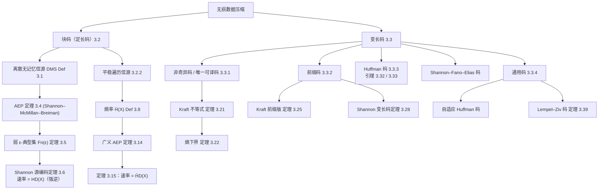
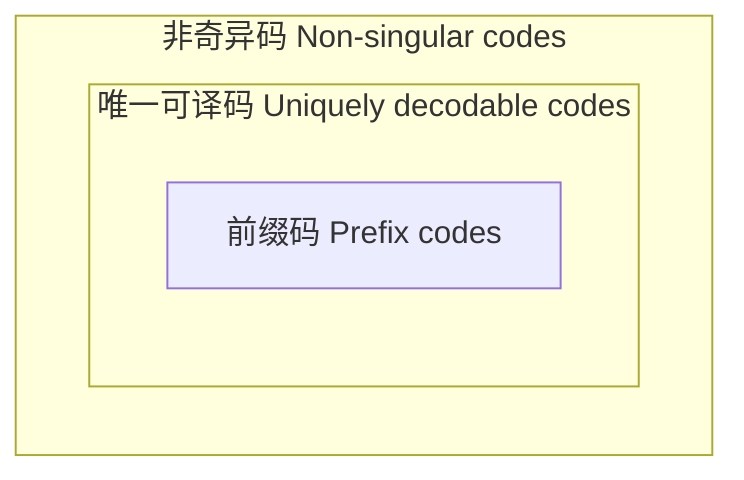
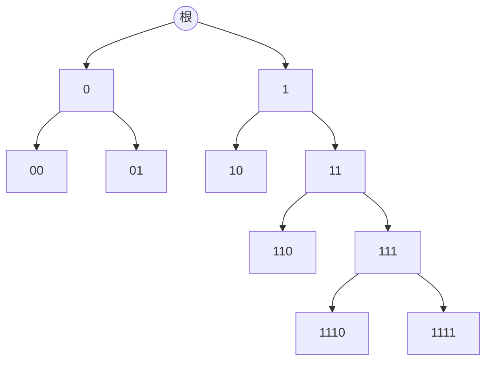
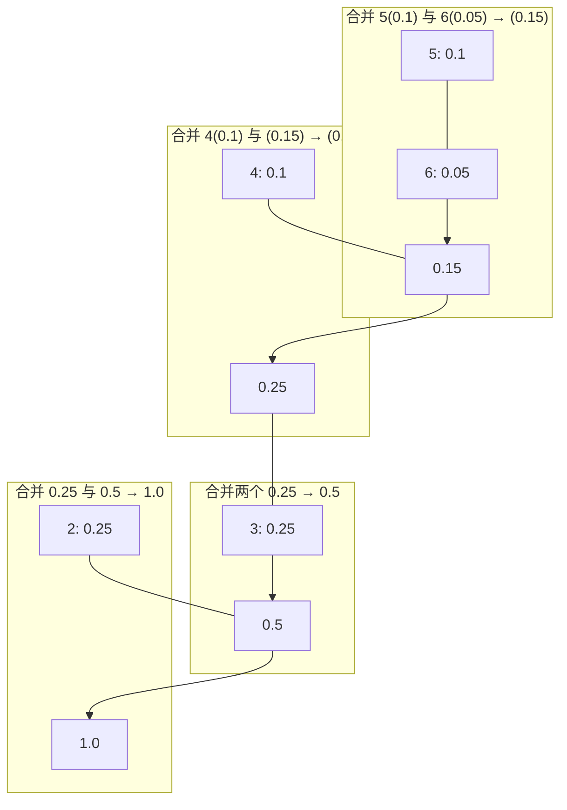

# 第 3 章 无损数据压缩 (Lossless Data Compression)

> [!abstract] 本章主线
> 本章研究**无损数据压缩 (lossless data compression)** 的编码定理：先用块码（定长码）证明 Shannon 信源编码定理，得出熵是"渐近无损"块压缩的最小可达速率；再研究变长码，证明唯一可译码的最小平均码率等于熵，并给出达到该界的前缀码构造（Huffman、Shannon–Fano–Elias 码）；最后介绍通用编码（自适应 Huffman、Lempel–Ziv 码）。

## 📝 本章摘要

- 无损压缩的核心结论：对离散无记忆信源 (DMS)，**渐近无损块码**的最小可达压缩速率恰为源熵 $H_D(X)$（Shannon 源编码定理，定理 3.6）；对平稳遍历信源，该结论推广为熵率 $\bar H_D(X)$（定理 3.15）。
- **渐近等分性质 (AEP)**（Shannon–McMillan–Breiman 定理）是证明的枢纽：几乎所有概率质量都集中在约 $2^{nH}$ 个"弱 $\epsilon$-典型"序列上，其概率近似相等。
- 对**变长码**：唯一可译码 ⟺ Kraft 不等式成立；所有唯一可译码的平均码率 ≥ 熵（定理 3.22），而前缀码可做到 ≤ 熵 + $1/n$（定理 3.27），故最小无损平均码率恰为熵（定理 3.28）。
- **Huffman 算法**递归构造出最优（平均码长最小）二进制前缀码；**Shannon–Fano–Elias 码**基于累计分布实现 $\bar\ell<H(X)+2$ 的简单前缀码。
- 当信源分布未知时，**通用编码**（自适应 Huffman、Lempel–Ziv 码）可渐近达到任意平稳遍历信源的熵率（定理 3.39）。

## 🧠 知识结构思维导图



---

## 3.1 数据压缩原理 (Principles of Data Compression)

如第 1 章所述，数据压缩描述的是"用平均码长（或码率）可接受地小"的码来表示信源的方法。这种表示可以是**无损的（或渐近无损的）**——重建的信源与原始信源相同（或以渐近消失的错误概率相同）；也可以是**有损的**——允许重建信源偏离原始信源，通常在一个可接受阈值内。本章聚焦**无损数据压缩**。

由于无记忆信源被建模为随机变量，码本的平均码长基于该随机变量的概率分布计算。例如考虑三元无记忆信源 $X$，三个可能结果的分布为

$$
P_X(x=\text{outcome}_A)=0.5;\qquad P_X(x=\text{outcome}_B)=0.25;\qquad P_X(x=\text{outcome}_C)=0.25.
$$

假设为该信源设计二进制码本：$\text{outcome}_A$、$\text{outcome}_B$、$\text{outcome}_C$ 分别编码为 $0,10,11$。则平均码长（bit/信源输出）为

$$
\ell(0)\cdot P_X(\text{outcome}_A)+\ell(10)\cdot P_X(\text{outcome}_B)+\ell(11)\cdot P_X(\text{outcome}_C)=0.5+2\cdot0.25+2\cdot0.25=1.5\ \text{bits}.
$$

**变长码 vs 定长码：** 通常对码的基本结构没有限制。当每个信源输出对应码长可以不同时，称该码为**变长码 (variable-length code)**；当所有信源输出的码长相等时，称**定长码 (fixed-length code)**。显然，所有变长码中最小平均码长不大于所有定长码中的最小平均码长，因为后者是前者的子类。本章将看到：对概率特性良好（如平稳性、遍历性）的信源，变长码与定长码能达到的最小平均码率一致；但对更一般的有记忆信源，两者不同（例如参见 [172]）。

**定长码的分段：** 对定长码，相邻码字为了存储或传输需要拼接在一起，通常需要某种标点机制——如标记每个码字的开始或划分内部子块以实现编解码同步——被视为码字固有的隐含部分。由于空间或处理能力限制，源符号序列可能过长，编码前通常需要分段。例如用二进制码为 100 名学生的成绩（三个等级 A,B,C）编码。观察到 100 名学生有 $3^{100}$ 种成绩组合，直接设计需要 $\log_2(3^{100})=159$ bits。若编码器每次只能处理 16 bits，则需分段：每次编码 10 名学生的成绩，需要 $\log_2(3^{10})=16$ bits，于是 100 名学生的成绩共需 160 bits。

**术语：** 成绩集合 $\{A,B,C\}$ 中的字母与码字母表 $\{0,1\}$ 中的字母分别称为**源符号 (source symbols)** 与**码符号 (code symbols)**。码字母表为二进制时，码符号称**码位或位 (code bits / bits)**。源符号的元组（成组序列）称**源字 (sourceword)**，编码得到的码符号元组称**码字 (codeword)**。

> [!note] 本书的约定
> 编码过程中源字长度不必相等，但本书只考虑编码过程源字为**固定长度**的情形（本章末尾简述的 Lempel–Ziv 码除外），但允许码字如前述有固定或可变长度。换言之，本书的定长码实为"**定长到定长码 (fixed-to-fixed)**"，变长码为"**定长到变长码 (fixed-to-variable)**"。

**块码 vs 树码：** 给定长码加入分段机制后，码可粗略分为两组：**块码 (block codes)** 中，下一段源符号的编码（或译码）独立于之前各段；若下一段的编码/译码保留并利用了更早段的知识，则称**定长树码 (fixed-length tree code)**。本书不研究树码，因此"块码"与"定长码"可作为同义词。


> [!tip] 图 3.1 结构解读
> 原书图 3.1 为数据压缩系统框图：源字 → 信源编码器 → 码字 → 信源译码器 → 源字。上图 Mermaid 复现了这一闭环结构。

---

## 3.2 渐近无损压缩的块码 (Block Codes for Asymptotically Lossless Compression)

### 3.2.1 离散无记忆信源的块码 (Block Codes for Discrete Memoryless Sources)

> [!definition] 定义 3.1 (离散无记忆信源, Definition 3.1)
> **离散无记忆信源 (discrete memoryless source, DMS)** $\{X_n\}_{n=1}^{\infty}$ 由一列 i.i.d. 随机变量 $X_1,X_2,X_3,\dots$ 组成，它们都在公共有限字母表 $\mathcal X$ 上取值。特别地，若 $P_X(\cdot)$ 是 $X_i$ 的公共分布（pmf），则
>
> $$
> P_{X^n}(x_1,x_2,\dots,x_n)=\prod_{i=1}^n P_X(x_i).
> $$

> [!definition] 定义 3.2 ((n, M) 块码, Definition 3.2)
> 对离散信源 $\{X_n\}$，具有块长 $n$ 与大小 $M$（一般可为 $n$ 的函数，即 $M=M_n$）的 **(n, M) 块码**是集合 $\mathcal C_n=\{c_1,c_2,\dots,c_M\}\subseteq\mathcal X^n$，包含 $M$ 个**再现（重建）字**，每个再现字都是一个源字（$n$ 元源符号元组）。
>
> 为简化叙述，本书滥用记号，用 $\mathcal C_n=(n,M)$ 表示 $\mathcal C_n$ 是块长 $n$、大小 $M$ 的块码。

> [!note] Observation 3.3 (二元索引)
> 可用 $k:=\lceil\log_2 M\rceil$ 位对 $\mathcal C_n=\{c_1,\dots,c_M\}$ 中的再现字进行二元索引（枚举）。由于这些 $k$ 位字通常存储以备后用，$(n,M)$ 块码可由编码–译码函数对 $(f,g)$ 表示：编码函数
>
> $$
> f:\mathcal X^n\to\{0,1\}^k
> $$
>
> 把每个源字 $x^n$ 映射到 $k$ 位字 $f(x^n)$，称为码字；译码函数
>
> $$
> g:\{0,1\}^k\to\{c_1,c_2,\dots,c_M\}
> $$
>
> 是产生再现字的检索操作。码字取二进制值，故此类块码称**二进制码**。更一般地，**D 进制块码**（$D>1$ 为整数）使用编码函数 $f:\mathcal X^n\to\{0,1,\dots,D-1\}^k$，其中每个码字 $f(x^n)$ 含 $k$ 个 D 进制码符号。
>
> 由于块码的行为在 $n,M\to\infty$ 时考察，把 $\lceil\log_2 M\rceil$ 换成 $\log_2 M$ 是合理的。由此，**数据压缩率（码率）**为
>
> $$
> \frac{k}{n}=\frac1n\log_2 M\quad(\text{bit/源符号}).
> $$
>
> 类似地，D 进制码的码率为 $\dfrac{k}{n}=\dfrac1n\log_D M$（D 进制码符号/源符号）。为计算方便，也可用 nat（自然对数）替代 bit 或 D 进制码符号，此时码率为 $\frac1n\ln M$（nat/源符号）。
>
> 块码的运作可符号化表示为
>
> $$
> (x_1,x_2,\dots,x_n)\to c_m\in\{c_1,c_2,\dots,c_M\}.
> $$
>
> 该过程对每块长度 $n$ 的连续块重复：$\cdots(x_{3n},\dots,x_{2n+1})(x_{2n},\dots,x_{n+1})(x_{1n},\dots,x_1)\to\cdots|c_{m_3}|c_{m_2}|c_{m_1}$，其中 "$|$" 反映连续源块编码器需要"标点机制"或"同步机制"。

> [!theorem] 定理 3.4 (Shannon–McMillan–Breiman 定理 / AEP, Theorem 3.4)
> 若 $\{X_n\}_{n=1}^{\infty}$ 是熵为 $H(X)$ 的 DMS，则
>
> $$
> \frac{-1}{n}\log_2P_{X^n}(X_1,\dots,X_n)\to H(X)\quad\text{依概率}.
> $$
>
> 换言之，对任意 $\epsilon>0$，
>
> $$
> \lim_{n\to\infty}\Pr\left[\left|\frac{-1}{n}\log_2P_{X^n}(X_1,\dots,X_n)-H(X)\right|>\epsilon\right]=0.
> $$

> [!proof]- Proof
> 对 i.i.d. 序列 $\{X_n\}$，
>
> $$
> \frac{-1}{n}\log_2P_{X^n}(X_1,\dots,X_n)=\frac1n\sum_{i=1}^n[-\log_2P_X(X_i)],
> $$
>
> 且 $\{-\log_2P_X(X_i)\}_{i=1}^{\infty}$ 是 i.i.d. 序列，对该序列应用弱大数定律即可。∎

**AEP 的"信息论类比"意义：** AEP 恰是弱大数定律的"信息论"类比——它断言对 i.i.d. 序列 $\{-\log_2P_X(X_i)\}$，对任意 $\epsilon>0$，$\Pr\left[\left|\frac1n\sum_{i=1}^n[-\log_2P_X(X_i)]-H(X)\right|\le\epsilon\right]\to1$（$n\to\infty$）。

作为 AEP 的推论，所有概率质量最终将集中在**弱 $\epsilon$-典型集 (weakly $\epsilon$-typical set)** 上，其定义为

$$
\mathcal F_n(\epsilon):=\left\{x^n\in\mathcal X^n:\left|\frac{-1}{n}\log_2P_{X^n}(x^n)-H(X)\right|\le\epsilon\right\}
=\left\{x^n\in\mathcal X^n:\left|\frac{-1}{n}\sum_{i=1}^n\log_2P_X(x_i)-H(X)\right|\le\epsilon\right\}.
$$

由于信源无记忆，对任意 $x^n\in\mathcal F_n(\epsilon)$，$-(1/n)\log_2P_{X^n}(x^n)$（$x^n$ 的归一化自信息）等于 $(1/n)\sum_{i=1}^n[-\log_2P_X(x_i)]$，即信源的经验（算术平均）自信息或"表观"熵。因此，若源字 $x^n$ 产生与"真实"源熵 $H(X)$ 相差不超过 $\epsilon$ 的表观源熵，则它是 $\epsilon$-典型的。注意 $\mathcal F_n(\epsilon)$ 中的源字近似等概率或"等惊讶程度"（见定理 3.5 性质 1），这印证了定理 3.4 的 AEP 命名。

> [!theorem] 定理 3.5 (AEP 的推论, Theorem 3.5)
> 给定熵为 $H(X)$ 的 DMS $\{X_n\}$ 及任意 $\epsilon>0$，弱 $\epsilon$-典型集 $\mathcal F_n(\epsilon)$ 满足：
>
> 1. 若 $x^n\in\mathcal F_n(\epsilon)$，则
>
>    $$
>    2^{-n(H(X)+\epsilon)}\le P_{X^n}(x^n)\le2^{-n(H(X)-\epsilon)}.
>    $$
>
> 2. 对足够大的 $n$，$P_{X^n}\bigl(\mathcal F_n^c(\epsilon)\bigr)<\epsilon$，其中上标 $c$ 表示补集运算。
> 3. 对足够大的 $n$，$|\mathcal F_n(\epsilon)|>(1-\epsilon)2^{n(H(X)-\epsilon)}$；且对每个 $n$，$|\mathcal F_n(\epsilon)|\le2^{n(H(X)+\epsilon)}$，其中 $|\mathcal F_n(\epsilon)|$ 表示 $\mathcal F_n(\epsilon)$ 中元素个数。
>
> > [!note] 注
> > 若用底 $D>1$ 的对数 $\log_D$ 定义典型集，上述定理同样成立；只需把指数项中的 $2^x$ 换成 $D^x$，并把 $H(X)$ 换成 $H_D(X)$。

> [!proof]- Proof
> 性质 1 是 $\mathcal F_n(\epsilon)$ 定义的直接推论。性质 2 是 AEP 的直接推论——AEP 断言对固定 $\epsilon>0$，$\lim_n P_{X^n}(\mathcal F_n(\epsilon))=1$。下面给出性质 2 的直接证明并给出 $n_0$ 的显式表达：由 Chebyshev 不等式[^5]，
>
> $$
> P_{X^n}\bigl(\mathcal F_n^c(\epsilon)\bigr)\le\frac{\sigma_X^2}{n\epsilon^2}<\epsilon\quad\text{当 }n>\sigma_X^2/\epsilon^3,
> $$
>
> 其中方差 $\sigma_X^2:=\operatorname{Var}[-\log_2P_X(X)]=\sum_xP_X(x)(\log_2P_X(x))^2-(H(X))^2$ 是不依赖 $n$ 的常数。
>
> [^5]: Chebyshev 不等式及其证明见附录 B 第 287 页。
>
> 为证性质 3，由性质 1：
>
> $$
> 1=\sum_{x^n\in\mathcal F_n(\epsilon)}P_{X^n}(x^n)\ge|\mathcal F_n(\epsilon)|\cdot2^{-n(H(X)+\epsilon)},
> $$
>
> 得 $|\mathcal F_n(\epsilon)|\le2^{n(H(X)+\epsilon)}$（对每个 $n$）。再由性质 2 与 1：
>
> $$
> 1-\epsilon<1-\frac{\sigma_X^2}{n\epsilon^2}\le\sum_{x^n\in\mathcal F_n(\epsilon)}P_{X^n}(x^n)\le|\mathcal F_n(\epsilon)|\cdot2^{-n(H(X)-\epsilon)},
> $$
>
> 对 $n\ge\sigma_X^2/\epsilon^3$ 成立，即 $|\mathcal F_n(\epsilon)|>(1-\epsilon)2^{n(H(X)-\epsilon)}$。∎
>
> 注：证明中假设方差 $\sigma_X^2<\infty$，这由有限字母表保证：
> $$
> \operatorname{Var}[-\log_2P_X(X)]\le\mathbb E[(\log_2P_X(X))^2]\le\frac4{e^2}[\log_2(e)]^2|\mathcal X|<\infty.
> $$

**唯一可译（完全无损）块码：** 对任意 $n>0$，若块码 $\mathcal C_n=(n,M)$ 的再现字集合平凡地等于所有源 $n$ 元组集合，即 $\{c_1,\dots,c_M\}=\mathcal X^n$，则称其**唯一可译 (uniquely decodable)** 或**完全无损**。此时用编码–译码对 $(f,g)$ 二元索引再现字，每个源字 $x^n$ 都被赋给长度 $k=\log_2 M$ 的不同二进制码字，且所有二进制 $k$ 元组都是某源字在 $f$ 下的像。即 $f$ 是双射（单射且满射），从而可逆，$g=f^{-1}$，$M=|\mathcal X|^n=2^k$。此时码率为 $(1/n)\log_2M=\log_2|\mathcal X|$ bit/源符号。

**问题：** 能否做到更小（更优）的压缩率？**答案是肯定的**：若放弃（对每个 $n$ 的）唯一可译性，并允许 $n$ 足够大，通过任意小（但为正）的译码错误概率实现渐近无损重建，则可达到等于源熵 $H(X)$（bit 为单位）的压缩率——当信源强非均匀分布时，这可比 $\log_2|\mathcal X|$ 小得多。块码的译码错误概率为

$$
P_e(\mathcal C_n):=P_{X^n}\{x^n\in\mathcal X^n:g(f(x^n))\ne x^n\}.
$$

因此，本书中的块码可相对于块长实现**渐近无损**压缩；这与变长码（可对每个有限块长做到完全无损、唯一可译）形成对比。

> [!theorem] 定理 3.6 (Shannon 源编码定理, Theorem 3.6)
> 给定整数 $D>1$，考虑熵为 $H_D(X)$ 的离散无记忆信源 $\{X_n\}$。则下列成立。
>
> - **正向部分（可达性）：** 对任意 $0<\epsilon<1$，存在 $0<\delta<\epsilon$ 及一列 D 进制块码 $\{\mathcal C_n=(n,M_n)\}_{n=1}^{\infty}$，满足
>
>   $$
>   \limsup_{n\to\infty}\frac1n\log_D M_n\le H_D(X)+\delta, \tag{3.2.1}
>   $$
>
>   且
>
>   $$
>   P_e(\mathcal C_n)<\epsilon \tag{3.2.2}
>   $$
>
>   对所有足够大的 $n$ 成立，其中 $P_e(\mathcal C_n)$ 表示块码 $\mathcal C_n$ 的错误（译码错误）概率。
>
> - **强反向部分 (strong converse)：** 对任意 $0<\epsilon<1$，任意满足
>
>   $$
>   \limsup_{n\to\infty}\frac1n\log_D M_n<H_D(X) \tag{3.2.3}
>   $$
>
>   的 D 进制块码序列 $\{\mathcal C_n=(n,M_n)\}$ 满足
>
>   $$
>   P_e(\mathcal C_n)>1-\epsilon
>   $$
>
>   对所有足够大的 $n$ 成立。

> [!note] 关于 (3.2.2) 的注
> (3.2.2) 等价于 $\limsup_n P_e(\mathcal C_n)\le\epsilon$。由于 $\epsilon$ 可任意小，正向部分实际表明存在满足 (3.2.1) 的 D 进制块码序列使 $\limsup_n P_e(\mathcal C_n)=0$。据此，反向部分应是"满足 (3.2.3) 的任意 D 进制块码序列满足 $\limsup_n P_e(\mathcal C_n)>0$"；但**强反向**给出更强的结论 $\limsup_n P_e(\mathcal C_n)=1$。

> [!proof]- Proof
> **正向部分：** 不失一般性，对二进制码（$D=2$）证明；记 $H(X)$ 为 $H_2(X)$（省略下标）。给定 $0<\epsilon<1$，固定 $0<\delta<\epsilon$ 且选 $n>2/\delta$。构造二进制块码 $\mathcal C_n$：把 $\delta/2$-典型源字 $x^n$ 映射到长度为 $k:=\log_2M_n$ 的互不相同、非全零的二进制码字，即用如下编码映射对 $\mathcal F_n(\delta/2)$ 中的源字二元索引：
>
> $$
> x^n\mapsto\begin{cases}\text{ }x^n\text{ 的二进制索引},& x^n\in\mathcal F_n(\delta/2),\\ \text{全零码字},& x^n\notin\mathcal F_n(\delta/2).\end{cases}
> $$
>
> 由 Shannon–McMillan–Breiman AEP 定理（性质 3），当 $n>2/\delta$ 时
>
> $$
> M_n=|\mathcal F_n(\delta/2)|+1\le2^{n(H(X)+\delta/2)}+1<2\cdot2^{n(H(X)+\delta/2)}<2^{n(H(X)+\delta)}.
> $$
>
> 于是建立了满足 (3.2.1) 的 $\mathcal C_n=(n,M_n)$ 块码序列。还需证明该块码序列的错误概率对足够大的 $n$ 可小于 $\epsilon$。
>
> 由 AEP 定理（性质 2），$P_{X^n}\bigl(\mathcal F_n^c(\delta/2)\bigr)<\epsilon/2$ 对所有足够大的 $n$ 成立。于是对满足该不等式且 $n>2/\delta$ 的 $n$：
>
> $$
> P_e(\mathcal C_n)\le P_{X^n}\bigl(\mathcal F_n^c(\delta/2)\bigr)<\frac\epsilon2<\epsilon.
> $$
>
> （最后一步可参照表 3.1：只有典型集之外"歧义"的序列对错误概率有贡献。）
>
> **强反向部分：** 固定任意满足 $\limsup_n\frac1n\log_2|\mathcal C_n|<H(X)$ 的块码序列。设 $\mathcal S_n$ 为能通过 $\mathcal C_n$ 编码系统正确译码的源符号集合，则 $|\mathcal S_n|=|\mathcal C_n|$。选取足够小、满足 $\delta/2>\epsilon>0$ 的 $\epsilon$，由 limsup 定义，$(\exists N_0)(\forall n>N_0)\ \frac1n\log_2|\mathcal S_n|=\frac1n\log_2|\mathcal C_n|<H(X)-2\epsilon$，即
>
> $$
> |\mathcal S_n|<2^{n(H(X)-2\epsilon)}\quad(n>N_0).
> $$
>
> 由 AEP 推论性质 2，$(\exists N_1)(\forall n>N_1)\ P_{X^n}(\mathcal F_n^c(\epsilon))<\epsilon$。于是对 $n>N:=\max\{N_0,N_1,\log_2(2/\epsilon)/\epsilon\}$，正确块译码概率满足
>
> $$
> \begin{aligned}
> 1-P_e(\mathcal C_n)&=\sum_{x^n\in\mathcal S_n}P_{X^n}(x^n)\\
> &=\sum_{x^n\in\mathcal S_n\cap\mathcal F_n^c(\epsilon)}P_{X^n}(x^n)+\sum_{x^n\in\mathcal S_n\cap\mathcal F_n(\epsilon)}P_{X^n}(x^n)\\
> &\le P_{X^n}(\mathcal F_n^c(\epsilon))+|\mathcal S_n\cap\mathcal F_n(\epsilon)|\cdot\max_{x^n\in\mathcal F_n(\epsilon)}P_{X^n}(x^n)\\
> &<\epsilon+|\mathcal S_n|\cdot2^{-n(H(X)-\epsilon)}\\
> &<\epsilon+2^{n(H(X)-2\epsilon)}\cdot2^{-n(H(X)-\epsilon)}\\
> &=\epsilon+2^{-n\epsilon}\\
> &<2\epsilon,
> \end{aligned}
> $$
>
> 即 $P_e(\mathcal C_n)>1-2\epsilon$，等价于 $P_e(\mathcal C_n)>1-\epsilon'$（重新命名 $\epsilon'=2\epsilon$）对 $n>N$ 成立。∎

> [!note] Observation 3.7
> 定理 3.6 的结果见图 3.3，其中 $\bar R:=\limsup_n\frac1n\log_D M_n$ 通常称为块码压缩信源的**渐近码率 (asymptotic code rate)**。由该图清晰可见：任何译码错误概率任意小的块码的（渐近）码率必须 ≥ 源熵[^8]；反之，任何码率小于熵的块码的错误概率最终趋于 1（因而有界远离零）。因此对 DMS，源熵 $H_D(X)$ 是全部"可达"（块）编码码率的下确界；即存在一列 D 进制块码、其译码错误概率随块长渐近消失的那些码率的下确界。事实上为证明 $H_D(X)$ 是该下确界，我们按"下确界的性质"把定理拆成正、反两部分；见 Observation A.11。
>
> [^8]: 由定理 3.6 正向部分的陈述与证明清晰可见：只要 $(1/n)\log_D M_n$ 随 $n$ 增大从上方逼近熵，源熵即可作为渐近压缩率达到。此外，渐近压缩率定义为 $(1/n)\log_D M_n$ 的 limsup，以保证对足够大的 $n$ 有可靠压缩（类似地，在信道编码中渐近传输率定义为 liminf 以保证所有足够大的 $n$ 可靠通信，见第 4 章）。

**对一般（有记忆）信源的推广思路：** 对（统计）有记忆的信源，Shannon–McMillan–Breiman 定理不能直接以其原形式应用，Shannon 源编码定理看似仅限无记忆信源。但探究这些定理背后的思想可发现：Shannon 源编码定理成立的关键实际是存在集合 $\mathcal A_n=\{x_1^n,\dots,x_M^n\}$，满足 $M\le D^{nH_D(X)}$ 且 $P_{X^n}(\mathcal A_n^c)\to0$——即存在一个"**典型类**"集合 $\mathcal A_n$，其大小极小、概率质量渐近大。因此，若能对有记忆信源找到这样的典型类集合，块码源编码定理即可推广到该信源。事实上，经适当修改，Shannon–McMillan–Breiman 定理可推广到**平稳遍历信源**类，从而建立该类信源的块码编码定理；下节讨论。对更一般（如非平稳非遍历）信源的块码编码定理，可用广义"谱"熵度量研究 [73, 172, 175]。

**表 3.1（AEP 编码示例）**：取 $n=2$、$\epsilon=0.4$，源分布 $P_X(A)=0.4,P_X(B)=0.3,P_X(C)=0.2,P_X(D)=0.1$，则 $\mathcal F_2(0.4)=\{AB,AC,BA,BB,BC,CA,CB\}$。码字集合为 $\{001(AB),010(AC),011(BA),100(BB),101(BC),110(CA),111(CB),000(\text{其余均歧义})\}$。表中每一源字列出其归一化自信息 $\left|-\frac12\sum_{i=1}^2\log_2P_X(x_i)-H(X)\right|$、是否属于 $\mathcal F_2(0.4)$、码字及重建结果。典型集内的源字（如 AB, AC, …）被唯一重建；典型集外的（如 AA, AD, …, DD）共享全零码字 000，重建歧义，对错误概率有贡献。

### 3.2.2 平稳遍历信源的块码 (Block Codes for Stationary Ergodic Sources)

实践中，用于建模数据的随机信源常表现出其随机变量间的记忆（统计依赖）；其联合分布不是边缘分布的乘积。本节考虑**平稳遍历信源**类的渐近无损压缩定理。

推广块码编码定理之前，需先为相依随机变量序列 $X^n$ 推广"熵"度量（它当然应与 DMS 情形向后兼容）。一个直接的推广是考察源序列归一化块熵的极限，得到**熵率**概念。

> [!definition] 定义 3.8 (熵率, Definition 3.8)
> 信源 $\{X_n\}$ 的**熵率 (entropy rate)** 记为 $\bar H(X)$，定义为
>
> $$
> \bar H(X):=\lim_{n\to\infty}\frac1nH(X^n),
> $$
>
> 其中 $X^n=(X_1,\dots,X_n)$，假定极限存在。

下面证明平稳信源的熵率存在（此处不需要遍历性）。

> [!lemma] 引理 3.9 (Lemma 3.9)
> 对平稳信源 $\{X_n\}$，条件熵 $H(X_n|X_{n-1},\dots,X_1)$ 关于 $n$ 非增且有下界零。因此由引理 A.20，极限
>
> $$
> \lim_{n\to\infty}H(X_n|X_{n-1},\dots,X_1)
> $$
>
> 存在。

> [!proof]- Proof
> $$
> H(X_n|X_{n-1},\dots,X_1)\le H(X_n|X_{n-1},\dots,X_2) \tag{3.2.4}
> $$
>
> $$
> =H(X_n,\dots,X_2)-H(X_{n-1},\dots,X_2) \tag{3.2.5}
> $$
>
> $$
> =H(X_{n-1},\dots,X_1)-H(X_{n-2},\dots,X_1)
> =H(X_{n-1}|X_{n-2},\dots,X_1),
> $$
>
> 其中 (3.2.4) 因条件化不增熵，(3.2.5) 因平稳性假设成立。最后，每个条件熵 $H(X_n|X_{n-1},\dots,X_1)$ 非负。∎

> [!lemma] 引理 3.10 (Cesàro 均值定理, Lemma 3.10)
> 若 $a_n\to a$（$n\to\infty$）且 $b_n=\frac1n\sum_{i=1}^n a_i$，则 $b_n\to a$（$n\to\infty$）。

> [!proof]- Proof
> $a_n\to a$ 意味着对任意 $\epsilon>0$，存在 $N$ 使对所有 $n>N$，$|a_n-a|<\epsilon$。则
>
> $$
> |b_n-a|=\left|\frac1n\sum_{i=1}^n(a_i-a)\right|\le\frac1n\sum_{i=1}^n|a_i-a|
> =\frac1n\sum_{i=1}^N|a_i-a|+\frac1n\sum_{i=N+1}^n|a_i-a|
> \le\frac1n\sum_{i=1}^N|a_i-a|+\frac{n-N}{n}\epsilon.
> $$
>
> 故 $\lim_n|b_n-a|\le\epsilon$。因 $\epsilon$ 可任意小，引理成立。∎

> [!theorem] 定理 3.11 (Theorem 3.11)
> 平稳信源 $\{X_n\}$ 的熵率总是存在，且等于
>
> $$
> \bar H(X)=\lim_{n\to\infty}H(X_n|X_{n-1},\dots,X_1).
> $$

> [!proof]- Proof
> 由熵的链式法则：
>
> $$
> \frac1nH(X^n)=\frac1n\sum_{i=1}^n H(X_i|X_{i-1},\dots,X_1),
> $$
>
> 再应用 Cesàro 均值定理即可。∎

> [!note] Observation 3.12
> 还可证明对平稳信源，$\frac1nH(X^n)$ 关于 $n$ 非增，且对一切 $n\ge1$，$\frac1nH(X^n)\ge H(X_n|X_{n-1},\dots,X_1)$。（证明留作习题，见习题 3。）

当 $\{X_n\}$ 为 DMS 时，$H(X^n)=nH(X)$（每个 $n$），故 $\bar H(X)=\lim_n\frac1nH(X^n)=H(X)$。

对平稳一阶 Markov 信源[^10]：

$$
\bar H(X)=\lim_{n\to\infty}\frac1nH(X^n)=\lim_{n\to\infty}H(X_n|X_{n-1},\dots,X_1)=H(X_2|X_1),
$$

其中

$$
H(X_2|X_1)=-\sum_{x_1\in\mathcal X}\sum_{x_2\in\mathcal X}\pi(x_1)P_{X_2|X_1}(x_2|x_1)\log P_{X_2|X_1}(x_2|x_1),
$$

$\pi(\cdot)$ 是 Markov 信源的平稳分布（Markov 信源不可约时 $\pi(\cdot)$ 唯一[^11]）。例如对转移概率 $P_{X_2|X_1}(0|1)=\beta$、$P_{X_2|X_1}(1|0)=\alpha$（$0<\alpha,\beta<1$）的平稳二元 Markov 信源：

$$
\bar H(X)=\frac{\alpha}{\alpha+\beta}h_b(\beta)+\frac{\beta}{\alpha+\beta}h_b(\alpha),
$$

其中 $h_b(\alpha):=-\alpha\log_2\alpha-(1-\alpha)\log_2(1-\alpha)$ 为二元熵函数。

> [!note] Observation 3.13 (有记忆信源的散度率)
> 与熵率概念类似，也可为有记忆信源定义**散度率 (divergence rate)**（Kullback–Leibler 散度率）。给定定义在公共有限字母表 $\mathcal X$ 上的两个离散信源 $\{X_i\}$ 与 $\{\hat X_i\}$，其 $n$ 重分布序列分别为 $\{P_{X^n}\}$ 与 $\{P_{\hat X^n}\}$，则二者之间的散度率定义为
>
> $$
> \lim_{n\to\infty}\frac1nD(P_{X^n}\parallel P_{\hat X^n}),
> $$
>
> 假定极限存在。散度率一般不保证存在；[350] 给出两个非 Markov 遍历信源的散度率不存在的例子。但若信源 $\{\hat X_i\}$ 时不变 Markov、$\{X_i\}$ 平稳，则散度率存在，并可由 $\{X_i\}$ 的熵率与另一个依赖 $\{X_i\}$ 和 $\{\hat X_i\}$（二阶）统计量的量表示为 [157, p. 40]：
>
> $$
> \lim_{n\to\infty}\frac1nD(P_{X^n}\parallel P_{\hat X^n})=-\bar H(X)-\sum_{x_1\in\mathcal X}\sum_{x_2\in\mathcal X}P_{X_1X_2}(x_1,x_2)\log_2P_{\hat X_2|\hat X_1}(x_2|x_1). \tag{3.2.6}
> $$
>
> 进一步，若 $\{X_i\}$ 与 $\{\hat X_i\}$ 都是时不变不可约 Markov 信源，则其散度率存在且有如下表达式 [312, Theorem 1]：
>
> $$
> \lim_{n\to\infty}\frac1nD(P_{X^n}\parallel P_{\hat X^n})=\sum_{x_1\in\mathcal X}\sum_{x_2\in\mathcal X}\pi_X(x_1)P_{X_2|X_1}(x_2|x_1)\log_2\frac{P_{X_2|X_1}(x_2|x_1)}{P_{\hat X_2|\hat X_1}(x_2|x_1)},
> $$
>
> 其中 $\pi_X(\cdot)$ 是 $\{X_i\}$ 的平稳分布。该结果还可借助非负矩阵理论与 Perron–Frobenius 理论推广到 $\{X_i\}$、$\{\hat X_i\}$ 为任意（不必不可约、平稳等）时不变 Markov 链的情形，见 [312, Theorem 2] 中的显式可计算表达式。后一结果的直接推论是任意（不必平稳）时不变 Markov 信源熵率的公式 [312, Corollary 2]。最后，若把 Markov 链换成 $k$ 阶 Markov 链（任意整数 $k>1$），上述所有结果在适当修改后仍成立 [312]。

> [!theorem] 定理 3.14 (广义 AEP / Shannon–McMillan–Breiman 定理, Theorem 3.14)
> 若 $\{X_n\}$ 是平稳遍历信源，则
>
> $$
> \frac{-1}{n}\log_2P_{X^n}(X_1,\dots,X_n)\xrightarrow{\text{a.s.}}\bar H(X).
> $$

由于 AEP 定理（大数定律）对平稳遍历信源成立，AEP 的所有推论（包括 Shannon 无损源编码定理）都成立。

> [!theorem] 定理 3.15 (平稳遍历信源的 Shannon 源编码定理, Theorem 3.15)
> 给定整数 $D>1$，设 $\{X_n\}$ 是熵率（以 D 为单位）
>
> $$
> \bar H_D(X):=\lim_{n\to\infty}\frac1nH_D(X^n)
> $$
>
> 的平稳遍历信源。则下列成立。
>
> - **正向部分（可达性）：** 对任意 $0<\epsilon<1$，存在 $0<\delta<\epsilon$ 及一列 D 进制块码 $\{\mathcal C_n=(n,M_n)\}$，满足
>
>   $$
>   \limsup_{n\to\infty}\frac1n\log_D M_n<\bar H_D(X)+\delta,
>   $$
>
>   且对所有足够大的 $n$，译码错误概率满足 $P_e(\mathcal C_n)<\epsilon$。
>
> - **强反向部分：** 对任意 $0<\epsilon<1$，任意满足 $\limsup_n\frac1n\log_D M_n<\bar H_D(X)$ 的 D 进制块码序列 $\{\mathcal C_n=(n,M_n)\}$ 满足
>
>   $$
>   P_e(\mathcal C_n)>1-\epsilon
>   $$
>
>   对所有足够大的 $n$ 成立。

> [!note] 关于遍历性
> 离散无记忆（i.i.d.）信源是平稳且遍历的（故定理 3.6 是定理 3.15 的特例）。一般而言，验证平稳过程是否遍历是困难的。已知：若平稳过程是两个或更多平稳遍历过程的混合，即其 $n$ 重分布可写成若干平稳遍历过程 $n$ 重分布（关于某个分布）的均值，则它不是遍历的[^14]。
>
> 例如设 $P$ 与 $Q$ 是有限字母表 $\mathcal X$ 上的两个分布，过程 $\{X_n\}$ 按分布 $P$ 为 i.i.d.、$\{Y_n\}$ 按分布 $Q$ 为 i.i.d.。抛掷一次有偏硬币（正面概率 $\theta$，$0<\theta<1$），令
>
> $$
> Z_n=\begin{cases}X_n,& \text{正面},\\ Y_n,& \text{反面},\end{cases}\qquad n=1,2,\dots
> $$
>
> 则所得过程 $\{Z_n\}$ 的 $n$ 重分布是 $\{X_n\}$ 与 $\{Y_n\}$ 的 $n$ 重分布的混合：
>
> $$
> P_{Z^n}(a^n)=\theta P_{X^n}(a^n)+(1-\theta)P_{Y^n}(a^n) \tag{3.2.7}
> $$
>
> 对所有 $a^n\in\mathcal X^n$、$n=1,2,\dots$ 成立。于是 $\{Z_n\}$ 平稳但不遍历。
>
> 一个容易验证遍历性的特例（除 i.i.d. 情形外）是平稳 Markov 信源：有限字母表平稳 Markov 信源若不可约，则遍历（如 [30, p. 371] 与 [349, Prop. I.2.9]），故其广义 AEP 成立。不可约性可由源转移概率矩阵验证。

[^10]: 若提到 Markov 信源而不指明阶数，默认指一阶 Markov 信源；Markov 信源及其性质的简述见附录 B。
[^11]: Markov 信源不可约性的定义见附录 B §B.3。
[^14]: 反之亦真：若平稳过程不能表示为平稳遍历过程的混合，则它是遍历的。

> [!example] 例 3.16 (Polya 传染过程, Example 3.16)
> 考虑由如下 Polya 传染瓮抽样机制 [304–306]（另见 [119, 120]）得到的二元有记忆过程 $\{Z_n\}$。
>
> 瓮初始含 $T$ 个球，其中 $R$ 个红、$B$ 个黑（$T=R+B$）。连续从瓮中抽取；每次抽取后，把刚抽到颜色的 $1+\lambda$ 个球放回瓮中（$\lambda>0$）。过程 $\{Z_n\}$ 按抽取结果生成：
>
> $$
> Z_n=\begin{cases}1,& \text{第 }n\text{ 次抽到红球},\\ 0,& \text{第 }n\text{ 次抽到黑球}.\end{cases}
> $$
>
> 该模型中，瓮中的红球可代表种群中的感染者、黑球代表健康者。由于刚抽到颜色的球数增加（另一颜色球数不变），下一次抽到与刚抽到相同颜色球的似然增大。故"不利"事件（如感染）的发生提高了未来不利事件（同样适用于有利事件）的概率，从而该模型为刻画传染现象提供了基本模板。
>
> 对任意 $n\ge1$，二元过程 $\{Z_n\}$ 的 $n$ 重分布可闭式求得如下：对所有 $a^n=(a_1,\dots,a_n)\in\{0,1\}^n$，其中 $d=a_1+\cdots+a_n$，$\alpha:=R/T$，$\beta:=1-\alpha=B/T$，$\gamma:=\lambda/T$，
>
> $$
> \Pr[Z^n=a^n]=\frac{(\alpha+\gamma)\cdots(\alpha+(d-1)\gamma)(\beta+\gamma)\cdots(\beta+(n-d-1)\gamma)}{(1+\gamma)(1+2\gamma)\cdots(1+(n-1)\gamma)}
> =\frac{\Gamma(\alpha/\gamma+d)\Gamma(\beta/\gamma+n-d)\Gamma(1/\gamma)}{\Gamma(\alpha/\gamma)\Gamma(\beta/\gamma)\Gamma(1/\gamma+n)}, \tag{3.2.8}
> $$
>
> 其中 $\Gamma(\cdot)$ 为 Gamma 函数：$\Gamma(x)=\int_0^\infty t^{x-1}e^{-t}\,dt$（$x>0$）。推导 (3.2.8) 最后一式时使用恒等式
>
> $$
> \prod_{j=0}^{n-1}(\alpha+j\gamma)=\gamma^n\frac{\Gamma(\alpha/\gamma+n)}{\Gamma(\alpha/\gamma)},
> $$
>
> 它由 $\Gamma(x+1)=x\Gamma(x)$ 得到。
>
> 由联合分布表达式 (3.2.8) 可知：过程 $\{Z_n\}$ 是**可交换的 (exchangeable)**[^15]，从而是平稳的。进一步可证 [120, 306]：过程样本均值 $\frac1n(Z_1+Z_2+\cdots+Z_n)$ 随 $n\to\infty$ 几乎必然收敛到随机变量 $Z^\infty$，其分布是参数为 $\alpha/\gamma=R/\lambda$ 与 $\beta/\gamma=B/\lambda$ 的 Beta 分布。这直接说明过程 $\{Z_n\}$ **不遍历**——其样本均值不收敛到常数。还可知 [12] $\{Z_n\}$ 的熵率为
>
> $$
> \bar H(Z)=\mathbb E_{Z^\infty}[h_b(Z^\infty)]=\int_0^1 h_b(z)f_{Z^\infty}(z)\,dz,
> $$
>
> 其中 $h_b(\cdot)$ 是二元熵函数，
>
> $$
> f_{Z^\infty}(z)=\begin{cases}\dfrac{\Gamma(\alpha/\gamma+\beta/\gamma)}{\Gamma(\alpha/\gamma)\Gamma(\beta/\gamma)}z^{\alpha/\gamma-1}(1-z)^{\beta/\gamma-1},& 0<z<1,\\ 0,& \text{否则},\end{cases}
> $$
>
> 是参数为 $\alpha/\gamma$、$\beta/\gamma$ 的 Beta 概率密度函数。注意：因为 $\{Z_n\}$ 不遍历，定理 3.15 对该传染源不成立。
>
> 最后，令 $0\le R_n\le1$ 表示第 $n$ 次抽取后瓮中红球比例，可写
>
> $$
> R_n=\frac{R+\lambda(Z_1+Z_2+\cdots+Z_n)}{T+\lambda n}=\frac{R_{n-1}(T+(n-1)\lambda)+\lambda Z_n}{T+\lambda n}. \tag{3.2.9}
> $$
>
> 用 (3.2.9) 得
>
> $$
> \begin{aligned}
> \mathbb E[R_n|R_{n-1},\dots,R_1]&=\mathbb E[R_n|R_{n-1}]\\
> &=R_{n-1}\cdot\frac{R_{n-1}(T+(n-1)\lambda)+\lambda}{T+\lambda n}
> +(1-R_{n-1})\cdot\frac{R_{n-1}(T+(n-1)\lambda)}{T+\lambda n}\\
> &=R_{n-1}
> \end{aligned}
> $$
>
> 几乎必然成立，故 $\{R_n\}$ 是**鞅 (martingale)**（如 [120, 162]）。因 $\{R_n\}$ 有界，由鞅收敛定理 $R_n$ 几乎必然收敛到某个极限随机变量。但由 (3.2.9)，$R_n$ 的渐近行为与 $\frac1n(Z_1+\cdots+Z_n)$ 相同，故 $R_n$ 也几乎必然收敛到上述 Beta 分布随机变量 $Z^\infty$。
>
> [12] 把噪声为上述 Polya 传染过程的二元加性噪声信道作为非遍历有记忆通信信道模型加以研究。Polya 瓮方案已被广泛应用于许多背景，包括遗传学 [210]、进化与流行病学 [257, 289]、图像分割 [35]、网络流行病 [182]（综述见 [289]）。
>
> [^15]: 过程 $\{Z_n\}$ 称为**可交换（对称相依）的**，若对每个有限正整数 $n$，随机变量 $Z_1,\dots,Z_n$ 的联合分布关于指标 $1,\dots,n$ 的所有置换不变（如 [120]）。可交换性概念源自 de Finetti [90]。由定义直接可知可交换过程是平稳的。

> [!example] 例 3.17 (有限记忆 Polya 传染过程, Example 3.17)
> 上述 Polya 模型具有"无限"记忆——瓮中第一个抽出的球对第 100 万次抽取结果的影响，与第 999999 个球的影响相同（且不随抽取次数增加而消失）。在刻画传染现象的背景下这不合常理：一般认为感染的影响随时间消散。此处考虑更现实的**有限记忆**瓮模型 [12]。
>
> 同样考虑初始含 $T=R+B$ 个球（$R$ 红、$B$ 黑）的瓮。在第 $n$ 次抽取（$n=1,2,\dots$）时从瓮中随机抽一个球，并放回 $1+\lambda$ 个同色球（$\lambda>0$）。然后 $M$ 次抽取之后，即第 $(n+M)$ 次抽取后，从瓮中取回第 $n$ 次抽取颜色的球。
>
> 该模型中，经过 $M$ 次抽取的初始化期后，瓮中球总数恒定（$T+M\lambda$）。在此方案中，任何一次抽取的影响只限于未来 $M$ 次抽取。过程 $\{Z_n\}$ 仍对应抽取结果。对 $n\ge M+1$：
>
> $$
> \Pr[Z_n=1|Z_{n-1}=z_{n-1},\dots,Z_1=z_1]=\frac{R+\lambda(z_{n-1}+\cdots+z_{n-M})}{T+M\lambda}
> =\Pr[Z_n=1|Z_{n-1}=z_{n-1},\dots,Z_{n-M}=z_{n-M}]
> $$
>
> 对任意 $z_i\in\{0,1\}$、$i=1,\dots,n$ 成立。因此 $\{Z_n\}$ 是记忆阶为 $M$ 的 Markov 过程。[12] 还证明 $\{Z_n\}$ 平稳，其平稳分布、$n$ 重分布及熵率
>
> $$
> \bar H(Z)=H(Z_{M+1}|Z_M,Z_{M-1},\dots,Z_1)
> $$
>
> 都可以用 $R/T$、$\lambda/T$ 与 $M$ 闭式表达。此外 $\{Z_n\}$ 不可约、从而遍历，故定理 3.15 适用于该有限记忆 Polya 传染过程。[420] 通过涉及大瓮与有限队列的球抽样机制引入该过程的推广版本。

> [!note] Observation 3.18 (谱熵率)
> 在复杂情形——如信源非平稳（时变统计特性）和/或不遍历（如 (3.2.7) 或例 3.16 中的不遍历过程）——源熵率 $\bar H(X)$（若极限存在；否则可考虑 $(1/n)H(X^n)$ 的 liminf/limsup）不再具有"最小可能块压缩率"的操作意义。这需要建立恰当刻画任意有记忆随机系统操作极限的新熵度量。[175] 中 Han 与 Verdú 引入 **inf/sup-熵率的谱概念**，并阐明这些熵度量在证明一般无损块源编码定理中的关键作用。更具体地，他们证明：对任意（不必平稳遍历的）有限字母表信源 $X:=\{X^n=(X_1,\dots,X_n)\}$，最小可达（块）源编码率由 **sup-熵率** $\overline H(X)$ 给出：
>
> $$
> \overline H(X):=\inf\left\{\alpha:\limsup_{n\to\infty}\Pr\left[\frac{-1}{n}\log P_{X^n}(X^n)>\alpha\right]=0\right\}.
> $$
>
> 更多细节见 [73, 172, 175]。

### 3.2.3 无损块压缩的冗余度 (Redundancy for Lossless Block Data Compression)

Shannon 块源编码定理确立：对平稳遍历信源，要达到任意小错误概率的最小数据压缩率为熵率。因此可把**信源冗余度 (source redundancy)** 定义为"通过渐近无损块源编码所能实现的编码率缩减"相对于"仅使用唯一可译（对任意源字块长 $n$ 都完全无损）块源编码"的差值。考虑到前者所得源编码率等于熵率、后者提供的码率为 $\log_2|\mathcal X|$，因此对平稳遍历信源 $\{X_n\}$ 定义**总块源编码冗余度 $\rho_t$**（bit/源符号）为

$$
\rho_t:=\log_2|\mathcal X|-\bar H(X).
$$

故 $\rho_t$ 表示通过二进制[^16]块源编码可消除的"无用（多余）"统计源信息量。

若信源 i.i.d. 且均匀分布，其熵率等于 $\log_2|\mathcal X|$，冗余度 $\rho_t=0$，即信源不可压缩（符合预期）——此时每个源字 $x^n$ 对每个 $n>0,\epsilon>0$ 都属于 $\epsilon$-典型集 $\mathcal F_n(\epsilon)$（即 $\mathcal F_n(\epsilon)=\mathcal X^n$），没有可借源编码省去的多余源字。若信源有记忆或边缘分布非均匀，其冗余度严格为正，可分成两部分：

- **因源边缘分布非均匀导致的冗余度 $\rho_d$：**
  $$
  \rho_d:=\log_2|\mathcal X|-H(X_1).
  $$
- **因源记忆导致的冗余度 $\rho_m$：**
  $$
  \rho_m:=H(X_1)-\bar H(X).
  $$

于是源总冗余度分解为两部分：$\rho_t=\rho_d+\rho_m$。

| 信源类型 | $\rho_d$ | $\rho_m$ | $\rho_t$ |
|---|---|---|---|
| i.i.d. 均匀 | 0 | 0 | 0 |
| i.i.d. 非均匀 | $\log_2\|\mathcal X\|-H(X_1)$ | 0 | $\rho_d$ |
| 一阶对称 Markov[^a] | 0 | $H(X_1)-H(X_2\|X_1)$ | $\rho_m$ |
| 一阶非对称 Markov | $\log_2\|\mathcal X\|-H(X_1)$ | $H(X_1)-H(X_2\|X_1)$ | $\rho_d+\rho_m$ |

[^16]: 由于 $\rho_t$ 以 code bit/源符号计量，其表达式中所有对数均以 2 为底，故该冗余度可由渐近无损二进制块码消除（对 D 进制块码也可用底 D 的对数换单位为 D 进制码符号/源符号）。
[^a]: 一阶 Markov 过程称为**对称的**，若对任意 $x_1$ 与 $\hat x_1$，$\{a:a=P_{X_2\|X_1}(y|x_1)\text{ 对某个 }y\}=\{a:a=P_{X_2\|X_1}(y|\hat x_1)\text{ 对某个 }y\}$。

---

## 3.3 无损压缩的变长码 (Variable-Length Codes for Lossless Data Compression)

### 3.3.1 非奇异码与唯一可译码 (Non-singular Codes and Uniquely Decodable Codes)

下面研究变长（完全）无损数据压缩码。

> [!definition] 定义 3.19 (n 阶变长码, Definition 3.19)
> 考虑具有有限字母表 $\mathcal X$ 的离散信源 $\{X_n\}$，以及 D 进制码字母表 $\mathcal B=\{0,1,\dots,D-1\}$（$D>1$ 为整数）。固定整数 $n\ge1$，则 **D 进制 n 阶变长码 (variable-length code, VLC)** 是函数
>
> $$
> f:\mathcal X^n\to\mathcal B^*,
> $$
>
> 把（定长）源字映射到 $\mathcal B$ 中变长的 D 进制码字，其中 $\mathcal B^*$ 表示 $\mathcal B$ 的所有有限长字符串之集（即 $c\in\mathcal B^*\iff$ 存在整数 $\ell\ge1$ 使 $c\in\mathcal B^\ell$）。
>
> VLC 的**码本** $\mathcal C$ 是所有码字之集：$\mathcal C=f(\mathcal X^n)=\{f(x^n)\in\mathcal B^*:x^n\in\mathcal X^n\}$。
>
> **变长无损压缩码**是源符号可完全无失真重建的码。为达此目标，源符号须无歧义地编码——任何两个不同（正概率的）源符号须由不同码字表示。满足该性质的码称**非奇异码 (non-singular code)**。
>
> 实践中编码器常需编码一串源符号，产生码字的拼接序列。若码字的任意拼接也可无标点无歧义重建，则称该码**唯一可译 (uniquely decodable)**。换言之，VLC 唯一可译当且仅当所有有限源字序列映射到不同码字串：对任意 $m,m'$，$(x_1^n,\dots,x_m^n)\ne(y_1^n,\dots,y_{m'}^n)$ 蕴含
>
> $$
> (f(x_1^n),\dots,f(x_m^n))\ne(f(y_1^n),\dots,f(y_{m'}^n)),
> $$
>
> 或等价地，$(f(x_1^n),\dots,f(x_m^n))=(f(y_1^n),\dots,f(y_{m'}^n))$ 蕴含 $m'=m$ 且 $x_j^n=y_j^n$（$j=1,\dots,m$）。

注意，非奇异 VLC 不一定唯一可译。例如对字母表 $\mathcal X=\{A,B,C,D,E,F\}$ 的信源，给定二进制（一阶）码：

```
A → 0,  B → 1,  C → 00,  D → 01,  E → 10,  F → 11
```

该码显然非奇异，但不唯一可译：码字序列 010 可重建为 ABA、DA 或 AE（即 $(f(A),f(B),f(A))=(f(D),f(A))=(f(A),f(E))$，尽管 $(A,B,A)$、$(D,A)$、$(A,E)$ 互不相等）。

一个重要目标：求出用唯一可译的 n 阶 VLC 表示给定离散信源"多高效"，并提供（至少渐近地，随 $n\to\infty$）达到最优"效率"的构造技术。即确定唯一可译 n 阶 VLC 表示给定信源（无损）所能具有的最小可能平均码率（等价地，最小平均码长），并给出可达到该最小速率（至少在源字长 $n$ 渐近意义下）的显式码构造。

> [!definition] 定义 3.20 (平均码长与平均码率, Definition 3.20)
> 设 $\mathcal C$ 是离散信源 $\{X_n\}$（字母表 $\mathcal X$、分布 $P_{X^n}(x^n)$）的 D 进制 n 阶 VLC $f:\mathcal X^n\to\{0,1,\dots,D-1\}$。记 $\ell(c_{x^n})$ 为与源字 $x^n$ 相关联的码字 $c_{x^n}=f(x^n)$ 的长度，则 $\mathcal C$ 的**平均码长**为
>
> $$
> \bar\ell:=\sum_{x^n\in\mathcal X^n}P_{X^n}(x^n)\ell(c_{x^n}),
> $$
>
> 其**平均码率**（D 进制码符号/源符号）为
>
> $$
> R_n:=\frac{\bar\ell}{n}=\frac1n\sum_{x^n\in\mathcal X^n}P_{X^n}(x^n)\ell(c_{x^n}).
> $$

> [!theorem] 定理 3.21 (唯一可译码的 Kraft 不等式, Theorem 3.21)
> 设 $\mathcal C$ 是离散信源 $\{X_n\}$（字母表 $\mathcal X$）的唯一可译 D 进制 n 阶 VLC。设 $\mathcal C$ 的 $M=|\mathcal X|^n$ 个码字长度分别为 $\ell_1,\ell_2,\dots,\ell_M$。则必须满足如下不等式：
>
> $$
> \sum_{m=1}^M D^{-\ell_m}\le1.
> $$

> [!proof]- Proof
> 假设用码本 $\mathcal C$ 编码依次到达的 $N$ 个源字（$x_k^n\in\mathcal X^n$，$k=1,\dots,N$），得到拼接码字序列 $c_1c_2c_3\cdots c_N$，各码字长度分别为 $\ell(c_1),\dots,\ell(c_N)$。考虑
>
> $$
> \sum_{c_1\in\mathcal C}\sum_{c_2\in\mathcal C}\cdots\sum_{c_N\in\mathcal C}D^{-[\ell(c_1)+\ell(c_2)+\cdots+\ell(c_N)]}.
> $$
>
> 该表达式显然等于
>
> $$
> \left(\sum_{c\in\mathcal C}D^{-\ell(c)}\right)^N=\left(\sum_{m=1}^M D^{-\ell_m}\right)^N.
> $$
>
> （注意 $|\mathcal C|=M$。）另一方面，长度为 $L=\ell(c_1)+\cdots+\ell(c_N)$ 的所有码序列对该和贡献相等，均为 $D^{-L}$。设 $A_L$ 为长度为 $L$ 的 $N$ 码字序列个数。则上述恒等式可改写为
>
> $$
> \left(\sum_{m=1}^M D^{-\ell_m}\right)^N=\sum_{L=1}^{LN}A_L D^{-L},
> $$
>
> 其中 $L_{\max}:=\max_{c\in\mathcal C}\ell(c)$。
>
> 由于 $\mathcal C$ 按假设唯一可译，码字序列必须无歧义可译。注意到长度为 $L$ 的码序列至多有 $D^L$ 种无歧义组合，故 $A_L\le D^L$，于是
>
> $$
> \left(\sum_{m=1}^M D^{-\ell_m}\right)^N=\sum_{L=1}^{LN}A_LD^{-L}\le\sum_{L=1}^{LN}D^LD^{-L}=LN,
> $$
>
> 即
>
> $$
> \sum_{m=1}^M D^{-\ell_m}\le(LN)^{1/N}.
> $$
>
> 证明完成：上式对每个 $N$ 成立，而上界 $(LN)^{1/N}$ 在 $N\to\infty$ 时趋于 1。∎

Kraft 不等式是非常有用的工具，尤其用于证明唯一可译 VLC 对离散无记忆信源的平均速率基本下界由源熵给出。

> [!theorem] 定理 3.22 (Theorem 3.22)
> 离散无记忆信源 $\{X_n\}$ 的每个唯一可译 D 进制 n 阶 VLC 的平均速率以源熵 $H_D(X)$（D 进制码符号/源符号计量）为下界。

> [!proof]- Proof
> 考虑信源 $\{X^n\}$ 的唯一可译 D 进制 n 阶 VLC $f:\mathcal X^n\to\{0,1,\dots,D-1\}$，记 $\ell(c_{x^n})$ 为源字 $x^n$ 的码字 $c_{x^n}=f(x^n)$ 的长度。则
>
> $$
> \begin{aligned}
> R_n-H_D(X)&=\frac1n\sum_{x^n}P_{X^n}(x^n)\ell(c_{x^n})-\frac1nH_D(X^n)\\
> &=\frac1n\sum_{x^n}P_{X^n}(x^n)\ell(c_{x^n})-\frac1n\sum_{x^n}[-P_{X^n}(x^n)\log_DP_{X^n}(x^n)]\\
> &=\frac1n\sum_{x^n}P_{X^n}(x^n)\log_D\frac{P_{X^n}(x^n)}{D^{-\ell(c_{x^n})}}\\
> &\ge\frac1n\left(\sum_{x^n}P_{X^n}(x^n)\right)\log_D\frac{\sum_{x^n}P_{X^n}(x^n)}{\sum_{x^n}D^{-\ell(c_{x^n})}}\quad(\text{Log-sum 不等式})\\
> &=-\frac1n\log_D\sum_{x^n}D^{-\ell(c_{x^n})}\\
> &\ge0,
> \end{aligned}
> $$
>
> 最后一个不等式来自唯一可译码的 Kraft 不等式以及对数严格递增。∎

由上述证明观察到：$R_n=H_D(X)$ 当且仅当 $P_{X^n}(x^n)=D^{-\ell(c_{x^n})}$，即源符号概率是 $D$ 的（负）整数幂。这类信源称 **D 进 (D-adic)** [83]。此时该码称**绝对最优 (absolutely optimal)**——它对任何给定 $n$ 都达到源熵下界（就最小平均码率而言最优）。

此外由上述定理，平均码率不小于源熵。确实，平均码率达到熵的无损压缩码应是最优的（若码的平均码率低于熵，则违反 Kraft 不等式，码不再唯一可译）。总结：

- 唯一可译性 ⟺ Kraft 不等式成立。
- 唯一可译性 ⟹ 无记忆信源 VLC 的平均码率以源熵为下界。

> [!exercise] 习题 3.23 (Exercise 3.23)
> 1. 找一个非奇异且非唯一可译、且违反 Kraft 不等式的码。（提示：本节已给出答案。）
> 2. 找一个非奇异且非唯一可译、且"击败"熵下界的码。

### 3.3.2 前缀码或即时码 (Prefix or Instantaneous Codes)

**前缀码 (prefix code)** 是"自标点"的 VLC——无需附加符号来区分相邻码字。

> [!definition] 定义 3.24 (前缀码, Definition 3.24)
> 若 VLC 中没有任何码字是另一个码字的前缀，则称该 VLC 为**前缀码 (prefix code)** 或**即时码 (instantaneous code)**。

前缀码也称即时码，因为码字序列可被即时译码（立即识别），无需参考同一序列中后续的码字。注意唯一可译码不一定是前缀码，也不一定能即时译码。迄今所遇各类码的关系见图 3.4。



> [!tip] 图 3.4 结构解读
> 原书图 3.4 为包含关系的同心图：前缀码 ⊂ 唯一可译码 ⊂ 非奇异码。上图 Mermaid 用嵌套子图表达包含关系。

D 进制前缀码可用 D 叉树的初始段图示。图 3.5 给出一个二进制（$D=2$）前缀码的树表示。



> [!tip] 图 3.5 结构解读
> 原书图 3.5 为二进制前缀码的树结构，码字位于树叶上，本例为 00、01、10、110、1110、1111。上图 Mermaid 复现该树：根节点分叉 0/1；0 的分支给出 00、01；1 的分支经 11 再分叉给出 110 与（111 下）1110、1111。

> [!theorem] 定理 3.25 (前缀码的 Kraft 不等式, Theorem 3.25)
> 对离散信源 $\{X_n\}$（字母表 $\mathcal X$）存在 D 进制 n 阶前缀码，当且仅当码字长度 $\ell_m$（$m=1,\dots,M$，$M=|\mathcal X|^n$）满足 Kraft 不等式。

> [!proof]- Proof
> 不失一般性，仅证 $D=2$（二进制码）情形。
>
> **正向部分（前缀码满足 Kraft 不等式）：** 前缀码的码字总可放在树的树叶上。取长度 $\ell_{\max}:=\max_{1\le m\le M}\ell_m$。一棵树在第 $\ell_{\max}$ 层原有 $2^{\ell_{\max}}$ 个节点。每个长度为 $\ell_m$ 的码字在第 $\ell_{\max}$ 层障碍 $2^{\ell_{\max}-\ell_m}$ 个节点。换言之，当某节点被选为码字时，其所有后代都被排除在码字之外（前缀码中任何码字都不能是其他码字的前缀）。第 $\ell_{\max}$ 层恰好有 $2^{\ell_{\max}-\ell_m}$ 个被障碍节点。注意两个码字不会障碍同一节点。故第 $\ell_{\max}$ 层被障碍节点总数小于 $2^{\ell_{\max}}$：
>
> $$
> \sum_{m=1}^M2^{\ell_{\max}-\ell_m}\le2^{\ell_{\max}},
> $$
>
> 立即给出 Kraft 不等式 $\sum_{m=1}^M2^{-\ell_m}\le1$。
>
> （此部分也可用"前缀码是唯一可译码"这一事实证明；此处加入该证明是为了展示树状前缀码的特征。）
>
> **反向部分（Kraft 不等式蕴含前缀码的存在）：** 假设 $\ell_1,\ell_2,\dots,\ell_M$ 满足 Kraft 不等式。将证明存在一棵含 $M$ 个被选节点、第 $i$ 个节点位于第 $\ell_i$ 层的二叉树。
>
> 设 $n_i$ 为（$M$ 个节点中）位于第 $i$ 层的节点数（即长度为 $i$ 的码字数），$\ell_{\max}:=\max_{1\le m\le M}\ell_m$。由 Kraft 不等式，
>
> $$
> n_12^{-1}+n_22^{-2}+\cdots+n_{\ell_{\max}}2^{-\ell_{\max}}\le1.
> $$
>
> 上式可改写为更适合本证明的形式：
>
> $$
> \begin{aligned}
> n_12^{-1}&\le1,\\
> n_12^{-1}+n_22^{-2}&\le1,\\
> &\vdots\\
> n_12^{-1}+n_22^{-2}+\cdots+n_{\ell_{\max}}2^{-\ell_{\max}}&\le1.
> \end{aligned}
> $$
>
> 故
>
> $$
> \begin{aligned}
> n_1&\le2,\\
> n_2&\le2^2-n_12^1,\\
> &\vdots\\
> n_{\ell_{\max}}&\le2^{\ell_{\max}}-n_12^{\ell_{\max}-1}-\cdots-n_{\ell_{\max}-1}2^1,
> \end{aligned}
> $$
>
> 可依树模型解释：第一个不等式说长度 1 的码字数小于第一层可用节点数 2。第二个不等式说长度 2 的码字数小于第二层节点总数 $2^2$ 减去已被第一层码字占据节点障碍的节点数。后续不等式表明在移除较短码字障碍的节点后，每一层都有足够节点可用。因为对直到最大码字长度的每个码字长度都成立，定理断言得证。∎

定理 3.21 与 3.25 揭示了变长唯一可译码与前缀码之间的如下关系。

> [!corollary] 推论 3.26 (Corollary 3.26)
> 唯一可译的 D 进制 n 阶码总可用具有相同平均码长（从而相同平均码率）的 D 进制 n 阶前缀码替代。

下面定理解释前缀码平均码率与源熵之间的关系。

> [!theorem] 定理 3.27 (Theorem 3.27)
> 考虑离散无记忆信源 $\{X_n\}$。
>
> 1. 对信源的任意 D 进制 n 阶前缀码，平均码率不小于源熵 $H_D(X)$。
> 2. 必然存在信源的 D 进制 n 阶前缀码，其平均码率不大于 $H_D(X)+\dfrac1n$，即
>
>    $$
>    R_n:=\frac1n\sum_{x^n\in\mathcal X^n}P_{X^n}(x^n)\ell(c_{x^n})\le H_D(X)+\frac1n, \tag{3.3.1}
>    $$
>
>    其中 $c_{x^n}$ 是源字 $x^n$ 的码字，$\ell(c_{x^n})$ 是码字 $c_{x^n}$ 的长度。

> [!proof]- Proof
> 前缀码唯一可译，故由定理 3.22 直接得到其平均码率不小于源熵。
>
> 为证第二部分，设计同时满足 (3.3.1) 与 Kraft 不等式的前缀码——由定理 3.25 即得所需码的存在性。选择源字 $x^n$ 的码字长度为
>
> $$
> \ell(c_{x^n})=\lceil-\log_DP_{X^n}(x^n)\rceil+1. \tag{3.3.2}
> $$
>
> 则
>
> $$
> D^{-\ell(c_{x^n})}\le P_{X^n}(x^n).
> $$
>
> 对全体源符号求和：
>
> $$
> \sum_{x^n}D^{-\ell(c_{x^n})}\le1,
> $$
>
> 恰为 Kraft 不等式。另一方面，(3.3.2) 蕴含 $\ell(c_{x^n})\le-\log_DP_{X^n}(x^n)+2$，进而
>
> $$
> \sum_{x^n}P_{X^n}(x^n)\ell(c_{x^n})\le-\sum_{x^n}P_{X^n}(x^n)\log_DP_{X^n}(x^n)+2=H_D(X^n)+2=nH_D(X)+2,
> $$
>
> 最后一个等式因信源无记忆成立。这给出 $R_n\le H_D(X)+2/n$，比所需 (3.3.1) 略弱；取 $\ell(c_{x^n})=\lceil-\log_DP_{X^n}(x^n)\rceil$（去掉 +1）可得 $R_n\le H_D(X)+1/n$，严格满足 (3.3.1)。∎

[译者注：原文 (3.3.2) 取 $\ell=\lceil-\log_D P\rceil+1$ 后 (3.3.1) 右端为 $H_D(X)+2/n$；为得到 $+1/n$ 需令 $\ell=\lceil-\log_D P\rceil$。此处按原文保留 (3.3.2) 与最终不等式，差异在于取整上界不同，数学结论（速率可任意逼近熵）不受影响。]

> [!note] 一阶与二阶前缀码示例
> n 阶前缀码（编码长度为 n 的源字）对无记忆信源可在 $n\to\infty$ 时使平均码率任意接近源熵。例如字母表 $\{A,B,C\}$、分布 $P_X(A)=0.8,\ P_X(B)=P_X(C)=0.1$ 的信源熵为
>
> $$
> -0.8\log_2 0.8-0.1\log_2 0.1-0.1\log_2 0.1=0.92\ \text{bits}.
> $$
>
> 最优一阶（$n=1$）二进制前缀码可取 $c(A)=0,c(B)=10,c(C)=11$，平均码率为 $0.8\cdot1+0.2\cdot2=1.2$ bits ≥ 0.92 bits。
>
> 若采用二阶（$n=2$）前缀码（每次编码两个连续源符号），新源字母表为 $\{AA,AB,AC,BA,BB,BC,CA,CB,CC\}$，概率分布由 $P_{X^2}(x_1,x_2)=P_X(x_1)P_X(x_2)$ 给出（信源无记忆）。一个最优二进制前缀码可取 $c(AA)=0$、$c(AB)=100$、$c(AC)=101$、$c(BA)=110$、$c(BB)=111100$、$c(BC)=111101$、$c(CA)=1110$、$c(CB)=111110$、$c(CC)=111111$。其平均码率为
>
> $$
> \frac{0.64(1)+0.08(3+3+4)+0.01(6+6+4+6)}{2}=0.96\ \text{bits},
> $$
>
> 更接近源熵 0.92 bits。随 $n$ 增大，平均码率将更接近源熵。

由定理 3.22 与 3.27，得到离散无记忆信源的 Shannon 无损变长源编码定理。

> [!theorem] 定理 3.28 (Shannon 无损变长源编码定理：DMS, Theorem 3.28)
> 固定整数 $D>1$，考虑分布为 $P_X$、熵为 $H_D(X)$（D 进制单位计量）的 DMS $\{X_n\}$。则下列成立。
>
> - **正向部分（可达性）：** 对任意 $\epsilon>0$，存在信源的 D 进制 n 阶前缀（从而唯一可译）码
>
>   $$
>   f:\mathcal X^n\to\{0,1,\dots,D-1\}
>   $$
>
>   其平均码率 $R_n$ 对足够大的 $n$ 满足 $R_n<H_D(X)+\epsilon$。
>
> - **反向部分：** 信源的每个唯一可译码 $f:\mathcal X^n\to\{0,1,\dots,D-1\}$ 的平均码率满足 $R_n\ge H_D(X)$。
>
> 因此对离散无记忆信源，其熵 $H_D(X)$（D 进制单位计量）代表对足够大的 $n$ 的最小变长无损压缩率。

> [!proof]- Proof
> 正向部分由定理 3.27 直接得出（取 $n$ 足够大使 $1/n<\epsilon$）；反向部分已由定理 3.22 给出。∎

> [!note] Observation 3.29 (平稳信源的 Shannon 无损变长编码定理)
> 定理 3.28 对平稳信源类也成立，只需把源熵 $H_D(X)$ 换成源熵率
>
> $$
> \bar H_D(X):=\lim_{n\to\infty}\frac1nH_D(X^n),
> $$
>
> 以 D 进制单位计量。证明与定理 3.22、3.27 的证明非常相似，仅需稍作修改（如利用对平稳信源 $\frac1nH_D(X^n)$ 关于 $n$ 非增这一事实）。

> [!note] Observation 3.30 (Rényi 熵与无损数据压缩)
> 无损变长源编码定理中，选择了最小化平均码长这一准则。平均码长作为性能准则隐含的假设是：压缩代价随码长线性变化。但有些应用并不总是如此——译码的处理代价可能升高、长码字造成的缓冲溢出可能引发问题——此时码长的**指数代价/罚函数**可能比线性代价更合适 [54, 67, 206]。自然希望选择带指数代价的广义函数，使熟悉的线性代价函数（平均码长）成为其特例极限。
>
> 事实上 [67] 中，给定离散信源（字母表 $\mathcal X$、分布 $P_{X^n}$）的 D 进制 n 阶 VLC $f:\mathcal X^n\to\{0,1,\dots,D-1\}$，Campbell 考虑如下指数代价函数，称**阶 $t$ 平均码长**：
>
> $$
> \mathcal L_n(t):=\frac1t\log_D\left(\sum_{x^n\in\mathcal X^n}P_{X^n}(x^n)D^{t\cdot\ell(c_{x^n})}\right),
> $$
>
> 其中 $t$ 是选定的正常数，$c_{x^n}=f(x^n)$ 是源字 $x^n$ 的码字，$\ell(\cdot)$ 是 $c_{x^n}$ 的长度。类似地，$\frac1n\mathcal L_n(t)$ 表示阶 $t$ 平均码率。最优性准则变为：n 阶码在全部可能唯一可译码中其代价 $\mathcal L_n(t)$ 最小者称为最优。
>
> 在极限 $t\to0$ 时，$\mathcal L_n(t)\to\sum_xP_X(x)\ell(c_x)=\bar\ell$，恢复平均码长（符合期望）。$t\to+\infty$ 时，$\mathcal L_n(t)\to\max_{x\in\mathcal X}\ell(c_x)$，即 $\mathcal C$ 中所有码字的最大码长。注意对固定 $t>0$，最小化 $\mathcal L_n(t)$ 等价于最小化 $\sum_{x^n}P_{X^n}(x^n)D^{t\ell(c_{x^n})}$——该和中码字 $c_{x^n}$ 的权重为 $D^{t\ell(c_{x^n})}$，故更短的码字被偏好。
>
> 对带指数代价函数的信源编码设置，Campbell 在 [67] 中通过证明如下无记忆信源的无损变长编码定理，给出了 Rényi 熵的操作刻画。

> [!theorem] 定理 3.31 (指数代价下的无损源编码定理, Theorem 3.31)
> 考虑 DMS $\{X_n\}$，其 D 进制单位、阶 $\alpha$ 的 Rényi 熵为
>
> $$
> H_\alpha(X)=\frac1{1-\alpha}\log_D\sum_{x\in\mathcal X}P_X(x)^\alpha.
> $$
>
> 固定 $t>0$ 并令 $\alpha=\dfrac{1}{1+t}$，则下列成立。
>
> - 对任意 $\epsilon>0$，存在信源的 D 进制 n 阶唯一可译码 $f:\mathcal X^n\to\{0,1,\dots,D-1\}$，对足够大的 $n$ 其阶 $t$ 平均码率满足
>
>   $$
>   \frac1n\mathcal L_n(t)\le H_\alpha(X)+\epsilon.
>   $$
>
> - 反之，不可能找到阶 $t$ 平均码率小于 $H_\alpha(X)$ 的唯一可译码。
>
> 注意到（由引理 2.52）阶 $\alpha$ Rényi 熵在 $\alpha\to1$ 时退化为（D 进制单位的）Shannon 熵，上述定理在 $\alpha\to1$（等价地 $t\to0$）时退化为定理 3.28。最后，[309, Sect. 4.4]、[310, 311] 把上述源编码定理以 Rényi 熵率 $\lim_n\frac1nH_\alpha(X^n)$（$\alpha=(1+t)^{-1}$）推广到时不变 Markov 信源，该熵率对此类信源存在且可闭式计算。

### 3.3.3 二进制前缀码的例子 (Examples of Binary Prefix Codes)

#### (A) Huffman 码：最优变长码

给定字母表 $\mathcal X$ 的离散信源，构造最优二进制一阶（单字母）唯一可译变长码 $f:\mathcal X\to\{0,1\}$，其中"最优"指该码的平均码长（等价地平均码率）在信源的全部二进制唯一可译码类中最小。注意寻找 $n>1$ 的最优 n 阶码只需把 $\mathcal X^n$ 视为字母表扩张的新信源（即每次映射 n 个源符号）。

由推论 3.26，在搜索最优唯一可译码时，可把注意力限制在（更小的）最优前缀码类上。据此观察二进制前缀码最优性的如下必要条件。

> [!lemma] 引理 3.32 (Lemma 3.32)
> 设 $\mathcal C$ 是信源（字母表 $\mathcal X=\{a_1,\dots,a_M\}$、符号概率 $p_1,\dots,p_M$）的最优二进制前缀码，码字长度为 $\ell_i$（$i=1,\dots,M$）。不失一般性假设
>
> $$
> p_1\ge p_2\ge p_3\ge\cdots\ge p_M,
> $$
>
> 且任何概率相同的源符号组按码长递增排列（即若 $p_i=p_{i+1}=\cdots=p_{i+s}$，则 $\ell_i\le\ell_{i+1}\le\cdots\le\ell_{i+s}$）。则下列性质成立：
>
> 1. **高概率源符号码字更短：** $p_i>p_j$ 蕴含 $\ell_i\le\ell_j$（$i,j=1,\dots,M$）。
> 2. **两个最小概率源符号码长相等：** $\ell_{M-1}=\ell_M$。
> 3. **在长度为 $\ell_M$ 的码字中，有两个码字除最后一位外完全相同。**

> [!proof]- Proof
> (1) 若 $p_i>p_j$ 且 $\ell_i>\ell_j$，则可构造更优的码 $\mathcal C'$：交换 $\mathcal C$ 中码字 $i$ 与 $j$。因为
>
> $$
> \bar\ell(\mathcal C')-\bar\ell(\mathcal C)=p_i\ell_j+p_j\ell_i-(p_i\ell_i+p_j\ell_j)=(p_i-p_j)(\ell_j-\ell_i)<0.
> $$
>
> 故 $\mathcal C'$ 优于 $\mathcal C$，与 $\mathcal C$ 最优矛盾。
>
> (2) 首先有 $\ell_{M-1}\le\ell_M$：若 $p_{M-1}>p_M$ 由性质 1；若 $p_{M-1}=p_M$ 由概率相同符号的码长排序假设。现若 $\ell_{M-1}<\ell_M$，则删除码字 $M$ 的最后一位，由于 $\mathcal C$ 是前缀码，删除不会产生另一个码字。于是删除构成平均码长更短的新前缀码，与 $\mathcal C$ 最优矛盾。故 $\ell_{M-1}=\ell_M$。
>
> (3) 在长度为 $\ell_M$ 的码字中，若没有两个码字除最后一位外完全相同，则可删除所有这些码字的最后一位得到更优码字，矛盾。∎

上述观察表明：若能构造除两个最小似然符号外整个信源的最优码，则可构造整体最优码。事实上，Huffman [195] 的如下引理由引理 3.32 推出。

> [!lemma] 引理 3.33 (Huffman 引理, Lemma 3.33)
> 考虑字母表 $\mathcal X=\{a_1,\dots,a_M\}$、符号概率 $p_1,\dots,p_M$（$p_1\ge p_2\ge\cdots\ge p_M$）的信源。考虑由 $\mathcal X$ 得到的缩减信源字母表 $\mathcal Y=\{a_1,\dots,a_{M-2},a_{M-1,M}\}$，其中 $\mathcal Y$ 的前 $M-2$ 个符号与 $\mathcal X$ 中相同，符号 $a_{M-1,M}$ 的概率为 $p_{M-1}+p_M$，由合并 $\mathcal X$ 的两个最小似然源符号 $a_{M-1}$、$a_M$ 得到。设 $f':\mathcal Y\to\{0,1\}$ 是缩减信源 $\mathcal Y$ 的最优前缀码 $\mathcal C'$。按如下构造原信源 $\mathcal X$ 的前缀码 $\mathcal C$（$f:\mathcal X\to\{0,1\}$）：
>
> - 符号 $a_1,a_2,\dots,a_{M-2}$ 的码字与 $\mathcal C'$ 中对应码字完全相同：$f(a_1)=f'(a_1),\dots,f(a_{M-2})=f'(a_{M-2})$。
> - 与符号 $a_{M-1}$ 与 $a_M$ 关联的码字，分别通过在 $\mathcal C'$ 中与字母 $a_{M-1,M}$ 关联的码字 $f'(a_{M-1,M})$ 后追加 "0" 与 "1" 形成：$f(a_{M-1})=[f'(a_{M-1,M})\,0]$，$f(a_M)=[f'(a_{M-1,M})\,1]$。
>
> 则码 $\mathcal C$ 对原信源 $\mathcal X$ 最优。

**Huffman 编码算法：** 反复应用上述引理，直到只剩两个符号的缩减信源；该信源的最优二进制前缀码为码字 0 与 1。然后逆向前进，按上述引理为每个缩减信源构造最优码，直到回到原信源。

于是，求字母表大小 $M$ 的信源最优码，简化为求字母表大小 $M-1$ 的缩减信源的最优码；进而可逐级化简。事实上上述引理给出构造最优二进制前缀码的**递归算法**。

> [!example] 例 3.34 (Example 3.34)
> 考虑字母表 $\mathcal X=\{1,2,3,4,5,6\}$、符号概率分别为 $0.25,0.25,0.25,0.1,0.1,0.05$ 的信源。按图 3.6 的 Huffman 编码过程，得到 Huffman 码
>
> $$
> 00,\ 01,\ 10,\ 110,\ 1110,\ 1111.
> $$



> [!tip] 图 3.6 结构解读
> 原书图 3.6 展示 Huffman 编码过程（每次合并两个最小概率节点）：初始概率 0.25,0.25,0.25,0.1,0.1,0.05 → 合并 0.1 与 0.05 得 0.15 → 合并 0.1 与 0.15 得 0.25 → 合并两个 0.25 得 0.5 → 合并 0.25 与 0.5 得 1.0，对应码字 00, 01, 10, 110, 1110, 1111。上图 Mermaid 简化为各合并步骤。

> [!note] Observation 3.35 (Huffman 码的性质)
> - **Huffman 码不唯一：** 对给定源分布，Huffman 码不唯一。例如反转 Huffman 码的所有码位可得另一 Huffman 码；或在 Huffman 算法中以不同方式解决平局也可得不同 Huffman 码（但这些码都有相同的最小 $R_n$）。
> - **存在非 Huffman 的最优码：** 例如交换 Huffman 码两个等长码字可得另一个非 Huffman（但最优）的码。此外，反转 Huffman 码字可由 Huffman 码（前缀码）构造最优**后缀码 (suffix code)**（任何码字都不能是另一码字的后缀）。
> - **二进制 Huffman 码总以等号满足 Kraft 不等式**（其码树"饱和"）；例如见 [87, p. 72]。
> - 有限字母表平稳信源 $\{X_n\}$ 的任意 n 阶二进制 Huffman 码满足
>
>   $$
>   \bar H(X)\le\frac1nH(X^n)\le R_n<\frac1nH(X^n)+\frac1n.
>   $$
>
>   因此随 $n\to\infty$，$R_n\to\bar H(X)$；但编码–译码时延只随 $n$ 线性增长，而存储复杂度随 $n$ 指数增长。
> - **非二进制（$D>2$）Huffman 码**也可按与二进制情形基本类似的方式构造：设计 D 叉树并迭代应用引理 3.33，此时每阶段合并 $D$ 个最小似然源符号。与二进制情形的唯一区别是：须保证算法最后阶段恰好剩余 $D$ 个符号以保证码的最优性。补救办法是给原源字母表 $\mathcal X$ 添加"哑元"符号（各零概率），使扩张信源字母表大小 $|\mathcal X'|$ 是 ≥ $|\mathcal X|$ 且满足
>
>   $$
>   |\mathcal X'|=1\ (\bmod\ D-1)
>   $$
>
>   的最小正整数。例如 $|\mathcal X|=6$、$D=3$（三元码）时，$|\mathcal X'|=7$，即需添加一个哑元（零概率）源符号。
>
>   于是引理 3.32 的最优性必要条件对 D 进制前缀码也成立，只要把 $\mathcal X$ 换成扩张源 $\mathcal X'$、把陈述中的"两个"换成"$D$"即可。所得 D 进制 Huffman 码将是原信源 $\mathcal X$ 的最优码（如 [135, Chap. 3] 与 [266, Chap. 11]）。
> - **指数代价下的广义 Huffman 码：** 当无损压缩问题允许指数代价（如 Observation 3.30 与定理 3.31 所讨论），可得到 Huffman 算法的最小化阶 $t$ 平均码率 $\frac1n\mathcal L_n(t)$ 的直接推广 [192, Theorem 1]。具体地，Huffman 算法中每个新节点（对组合或等价符号）赋权重 $p_i+p_j$（$p_i,p_j$ 是可用节点中的最低权重）；广义算法中每个新节点赋权重 $2^t(p_i+p_j)$。用这一简单修改即可直接构造这类广义 Huffman 码（如 [310] 为 Markov 信源设计的码的例子）。

#### (B) Shannon–Fano–Elias 码

设 $\mathcal X=\{1,\dots,M\}$，且对所有 $x\in\mathcal X$ 有 $P_X(x)>0$。定义

$$
F(x):=\sum_{a\le x}P_X(a),
$$

以及

$$
\bar F(x):=\sum_{a<x}P_X(a)+\frac12P_X(x).
$$

**编码器：** 对任意 $x\in\mathcal X$，把 $\bar F(x)$ 表示为二进制小数，如 $\bar F(x)=.c_1c_2\cdots c_k\cdots$，并取前 $k$ 个（小数）位作为源符号 $x$ 的码字 $(c_1,c_2,\dots,c_k)$，其中 $k:=\lceil\log_2(1/P_X(x))\rceil+1$。

**译码器：** 给定码字 $(c_1,\dots,c_k)$，从 $\{1,2,\dots,M\}$ 中最小的元素开始计算 $F(\cdot)$ 的累加和，直到第一个满足 $F(x)\ge.c_1\cdots c_k$ 的 $x$。则该 $x$ 应为原源符号。

**可译性证明：** 对任意 $a\in[0,1]$，记 $[a]_k$ 为把 $a$ 的二进制表示在第 $k$ 位后截断（即去掉第 $k+1$ 位、第 $k+2$ 位等）的运算。则

$$
\bar F(x)-[\bar F(x)]_k<\frac1{2^k}.
$$

由于 $k=\lceil\log_2(1/P_X(x))\rceil+1$，$\dfrac1{2^k}\le\dfrac{P_X(x)}2$。于是

$$
\dfrac1{2^k}\le\frac{P_X(x)}2=\left[\sum_{a<x}P_X(a)+\frac{P_X(x)}2\right]-\sum_{a\le x-1}P_X(a)=\bar F(x)-F(x-1).
$$

故

$$
F(x-1)\le F(x-1)+\frac1{2^k}-\frac1{2^k}\le\bar F(x)-\frac1{2^k}<[\bar F(x)]_k.
$$

此外 $F(x)>\bar F(x)\ge[\bar F(x)]_k$。于是 $x$ 是第一个满足 $F(x)\ge.c_1c_2\cdots c_k$ 的元素。

**平均码长：**

$$
\bar\ell=\sum_{x\in\mathcal X}P_X(x)\left(\left\lceil\log_2\frac1{P_X(x)}\right\rceil+1\right)<\sum_{x\in\mathcal X}P_X(x)\left(\log_2\frac1{P_X(x)}+2\right)=H(X)+2\ \text{bits}.
$$

> [!note] Observation 3.36
> Shannon–Fano–Elias 码是前缀码。

### 3.3.4 通用无损变长码的例子 (Examples of Universal Lossless Variable-Length Codes)

§3.3.3 假设源分布已知，故可用 Huffman 码或 Shannon–Fano–Elias 码压缩信源。若源分布先验未知，是否仍能建立对所有感兴趣信源普遍良好（或渐近最优）的**完全无损**压缩码？答案是肯定的。这类通用码的例子有：**自适应 Huffman 码** [136]、**算术码** [242, 243, 322]（基于 Shannon–Fano–Elias 码）、**Lempel–Ziv 码** [404, 430, 431]，它们以各种形式被高效应用于许多多媒体压缩软件包与标准中。本节简要且基础地描述自适应 Huffman 码与 Lempel–Ziv 码。

#### (A) 自适应 Huffman 码

一个直接的通用编码方案是：把经验分布（相对频率）当作真实分布，再按经验分布应用最优 Huffman 码。若信源 i.i.d.，相对频率收敛到其真实边缘概率，故此类通用码对一切 i.i.d. 信源都应是好的。但为精确估计真实分布，需观察足够长的源序列，编码器将承受长时延。用**自适应通用 Huffman 码** [136] 可改善。

自适应 Huffman 码的工作流程：以源分布的初始猜测开始（假设信源为 DMS）。新源符号到达时，按当前估计分布对应的 Huffman 编码方案编码数据，再按新到达的源符号更新估计分布与 Huffman 码本。

具体地，设源字母表 $\mathcal X:=\{a_1,\dots,a_M\}$。定义 $N(a_i|x^n):=$ $a_i$ 在 $x_1,x_2,\dots,x_n$ 中的出现次数。则 $a_i$ 的（当前）相对频率为 $N(a_i|x^n)/n$。记 $c_n(a_i)$ 为源符号 $a_i$ 关于分布 $\left(\frac{N(a_1|x^n)}n,\dots,\frac{N(a_M|x^n)}n\right)$ 的 Huffman 码字。

现设 $x_{n+1}=a_j$。输出码字 $c_n(a_j)$，各源结果相对频率变为

$$
\frac{N(a_j|x^{n+1})}{n+1}=\frac{n\cdot(N(a_j|x^n)/n)+1}{n+1},\qquad
\frac{N(a_i|x^{n+1})}{n+1}=\frac{n\cdot(N(a_i|x^n)/n)}{n+1}\ (i\ne j).
$$

这得到如下分布更新策略：

$$
\hat P_{X}^{(n+1)}(a_j)=\frac{n\hat P_X^{(n)}(a_j)+1}{n+1},\qquad
\hat P_X^{(n+1)}(a_i)=\frac{n}{n+1}\hat P_X^{(n)}(a_i)\ (i\ne j),
$$

其中 $\hat P_X^{(n+1)}$ 表示时刻 $(n+1)$ 对真实分布 $P_X$ 的估计。

注意：自适应 Huffman 编码方案中，编解码器不必每时每刻重新设计，只在估计分布发生足够变化、使所谓的**兄弟性质 (sibling property)** 被违反时才需重设计。

> [!definition] 定义 3.37 (兄弟性质, Definition 3.37)
> 二进制前缀码具有**兄弟性质**，若其码树满足
>
> 1. 码树中每个节点（根节点除外）都有兄弟（即码树饱和）；
> 2. 节点可按概率非递减顺序列出，且每个节点与其兄弟相邻。

> [!note] Observation 3.38
> 二进制前缀码是 Huffman 码当且仅当它满足兄弟性质。

图 3.7 给出满足兄弟性质的码树示例：要求 1 因树饱和满足；要求 2 可按图 3.7 的节点表检验。若下一个观测（如时刻 $n=17$）为 $a_3$，则其码字 100 作为输出（用对应 $\hat P_X^{(16)}$ 的 Huffman 码）。估计分布更新为

$$
\begin{aligned}
\hat P_X^{(17)}(a_1)=\frac{16\cdot(3/8)}{17}=\frac6{17},&\qquad
\hat P_X^{(17)}(a_2)=\frac{16\cdot(1/4)}{17}=\frac4{17},\\
\hat P_X^{(17)}(a_3)=\frac{16\cdot(1/8)+1}{17}=\frac3{17},&\qquad
\hat P_X^{(17)}(a_4)=\frac{16\cdot(1/8)}{17}=\frac2{17},\\
\hat P_X^{(17)}(a_5)=\frac{16\cdot(1/16)}{17}=\frac1{17},&\qquad
\hat P_X^{(17)}(a_6)=\frac{16\cdot(1/16)}{17}=\frac1{17}.
\end{aligned}
$$

此时兄弟性质被违反（见图 3.8：节点 $a_1$ 不再与兄弟 $a_2$ 相邻）。故需按新估计分布更新码本，时刻 $n=18$ 的观测用图 3.9 的新码本编码。自适应 Huffman 码的细节见 [136]。

#### (B) Lempel–Ziv 码

现介绍著名且高性能的通用编码方案，以发明者 Lempel 与 Ziv 命名 [430, 431]（在 Welch 提出原始 Lempel–Ziv 技术的高效版本 [404] 后，也称 Lempel–Ziv–Welch 压缩算法）。这些码与 Huffman 码、Shannon–Fano–Elias 码不同：它们把**变长源字**（而非定长码字）映射到码字。

设源字母表二进制。Lempel–Ziv 编码器可描述如下。

**编码器：**
1. 把输入序列解析成"此前从未出现过"的字符串。例如输入 $1011010100010\cdots$：算法先取第一个字母 1，发现从未出现，故 1 是第一个字符串；再取第二个字母 0，也未出现过，作为下一字符串；继续取字母 1，发现该串已出现，于是再取一个字母得新串 11，依此类推。按此过程源序列被解析为
   $$
   1,\ 0,\ 11,\ 01,\ 010,\ 00,\ 10.
   $$
2. 设 $L$ 为解析后不同字符串的个数。则需 $\lceil\log_2 L\rceil+1$ 位索引这些字符串（从 1 开始）。上例中索引为
   $$
   \text{解析源:}\ 1\ 0\ 11\ 01\ 010\ 00\ 10\qquad
   \text{索引:}\ 001\ 010\ 011\ 100\ 101\ 110\ 111
   $$
   每个字符串的码字 = 其前缀的索引 ∥ 其源字符串的最后一位。例如源字符串 010 的码字为 01 的索引 100 后接源字符串最后一位 0。按此过程，上例解析字符串（$L=3$）的码字序列为
   $$
   (000,1)(000,0)(001,1)(010,1)(100,0)(010,0)(001,0)
   $$
   即 $0001000000110101100001000010$。

   注意：常规 Lempel–Ziv 编码器需两次扫描：第一遍确定 $L$，第二遍生成码字。但算法可修改为只需对整条源字符串单次扫描。此外上述算法对所有位置索引用等量位（$\lceil\log_2L\rceil+1$），也可适当修改放宽。

**译码器：** 译码由编码过程直接得到。

> [!theorem] 定理 3.39 (Theorem 3.39)
> 上述算法渐近达到任意（统计量未知的）平稳遍历信源的熵率。

> [!proof]- Proof
> 参见 [83, Sect. 13.5]。∎

---

## 核心公式总表

| 教材编号 | 概念 | 公式 |
|---|---|---|
| [[#定义 3.1 (离散无记忆信源, Definition 3.1)\|定义 3.1]] | DMS | $P_{X^n}(x_1,\dots,x_n)=\prod_iP_X(x_i)$ |
| [[#定理 3.4 (Shannon–McMillan–Breiman 定理 / AEP, Theorem 3.4)\|定理 3.4]] | AEP | $-\frac1n\log_2P_{X^n}(X^n)\to H(X)$ 依概率 |
| [[#定理 3.5 (AEP 的推论, Theorem 3.5)\|定理 3.5]] | 典型集 | $\|\mathcal F_n(\epsilon)\|\sim2^{nH}$；$P(\mathcal F_n^c)<\epsilon$ |
| [[#定理 3.6 (Shannon 源编码定理, Theorem 3.6)\|定理 3.6]] | Shannon 块码定理 | $\bar R=H_D(X)$（强逆 $P_e\to1$） |
| [[#定义 3.8 (熵率, Definition 3.8)\|定义 3.8]] | 熵率 | $\bar H(X)=\lim_n\frac1nH(X^n)$ |
| [[#定理 3.11 (Theorem 3.11)\|定理 3.11]] | 平稳源熵率 | $\bar H(X)=\lim_nH(X_n\|X_{n-1},\dots,X_1)$ |
| [[#定理 3.21 (唯一可译码的 Kraft 不等式, Theorem 3.21)\|定理 3.21]] | Kraft 不等式 | $\sum_mD^{-\ell_m}\le1$ |
| [[#定理 3.22 (Theorem 3.22)\|定理 3.22]] | 熵下界 | $R_n\ge H_D(X)$ |
| [[#定理 3.28 (Shannon 无损变长源编码定理：DMS, Theorem 3.28)\|定理 3.28]] | Shannon 变长码定理 | $\inf R_n=H_D(X)$ |
| [[#定理 3.31 (指数代价下的无损源编码定理, Theorem 3.31)\|定理 3.31]] | Rényi 变长码 | $\frac1n\mathcal L_n(t)\to H_\alpha(X)$，$\alpha=\frac1{1+t}$ |
| [[#引理 3.33 (Huffman 引理, Lemma 3.33)\|引理 3.33]] | Huffman 合并 | 合并两最小概率 → 递归最优 |

---

## 易错点总结

> [!danger] 易错点 1：定长码 ≠ 完全无损
> 块码（定长码）的压缩是**渐近无损**的（存在任意小的正译码错误概率）；只有变长码（前缀/唯一可译码）可对每个有限块长做到完全无损。定理 3.6 的正向用"典型集内索引 + 集外全零码字"实现。

> [!danger] 易错点 2：唯一可译码 ≠ 前缀码
> 唯一可译码不一定能即时译码（非前缀码）。但推论 3.26 保证：任何唯一可译码都可用平均码长相同的前缀码替代，故求最优码只需搜索前缀码类。

> [!danger] 易错点 3：熵下界的两个版本
> 定长码（块码）下界是 $\bar R\ge H_D(X)$（定理 3.6 反向）；变长码下界 $R_n\ge H_D(X)$（定理 3.22）。两者数值一致，但前者是渐近/强逆（$P_e\to1$），后者对每个有限 $n$ 成立。

> [!danger] 易错点 4：Kraft 不等式是必要条件还是充分条件
> 对唯一可译码是**必要条件**（定理 3.21）；对前缀码是**充要条件**（定理 3.25）。Huffman 码以等式满足 Kraft 不等式（树饱和）。

> [!danger] 易错点 5：冗余度分解
> 总冗余度 $\rho_t=\log_2|\mathcal X|-\bar H(X)=\rho_d+\rho_m$，其中 $\rho_d$（非均匀性）、$\rho_m$（记忆性）。i.i.d. 均匀源的冗余度为 0（不可压缩）。

> [!danger] 易错点 6：广义 Huffman 的 D 进制哑元
> D 进制 Huffman 码需在最后阶段恰好剩 D 个符号；不足时给源字母表添加零概率"哑元"符号使 $|\mathcal X'|=1\ (\bmod\ D-1)$。

---

## 后续知识连接

- [[Chapter_02_Information_Measures_for_Discrete_Systems]] — 熵、互信息、散度、Rényi 熵的基础
- [[Chapter_04_Data_Transmission_and_Channel_Capacity]] — 信道容量与信道编码定理（与源编码定理对偶）
- [[Chapter_06_Lossy_Data_Compression_and_Transmission]] — 有损压缩与率失真理论（放弃无损换失真 $D$）
- [[Huffman 编码]]
- [[AEP 与典型集]]
- [[Kraft 不等式]]
- [[熵率]]

---

## 一句话总结

> 无损压缩的两条主线在此交汇：块码（定长码）通过 AEP 证明"速率 = 熵"的 Shannon 源编码定理（含强逆）；变长码通过 Kraft 不等式证明"最小平均码率 = 熵"，并由 Huffman 算法显式构造最优前缀码；当分布未知时，Lempel–Ziv 等通用码渐近达到任意平稳遍历信源的熵率。
