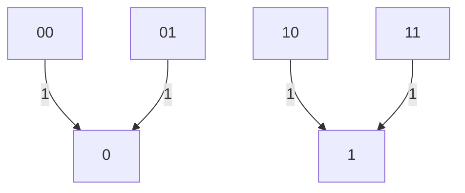
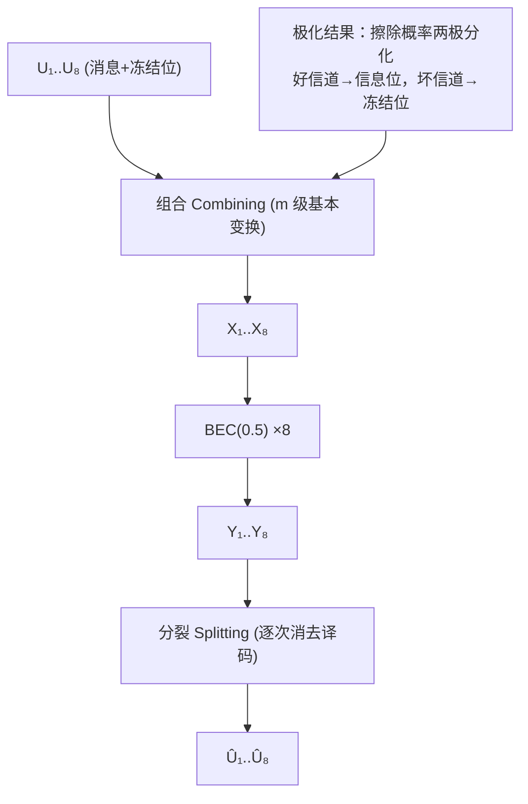
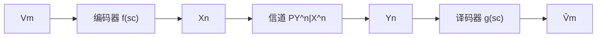

# 第 4 章 数据传输与信道容量 (Data Transmission and Channel Capacity)

> [!abstract] 本章主线
> 本章研究噪声信道上的**数据传输 (data transmission)** 编码：定义离散无记忆信道 (DMC) 及信道块码，证明 Shannon 信道编码定理——DMC 的操作容量恰等于信道容量 $C=\max_{P_X}I(X;Y)$（含随机编码正向证明与 Fano 不等式反向证明）；随后研究容量计算（对称/弱对称/拟对称信道、KKT 条件）、极化码，并证明无损联合信源信道编码定理与 Shannon 分离原理。

## 📝 本章摘要

- 噪声信道上可靠传输的极限由 **信道容量 (channel capacity)** $C=\max_{P_X}I(X;Y)$ 刻画：只要编码速率低于 $C$，就存在渐近可靠（错误概率趋于零）的块码；速率高于 $C$ 则错误概率有界远离零（**强反向**）。
- **Shannon 信道编码定理（定理 4.11）** 证明采用**随机编码 (random coding)**：码字按容量实现分布独立抽取，译码用联合典型集，期望错误概率可任意小，从而推出好码存在。
- 反向证明借助 **Fano 不等式 + 数据处理不等式**：$H(W|Y^n)\le1+P_e\log M_n$ 且 $I(X^n;Y^n)\le nC$，推出 $P_e$ 的下界。
- **容量计算**：对称/弱对称信道容量 $C=\log_2|\mathcal Y|-H(\text{行})$（均匀输入最优）；拟对称信道 $C=\sum_i a_iC_i$；一般信道用 **KKT 条件**（定理 4.25）判定达到容量的输入分布。
- **极化码 (polar codes)**（Arikan）通过信道"极化"把多个 BEC 用次变换成"完美/全噪"两级信道，可确定性地达到信道容量，已被 5G 标准采用。
- **Shannon 分离原理（定理 4.30）**：平稳遍历信源可可靠传输当且仅当熵率 $\bar H(\mathcal V)<C$，且分离（串联）的信源编码 + 信道编码与联合编码同样最优。

## 🧠 知识结构思维导图

```mermaid
graph TD
    DT["数据传输与信道容量"] --> DMC["DMC 定义 4.1/4.2"]
    DT --> CODE["信道块码 定义 4.4/4.5"]
    DT --> CCT["Shannon 信道编码定理 4.11"]
    DT --> CALC["容量计算 4.5"]
    DT --> POLAR["极化码 4.4"]
    DT --> JSCC["联合信源信道编码 4.6"]

    DMC --> BSC["BSC"]
    DMC --> BEC["BEC"]
    DMC --> BSEC["BSEC"]
    DMC --> QSC["q 元对称信道"]

    CODE --> PE["平均错误概率 Pe(Cn) 4.5"]
    CODE --> MAXPE["最大错误概率 λ(Cn) 4.6"]

    CCT --> FWD["正向：随机编码 + 联合典型集<br/>E[Pe]→0"]
    CCT --> CONV["反向：Fano 不等式 + DPI<br/>Pe ≥ 1 - (C+1/n)/((1/n)log Mn)"]
    CCT --> OPC["操作容量 Cop = C (定义 4.10)"]

    CALC --> SYM["对称/弱对称：C=log₂|𝒴|−H(行) 引理 4.16"]
    CALC --> QSYM["拟对称：C=Σ aᵢCᵢ 引理 4.21"]
    CALC --> KKT["KKT 条件 引理 4.25"]

    POLAR --> BASE["基本变换：Q→(Q⁻,Q⁺)<br/>ε⁻=1-(1-ε)², ε⁺=ε²"]
    POLAR --> POL["极化：组合 + 分裂 → 完美/全噪信道"]

    JSCC --> SEP["分离原理：H̄(𝒱)<C ⟺ 可靠传输 定理 4.30"]
    JSCC --> SEP2["分离编码 = 串联信源码 + 信道码"]
```



---

## 4.1 数据传输原理 (Principles of Data Transmission)

**噪声通信信道**是输入–输出介质，其输出并非完全或确定性地由输入决定。信道被随机建模：给定信道输入 $x$，信道输出 $y$ 由转移（条件）概率分布 $P_{Y|X}(y|x)$ 支配。由于两个不同输入可能产生同一输出，接收方收到输出后需要猜测最可能被发送的输入。一般而言，长度为 $n$ 的字被发送并接收；此时信道由一列 $n$ 维转移分布 $P_{Y^n|X^n}(y^n|x^n)$（$n=1,2,\dots$）刻画。无（输出）反馈的数据传输（信道编码）系统框图见图 4.1。


> [!tip] 图 4.1 结构解读
> 原书图 4.1：$W$ 为待传消息，$X^n$ 为对应 $W$ 的码字，$Y^n$ 为因信道输入 $X^n$ 收到的字，$\hat W$ 为从 $Y^n$ 重建的消息。上图 Mermaid 复现该链路。

数据传输码的设计者需从信道输入字（给定长度）集合中精心选择码字，使信道接收端获得最小歧义。例如设信道具有二元输入输出字母表，其转移分布对长度 2 的输入字诱导如下条件概率：

$$
P_{Y^2|X^2}(y=0|x^2=00)=1,\quad P_{Y^2|X^2}(y=0|x^2=01)=1,
$$
$$
P_{Y^2|X^2}(y=1|x^2=10)=1,\quad P_{Y^2|X^2}(y=1|x^2=11)=1.
$$

可用如下转移图表示：



[译者注：原图以两列节点表示 00/01/10/11 → 0/1 的确定映射。]

若需从发送方到接收方传输二元消息（事件 A 或 B），则码（事件 A → 码字 00，事件 B → 码字 10）在接收端引起的歧义显然小于码（事件 A → 码字 00，事件 B → 码字 01）。

**设计信道码的目标：** 把噪声信道转变成可靠介质，以最小损失发送消息并在接收端恢复。为此，信道码设计者需利用发送方与接收方共同部分中**最不受信道噪声影响**的部分。将看到这些共同部分被信道输入与输出之间的**互信息**在概率意义上刻画。

若适当选择"最不受噪声影响"的信道输入字子集作为码字集合，则待发消息可被任意小错误地可靠发送到接收方。由此提出问题：

> **在给定噪声信道上，每信道使用一次能可靠传输的最大信息量是多少？**

上例中可无误码传输二元消息，故可靠传输的信息量至少为每信道使用 1 bit（或信道符号）。可以预期：高噪声信道的可靠传输量应小于低噪声信道。但这种比较需要良好的信道"噪声程度"度量。

从信息论观点看，**"信道容量"** 提供了信道噪声程度的良好度量；它表示通过信道码在信道上传输并以任意小错误概率在接收端恢复的最大信息消息量（每信道使用）。除依赖信道转移分布外，信道容量还依赖于施加于信道输入的编码约束（如"只允许块（定长）码"）。本章研究**块码的信道容量**（即只用块传输码）[^1]。全章假设噪声信道无记忆（下节定义）。

[^1]: 关于对信道输入不加编码约束（从而可采用变长码）时信道容量的近期结果，见 [397]。

---

## 4.2 离散无记忆信道 (Discrete Memoryless Channels)

> [!definition] 定义 4.1 (离散信道, Definition 4.1)
> **离散通信信道**由以下构成：
>
> - 有限输入字母表 $\mathcal X$；
> - 有限输出字母表 $\mathcal Y$；
> - 一列 $n$ 维转移分布 $\{P_{Y^n|X^n}(y^n|x^n)\}_{n=1}^{\infty}$，使得对每个 $x^n=(x_1,\dots,x_n)\in\mathcal X^n$，$\sum_{y^n\in\mathcal Y^n}P_{Y^n|X^n}(y^n|x^n)=1$，其中 $y^n=(y_1,\dots,y_n)\in\mathcal Y^n$。
>
> 假设上述 $n$ 维分布序列是**一致的 (consistent)**，即对每个 $x^i,y^i$、$P_{X^{i+1}|X^i}$ 与 $i=1,2,\dots$：
>
> $$
> P_{Y^i|X^i}(y^i|x^i)=\sum_{\substack{x_{i+1}\in\mathcal X\\ y_{i+1}\in\mathcal Y}}P_{X^{i+1}|X^i}(x_{i+1}|x^i)P_{Y^{i+1}|X^{i+1}}(y^{i+1}|x^{i+1}).
> $$

一般地，现实通信信道表现出统计记忆——当前信道输出统计上依赖过去的输出以及过去、当前（可能还有未来）的输入。为简化，本章把注意力限制在**无记忆信道**类（有记忆信道的简要讨论见习题 4.27）。

> [!definition] 定义 4.2 (离散无记忆信道, Definition 4.2)
> **离散无记忆信道 (discrete memoryless channel, DMC)** 是其转移分布序列 $P_{Y^n|X^n}$ 满足
>
> $$
> P_{Y^n|X^n}(y^n|x^n)=\prod_{i=1}^n P_{Y|X}(y_i|x_i) \tag{4.2.1}
> $$
>
> 的信道，对每个 $n=1,2,\dots$、$x^n\in\mathcal X^n$、$y^n\in\mathcal Y^n$ 成立。换言之，DMC 完全由其大小为 $|\mathcal X|\times|\mathcal Y|$ 的**信道转移分布矩阵** $Q:=[p_{x,y}]$ 描述，其中
>
> $$
> p_{x,y}:=P_{Y|X}(y|x)\qquad(x\in\mathcal X,\ y\in\mathcal Y).
> $$
>
> 且矩阵 $Q$ 是**随机的**：每行元素之和等于 1（因对每个 $x\in\mathcal X$，$\sum_y p_{x,y}=1$）。

> [!note] Observation 4.3 (DMC 的等价条件)
> DMC 的条件 (4.2.1) 实际等价于以下两组条件 [29]：
>
> $$
> P_{Y_n|X^n,Y^{n-1}}(y_n|x^n,y^{n-1})=P_{Y|X}(y_n|x_n)\quad n=1,2,\dots \tag{4.2.2a}
> $$
>
> $$
> P_{Y^{n-1}|X^n}(y^{n-1}|x^n)=P_{Y^{n-1}|X^{n-1}}(y^{n-1}|x^{n-1})\quad n=2,3,\dots \tag{4.2.2b}
> $$
>
> 或等价地：
>
> $$
> P_{Y_n|X^n,Y^{n-1}}(y_n|x^n,y^{n-1})=P_{Y|X}(y_n|x_n)\quad n=1,2,\dots \tag{4.2.3a}
> $$
>
> $$
> P_{X_n|X^{n-1},Y^{n-1}}(x_n|x^{n-1},y^{n-1})=P_{X_n|X^{n-1}}(x_n|x^{n-1})\quad n=1,2,\dots \tag{4.2.3b}
> $$
>
> 条件 (4.2.2a) [同理 (4.2.3a)] 蕴含当前输出 $Y_n$ 只依赖当前输入 $X_n$，而不依赖过去的输入 $X^{n-1}$ 与输出 $Y^{n-1}$。条件 (4.2.2b) 表明过去的输出 $Y^{n-1}$ 不依赖当前输入 $X_n$。两条件合起来给出
>
> $$
> P_{Y^n|X^n}(y^n|x^n)=P_{Y^{n-1}|X^n}(y^{n-1}|x^n)P_{Y_n|X^n,Y^{n-1}}(y_n|x^n,y^{n-1})=P_{Y^{n-1}|X^{n-1}}(y^{n-1}|x^{n-1})P_{Y|X}(y_n|x_n),
> $$
>
> 从而对 $n=1,2,\dots$ 递归地成立 (4.2.1)。反向 [即 (4.2.1) 蕴含 (4.2.2a) 与 (4.2.2b)] 是如下两式的直接推论：
>
> $$
> P_{Y_n|X^n,Y^{n-1}}(y_n|x^n,y^{n-1})=\frac{P_{Y^n|X^n}(y^n|x^n)}{\sum_{y_n}P_{Y^n|X^n}(y^n|x^n)},\qquad
> P_{Y^{n-1}|X^n}(y^{n-1}|x^n)=\sum_{y_n}P_{Y^n|X^n}(y^n|x^n).
> $$
>
> 类似地，(4.2.3b) 表明当前输入 $X_n$ 独立于过去输出 $Y^{n-1}$，与 (4.2.3a) 一起再次导出 (4.2.1)。对 (4.2.3b) 的反向——(4.2.1) 蕴含 (4.2.3b)——可类似证明。
>
> **反馈的禁止：** 上述 (4.2.1) 的 DMC 定义禁止使用信道反馈——反馈允许当前信道输入是过去信道输出的函数（因此有反馈时 (4.2.2b) 与 (4.2.3b) 不能成立）。有反馈信道需要推广 (4.2.2a) 的**因果性条件**（见习题 4.28 或 [415, Definition 7.4]）。

**DMC 的例子：**

1. **恒等（无噪）信道：** 输入输出字母表大小相等（$|\mathcal X|=|\mathcal Y|$），转移概率满足 $P_{Y|X}(y|x)=1$（若 $y=x$），$0$（若 $y\ne x$）。这是无噪（完美）信道——信道输入在输出端无错接收。

2. **二元对称信道 (BSC)：** 二元输入输出字母表，每个输入以概率 $\epsilon$ 在输出端被反转，$\epsilon\in[0,1]$ 称为信道的**交叉概率 (crossover probability)** 或**误码率 (bit error rate)**。转移矩阵为
   $$
   Q=[p_{x,y}]=\begin{pmatrix}p_{0,0}&p_{0,1}\\ p_{1,0}&p_{1,1}\end{pmatrix}=\begin{pmatrix}1-\epsilon&\epsilon\\ \epsilon&1-\epsilon\end{pmatrix} \tag{4.2.4}
   $$
   可用图 4.2 的转移图表示。$\epsilon=0$ 时 BSC 退化为二元恒等（无噪）信道。称其"对称"因 $P_{Y|X}(1|0)=P_{Y|X}(0|1)$，即输入位翻转为 0 或 1 的概率相同。

   ```mermaid
   graph TD
       X0["0"] -->|"1-ε"| Y0["0"]
       X0 -->|"ε"| Y1["1"]
       X1["1"] -->|"ε"| Y0
       X1 -->|"1-ε"| Y1
   ```

   > [!tip] 图 4.2 结构解读
   > 上图 Mermaid 复现 BSC 转移图：$0\xrightarrow{1-\epsilon}0$、$0\xrightarrow{\epsilon}1$、$1\xrightarrow{\epsilon}0$、$1\xrightarrow{1-\epsilon}1$。

   尽管简单，BSC 足以刻画更一般信道编码问题的大部分复杂性。例如它能精确建模"二元对称调制 + 硬判决解调 + 加性无记忆高斯噪声"的实际信道行为（如 [407, p. 240]）。BSC 还可显式表示为二元模 2 加性噪声信道，其第 $i$ 时刻输出是输入与噪声变量的模 2 和：
   $$
   Y_i=X_i\oplus Z_i,\quad i=1,2,\dots \tag{4.2.5}
   $$
   其中 $\oplus$ 表示模 2 加法，$Y_i,X_i,Z_i$ 分别是第 $i$ 时刻的信道输出、输入与噪声，字母表 $\mathcal X=\mathcal Y=\mathcal Z=\{0,1\}$。在 (4.2.5) 中假设对任意 $i,j$，$X_i$ 与 $Z_j$ 独立，且噪声过程是 Bernoulli($\epsilon$) 过程——即 $\Pr[Z=1]=\epsilon$ 的二元 i.i.d. 过程。

3. **二元擦除信道 (BEC)：** 有些信道中部分输入位在传输中**丢失**而非被破坏（如数据网络中分组因拥塞或带宽限制被丢弃）。此时接收方知道这些位在接收比特流/码字中的确切位置，但不知道其实际值。这些位被声明为"**擦除 (erasure)**"。这给出图 4.3 的**二元擦除信道**：输入字母表 $\mathcal X=\{0,1\}$，输出字母表 $\mathcal Y=\{0,E,1\}$，其中 $E$ 表示擦除（可假设 $E$ 是严格大于 1 的实数），转移矩阵为
   $$
   Q=[p_{x,y}]=\begin{pmatrix}P_{Y|X}(0|0)&P_{Y|X}(E|0)&P_{Y|X}(1|0)\\ P_{Y|X}(0|1)&P_{Y|X}(E|1)&P_{Y|X}(1|1)\end{pmatrix}=\begin{pmatrix}1-\epsilon&0&\epsilon\\ \epsilon&0&1-\epsilon\end{pmatrix} \tag{4.2.6}
   $$
   其中 $0\le\epsilon\le1$ 是信道的**擦除概率**。与 BSC 类似，BEC 可显式表示为
   $$
   Y_i=X_i\cdot\mathbf 1_{\{Z_i\ne E\}}+E\cdot\mathbf 1_{\{Z_i=E\}},\quad i=1,2,\dots \tag{4.2.7}
   $$
   其中 $\mathbf 1_{\{Z_i=E\}}:=1$（若 $Z_i=E$）、$0$（若 $Z_i\ne E$）是集合 $\{Z_i=E\}$ 的指示函数，$Y_i,X_i,Z_i$ 分别是第 $i$ 时刻的信道输出、输入与擦除变量，字母表 $\mathcal X=\{0,1\}$、$\mathcal Z=\{0,E\}$、$\mathcal Y=\{0,1,E\}$。当擦除变量 $Z_i=E$ 时，$Y_i=E$，信道中发生擦除；当 $Z_i=0$ 时，$Y_i=X_i$，输入被完美接收。在 (4.2.7) 中假设 $X_i$ 与 $Z_j$ 对任意 $i,j$ 独立，且擦除过程 $\{Z_i\}$ 是 $\Pr[Z=E]=\epsilon$ 的 i.i.d. 过程。

   ```mermaid
   graph TD
       X0["0"] -->|"1-ε"| Y0["0"]
       X0 -->|"ε"| YE["E"]
       X1["1"] -->|"ε"| YE
       X1 -->|"1-ε"| Y1["1"]
   ```

   > [!tip] 图 4.3 结构解读
   > 上图 Mermaid 复现 BEC 转移图：$0\xrightarrow{1-\epsilon}0$、$0\xrightarrow{\epsilon}E$、$1\xrightarrow{\epsilon}E$、$1\xrightarrow{1-\epsilon}1$。

4. **带错误与擦除的二元信道 (BSEC)：** 组合 BSC 与 BEC 得图 4.4 的**二元对称擦除信道 (BSEC)**，转移矩阵为
   $$
   Q=[p_{x,y}]=\begin{pmatrix}p_{0,0}&p_{0,E}&p_{0,1}\\ p_{1,0}&p_{1,E}&p_{1,1}\end{pmatrix}=\begin{pmatrix}1-\alpha-\beta&0&\alpha\\ \alpha&0&1-\alpha-\beta\end{pmatrix} \tag{4.2.8}
   $$
   其中 $\alpha,\beta\in[0,1]$ 分别是信道的交叉与擦除概率，且 $\alpha+\beta\le1$。$\beta=0$ 时 BSEC 退化为 BSC；$\alpha=0$ 时退化为 BEC。与 BSC、BEC 类似，BSEC 可用噪声-擦除过程显式表达：
   $$
   Y_i=(X_i\oplus Z_i)\cdot\mathbf 1_{\{Z_i\ne E\}}+E\cdot\mathbf 1_{\{Z_i=E\}},\quad i=1,2,\dots \tag{4.2.9}
   $$
   其中 $\oplus$ 是模 2 加法，$\mathbf 1\{\cdot\}$ 是指示函数，$Y_i,X_i,Z_i$ 分别是第 $i$ 时刻的信道输出、输入与噪声-擦除变量，字母表 $\mathcal X=\{0,1\}$、$\mathcal Y=\mathcal Z=\{0,1,E\}$。当噪声-擦除变量 $Z_i=E$ 时擦除发生；$Z_i=0$ 时输入完美接收；$Z_i=1$ 时输入位出错。在 (4.2.9) 中假设 $X_i$ 与 $Z_j$ 独立，且 $\Pr[Z=E]=\beta$、$\Pr[Z=1]=\alpha$。
   > [!note] 注
   > 严格说，(4.2.9) 中 $Z=E$ 时 $X\oplus Z$ 未定义；但 $Z=E$ 时 $\mathbf 1_{\{Z=E\}}=0$，故用"未定义量乘零等于零"的约定补救。

   更一般地，信道不必具有"发送 0 或 1 时转移分布相同"的对称性。例如转移矩阵可为
   $$
   Q=[p_{x,y}]=\begin{pmatrix}1-\alpha-\beta&0&\alpha\\ \beta&0&1-\alpha-\beta\end{pmatrix}, \tag{4.2.10}
   $$
   其中一般 $\alpha\ne\beta$。称此类信道为**带错误与擦除的非对称信道**（该模型或可用于表示采用非对称/非均匀调制星座的实际信道）。

5. **q 元对称信道：** 对整数 $q\ge2$，q 元对称信道是 BSC 的非二元推广：字母表 $\mathcal X=\mathcal Y=\{0,1,\dots,q-1\}$ 大小为 $q$，转移矩阵为
   $$
   Q=[p_{x,y}]=\begin{pmatrix}1-\epsilon&\frac{\epsilon}{q-1}&\cdots&\frac{\epsilon}{q-1}\\ \frac{\epsilon}{q-1}&1-\epsilon&\cdots&\frac{\epsilon}{q-1}\\ \vdots&\vdots&\ddots&\vdots\\ \frac{\epsilon}{q-1}&\frac{\epsilon}{q-1}&\cdots&1-\epsilon\end{pmatrix}, \tag{4.2.11}
   $$
   其中 $0\le\epsilon\le1$ 是信道的**符号错误率**。$q=2$ 时退化为误码率 $\epsilon$ 的 BSC。
   
   与 BSC 类似，q 元对称信道可表示为模 q 加性噪声信道（输入、输出、噪声字母表相同 $\mathcal X=\mathcal Y=\mathcal Z=\{0,1,\dots,q-1\}$），第 $i$ 时刻输出 $Y_i=X_i\oplus_q Z_i$，其中 $\oplus_q$ 表示模 q 加法。噪声过程 $\{Z_n\}$ 假设为 i.i.d.，分布为 $\Pr[Z=0]=1-\epsilon$、$\Pr[Z=a]=\epsilon/(q-1)$（$a\in\{1,\dots,q-1\}$）。输入与噪声过程假设相互独立。

6. **q 元擦除信道：** 对整数 $q\ge2$，BEC 的非二元推广给出 q 元擦除信道：输入输出字母表 $\mathcal X=\{0,1,\dots,q-1\}$、$\mathcal Y=\{0,1,\dots,q-1,E\}$（$E$ 表示擦除），转移分布为
   $$
   P_{Y|X}(y|x)=\begin{cases}1-\epsilon,& y=x,\ x\in\mathcal X,\\ \epsilon,& y=E,\ x\in\mathcal X,\\ 0,& \text{否则},\end{cases} \tag{4.2.12}
   $$
   其中 $0\le\epsilon\le1$ 是擦除概率。$q=2$ 时退化为 BEC。相同的函数表示 (4.2.7) 也适用于该信道（$\{Z_i\}$ 是字母表 $\{0,E\}$ 的 i.i.d. 擦除过程）。BSEC 的非二元推广可类似得到。

---

## 4.3 DMC 上的数据传输块码 (Block Codes for Data Transmission Over DMCs)

> [!definition] 定义 4.4 (定长数据传输码, Definition 4.4)
> 给定正整数 $n$ 与 $M$（其中 $M=M_n$），以及输入字母表 $\mathcal X$、输出字母表 $\mathcal Y$ 的离散信道，该信道的、块长 $n$、速率 $\frac1n\log_2M$（消息 bit/信道符号 或信道使用）的**定长数据传输码（块码）** 记为 $\mathcal C_n=(n,M)$，由以下构成：
>
> 1. $M$ 个待传输的信息消息；
> 2. **编码函数** $f:\{1,2,\dots,M\}\to\mathcal X^n$，产生码字 $f(1),f(2),\dots,f(M)\in\mathcal X^n$，每个长度 $n$。这 $M$ 个码字的集合称为**码本 (codebook)**，也常写 $\mathcal C_n=\{f(1),f(2),\dots,f(M)\}$；
> 3. **译码函数** $g:\mathcal Y^n\to\{1,2,\dots,M\}$。
>
> 集合 $\{1,2,\dots,M\}$ 称为**消息集**，假设消息 $W$ 在消息集上服从均匀分布：$\Pr[W=w]=1/M$（$\forall w$）。信道码的框图见图 4.1：为在信道上传递消息 $W$，编码器发送对应码字 $X^n=f(W)$ 作为信道输入；最后在信道输出端收到 $Y^n$（按无记忆信道分布 $P_{Y^n|X^n}$），译码器给出消息估计 $\hat W=g(Y^n)$。

> [!definition] 定义 4.5 (平均错误概率, Definition 4.5)
> 在转移分布 $P_{Y^n|X^n}$ 的信道上使用、编码函数 $f(\cdot)$ 与译码函数 $g(\cdot)$ 的信道块码 $\mathcal C_n=(n,M)$ 的**平均错误概率**定义为
>
> $$
> P_e(\mathcal C_n):=\frac1M\sum_{w=1}^M\lambda_w(\mathcal C_n),
> $$
>
> 其中
>
> $$
> \lambda_w(\mathcal C_n):=\Pr[\hat W\ne W|W=w]=\Pr[g(Y^n)\ne w|X^n=f(w)]=\sum_{y^n\in\mathcal Y^n:g(y^n)\ne w}P_{Y^n|X^n}(y^n|f(w))
> $$
>
> 是给定消息 $w$ 在信道上发送时该码的条件译码错误概率。
>
> 由于假设消息 $W$ 从消息集均匀抽取，有 $P_e(\mathcal C_n)=\Pr[\hat W\ne W]$。

> [!note] Observation 4.6 (最大错误概率)
> 另一个更保守的错误准则**最大错误概率**
>
> $$
> \lambda(\mathcal C_n):=\max_{w\in\{1,\dots,M\}}\lambda_w(\mathcal C_n).
> $$
>
> 显然 $P_e(\mathcal C_n)\le\lambda(\mathcal C_n)$。可证明：从平均错误概率任意小的码 $\mathcal C_n=(n,M)$ 出发，通过丢弃 $\mathcal C_n$ 中条件错误概率最大的**一半**码字，可构造最大错误概率任意小、码率基本相同的码 $\mathcal C'_n=(n,M/2)$（$n\to\infty$；如 [83, p. 204]、[415, p. 163]）[^3]。因此为简化，评估信道块码"优劣/可靠性"[^4] 时只用 $P_e(\mathcal C_n)$；但须牢记下述结果（尤其信道编码定理）在 $\lambda(\mathcal C_n)$ 准则下也成立。
>
> [^3]: 该事实对已知转移分布（如定义 4.1）且在码字传输期间保持不变的**单用户信道**成立；但对码字传输期间统计描述可能逐符号以未知方式变化的单用户信道不成立。此类信道（包括"任意变化信道"类，见 [87, Chap. 2, Sect. 6]）不在本书范围。
> [^4]: 对块码用"优劣"或"可靠性"表示其（平均）错误概率随块长增大渐近消失。

**目标：** 寻找好的信道块码（或证明好码存在）。由（弱）大数定律视角，好的选择是根据信道输入与输出的**联合典型集**抽取码字——所有概率质量最终都集中在联合典型集上。译码失败仅发生在信道输入–输出对不在联合典型集中时，这蕴含译码错误概率最终很小。下面定义联合典型集。

> [!definition] 定义 4.7 (联合典型集, Definition 4.7)
> 关于无记忆分布 $P_{X^n,Y^n}(x^n,y^n)=\prod_{i=1}^nP_{X,Y}(x_i,y_i)$ 的**联合 $\epsilon$-典型 $n$ 元组对** $(x^n,y^n)$ 的集合 $\mathcal F_n(\epsilon)$ 定义为
>
> $$
> \mathcal F_n(\epsilon):=\left\{(x^n,y^n)\in\mathcal X^n\times\mathcal Y^n:\ \left|\frac{-1}{n}\log_2P_{X^n}(x^n)-H(X)\right|<\epsilon,\ \left|\frac{-1}{n}\log_2P_{Y^n}(y^n)-H(Y)\right|<\epsilon,\ \text{且}\ \left|\frac{-1}{n}\log_2P_{X^n,Y^n}(x^n,y^n)-H(X,Y)\right|<\epsilon\right\}.
> $$
>
> 简言之，按 $P_{X,Y}$ 独立抽取 $n$ 次产生的对 $(x^n,y^n)$ 是联合 $\epsilon$-典型的，若其联合与边缘经验熵分别 $\epsilon$-接近真实的联合与边缘熵。

> [!theorem] 定理 4.8 (联合 AEP, Theorem 4.8)
> 若 $(X_1,Y_1),(X_2,Y_2),\dots,(X_n,Y_n),\dots$ 是 i.i.d.，即 $\{(X_i,Y_i)\}$ 是相依 DMS 对，则
>
> $$
> \frac{-1}{n}\log_2P_{X^n}(X_1,X_2,\dots,X_n)\to H(X)\quad\text{依概率},
> $$
>
> $$
> \frac{-1}{n}\log_2P_{Y^n}(Y_1,Y_2,\dots,Y_n)\to H(Y)\quad\text{依概率},
> $$
>
> 且
>
> $$
> \frac{-1}{n}\log_2P_{X^n,Y^n}((X_1,Y_1),\dots,(X_n,Y_n))\to H(X,Y)\quad\text{依概率}
> $$
>
> （$n\to\infty$）。

> [!proof]- Proof
> 由弱大数定律即得所需结果。∎

> [!theorem] 定理 4.9 (配对版 Shannon–McMillan–Breiman 定理, Theorem 4.9)
> 给定联合熵 $H(X,Y)$ 的相依 DMS 对及任意 $\epsilon>0$，可选足够大的 $n$ 使联合 $\epsilon$-典型集满足：
>
> 1. 对足够大的 $n$，$P_{X^n,Y^n}\bigl(\mathcal F_n^c(\epsilon)\bigr)<\epsilon$；
> 2. $\mathcal F_n(\epsilon)$ 的元素数对足够大的 $n$ 至少为 $(1-\epsilon)2^{n(H(X,Y)-\epsilon)}$，对每个 $n$ 至多为 $2^{n(H(X,Y)+\epsilon)}$；
> 3. 若 $(x^n,y^n)\in\mathcal F_n(\epsilon)$，其出现概率满足 $2^{-n(H(X,Y)+\epsilon)}<P_{X^n,Y^n}(x^n,y^n)<2^{-n(H(X,Y)-\epsilon)}$。

> [!proof]- Proof
> 证明与上一章单个无记忆信源的 Shannon–McMillan–Breiman 定理非常相似，留作习题。∎

> [!definition] 定义 4.10 (操作容量, Definition 4.10)
> 若存在一列 $(n,M_n)$ 信道码 $\mathcal C_n$ 满足
>
> $$
> \liminf_{n\to\infty}\frac1n\log_2M_n\ge R\qquad\text{且}\qquad\lim_{n\to\infty}P_e(\mathcal C_n)=0,
> $$
>
> 则称速率 $R$ 对离散信道**可达 (achievable)**。信道的**操作容量 (operational capacity)** $C_{op}$ 是所有可达速率的上确界：
>
> $$
> C_{op}=\sup\{R:R\text{ 可达}\}.
> $$

本节至此到达本章主结果：DMC 的 Shannon 信道编码定理。它断言：对 DMC，操作容量 $C_{op}$ 实际等于某量 $C$，该量方便地称为**信道容量（信息容量）**，定义为信道互信息在其输入分布集合上的最大值（见下）。换言之，量 $C$ 正是所有可达信道码率的上确界，这按上确界的性质在定理中分两部分证明（见 Observation A.5）。因此，对给定 DMC，仅用信道转移矩阵 $Q$ 即可计算的量 $C$ 构成通过块码在此信道上可靠传输信息的最大速率。从而，只要速率低于 $C$ 且允许码块长足够大，就可能在固有噪声的 DMC 上以固定速率（不降低）可靠通信。

> [!theorem] 定理 4.11 (Shannon 信道编码定理, Theorem 4.11)
> 考虑有限输入字母表 $\mathcal X$、有限输出字母表 $\mathcal Y$、转移分布 $P_{Y|X}(y|x)$（$x\in\mathcal X$，$y\in\mathcal Y$）的 DMC。定义**信道容量**[^5]
>
> $$
> C:=\max_{P_X}I(X;Y)=\max_{P_X}I(P_X,P_{Y|X}),
> $$
>
> 其中最大值在全体输入分布 $P_X$ 上取得。则下列成立。
>
> - **正向部分（可达性）：** 对任意 $0<\epsilon<1$，存在 $\delta>0$ 及一列数据传输块码 $\{\mathcal C_n=(n,M_n)\}_{n=1}^{\infty}$，满足
>
>   $$
>   \liminf_{n\to\infty}\frac1n\log_2M_n\ge C-\delta
>   $$
>
>   且对足够大的 $n$，$P_e(\mathcal C_n)<\epsilon$。
>
> - **反向部分：** 对任意 $0<\epsilon<1$，任意满足
>
>   $$
>   \liminf_{n\to\infty}\frac1n\log_2M_n>C
>   $$
>
>   的数据传输块码序列 $\{\mathcal C_n=(n,M_n)\}$ 满足
>
>   $$
>   P_e(\mathcal C_n)>(1-\epsilon)\quad\text{对所有足够大的 }n, \tag{4.3.1}
>   $$
>
>   其中
>
>   $$
>   \eta=\left(1-\frac{C}{\liminf_n\frac1n\log_2M_n}\right)>0,
>   $$
>
>   即这些码的错误概率对所有足够大的 $n$ 有界远离零。

> [!note] 关于 $C$ 良定义性的注
> 互信息 $I(X;Y)$ 实际是输入统计 $P_X$ 与信道统计 $P_{Y|X}$ 的函数，可写为
>
> $$
> I(P_X,P_{Y|X})=\sum_{x\in\mathcal X}\sum_{y\in\mathcal Y}P_X(x)P_{Y|X}(y|x)\log_2\frac{P_{Y|X}(y|x)}{\sum_{x'\in\mathcal X}P_X(x')P_{Y|X}(y|x')}.
> $$
>
> 该式更便于计算信道容量。信道容量 $C$ 良定义，因为：对固定 $P_{Y|X}$，$I(P_X,P_{Y|X})$ 关于 $P_X$ 凹且连续（关于变分距离与欧氏（即 $L_2$）距离均连续 [415, Chap. 2]）；且由 $\mathcal X$ 有限，全体输入分布集合 $P_X$ 是 $\mathbb R^{|\mathcal X|}$ 的紧（闭且有界）子集。故存在 $P_X$ 达到互信息的上确界，最大值可达到。

> [!proof]- Proof (正向部分)
> 只需证明存在好块码序列（满足速率条件，即对某个 $\delta>0$，$\liminf_n\frac1n\log_2M_n\ge C-\delta$）且其平均错误概率最终小于 $\epsilon$。$C=0$ 时设 $M_n=1$ 正向平凡成立，故以下假设 $C>0$。
>
> 采用 Shannon 原创的**随机编码 (random coding)** 证明技术：好块码序列不是确定性构造的；其存在性通过证明：对块码序列类（系综）$\{\mathcal C_n\}$ 及其上的码选择分布 $\Pr[\mathcal C_n]$，平均错误概率在码选择分布下的期望值对足够大的 $n$ 可小于 $\epsilon$：
>
> $$
> \mathbb E_{\mathcal C_n}[P_e(\mathcal C_n)]=\sum_{\mathcal C_n}\Pr[\mathcal C_n]P_e(\mathcal C_n)\to0\quad(n\to\infty).
> $$
>
> 故其中必至少存在一个所需的好码序列（$P_e(\mathcal C_n)\to0$）。
>
> 固定 $\epsilon\in(0,1)$ 与某个 $\delta\in(0,\min\{4\epsilon,C\})$。存在 $N_0$ 使对 $n>N_0$ 可选整数 $M_n$ 满足
>
> $$
> C-\frac{\delta}{2}\le\frac1n\log_2M_n>C-\delta. \tag{4.3.2}
> $$
>
> （因只关心"足够大的 $n$"，只需考虑 $n>N_0$。）
>
> 定义 $\gamma:=\delta/8$。设 $P_{\hat X}$ 是达到信道容量的分布：$C=\max_{P_X}I(P_X,P_{Y|X})=I(P_{\hat X},P_{Y|X})$。记 $P_{\hat Y^n}$ 为由信道输入乘积分布 $P_{\hat X^n}$（$P_{\hat X^n}(x^n)=\prod_{i=1}^nP_{\hat X}(x_i)$）引起的信道输出分布：
>
> $$
> P_{\hat Y^n}(y^n)=\sum_{x^n\in\mathcal X^n}P_{\hat X^n,\hat Y^n}(x^n,y^n),
> $$
>
> 其中 $P_{\hat X^n,\hat Y^n}(x^n,y^n):=P_{\hat X^n}(x^n)P_{Y^n|X^n}(y^n|x^n)$（$\forall x^n,y^n$）。因 $P_{\hat X^n}$ 是乘积分布且信道无记忆，所得联合输入–输出过程 $\{(\hat X_i,\hat Y_i)\}$ 也无记忆，且
>
> $$
> P_{\hat X^n,\hat Y^n}(x^n,y^n)=\prod_{i=1}^nP_{\hat X,\hat Y}(x_i,y_i),\qquad
> P_{\hat X,\hat Y}(x,y)=P_{\hat X}(x)P_{Y|X}(y|x).
> $$
>
> 下面分三步证明。
>
> **第 1 步（码构造）：** 对任意块长 $n$，按分布 $P_{\hat X^n}(x^n)$ **有效回地 (with replacement)** 独立抽取 $M_n$ 个信道输入。对抽取的 $M_n$ 个信道输入（码本 $\mathcal C_n:=\{c_1,\dots,c_{M_n}\}$）定义编码函数 $f_n(\cdot)$ 与译码函数 $g_n(\cdot)$：
>
> $$
> f_n(m)=c_m\quad(1\le m\le M_n),
> $$
>
> 且
>
> $$
> g_n(y^n)=\begin{cases}m,& \text{若 }c_m\text{ 是 }\mathcal C_n\text{ 中唯一满足 }(c_m,y^n)\in\mathcal F_n(\gamma)\text{ 的码字},\\ \text{任意 }\{1,\dots,M_n\}\text{ 中一个},& \text{否则},\end{cases}
> $$
>
> 其中 $\mathcal F_n(\gamma)$ 按分布 $P_{\hat X^n,\hat Y^n}$ 定义（定义 4.7）。随机生成的码本总数为 $|\mathcal X|^{nM_n}$，选择每个码本的概率为
>
> $$
> \Pr[\mathcal C_n]=\prod_{m=1}^{M_n}P_{\hat X^n}(c_m).
> $$
>
> **第 2 步（条件错误概率）：** 对每个（随机生成的）码 $\mathcal C_n$，给定消息 $m$ 发送时的条件错误概率 $\lambda_m(\mathcal C_n)$ 可上界为
>
> $$
> \lambda_m(\mathcal C_n)\le\sum_{y^n\in\mathcal Y^n:(c_m,y^n)\notin\mathcal F_n(\gamma)}P_{Y^n|X^n}(y^n|c_m)+\sum_{\substack{m'=1\\m'\ne m}}^{M_n}\sum_{y^n\in\mathcal Y^n:(c_{m'},y^n)\in\mathcal F_n(\gamma)}P_{Y^n|X^n}(y^n|c_m), \tag{4.3.3}
> $$
>
> 其中 (4.3.3) 第一项考虑收到的信道输出 $y^n$ 与 $c_m$ 不联合 $\gamma$-典型的情形（译码规则 $g_n(\cdot)$ 可能造成错误猜测），第二项反映 $y^n$ 不仅与发送码字 $c_m$ 联合典型、还与另一码字 $c_{m'}$ 联合典型的情形（可能造成译码错误）。
>
> 对 (4.3.3) 关于第 $m$ 个码字选择分布 $P_{\hat X^n}(c_m)$ 取期望，得
>
> $$
> \begin{aligned}
> \sum_{c_m\in\mathcal X^n}P_{\hat X^n}(c_m)\lambda_m(\mathcal C_n)&\le\sum_{c_m}\sum_{y^n\notin\mathcal F_n(\gamma|c_m)}P_{\hat X^n}(c_m)P_{Y^n|X^n}(y^n|c_m)\\
> &\quad+\sum_{\substack{m'=1\\m'\ne m}}^{M_n}\sum_{c_m}\sum_{y^n\in\mathcal F_n(\gamma|c_m)}P_{\hat X^n}(c_m)P_{Y^n|X^n}(y^n|c_m)\\
> &=P_{\hat X^n,\hat Y^n}\bigl(\mathcal F_n^c(\gamma)\bigr)+\sum_{\substack{m'=1\\m'\ne m}}^{M_n}\sum_{c_m}\sum_{y^n\in\mathcal F_n(\gamma|c_m)}P_{\hat X^n,\hat Y^n}(c_m,y^n), \tag{4.3.4}
> \end{aligned}
> $$
>
> 其中 $\mathcal F_n(\gamma|x^n):=\{y^n\in\mathcal Y^n:(x^n,y^n)\in\mathcal F_n(\gamma)\}$。
>
> **第 3 步（平均错误概率）：** 分析平均错误概率在按 $\Pr[\mathcal C_n]$ 随机生成的全部码本系综上的期望并证明其随 $n\to\infty$ 消失。经一系列不等式（利用联合典型集定义与配对 SMB 定理 4.9）：
>
> $$
> \begin{aligned}
> \mathbb E_{\mathcal C_n}[P_e(\mathcal C_n)]&=P_{\hat X^n,\hat Y^n}\bigl(\mathcal F_n^c(\gamma)\bigr)\\
> &\quad+\frac1{M_n}\sum_{m=1}^{M_n}\sum_{\substack{m'=1\\m'\ne m}}^{M_n}\sum_{(c_m,y^n)\in\mathcal F_n(\gamma)}P_{\hat X^n}(c_m)P_{\hat Y^n}(y^n)\\
> &\le P_{\hat X^n,\hat Y^n}\bigl(\mathcal F_n^c(\gamma)\bigr)+M_n\cdot|\mathcal F_n(\gamma)|\cdot2^{-n(H(\hat X)-\gamma)}2^{-n(H(\hat Y)-\gamma)}\\
> &\le P_{\hat X^n,\hat Y^n}\bigl(\mathcal F_n^c(\gamma)\bigr)+M_n\cdot2^{n(H(\hat X,\hat Y)+\gamma)}2^{-n(H(\hat X)-\gamma)}2^{-n(H(\hat Y)-\gamma)}\\
> &=(M_n-1)2^{n(H(\hat X,\hat Y)+\gamma)}2^{-n(H(\hat X)-\gamma)}2^{-n(H(\hat Y)-\gamma)}\\
> &\le M_n\cdot2^{n(H(\hat X,\hat Y)+\gamma- H(\hat X)-H(\hat Y)+2\gamma)}\\
> &=M_n\cdot2^{-n(I(\hat X;\hat Y)-3\gamma)}\\
> &\le2^{n(C-\delta/2)}\cdot2^{-n(C-3\gamma)}\\
> &=2^{-n(\delta/2-3\gamma)}=2^{-n(4\gamma-3\gamma)}=2^{-n\gamma},\\
> \end{aligned}
> $$
>
> 其中各不等式分别来自：联合典型集定义、配对 SMB 定理 4.9（典型集大小界）、以及 $C=I(\hat X;\hat Y)$（$\hat X$、$\hat Y$ 的定义）与 $\frac1n\log_2M_n\le C-\delta/2=C-4\gamma$。故
>
> $$
> \mathbb E_{\mathcal C_n}[P_e(\mathcal C_n)]\le P_{\hat X^n,\hat Y^n}\bigl(\mathcal F_n^c(\gamma)\bigr)+2^{-n\gamma},
> $$
>
> 对足够大的 $n$（且 $n>N_0$），由配对 SMB 定理可使之小于 $2\gamma=\delta/4<\epsilon$。∎

> [!proof]- Proof (反向部分)
> 先回顾信道编码语境下的 Fano 不等式。对编码函数 $f_n:\{1,\dots,M_n\}\to\mathcal X^n$ 与译码函数 $g_n:\mathcal Y^n\to\{1,\dots,M_n\}$ 的 $(n,M_n)$ 信道块码，设消息 $W$ 均匀分布于 $\{1,\dots,M_n\}$，经码字 $X^n(W)=f_n(W)$ 在 DMC 上发送，$Y^n$ 在信道输出端收到，译码器估计 $\hat W=g_n(Y^n)$，估计错误概率为码的平均错误概率 $P_e(\mathcal C_n)$（$W$ 均匀）。则 Fano 不等式 (2.5.2) 给出
>
> $$
> H(W|Y^n)\le1+P_e(\mathcal C_n)\log_2(M_n-1)<1+P_e(\mathcal C_n)\log_2M_n. \tag{4.3.6}
> $$
>
> 对任意 $(n,M_n)$ 块信道码 $\mathcal C_n$，$W\to X^n\to Y^n$ 构成 Markov 链，由数据处理不等式：
>
> $$
> I(W;Y^n)\le I(X^n;Y^n). \tag{4.3.7}
> $$
>
> 还可用信道容量 $C$ 上界 $I(X^n;Y^n)$：
>
> $$
> I(X^n;Y^n)\le\max_{P_{X^n}}I(X^n;Y^n)\le\max_{P_{X^n}}\sum_{i=1}^nI(X_i;Y_i)\le\sum_{i=1}^n\max_{P_{X_i}}I(X_i;Y_i)=nC, \tag{4.3.8}
> $$
>
> 其中第二个不等式来自定理 2.21（条件独立性假设 $P_{Y^n|X^n}=\prod_iP_{Y_i|X_i}$ 由 DMC 满足）。
>
> 于是码 $\mathcal C_n$ 满足：
>
> $$
> \begin{aligned}
> \log_2M_n&=H(W)\quad(W\text{ 均匀})\\
> &=H(W|Y^n)+I(W;Y^n)\\
> &\le H(W|Y^n)+I(X^n;Y^n)\quad(\text{由 (4.3.7)})\\
> &\le H(W|Y^n)+nC\quad(\text{由 (4.3.8)})\\
> &<1+P_e(\mathcal C_n)\cdot\log_2M_n+nC.\quad(\text{由 (4.3.6)})
> \end{aligned}
> $$
>
> 这蕴含
>
> $$
> P_e(\mathcal C_n)>1-\frac{C+1/n}{(1/n)\log_2M_n}=1-\frac{C}{\frac1n\log_2M_n}-\frac{1}{n\log_2M_n}.
> $$
>
> 若 $\liminf_n\frac1n\log_2M_n\ge\frac{C}{1-\eta}$（对某个 $0<\eta<1$），则对任意 $0<\epsilon<1$ 存在整数 $N$ 使对 $n\ge N$，
>
> $$
> \frac1n\log_2M_n\ge\frac{C+1/n}{1-(1-\epsilon)}, \tag{4.3.9}
> $$
>
> 否则 (4.3.9) 对无穷多个 $n$ 被违反，与 $\liminf$ 矛盾。故对 $n\ge N$：
>
> $$
> P_e(\mathcal C_n)>1-[1-(1-\epsilon)]\cdot\frac{C+1/n}{C+1/n}=(1-\epsilon)>0.
> $$
>
> 即对足够大的 $n$，$P_e(\mathcal C_n)$ 有界远离零。∎

> [!note] Observation 4.12
> 上述信道编码定理（证明 $C_{op}=C$）的结果见图 4.5[^8]，其中 $\bar R=\liminf_n\frac1n\log_2M_n$（消息 bit/信道使用）通常称为信道块码的**渐近编码率**。如图：DMC 的任何好块码的渐近速率必须 ≤ 信道容量 $C$[^9]；反之，任何（渐近）速率大于 $C$ 的块码其错误概率将有界远离零。
>
> [^8]: 定理 4.11 实际蕴含 $R<C_{op}=C$ 时 $\lim_nP_e=0$、$R>C_{op}=C$ 时 $\liminf_nP_e>0$；这些性质对更一般的信道（非 DMC）可能不成立。对一般信道可能得到三个分区而非两个：$R<C_{op}$、$C_{op}<R<\bar C_{op}$、$R>\bar C_{op}$，分别对应最好块码 $\limsup_nP_e=0$、$\limsup_nP_e>0$ 但 $\liminf_nP_e=0$、以及所有信道码 $\liminf_nP_e>0$，其中 $\bar C_{op}$ 称信道的乐观操作容量 [394, 396]。对 DMC，$\bar C_{op}=C_{op}=C$，三区缩为两区。$\bar C_{op}$ 的广义（谱）互信息率公式见 [75]。
> [^9]: 由定理可见，只要 $(1/n)\log_2M_n$ 随 $n$ 增大从下方逼近 $C$（见 (4.3.2)），$C$ 即可作为渐近传输率达到。

> [!note] Observation 4.13 (零错误码)
> 在定理 4.11 的反向部分中证明了
>
> $$
> \liminf_{n\to\infty}P_e(\mathcal C_n)=0\implies\liminf_{n\to\infty}\frac1n\log_2M_n\le C. \tag{4.3.10}
> $$
>
> 现简要考察要求所有 $(n,M_n)$ 码 $\mathcal C_n$ 对任意块长 $n$ 完全无错（$P_e(\mathcal C_n)=0$，$\forall n$）的情形。此时 $H(W|Y^n)=0$，由数据处理不等式，对任意 $n$：
>
> $$
> \log_2M_n=H(W|Y^n)+I(W;Y^n)=I(W;Y^n)\le I(X^n;Y^n)\le nC.
> $$
>
> 故证明了
>
> $$
> P_e(\mathcal C_n)=0\ \forall n\implies\limsup_{n\to\infty}\frac1n\log_2M_n\le C,
> $$
>
> 这是比 (4.3.10) 更强的结果。

> [!note] 信道编码理论的注记
> Shannon 信道编码定理（1948 [340]）为噪声信道上的可靠通信提供了最终极限。但它没有提供好码的显式高效构造——从随机生成码的系综中搜索好码极其复杂，其规模随块长双指数增长（见正向证明第 1 步）。这催生了整个**编码理论**领域：过去数十年致力于构造接近容量极限的强力纠错码。对**线性码（群码）**类有特别进展——其丰富[^10]而优雅简洁的代数结构使其适合高效的实用编解码。此类码包括 Hamming、Golay、Bose–Chaudhuri–Hocquenghem (BCH)、Reed–Muller、Reed–Solomon 与卷积码。1993 年 Berrou 等 [44, 45] 引入 **Turbo 码**，实验证明对无记忆信道类性能接近容量极限。随后 Gallager 的 **LDPC 码** [133, 134, 251, 252] 被重新发现并实现类似近容量性能。更近的突破是 Arikan 在 2007 年发明的**极化码** [22, 23]，提供可证明达到信道容量的确定性码构造（下节给出 BEC 的简要示例）。
>
> [^10]: 确实存在可达到加性噪声无记忆信道容量（含 BSC 与 q 元对称信道）的线性码，如 [87, p. 114]。

---

## 4.4 BEC 的极化码示例 (Example of Polar Codes for the BEC)

**极化编码**是 Arikan [22, 23] 提出的新信道编码方法，可证明达到任意"容量由均匀输入分布实现"的二元输入无记忆信道 $Q$ 的容量（如拟对称信道）。其证明技术与码构造具有低编解码复杂度，纯粹基于信息论概念。为简洁，只聚焦擦除概率为 $\epsilon$ 的 BEC，记为 BEC($\epsilon$)。

**极化码的核心思想——信道"极化 (polarization)"：** 把 BEC($\epsilon$) 的多次独立使用（恰为 $n$ 次，$n$ 为编码块长[^11]）变换成极端的"极化"信道——即要么**完美（无噪）**、要么**完全有噪**的信道。可证明：当 $n\to\infty$ 时，未极化信道数收敛到 0，完美信道比例收敛到 $I(X;Y)=1-\epsilon$（均匀输入下），这正是 BEC 的容量。极化码自然构造：让信息位直接通过完美信道发送，让已知位（通常称**冻结位 (frozen bits)**）通过完全有噪信道发送。

[^11]: 回忆信道编码中长度为 $n$ 的码字通常通过连续使用信道 $n$ 次（即串联）发送。但极化编码采用等价方法：使用 $n$ 个相同且独立的信道副本并联，每个信道只使用一次。

**$n=2$ 的最简单情形（基本变换）：** 图 4.6a 的变换称**基本变换**。有两个独立的 BEC($\epsilon$) 使用 $(X_1,Y_1)$、$(X_2,Y_2)$，每 bit 以概率 $\epsilon$ 被擦除。在均匀分布的 $X_1,X_2$ 下，
$$
I(Q):=I(X_1;Y_1)=I(X_2;Y_2)=1-\epsilon.
$$

考虑图 4.6 的线性模 2 运算：

$$
X_1=U_1\oplus U_2,\qquad X_2=U_2,
$$

其中 $U_1,U_2$ 表示均匀分布独立消息位。译码器执行**逐次消去译码 (successive cancellation decoding)**：先从接收的 $(Y_1,Y_2)$ 译出 $U_1$，再基于 $(Y_1,Y_2)$ 与先前译出的 $U_1$ 译出 $U_2$（假设译码正确）。这产生两个新信道——"更差"信道 $Q^-$ 与"更好"信道 $Q^+$：

$$
Q^-:\ U_1\to(Y_1,Y_2),\qquad Q^+:U_2\to(Y_1,Y_2,U_1).
$$

注意单独正确接收 $Y_1=X_1$ 不足以确定 $U_1$——$U_2$ 是与 $U_1$ 独立的均匀随机变量。真正需要同时有 $Y_1=X_1$ 与 $Y_2=X_2$ 才能正确译出 $U_1$。这一观察意味着 $Q^-$ 是擦除概率[^12]
$$
\epsilon^-:=1-(1-\epsilon)^2
$$
的 BEC。类似地，给定 $U_1$，$Y_1=X_1$ 或 $Y_2=X_2$ 任一足够确定 $U_2$，故 $Q^+$ 是擦除概率 $\epsilon^+:=\epsilon^2$ 的 BEC。

[^12]: 更准确地说，$Q^-$ 与 BEC 行为相同，把其输出对 $(y_1,y_2)$ 重标号为等价三值符号 $y_{1,2}$ 后可精确转换为 BEC：
> $$
> y_{1,2}=\begin{cases}0,& (y_1,y_2)\in\{(0,0),(1,1)\},\\ E,& (y_1,y_2)\in\{(0,E),(1,E),(E,E),(E,0),(E,1)\},\\ 1,& (y_1,y_2)\in\{(0,1),(1,0)\}.\end{cases}
> $$
> 对 $Q^+$ 可作类似转换。

总体上有
$$
I(Q^+)+I(Q^-)=I(U_2;Y_1,Y_2,U_1)+I(U_1;Y_1,Y_2)=(1-\epsilon^2)+[1-(1-(1-\epsilon)^2)]=2(1-\epsilon)=2I(Q), \tag{4.4.1}
$$
且
$$
(1-\epsilon)^2=I(Q^-)\le I(Q)=1-\epsilon\le I(Q^+)=1-\epsilon^2, \tag{4.4.2}
$$
等号当且仅当 $(1-\epsilon)=0$（即 $\epsilon=0$ 或 $\epsilon=1$）。(4.4.1) 表明基本变换在互信息上无损失；(4.4.2) 确认 $Q^+$、$Q^-$ 分别优于、劣于 $Q$[^13]。

[^13]: 同样的推理可用于两个独立但不同分布的 BEC 的基本变换（图 4.6b），此时 $Q^+$ 与 $Q^-$ 分别成为 BEC($\epsilon_1\epsilon_2$) 与 BEC($1-(1-\epsilon_1)(1-\epsilon_2)$)。该推广在多阶段组合信道独立使用（尤其第二阶段后两个信道可能变得不同分布）时可能有用。例 4.14 中每阶段只组合同分布 BEC，这是极化编码的典型设计。

**$n=4$：** 设对 (i.i.d. 均匀) 消息位 $(U_1,U_2,U_3,U_4)$ 执行两次基本变换：
$$
Q^-:V_1\to(Y_1,Y_2),\ X_1=V_1\oplus V_2;\quad Q^+:V_2\to(Y_1,Y_2,V_1),\ X_2=V_2;
$$
$$
Q^-:V_3\to(Y_3,Y_4),\ X_3=V_3\oplus V_4;\quad Q^+:V_4\to(Y_3,Y_4,V_3),\ X_4=V_4,
$$
其中 $V_1=U_1\oplus U_2$、$V_3=U_2$、$V_2=U_3\oplus U_4$、$V_4=U_4$。两个 $Q^-$ 信道擦除概率相同（$\epsilon^-$），两个 $Q^+$ 信道也相同（$\epsilon^+$），故可再取两个 $Q^-$ 信道执行基本变换产生新信道：$Q^{--}:U_1\to(Y_1,Y_2,Y_3,Y_4)$（擦除概率 $\epsilon^{--}:=1-(1-\epsilon^-)^2$）与 $Q^{-+}:U_2\to(Y_1,Y_2,Y_3,Y_4,U_1)$（擦除概率 $\epsilon^{-+}:=(\epsilon^-)^2$）。类似用两个 $Q^+$ 信道形成 $Q^{+-}$（$\epsilon^{+-}:=1-(1-\epsilon^+)^2$）与 $Q^{++}$（$\epsilon^{++}:=(\epsilon^+)^2$）。

**极化的关键属性：** 不必在此停止——可继续利用该属性，直到所有信道最终要么很好（完美）、要么很坏（完全有噪）。极化编码术语中：用多个基本变换从 $U_1,\dots,U_n$ 得到 $X_1,\dots,X_n$（$U_i$ 为 i.i.d. 均匀消息随机变量）的过程称信道"**组合 (combining)**"；用 $Y_1,\dots,Y_n$ 与 $U_1,\dots,U_{i-1}$ 得到 $U_i$（$i\in\{1,\dots,n\}$）的过程称信道"**分裂 (splitting)**"。合起来称信道"**极化 (polarization)**"。

**构造极化码：** 对块长 $n=2^m$、$2^k$ 个码字（即每个二元消息字长 $k$）的极化码，执行 $m$ 级信道极化，把不编码的 $k$ 个消息位经互信息最大的 $k$ 个位置发送，其余 $n-k$ 个位置填入冻结位；该编码过程恰为信道组合。译码器基于 $(Y_1,\dots,Y_n)$ 与先前译出的 $\hat U_j$（$j<i$）逐次译出 $U_i$（$i\in\{1,\dots,n\}$），称**逐次消去译码器**，它模拟信道极化过程中分裂的行为。

> [!example] 例 4.14 (Example 4.14)
> 考虑擦除概率 $\epsilon=0.5$ 的 BEC，$n=8$。极化过程见图 4.7。因 BEC($\epsilon$) 在均匀输入下的互信息恰为 $1-\epsilon$，可等价地跟踪擦除概率（图 4.7 中括号内数值）。现构造 (8,4) 极化码：选 4 个互信息最大（即擦除概率最小）的位置，即 $(U_4,U_6,U_7,U_8)$ 发送不编码位，其余位置冻结。
>
> 擦除概率计算示例：$T_2$ 处 0.5625 由 $0.75\times0.75$ 得到（$V_1$ 与 $V_3$ 上方的数值）；组合 $T_1$ 与 $T_2$ 得 $1-(1-0.9375)(1-0.9375)\approx0.9961$，即 $U_1$ 上方的数值。

> [!note] 极化码的意义与现状
> 自 Arikan [22, 23] 发明以来，极化码引发广泛兴趣（见 [25, 26, 226, 228, 329, 371, 372] 及其中文献）。其盛行的关键原因：它们是第一个具有显式低复杂度构造结构、且在码长趋于无穷时能达到信道容量的编码方案。更重要的是，极化码不表现出 Turbo 码与（程度较轻的）LDPC 码容易出现的**错误平层 (error floor)** 行为。实践中因极化级数不可能无限多，总存在未极化信道；对实用块长极化码的有效构造与译码方法研究活跃。因这些优点，极化码于 2016 年被 3GPP 采纳为第 5 代 (5G) 移动通信标准控制信道的纠错码 [99]。
>
> 极化概念并不限于信道编码，也可用于信源编码及其他信息论问题，包括保密与多用户系统（如 [24, 148, 226, 227, 256]）。



> [!tip] 图 4.7 结构解读
> 原书图 4.7 展示 Q=BEC(0.5)、n=8 的信道极化：每个 $U_i$ 经多级变换（$V_j$、$T_k$ 中间节点）对应一个带擦除概率的信道，擦除概率越小的信道越适合送信息位。本例选中 $U_4,U_6,U_7,U_8$（对应擦除概率最小）。上图 Mermaid 概括整体流程。

---

## 4.5 计算信道容量 (Calculating Channel Capacity)

给定有限输入字母表 $\mathcal X$、有限输出字母表 $\mathcal Y$、大小为 $|\mathcal X|\times|\mathcal Y|$ 的信道转移矩阵 $Q=[p_{x,y}]$（$p_{x,y}:=P_{Y|X}(y|x)$）的 DMC，希望计算

$$
C:=\max_{P_X}I(X;Y),
$$

其中最大化在输入分布 $P_X$ 集合上进行（良定义），$I(X;Y)$ 是信道输入与输出的互信息。

$C$ 可通过非线性优化技术数值确定——如 Arimoto [27] 与 Blahut [49, 51] 的迭代算法（另见 [88] 与 [415, Chap. 9]）。一般而言 $C$ 没有闭式（单字母）解析表达式。但对许多"简化"信道，可在信道转移矩阵的某种"对称性"性质下解析确定 $C$。

### 4.5.1 对称、弱对称与拟对称信道

> [!definition] 定义 4.15 (Definition 4.15)
> 有限输入字母表 $\mathcal X$、有限输出字母表 $\mathcal Y$、转移矩阵 $Q=[p_{x,y}]$ 的 DMC 称为**对称的 (symmetric)**，若 $Q$ 的行互相为置换、且列互相为置换。信道称为**弱对称的 (weakly symmetric)**，若 $Q$ 的行互相为置换、且 $Q$ 的所有列和相等。

由定义直接可知对称蕴含弱对称。对称 DMC 的例子：BSC、q 元对称信道，以及如下三元信道（$\mathcal X=\mathcal Y=\{0,1,2\}$）：

$$
Q=\begin{pmatrix}P_{Y|X}(0|0)&P_{Y|X}(1|0)&P_{Y|X}(2|0)\\ P_{Y|X}(0|1)&P_{Y|X}(1|1)&P_{Y|X}(2|1)\\ P_{Y|X}(0|2)&P_{Y|X}(1|2)&P_{Y|X}(2|2)\end{pmatrix}=\begin{pmatrix}0.4&0.1&0.5\\ 0.5&0.4&0.1\\ 0.1&0.5&0.4\end{pmatrix}.
$$

如下 $|\mathcal X|=|\mathcal Y|=4$ 的 DMC 是弱对称（但非对称）的：

$$
Q=\begin{pmatrix}0.5&0.25&0.25&0\\ 0&0.5&0.25&0.25\\ 0.25&0&0.5&0.25\\ 0&0.25&0.25&0.5\end{pmatrix} \tag{4.5.1}
$$

注意以上信道转移矩阵都是方阵；强调 $Q$ 可以是矩形而仍满足对称/弱对称性质。例如 $|\mathcal X|=2$、$|\mathcal Y|=4$ 的 DMC
$$
Q=\begin{pmatrix}\frac{1-\epsilon}{2}&\frac{1-\epsilon}{2}&\frac{\epsilon}{2}&\frac{\epsilon}{2}\\ \frac{\epsilon}{2}&\frac{\epsilon}{2}&\frac{1-\epsilon}{2}&\frac{1-\epsilon}{2}\end{pmatrix} \tag{4.5.2}
$$
是对称的（$\epsilon\in[0,1]$）；而 $|\mathcal X|=2$、$|\mathcal Y|=3$ 的 DMC
$$
Q=\begin{pmatrix}\frac13&\frac16&\frac12\\ \frac13&\frac12&\frac16\end{pmatrix}
$$
是弱对称的。

> [!lemma] 引理 4.16 (Lemma 4.16)
> 弱对称信道 $Q$ 的容量由**均匀输入分布**达到，且为
>
> $$
> C=\log_2|\mathcal Y|-H(q_1,q_2,\dots,q_{|\mathcal Y|}), \tag{4.5.3}
> $$
>
> 其中 $(q_1,q_2,\dots,q_{|\mathcal Y|})$ 表示 $Q$ 的任一行，且
>
> $$
> H(q_1,\dots,q_{|\mathcal Y|}):=-\sum_{i=1}^{|\mathcal Y|}q_i\log_2q_i
> $$
>
> 是行熵。

> [!proof]- Proof
> 信道输入与输出的互信息为
>
> $$
> I(X;Y)=H(Y)-H(Y|X)=H(Y)-\sum_{x\in\mathcal X}P_X(x)H(Y|X=x),
> $$
>
> 其中 $H(Y|X=x)=-\sum_{y\in\mathcal Y}P_{Y|X}(y|x)\log_2P_{Y|X}(y|x)$。
>
> 因 $Q$ 的每行是其余行的置换，$H(Y|X=x)$ 与 $x$ 无关，可写 $H(Y|X=x)=H(q_1,\dots,q_{|\mathcal Y|})$。故
>
> $$
> H(Y|X)=\sum_xP_X(x)H(q_1,\dots,q_{|\mathcal Y|})=H(q_1,\dots,q_{|\mathcal Y|})\sum_xP_X(x)=H(q_1,\dots,q_{|\mathcal Y|}).
> $$
>
> 于是
>
> $$
> I(X;Y)=H(Y)-H(q_1,\dots,q_{|\mathcal Y|})\le\log_2|\mathcal Y|-H(q_1,\dots,q_{|\mathcal Y|}),
> $$
>
> 等号当且仅当 $Y$ 在 $\mathcal Y$ 上均匀分布。下面证明取均匀输入分布 $P_X(x)=1/|\mathcal X|$（$\forall x$）给出均匀输出分布，从而最大化互信息。事实上在均匀输入下，对任意 $y\in\mathcal Y$：
>
> $$
> P_Y(y)=\sum_{x\in\mathcal X}P_X(x)P_{Y|X}(y|x)=\frac1{|\mathcal X|}\sum_xp_{x,y}=\frac{A}{|\mathcal X|},
> $$
>
> 其中 $A:=\sum_xp_{x,y}$ 由弱对称性质知与 $y$ 无关（$Q$ 的所有列和相同）。由 $\sum_yP_Y(y)=1$ 得 $\sum_y\frac{A}{|\mathcal X|}=1$，即
>
> $$
> A=\frac{|\mathcal X|}{|\mathcal Y|}. \tag{4.5.4}
> $$
>
> 于是 $P_Y(y)=\frac{A}{|\mathcal X|}=\frac{|\mathcal X|}{|\mathcal Y|}\cdot\frac1{|\mathcal X|}=\frac1{|\mathcal Y|}$（$\forall y\in\mathcal Y$）。故均匀输入诱导均匀输出并达到 (4.5.3) 的信道容量。∎

> [!note] Observation 4.17
> 若弱对称信道有方阵（即 $|\mathcal X|=|\mathcal Y|$）转移矩阵 $Q$，则 $Q$ 是**双随机矩阵 (doubly stochastic)**——行和与列和都等于 1。但有方阵转移矩阵并不必然使弱对称信道成为对称的，例如 (4.5.1)。

> [!example] 例 4.18 (BSC 的容量, Example 4.18)
> 交叉概率 $\epsilon$ 的 BSC 对称，由引理 4.16 直接得容量由均匀输入达到：
>
> $$
> C=\log_2(2)-H(1-\epsilon,\epsilon)=1-h_b(\epsilon), \tag{4.5.5}
> $$
>
> 其中 $h_b(\cdot)$ 是二元熵函数。

> [!example] 例 4.19 (q 元对称信道的容量, Example 4.19)
> 符号错误率 $\epsilon$ 的 q 元对称信道对称，由引理 4.16：
>
> $$
> C=\log_2 q-H\!\left(1-\epsilon,\frac{\epsilon}{q-1},\dots,\frac{\epsilon}{q-1}\right)=\log_2 q+\epsilon\log_2\frac{\epsilon}{q-1}+(1-\epsilon)\log_2(1-\epsilon).
> $$
>
> $q=2$ 时容量等于 BSC 的（符合预期）；$\epsilon=0$ 时信道退化为恒等（无噪）q 元信道，容量为 $C=\log_2 q$。

可进一步弱化弱对称性质，定义一类"**拟对称 (quasi-symmetric)**"信道，均匀输入仍达到容量且容量有简单闭式。

> [!definition] 定义 4.20 (Definition 4.20)
> 有限输入字母表 $\mathcal X$、有限输出字母表 $\mathcal Y$、转移矩阵 $Q=[p_{x,y}]$ 的 DMC 称为**拟对称的**，若 $Q$ 可沿其列划分为 $m$ 个弱对称子矩阵 $Q_1,Q_2,\dots,Q_m$（对某整数 $m\ge1$），每个子矩阵 $Q_i$ 大小为 $|\mathcal X|\times|\mathcal Y_i|$，其中 $\mathcal Y_1\cup\cdots\cup\mathcal Y_m=\mathcal Y$ 且 $\mathcal Y_i\cap\mathcal Y_j=\varnothing$（$i\ne j$，$i,j=1,\dots,m$）。

拟对称是最弱的对称性概念：弱对称信道显然拟对称（只需取 $m=1$）。因此有 对称 ⟹ 弱对称 ⟹ 拟对称。

> [!lemma] 引理 4.21 (Lemma 4.21)
> 如上定义的拟对称信道 $Q$ 的容量由均匀输入分布达到，且为
>
> $$
> C=\sum_{i=1}^m a_iC_i, \tag{4.5.6}
> $$
>
> 其中
>
> $$
> a_i:=\sum_{y\in\mathcal Y_i}p_{x,y}=\text{ }Q_i\text{ 中任一行之和},\quad i=1,\dots,m,
> $$
>
> 且
>
> $$
> C_i=\log_2|\mathcal Y_i|-H\!\left(\text{矩阵 }\frac1{a_i}Q_i\text{ 的任一行}\right),\quad i=1,\dots,m
> $$
>
> 是第 $i$ 个弱对称"子信道"的容量，其转移矩阵由把 $Q_i$ 每个元素乘以 $1/a_i$ 得到（该归一化使子矩阵 $Q_i$ 成为随机矩阵，从而成为信道转移矩阵）。

> [!proof]- Proof
> 首先观察到对每个 $i=1,\dots,m$，$a_i$ 与输入值 $x$ 无关——子矩阵 $i$ 弱对称（任一行是其余行的置换），故 $a_i$ 是 $Q_i$ 中任一行之和。
>
> 对每个 $i=1,\dots,m$ 定义
>
> $$
> P_{Y_i|X}(y|x):=\begin{cases}\dfrac{p_{x,y}}{a_i},& y\in\mathcal Y_i\text{ 且 }x\in\mathcal X,\\ 0,& \text{否则},\end{cases}
> $$
>
> 其中 $Y_i$ 是取值于 $\mathcal Y_i$ 的随机变量。容易验证 $[P_{Y_i|X}(y|x)]$ 是随机矩阵（对每个 $x$，$\sum_y\frac{p_{x,y}}{a_i}=\frac{a_i}{a_i}=1$），故 $\left[\frac1{a_i}Q_i\right]$ 是弱对称"子信道"（输入字母表 $\mathcal X$、输出字母表 $\mathcal Y_i$）的转移矩阵。记 $I(X;Y_i)$ 为其互信息。因每个子信道弱对称，由引理 4.16 其容量
>
> $$
> C_i=\max_{P_X}I(X;Y_i)=\log_2|\mathcal Y_i|-H\!\left(\text{矩阵 }\frac1{a_i}Q_i\text{ 的任一行}\right),
> $$
>
> 最大值由均匀输入达到。
>
> 原拟对称信道 $Q$ 的输入输出互信息可写为
>
> $$
> \begin{aligned}
> I(X;Y)&=\sum_{y\in\mathcal Y}\sum_{x\in\mathcal X}P_X(x)p_{x,y}\log_2\frac{p_{x,y}}{\sum_{x'}P_X(x')p_{x',y}}\\
> &=\sum_{i=1}^m\sum_{y\in\mathcal Y_i}\sum_{x\in\mathcal X}a_iP_X(x)\frac{p_{x,y}}{a_i}\log_2\frac{\frac{p_{x,y}}{a_i}}{\sum_{x'}P_X(x')\frac{p_{x',y}}{a_i}}\\
> &=\sum_{i=1}^m a_i\sum_{y\in\mathcal Y_i}\sum_{x\in\mathcal X}P_X(x)P_{Y_i|X}(y|x)\log_2\frac{P_{Y_i|X}(y|x)}{\sum_{x'}P_X(x')P_{Y_i|X}(y|x')}\\
> &=\sum_{i=1}^m a_iI(X;Y_i).
> \end{aligned}
> $$
>
> 故信道 $Q$ 的容量为
>
> $$
> C=\max_{P_X}I(X;Y)=\max_{P_X}\sum_{i=1}^m a_iI(X;Y_i)=\sum_{i=1}^m a_i\max_{P_X}I(X;Y_i)=\sum_{i=1}^m a_iC_i,
> $$
>
> 其中第二个等号成立因相同的均匀 $P_X$ 使每个 $I(X;Y_i)$ 都达到最大。∎

> [!example] 例 4.22 (BEC 的容量, Example 4.22)
> 擦除概率 $\epsilon$ 的 BEC 是拟对称的（但既非弱对称也非对称）。其转移矩阵可沿列划分为两个对称（从而弱对称）子矩阵
>
> $$
> Q_1=\begin{pmatrix}1-\epsilon&0\\ 0&1-\epsilon\end{pmatrix},\qquad Q_2=\begin{pmatrix}\epsilon\\ \epsilon\end{pmatrix}.
> $$
>
> 应用引理 4.21 的拟对称容量公式，BEC 容量为 $C=a_1C_1+a_2C_2$，其中 $a_1=1-\epsilon$、$a_2=\epsilon$，
>
> $$
> C_1=\log_2(2)-H(1,0)=1-0=1,\qquad C_2=\log_2(1)-H(1)=0.
> $$
>
> 故
>
> $$
> C=(1-\epsilon)(1)+(\epsilon)(0)=1-\epsilon. \tag{4.5.7}
> $$

> [!example] 例 4.23 (BSEC 的容量, Example 4.23)
> 交叉概率 $\alpha$、擦除概率 $\beta$ 的 BSEC 拟对称；其转移矩阵可沿列划分为两个对称子矩阵
>
> $$
> Q_1=\begin{pmatrix}1-\alpha-\beta&0\\ \alpha&0\\ \alpha&0\\ 0&1-\alpha-\beta\end{pmatrix}\ \text{（重排）},\qquad Q_2=\begin{pmatrix}\beta\\ \beta\end{pmatrix}.
> $$
>
> 由引理 4.21，容量 $C=a_1C_1+a_2C_2$，其中 $a_1=1-\beta$、$a_2=\beta$，
>
> $$
> C_1=\log_2(2)-H\!\left(\frac{1-\alpha-\beta}{1-\beta},\frac{\alpha}{1-\beta}\right)=1-h_b\!\left(\frac{\alpha}{1-\beta}\right),\qquad C_2=0.
> $$
>
> 故
>
> $$
> C=(1-\beta)\left[1-h_b\!\left(\frac{\alpha}{1-\beta}\right)\right]+(\beta)(0)=(1-\beta)\left[1-h_b\!\left(\frac{\alpha}{1-\beta}\right)\right]. \tag{4.5.8}
> $$
>
> 如前所述，BSEC 是误码率 $\alpha$ 的 BSC 与擦除概率 $\beta$ 的 BEC 的组合。$\beta=0$ 时 (4.5.8) 给出 $C=1-h_b(\alpha)$（BSC 容量）；$\alpha=0$ 时给出 $C=1-\beta$（BEC 容量）。

> [!tip] 图 4.4 结构解读
> 原书图 4.4 为 BSEC 转移图：$0\xrightarrow{1-\alpha-\beta}0$、$0\xrightarrow{\beta}E$、$1\xrightarrow{\beta}E$、$1\xrightarrow{1-\alpha-\beta}1$（另含 $\alpha$ 交叉概率）。结构同图 4.3，仅交叉概率非零。

### 4.5.2 信道容量的 Karush–Kuhn–Tucker 条件

当信道不满足任何对称性质时，如下计算信道容量的**充要 Karush–Kuhn–Tucker (KKT) 条件**（参见附录 B.8、[135, pp. 87–91] 或 [46, 56]）很有用。

> [!definition] 定义 4.24 (特定输入符号的互信息, Definition 4.24)
> 特定输入符号的互信息定义为
>
> $$
> I(x;Y):=\sum_{y\in\mathcal Y}P_{Y|X}(y|x)\log_2\frac{P_{Y|X}(y|x)}{P_Y(y)}.
> $$
>
> 由上述定义，互信息变为
>
> $$
> I(X;Y)=\sum_{x\in\mathcal X}P_X(x)\sum_{y\in\mathcal Y}P_{Y|X}(y|x)\log_2\frac{P_{Y|X}(y|x)}{P_Y(y)}=\sum_{x\in\mathcal X}P_X(x)I(x;Y).
> $$

> [!lemma] 引理 4.25 (信道容量的 KKT 条件, Lemma 4.25)
> 对给定 DMC，输入分布 $P_X$ 达到信道容量当且仅当存在常数 $C$ 使得
>
> $$
> I(x;Y)=C\quad\forall x\in\mathcal X\ \text{且 }P_X(x)>0; \tag{4.5.9a}
> $$
>
> $$
> I(x;Y)\le C\quad\forall x\in\mathcal X\ \text{且 }P_X(x)=0. \tag{4.5.9b}
> $$
>
> 且该常数 $C$ 正是信道容量（这证实用记号 $C$ 的合理性）。

> [!proof]- Proof
> 正向（if）部分直接成立，只证反向（only-if）。不失一般性假设对所有 $x\in\mathcal X$ 有 $P_X(x)<1$（某 $x$ 处 $P_X(x)=1$ 意味着 $I(X;Y)=0$）。计算信道容量问题即最大化
>
> $$
> I(X;Y)=\sum_{x\in\mathcal X}\sum_{y\in\mathcal Y}P_X(x)P_{Y|X}(y|x)\log_2\frac{P_{Y|X}(y|x)}{\sum_{x'\in\mathcal X}P_X(x')P_{Y|X}(y|x')}, \tag{4.5.10}
> $$
>
> 约束为
>
> $$
> \sum_{x\in\mathcal X}P_X(x)=1. \tag{4.5.11}
> $$
>
> 用拉格朗日乘子法（见附录 B.8 或 [46]），在约束 (4.5.11) 下最大化 (4.5.10) 等价于最大化
>
> $$
> f(P_X):=\sum_{x\in\mathcal X}\sum_{y\in\mathcal Y}P_X(x)P_{Y|X}(y|x)\log_2\frac{P_{Y|X}(y|x)}{\sum_{x'\in\mathcal X}P_X(x')P_{Y|X}(y|x')}+\lambda\left(\sum_{x\in\mathcal X}P_X(x)-1\right).
> $$
>
> 对 $P_X(x^*)$ 求导得[^15]
>
> $$
> \frac{\partial f(P_X)}{\partial P_X(x^*)}=I(x^*;Y)-\log_2(e)+\lambda.
> $$
>
> 由引理 2.46 性质 2，$I(X;Y)=I(P_X,P_{Y|X})$ 关于 $P_X$ 凹（固定 $P_{Y|X}$）。因此当 $P_X(x)$ 不在边界（即 $1>P_X(x)>0$）时，$I(P_X,P_{Y|X})$ 的最大出现在导数为零处。对处于边界（即 $P_X(x)=0$）的 $P_X(x)$，最大当且仅当从边界向内部移动使量减小，即导数非正：
>
> $$
> I(x;Y)\le\lambda-\log_2(e)\quad\text{（对 }P_X(x)=0\text{ 的 }x\text{）}.
> $$
>
> 总结：若输入分布 $P_X$ 达到信道容量，则
>
> $$
> I(x;Y)=\lambda-\log_2(e)\quad\text{（对 }P_X(x)>0\text{）};\qquad I(x;Y)\le\lambda-\log_2(e)\quad\text{（对 }P_X(x)=0\text{）}.
> $$
>
> 令 $C=\lambda-\log_2(e)$ 即得 (4.5.9)。最后，把 (4.5.9) 中每个方程两边乘以 $P_X(x)$ 并对 $x$ 求和，左边得到 $\max_{P_X}I(X;Y)$、右边得到常数 $C$，从而证明常数 $C$ 确为信道容量。∎
>
> [^15]: 求导细节：对 $P_X(x^*)$ 求导，第一项经 $\frac{\partial}{\partial P_X(x^*)}\sum_xP_X(x)\log_2P_{Y|X}(y|x)=\log_2P_{Y|X}(y|x^*)$、第二项经对分母求导与 $\log_2(e)\frac{P_Y(y|x^*)}{P_Y(y)}$ 的抵消，最终得到 $I(x^*;Y)-\log_2(e)+\lambda$。

> [!example] 例 4.26 (拟对称信道, Example 4.26)
> 对拟对称信道，可直接验证均匀输入分布满足引理 4.25 的 KKT 条件并给出 (4.5.6) 的容量（留作习题）。如前所述，BSC、q 元对称信道、BEC 与 BSEC 都是拟对称的。

> [!example] 例 4.27 (Example 4.27)
> 考虑三元输入字母表 $\mathcal X=\{0,1,2\}$、二元输出字母表 $\mathcal Y=\{0,1\}$、转移矩阵
>
> $$
> Q=\begin{pmatrix}1&0\\ \frac12&\frac12\\ 0&1\end{pmatrix}
> $$
>
> 的 DMC。该信道不拟对称。但可猜测容量由输入分布 $(P_X(0),P_X(1),P_X(2))=(\frac12,0,\frac12)$ 达到——因为输入 $x=1$ 被接收为 0 或 1 的条件概率相等。在此输入分布下，$I(x=0;Y)=I(x=2;Y)=1$，$I(x=1;Y)=0$。于是 (4.5.9) 的 KKT 条件满足，从而确认上述输入分布达到信道容量，且容量等于 1 bit。

> [!note] Observation 4.28 (均匀输入达到容量的信道类)
> 存在比拟对称信道类更大的 DMC 类，其均匀输入分布达到容量。它涉及所谓"$T$-对称"信道类 [319, Sect. 5, Definition 1]，对此类信道
>
> $$
> T(x):=I(x;Y)-\log_2|\mathcal X|=\sum_{y\in\mathcal Y}P_{Y|X}(y|x)\log_2\frac{P_{Y|X}(y|x)}{\sum_{x'\in\mathcal X}P_{Y|X}(y|x')}
> $$
>
> 是 $x$ 的常数函数（即与 $x$ 无关），其中 $I(x;Y)$ 是均匀输入分布下输入 $x$ 的互信息。事实上 $T$-对称条件等价于"均匀输入分布达到容量"这一性质，这可从引理 4.25 的 KKT 条件直接推出。一个非拟对称的 $T$-对称信道例子是如下二元输入三元输出信道：
>
> $$
> Q=\begin{pmatrix}\frac13&\frac13&\frac13\\ \frac16&\frac13&\frac12\end{pmatrix}.
> $$
>
> 其容量由均匀输入分布达到。更多 $T$-对称信道例子见 [319, Fig. 2]。但与拟对称信道不同，$T$-对称信道一般不承认容量的简单闭式表达式（如 (4.5.6) 那种）。

---

## 4.6 无损联合信源信道编码与 Shannon 分离原理 (Lossless Joint Source-Channel Coding and Shannon's Separation Principle)

下面建立 Shannon 的**无损联合信源信道编码定理**[^16]，它为任何通信系统给出用其信源与信道信息论量表达的显式（且可直接验证）条件，在该条件下信源可被可靠传输（即错误概率渐近消失）。定理由两部分组成：(i) 正向部分——若信源的最小可达压缩（源编码）率严格小于信道容量，则可通过 **rate-one 信源信道块码** 在信道上可靠发送信源；(ii) 反向部分——若信源的最小可达压缩率严格大于信道容量，则无法通过 rate-one 信源信道块码在信道上可靠发送信源。定理（经小修改）还有更一般的版本：任意速率（不必为 1）信源信道块码下信源的可靠可传输性。

[^16]: 该定理有时也称无损信息传输定理。

**分离原理的得名：** 这个关键定理通常称为 Shannon 的**信源信道分离定理/原理**。理由：其一，定理中可靠可传输性的充要条件是完全"可分离""可解耦"的信息量——信源的最小压缩率与信道的容量，没有同时依赖信源与信道的量；这可视作"**函数分离**"性质。其二，正向证明（如将看到）由恰当组合 Shannon 源编码定理（定理 3.6 或 3.15）与信道编码定理（定理 4.11）构成，表明可靠可传输性可通过把信源信道编码函数**分离（分解）**成两个独立构想、串联施行的信源编码与信道编码操作来实现——信源码只依赖信源统计，信道码只是信道统计的函数。即"**操作分离**"：图 4.8 的分离（串联/两级）信源信道编码方案在（渐近可靠可传输性意义上）与图 4.9 更一般的联合信源信道编码方案（编码操作可包含针对信源与信道共同设计的组合（单级）码，或协调设计的联合信源信道码）一样好。


> [!tip] 图 4.8 结构解读
> 原书图 4.8 为分离（串联）信源信道编码方案：信源 → 信源编码器 → 信道编码器 → $X^n$ → 信道 → $Y^n$ → 信道译码器 → 信源译码器 → 信宿。上图 Mermaid 复现。


> [!tip] 图 4.9 结构解读
> 原书图 4.9 为联合信源信道编码方案：信源 → 编码器（联合设计）→ $X^n$ → 信道 → $Y^n$ → 译码器 → 信宿。上图 Mermaid 复现。

综合以上事实与定理反向部分——除"信源最小可达压缩率恰好等于信道容量"这一未解决情形外——意味着：要么信源的信道可靠可传输性可通过分离信源信道编码达到（在可传输性条件下），要么完全不可达。这为定理命名为分离原理提供了理由。

证明定理时，假设正向部分信源**平稳遍历**[^17]、反向部分信源**仅平稳**，信道为 DMC。定理可推广到更一般的信源与有记忆信道（见 [75, 96, 394]）。

[^17]: 此类信源的最小可达压缩率由熵率给出，见定理 3.15。

> [!definition] 定义 4.29 (信源信道块码, Definition 4.29)
> 给定有限字母表 $\mathcal V$ 的离散信源 $\{V_i\}_{i=1}^{\infty}$ 与有限输入输出字母表 $\mathcal X,\mathcal Y$ 的离散信道 $\{P_{Y^n|X^n}\}_{n=1}^{\infty}$，速率 $\frac{m}{n}$（源符号/信道符号）的 **m-to-n 信源信道块码** $\mathcal C_{m,n}$ 是一对映射 $(f^{(sc)},g^{(sc)})$[^18]：
>
> $$
> f^{(sc)}:\mathcal V^m\to\mathcal X^n,\qquad g^{(sc)}:\mathcal Y^n\to\mathcal V^m.
> $$
>
> 该码的操作见图 4.10：信源 $m$ 元组 $V^m$ 经信源信道编码函数 $f^{(sc)}$ 编码，得信道输入码字 $X^n=f^{(sc)}(V^m)$；信道输出 $Y^n$（仅通过 $X^n$ 依赖 $V^m$，即 $V^m\to X^n\to Y^n$ 构成 Markov 链）经 $g^{(sc)}$ 译码得信源元组估计 $\hat V^m=g^{(sc)}(Y^n)$。
>
> 若 $V^m\ne\hat V^m$，译码器出错，码的错误概率为
>
> $$
> P_e(\mathcal C_{m,n}):=\Pr[V^m\ne\hat V^m]=\sum_{v^m\in\mathcal V^m}\sum_{y^n\in\mathcal Y^n:g^{(sc)}(y^n)\ne v^m}P_{V^m}(v^m)P_{Y^n|X^n}(y^n|f^{(sc)}(v^m)).
> $$
>
> [^18]: 注意 $n=n_m$，即信道块长 $n$ 一般是信源块长 $m$ 的函数；$f^{(sc)}=f_m^{(sc)}$、$g^{(sc)}=g_m^{(sc)}$ 隐式依赖 $m$。



> [!tip] 图 4.10 结构解读
> 上图 Mermaid 复现 m-to-n 块信源信道编码系统：$V^m\to X^n\to Y^n\to\hat V^m$。

下面证明信源 $m$ 元组通过 $m$ 元组码字或 $m$ 次信道使用传输（即 $n=m$，或 rate-one 信源信道块码）时的无损联合信源信道编码定理。信源假设有记忆（如下），信道无记忆。

> [!theorem] 定理 4.30 (rate-one 块码的无损联合信源信道编码定理, Theorem 4.30)
> 考虑有限字母表 $\mathcal V$、熵率[^19] $\bar H(\mathcal V)$ 的离散信源 $\{V_i\}$ 与输入字母表 $\mathcal X$、输出字母表 $\mathcal Y$、容量 $C$ 的 DMC，其中 $\bar H(\mathcal V)$ 与 $C$ 以相同单位计量（即使用相同的对数底）。则下列成立。
>
> - **正向部分（可达性）：** 对任意 $0<\epsilon<1$，且信源平稳遍历，若
>
>   $$
>   \bar H(\mathcal V)<C,
>   $$
>
>   则存在一列 rate-one 信源信道码 $\{\mathcal C_{m,m}\}_{m=1}^{\infty}$ 使对足够大的 $m$，$P_e(\mathcal C_{m,m})<\epsilon$。
>
> - **反向部分：** 对任意 $0<\epsilon<1$，且信源平稳，若
>
>   $$
>   \bar H(\mathcal V)>C,
>   $$
>
>   则任意 rate-one 信源信道码序列 $\{\mathcal C_{m,m}\}_{m=1}^{\infty}$ 满足对足够大的 $m$，
>
>   $$
>   P_e(\mathcal C_{m,m})>(1-\epsilon), \tag{4.6.1}
>   $$
>
>   其中 $\eta=\bar H_D(\mathcal V)-C_D$，$D=|\mathcal V|$，$\bar H_D(\mathcal V)$ 与 $C_D$ 是以 D 进制数位计量的熵率与信道容量。即这些码的错误概率有界远离零，无法以任意低错误概率通过 rate-one 信源信道块码在信道上传输信源。
>
> [^19]: 假设信源熵率如下述存在。

> [!proof]- Proof (正向部分)
> 不失一般性，假设熵率 $\bar H(\mathcal V)$ 与信道容量 $C$ 都以 **nat** 计量（都用自然对数表达）。
>
> 将用图 4.8 的分离（串联/两级）信源信道编码方案证明所需 rate-one 码 $\mathcal C_{m,m}$ 的存在。
>
> 令 $\Delta:=C-\bar H(\mathcal V)>0$。对任意 $0<\epsilon<1$，由平稳遍历信源的无损源编码定理（定理 3.15），存在一列块长 $m$、大小 $M_m$ 的信源码（编码器 $f_s:\mathcal V^m\to\{1,\dots,M_m\}$，译码器 $g_s:\{1,\dots,M_m\}\to\mathcal V^m$），使
>
> $$
> \frac1m\log M_m<\bar H(\mathcal V)+\Delta/2 \tag{4.6.2}
> $$
>
> 且对足够大的 $m$，
>
> $$
> \Pr[g_s(f_s(V^m))\ne V^m]<\epsilon/2.
> $$
>
> 又由最大错误概率准则下的信道编码定理（见 Observation 4.6 与定理 4.11），存在一列块长 $m$、大小 $\tilde M_m$ 的信道码（编码器 $f_c:\{1,\dots,\tilde M_m\}\to\mathcal X^m$，译码器 $g_c:\mathcal Y^m\to\{1,\dots,\tilde M_m\}$），使
>
> $$
> \frac1m\log\tilde M_m>C-\Delta/2=\bar H(\mathcal V)+\Delta/2>\frac1m\log M_m \tag{4.6.5}
> $$
>
> 且对足够大的 $m$，
>
> $$
> \lambda:=\max_{w\in\{1,\dots,\tilde M_m\}}\Pr[g_c(Y^m)\ne w|X^m=f_c(w)]<\epsilon/2.
> $$
>
> 现在串联上述信源码与信道码形成信源信道码。具体地，m-to-m 信源信道码 $\mathcal C_{m,m}$ 的编码–译码对 $(f^{(sc)},g^{(sc)})$ 为
>
> $$
> f^{(sc)}:\mathcal V^m\to\mathcal X^m,\quad f^{(sc)}(v^m)=f_c(f_s(v^m))\ \ (\forall v^m),
> $$
>
> 与
>
> $$
> g^{(sc)}(y^m)=\begin{cases}g_s(g_c(y^m)),& g_c(y^m)\in\{1,\dots,M_m\},\\ \text{任意},& \text{否则},\end{cases}\quad(\forall y^m).
> $$
>
> 上述构造可行因 $\{1,\dots,M_m\}\subseteq\{1,\dots,\tilde M_m\}$。信源信道码的错误概率可按"是否发生信道译码错误"分情形分析：
>
> $$
> \begin{aligned}
> P_e(\mathcal C_{m,m})&=\Pr[g^{(sc)}(Y^m)\ne V^m]\\
> &=\Pr[g_s(g_c(Y^m))\ne V^m,\ g_c(Y^m)=f_s(V^m)]+\Pr[g^{(sc)}(Y^m)\ne V^m,\ g_c(Y^m)\ne f_s(V^m)]\\
> &\le\Pr[g_s(f_s(V^m))\ne V^m]+\Pr[g_c(Y^m)\ne f_s(V^m)]\\
> &\le\Pr[g_s(f_s(V^m))\ne V^m]+\lambda\\
> &<\epsilon/2+\epsilon/2=\epsilon
> \end{aligned}
> $$
>
> 对足够大的 $m$ 成立。因此只要 $\bar H(\mathcal V)<C$，就可通过 rate-one 块信源信道码在信道上可靠发送信源。∎

> [!proof]- Proof (反向部分)
> 为简洁，本证明中假设 $\bar H(\mathcal V)$ 与 $C$ 以 bit 计量。
>
> 对任意 m-to-m 信源信道码 $\mathcal C_{m,m}$，可写
>
> $$
> \begin{aligned}
> \bar H(\mathcal V)&\le\frac1mH(V^m) \tag{4.6.6}\\
> &=\frac1mH(V^m|\hat V^m)+\frac1mI(V^m;\hat V^m) \tag{4.6.7}\\
> &\le P_e(\mathcal C_{m,m})\log_2|\mathcal V|+\frac1m+\frac1mI(X^m;Y^m) \tag{4.6.8}\\
> &\le P_e(\mathcal C_{m,m})\log_2|\mathcal V|+\frac1m+C, \tag{4.6.9}
> \end{aligned}
> $$
>
> 其中
>
> - (4.6.6) 因平稳信源 $(1/m)H(V^m)$ 关于 $m$ 非增且 $m\to\infty$ 时收敛到 $\bar H(\mathcal V)$（见 Observation 3.12）；
> - (4.6.7) 由 Fano 不等式 $H(V^m|\hat V^m)\le P_e\log_2(|\mathcal V|^m)+h_b(P_e)\le P_e\log_2(|\mathcal V|^m)+1$；
> - (4.6.8) 由数据处理不等式（$V^m\to X^m\to Y^m\to\hat V^m$ 构成 Markov 链）；
> - (4.6.9) 由 (4.3.8)（信道为 DMC）。
>
> 上述推导中信息量都以 bit 计量。由此，对足够大的 $m$：
>
> $$
> P_e(\mathcal C_{m,m})\ge\frac{\bar H(\mathcal V)-C}{\log_2|\mathcal V|}-\frac1{m\log_2|\mathcal V|}=\bar H_D(\mathcal V)-C_D-\frac{\log_D(2)}{m\log_2|\mathcal V|}\ge(1-\epsilon)\eta,
> $$
>
> 即错误概率有界远离零，rate-one 信源信道块码无法以任意低错误概率传输信源。∎

> [!note] Observation 4.31
> 关于上述联合信源信道编码定理的注记：
>
> - 一般而言，当 $\bar H(\mathcal V)=C$ 时（即使信源为 DMS），不知信源能否在 DMC 上（渐近）可靠传输。原因：定理正向部分用分离信源信道编码证明，且信源编码率从上方逼近熵率 [见 (4.6.2)]、信道编码率从下方逼近容量 [见 (4.6.5)]。
> - 上述定理对 DMS 直接成立（任何 DMS 平稳且遍历）。
> - 可把定理正向部分的要求"信源平稳遍历"换成更一般的"信源信息稳定"[^23]。注意时不变不可约 Markov 信源（不必平稳）是信息稳定的。
>
> [^23]: 信息稳定信源的定义见 [75, 96, 303, 394]，其性质略广于定理 3.14 的广义 AEP 性质。

上述无损联合信源信道编码定理可轻易推广到 m-to-n 信源信道码（即速率不必为 1）如下（其证明与前一定理类似，留作习题）。

> [!theorem] 定理 4.32 (一般速率块码的无损联合信源信道编码定理, Theorem 4.32)
> 考虑有限字母表 $\mathcal V$、熵率 $\bar H(\mathcal V)$ 的离散信源 $\{V_i\}$ 与输入字母表 $\mathcal X$、输出字母表 $\mathcal Y$、容量 $C$ 的 DMC，其中 $\bar H(\mathcal V)$ 与 $C$ 以相同单位计量。则下列成立。
>
> - **正向部分（可达性）：** 对任意 $0<\epsilon<1$，且信源平稳遍历，若
>
>   $$
>   \limsup_{m\to\infty}\frac{m}{n_m}\cdot\frac{\bar H(\mathcal V)}{?}<C\ \text{（即 }\limsup_m\frac{m}{n_m}\bar H(\mathcal V)<C\text{）},
>   $$
>
>   则存在一列 m-to-$n_m$ 信源信道码 $\{\mathcal C_{m,n_m}\}_{m=1}^{\infty}$ 使对足够大的 $m$，$P_e(\mathcal C_{m,n_m})<\epsilon$。
>
> - **反向部分：** 对任意 $0<\epsilon<1$，且信源平稳，任意满足
>
>   $$
>   \liminf_{m\to\infty}\frac{m}{n_m}\bar H(\mathcal V)>C
>   $$
>
>   的 m-to-$n_m$ 信源信道码序列 $\{\mathcal C_{m,n_m}\}$ 满足对足够大的 $m$，$P_e(\mathcal C_{m,n_m})>(1-\epsilon)$（对某个依赖于 $\liminf_m\frac{m}{n_m}$、$\bar H(\mathcal V)$ 与 $C$ 的正常数 $\eta$）。即这些码的错误概率有界远离零，无法以任意低错误概率通过 m-to-$n_m$ 信源信道块码在信道上传输信源。

> [!tip] 定理 4.32 中的速率条件
> 原书以"lim sup $m/n_m\cdot\bar H(\mathcal V)<C$"（对应反向"lim inf $m/n_m\cdot\bar H(\mathcal V)>C$"）表述。此处"?"是原文排版占位，实际条件为"每信道符号可承载的信源熵率 $\frac{m}{n_m}\bar H(\mathcal V)$ 小于信道容量 $C$"。

**讨论：分离编码与联合编码**

Shannon 分离原理已成为大多数现代通信系统的关键支柱：信源编码与信道编码方案分别构造（信源（相应信道）码只考虑信源（相应信道）特性）、串联应用，在无限编码时延与复杂度下不牺牲可靠可传输性意义上的最优性。这正是一般分别研究信源编码/数据压缩（如 [42, 142, 158, 290, 326, 330]）与信道编码（如 [208, 248, 254, 321, 407]）实践的理由。此外，通过解耦信源与信道编码操作，分离编码提供系统模块化与灵活性等诱人性质。例如，若需在同一信道上发送不同信源，用分离编码只需修改信源码而保持信道码不变（类似地，单个信源要经不同信道通信时，只需适配信道码）。

然而实际实现中，极长编码块长要付出时延与复杂度代价（尤其时延与复杂度约束苛刻的系统，如无线通信系统）。首先注意：对"冗余度大的信源 + 噪声大的信道"组合，联合信源信道编码可能预期带来改进——因为此类系统中，分离编码需要先做信源编码去冗余、再做信道编码加冗余。一个自然猜想是：即使允许块长无限增长，这也不是最高效的做法。事实上 Shannon [340] 如此表述：

> "…然而，信源中的任何冗余通常都会有用，若在接收端加以利用。特别是，若信源已有一定冗余且不试图在匹配信道时消除它，此冗余将帮助对抗噪声。例如在无噪电报信道中，通过恰当编码消息可节省约 50% 的时间；但实际并未这样做，英文的大部分冗余保留在信道符号中。这却带来允许信道有相当噪声的优点：相当一部分字母可被错误接收而仍由上下文重建。事实上在许多情况下这很可能接近理想的近似…"

关于联合与分离信源信道编码的优劣，做以下观察：

- **有限块长/复杂度下**，许多研究证明联合信源信道编码可提供优于分离编码的性能（如 [13, 14, 37, 100, 127, 200, 247, 410, 427] 及其中文献）。
- **即使在无限块长**（分离编码在可靠可传输性上最优）下，可证明对一大类系统，联合信源信道编码可实现**错误指数 (error exponent)**[^24] 两倍于分离编码 [422–424]。这表明可通过联合信源信道编码实现与分离编码相同的性能、同时把编码时延减半（该结果在二元信源经高斯噪声、衰落与输出量化信道传输时，可转化为超过 2 dB 的功率节省 [422]）。这些发现为"相对分离编码采用联合信源信道编码"提供了信息论依据。
- **多用户系统**：除某些网络拓扑 [173, 383, 425] 分离最优外，分离定理一般不对多用户（多终端）系统成立（参见 [81, 83, 106, 174]），故此类系统中执行联合信源信道编码更有利。

[^24]: 编码系统的错误指数或可靠性函数，是其译码错误概率随编码块长无限增长的指数衰减速率的最大值 [51, 87, 95, 107, 114, 135, 177, 178, 205, 347, 348]。粗略地说，错误指数是满足"好码译码错误概率约 $e^{-nE}$（大块长 $n$）"的数 $E$。除揭示给定编码速率下最优码错误概率与块长的基本权衡、提供最优码行为洞见外，该函数还提供证明编码定理可达性部分的强力工具（如 [135]）、比较竞争编码方案的性能（如权衡联合与分离编码 [422]）、用于通信系统设计 [194]。

联合信源信道编码的研究最早可追溯到 1960 年代。多年来许多工作引入联合信源信道编码技术，并说明其对给定源信道条件、固定复杂度/时延约束下相对分离编码的益处（性能改进与对信道噪声变化鲁棒性增强）。在联合信源信道编码系统中，信源码与信道码的设计或良好协调、或合并为单步。单用户[^25]系统先前无损与有损联合信源信道编码研究（构造性与理论性的）的例子包括：(a) 基本极限——联合信源信道编码定理与分离原理 [21, 34, 75, 96, 103, 135, 161, 164, 172, 187, 231, 271, 273, 351, 365, 373, 386, 394, 399]，联合信源信道编码指数 [69, 70, 84, 85, 135, 220, 422–424]；(b) **信道优化信源码**（对信道噪声鲁棒的信源码）[15, 32, 33, 39, 102, 115–117, 121, 126, 131, 143, 155, 167, 218, 238–240, 247, 272, 293, 295, 296, 354–356, 369, 375, 392, 419]；(c) **信源优化信道码**（利用信源冗余的信道码）[14, 19, 62, 91, 93, 100, 118, 122, 127, 139, 169, 198, 234, 263, 331, 336, 410, 427, 428]、未编码信源信道匹配与联合译码 [13, 92, 140, 230, 285, 294, 334, 335, 366, 406]、信源匹配信道信令 [109, 229, 276, 368]；(d) 协调设计的联合信源信道码 [61, 101, 124, 132, 149, 150, 152, 166, 168, 171, 183, 184, 189, 190, 204, 217, 241, 268, 275, 282, 283, 286, 288, 332, 381, 402, 416, 417]；(e) **混合数字-模拟信源信道编码与模拟映射** [8, 57, 64, 71, 77, 79, 112, 130, 138, 147, 185, 193, 219, 221, 232, 244, 245, 274, 314, 320, 324, 335, 341, 357, 358, 367, 382, 391, 401, 405, 409, 429]。

[^25]: 需强调，多用户系统的联合信源信道编码文献虽未列出，但同样广泛且持续。

---

## 核心公式总表

| 教材编号 | 概念 | 公式 |
|---|---|---|
| [[#定义 4.2 (离散无记忆信道, Definition 4.2)\|定义 4.2]] | DMC | $P_{Y^n\|X^n}(y^n\|x^n)=\prod_iP_{Y\|X}(y_i\|x_i)$ |
| [[#定义 4.4 (定长数据传输码, Definition 4.4)\|定义 4.4]] | 信道块码 | $(n,M)$，速率 $\frac1n\log_2M$ |
| [[#定义 4.10 (操作容量, Definition 4.10)\|定义 4.10]] | 操作容量 | $C_{op}=\sup\{R:R\text{ 可达}\}$ |
| [[#定理 4.11 (Shannon 信道编码定理, Theorem 4.11)\|定理 4.11]] | 信道容量 | $C=\max_{P_X}I(X;Y)$ |
| [[#定理 4.9 (配对版 SMB 定理, Theorem 4.9)\|定理 4.9]] | 联合 AEP | $\|\mathcal F_n(\epsilon)\|\sim2^{nH(X,Y)}$ |
| [[#引理 4.16 (Lemma 4.16)\|引理 4.16]] | 弱对称容量 | $C=\log_2\|\mathcal Y\|-H(\text{行})$ |
| [[#引理 4.21 (Lemma 4.21)\|引理 4.21]] | 拟对称容量 | $C=\sum_ia_iC_i$ |
| [[#引理 4.25 (信道容量的 KKT 条件, Lemma 4.25)\|引理 4.25]] | KKT 条件 | $I(x;Y)=C\ (P_X(x)>0)$，$\le C\ (P_X(x)=0)$ |
| [[#例 4.18 (BSC 的容量, Example 4.18)\|例 4.18]] | BSC 容量 | $C=1-h_b(\epsilon)$ |
| [[#例 4.22 (BEC 的容量, Example 4.22)\|例 4.22]] | BEC 容量 | $C=1-\epsilon$ |
| [[#例 4.23 (BSEC 的容量, Example 4.23)\|例 4.23]] | BSEC 容量 | $C=(1-\beta)[1-h_b(\frac{\alpha}{1-\beta})]$ |
| [[#定理 4.30 (rate-one 块码的无损联合信源信道编码定理, Theorem 4.30)\|定理 4.30]] | 分离原理 | $\bar H(\mathcal V)<C\iff$ 可靠传输 |

---

## 易错点总结

> [!danger] 易错点 1：正向用期望、反向用"存在"
> 信道编码定理正向用**随机编码**证"存在"（对随机系综取期望，期望小 ⇒ 至少一个好码）；反向用 Fano 不等式对**任意**码成立。不要混淆"期望错误小"与"每个码都小"。

> [!danger] 易错点 2：操作容量 vs 信息容量
> 定理 4.11 的关键内容是证明 $C_{op}=C$：操作容量（可达速率上确界）等于互信息最大化定义的 $C$。正向给出 $C_{op}\ge C$，反向给出 $C_{op}\le C$。

> [!danger] 易错点 3：对称/弱对称/拟对称的包含关系
> 对称 ⟹ 弱对称 ⟹ 拟对称。BSC、q 元对称信道对称；BEC、BSEC 拟对称但非弱对称；T-对称信道可既非拟对称又均匀输入达到容量。

> [!danger] 易错点 4：KKT 条件的方向
> $I(x;Y)=C$ 只对支撑集上（$P_X(x)>0$）的输入成立；支撑集外（$P_X(x)=0$）是 $I(x;Y)\le C$。常数 $C$ 恰为容量。

> [!danger] 易错点 5：DMC 定义禁止反馈
> (4.2.1) 的乘积分解本质上禁止反馈（反馈使当前输入依赖过去输出，破坏 (4.2.2b)/(4.2.3b)）。有反馈信道需因果条件；且对 DMC 反馈不提高操作容量（习题 4.28）。

> [!danger] 易错点 6：分离原理的边界情形
> 分离原理只在 $\bar H(\mathcal V)\ne C$ 时给出充要条件；$\bar H(\mathcal V)=C$ 情形一般未解决。分离编码在无限块长下可靠可传输性最优，但有限块长下联合编码可更优（错误指数加倍）。

---

## 后续知识连接

- [[Chapter_02_Information_Measures_for_Discrete_Systems]] — 互信息、Fano 不等式、数据处理不等式、定理 2.21 的互信息上界
- [[Chapter_03_Lossless_Data_Compression]] — 源编码定理（分离原理的正向需组合定理 3.15）
- [[Chapter_05_Differential_Entropy_and_Gaussian_Channels]] — 连续信道（AWGN）的容量，Shannon 公式 $C=\frac12\log(1+\text{SNR})$
- [[Chapter_06_Lossy_Data_Compression_and_Transmission]] — 有损情形的率失真与联合信源信道编码
- [[信道容量]]
- [[信道编码定理]]
- [[极化码]]
- [[互信息]]

---

## 一句话总结

> 噪声信道可靠传输的极限是信道容量 $C=\max_{P_X}I(X;Y)$——随机编码 + 联合典型集证明"速率低于 $C$ 可任意可靠"（正向），Fano 不等式 + 数据处理不等式证明"速率高于 $C$ 必然出错"（反向）；而 Shannon 分离原理把源编码（熵率）与信道编码（容量）解耦，成为现代通信系统分层设计的理论基石。
